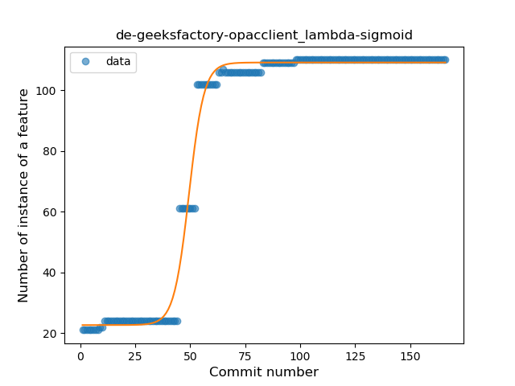
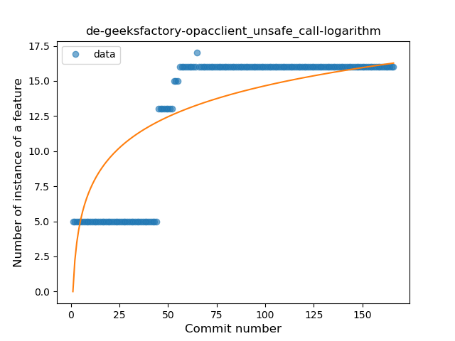
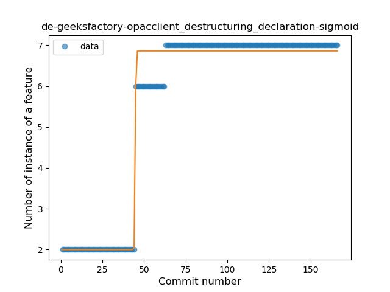

## de-geeksfactory-opacclient
----
#### Metrics provided by Detekt
* Number of lines of code 1903
* Number of Kotlin files: 7
* Cyclomatic complexity: 398
* Cyclomatic complexity by thousands of lines: 350 

----
**10** features analyzed

*	<a href="#type_inference">Type Inference</a> 
*	<a href="#lambda">Lambda</a> 
*	<a href="#safe_call">Safe Call</a> 
*	<a href="#when_expr">When expression</a> 
*	<a href="#unsafe_call">Unsafe Call</a> 
*	<a href="#companion_object">Companion Object</a> 
*	<a href="#string_template">String Template</a> 
*	<a href="#func_with_default_value">Function with Default Value</a> 
*	<a href="#smart_cast">Smart Cast</a> 
*	<a href="#destructuring_declaration">Destructuring Declaration</a> 

### <a name="type_inference">Type Inference</a>
----
#### Functions
* **Constant Rise - Linear:** 
    * **R_Squared:** 0.69983614
* **Sudden Rise Plateau - Logarithm:** 
    * **R_Squared:** 0.65363816

**Plots** :chart_with_upwards_trend:
-----

### <a name="lambda">Lambda</a>
----
#### Functions
* **Plateau Gradual Rise - Sigmoid:** 
    * **R_Squared:** 0.98901598
* **Constant Rise - Linear:** 
    * **R_Squared:** 0.69528642
* **Sudden Rise Plateau - Logarithm:** 
    * **R_Squared:** 0.6125035

**Plots** :chart_with_upwards_trend:
-----

### <a name="safe_call">Safe Call</a>
----
#### Functions
* **Plateau Gradual Rise - Sigmoid:** 
    * **R_Squared:** 0.98770677
* **Constant Rise - Linear:** 
    * **R_Squared:** 0.67429326
* **Sudden Rise Plateau - Logarithm:** 
    * **R_Squared:** 0.63795913

**Plots** :chart_with_upwards_trend:
-----

### <a name="when_expr">When expression</a>
----
#### Functions
* **Plateau Gradual Rise - Sigmoid:** 
    * **R_Squared:** 0.99151383
* **Constant Rise - Linear:** 
    * **R_Squared:** 0.64490183
* **Sudden Rise Plateau - Logarithm:** 
    * **R_Squared:** 0.57105092

**Plots** :chart_with_upwards_trend:
-----

### <a name="unsafe_call">Unsafe Call</a>
----
#### Functions
* **Sudden Rise Plateau - Logarithm:** 
    * **R_Squared:** 0.64909217
* **Constant Rise - Linear:** 
    * **R_Squared:** 0.63392369
* **Plateau Sudden Rise - Binary Sigmoid:** 
    * **R_Squared:** 0.39418596

**Plots** :chart_with_upwards_trend:
-----

### <a name="companion_object">Companion Object</a>
----
#### Functions
* **Plateau Gradual Rise - Sigmoid:** 
    * **R_Squared:** 0.95699232
* **Sudden Rise Plateau - Logarithm:** 
    * **R_Squared:** 0.67209996
* **Constant Rise - Linear:** 
    * **R_Squared:** 0.30099445

**Plots** :chart_with_upwards_trend:
-----

### <a name="string_template">String Template</a>
----
#### Functions
* **Plateau Gradual Rise - Sigmoid:** 
    * **R_Squared:** 0.9892552
* **Constant Rise - Linear:** 
    * **R_Squared:** 0.69135468
* **Sudden Rise Plateau - Logarithm:** 
    * **R_Squared:** 0.64558428

**Plots** :chart_with_upwards_trend:
-----

### <a name="func_with_default_value">Function with Default Value</a>
----
#### Functions
* **Plateau Sudden Rise - Binary Sigmoid:** 
    * **R_Squared:** 1.0
* **Sudden Rise Plateau - Logarithm:** 
    * **R_Squared:** 0.41824038
* **Constant Rise - Linear:** 
    * **R_Squared:** 0.12581762

**Plots** :chart_with_upwards_trend:
-----

### <a name="smart_cast">Smart Cast</a>
----
#### Functions
* **Constant Rise - Linear:** 
    * **R_Squared:** 0.35177249
* **Sudden Rise Plateau - Logarithm:** 
    * **R_Squared:** 0.22890983
* **Plateau Gradual Decline - Sigmoid:** 
    * **R_Squared:** 0.01651126

**Plots** :chart_with_upwards_trend:
-----

### <a name="destructuring_declaration">Destructuring Declaration</a>
----
#### Functions
* **Plateau Gradual Rise - Sigmoid:** 
    * **R_Squared:** 0.98119149
* **Constant Rise - Linear:** 
    * **R_Squared:** 0.65818886
* **Sudden Rise Plateau - Logarithm:** 
    * **R_Squared:** 0.6466334

**Plots** :chart_with_upwards_trend:
-----

