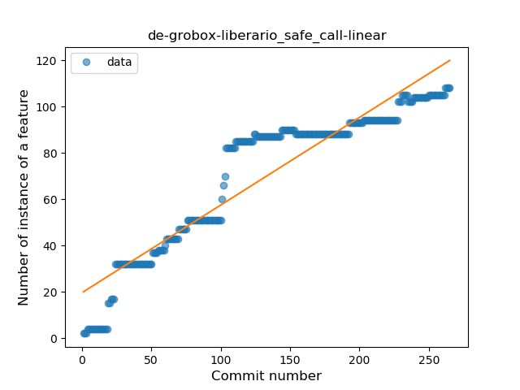
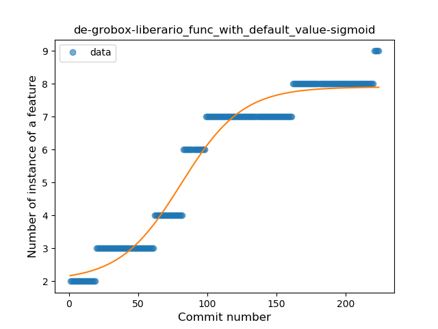
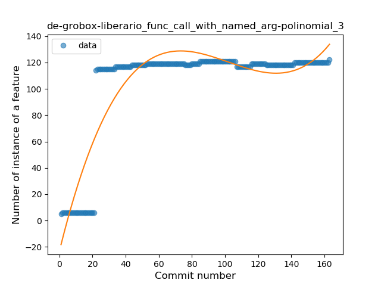
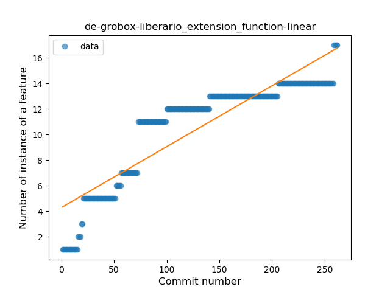

## de-grobox-liberario
----
#### Metrics provided by Detekt
* Number of lines of code 8385
* Number of Kotlin files: 71
* Cyclomatic complexity: 1057
* Cyclomatic complexity by thousands of lines: 264 

----
**13** features analyzed

*	<a href="#type_inference">Type Inference</a> 
*	<a href="#lambda">Lambda</a> 
*	<a href="#safe_call">Safe Call</a> 
*	<a href="#when_expr">When expression</a> 
*	<a href="#unsafe_call">Unsafe Call</a> 
*	<a href="#companion_object">Companion Object</a> 
*	<a href="#string_template">String Template</a> 
*	<a href="#func_with_default_value">Function with Default Value</a> 
*	<a href="#singleton">Singleton</a> 
*	<a href="#smart_cast">Smart Cast</a> 
*	<a href="#data_class">Data Class</a> 
*	<a href="#func_call_with_named_arg">Function call with Named Argument</a> 
*	<a href="#extension_function">Extension Function</a> 

### <a name="type_inference">Type Inference</a>
----
#### Functions
* **Constant Rise - Linear:** 
    * **R_Squared:** 0.89700129
* **Sudden Rise Plateau - Logarithm:** 
    * **R_Squared:** 0.63538083

**Plots** :chart_with_upwards_trend:
-----

### <a name="lambda">Lambda</a>
----
#### Functions
* **Constant Rise - Linear:** 
    * **R_Squared:** 0.89348876
* **Plateau Sudden Rise - Binary Sigmoid:** 
    * **R_Squared:** 0.60295516
* **Sudden Rise Plateau - Logarithm:** 
    * **R_Squared:** 0.49025339

**Plots** :chart_with_upwards_trend:
-----

### <a name="safe_call">Safe Call</a>
----
#### Functions
* **Constant Rise - Linear:** 
    * **R_Squared:** 0.87737474
* **Sudden Rise Plateau - Logarithm:** 
    * **R_Squared:** 0.66914515
* **Plateau Sudden Rise - Binary Sigmoid:** 
    * **R_Squared:** 0.53190017

**Plots** :chart_with_upwards_trend:
-----

### <a name="when_expr">When expression</a>
----
#### Functions
* **Constant Rise - Linear:** 
    * **R_Squared:** 0.8792997
* **Sudden Rise Plateau - Logarithm:** 
    * **R_Squared:** 0.60495666
* **Plateau Sudden Rise - Binary Sigmoid:** 
    * **R_Squared:** 0.29914382

**Plots** :chart_with_upwards_trend:
-----

### <a name="unsafe_call">Unsafe Call</a>
----
#### Functions
* **Constant Rise - Linear:** 
    * **R_Squared:** 0.88599583
* **Sudden Rise Plateau - Logarithm:** 
    * **R_Squared:** 0.63577389
* **Plateau Gradual Rise - Sigmoid:** 
    * **R_Squared:** 0.42888081

**Plots** :chart_with_upwards_trend:
-----

### <a name="companion_object">Companion Object</a>
----
#### Functions
* **Constant Rise - Linear:** 
    * **R_Squared:** 0.90798258
* **Sudden Rise Plateau - Logarithm:** 
    * **R_Squared:** 0.62282513

**Plots** :chart_with_upwards_trend:
-----

### <a name="string_template">String Template</a>
----
#### Functions
* **Constant Rise - Linear:** 
    * **R_Squared:** 0.89968199
* **Sudden Rise Plateau - Logarithm:** 
    * **R_Squared:** 0.67373135
* **Plateau Sudden Rise - Binary Sigmoid:** 
    * **R_Squared:** 0.07689169

**Plots** :chart_with_upwards_trend:
-----

### <a name="func_with_default_value">Function with Default Value</a>
----
#### Functions
* **Plateau Gradual Rise - Sigmoid:** 
    * **R_Squared:** 0.96169495
* **Constant Rise - Linear:** 
    * **R_Squared:** 0.89674877
* **Sudden Rise Plateau - Logarithm:** 
    * **R_Squared:** 0.688203

**Plots** :chart_with_upwards_trend:
-----

### <a name="singleton">Singleton</a>
----
#### Functions
* **Plateau Sudden Rise - Binary Sigmoid:** 
    * **R_Squared:** 0.92265273
* **Sudden Rise Plateau - Logarithm:** 
    * **R_Squared:** 0.69803161
* **Constant Rise - Linear:** 
    * **R_Squared:** 0.33456742

**Plots** :chart_with_upwards_trend:
-----

### <a name="smart_cast">Smart Cast</a>
----
#### Functions
* **Sudden Rise Plateau - Logarithm:** 
    * **R_Squared:** 0.76911716
* **Constant Rise - Linear:** 
    * **R_Squared:** 0.55653493
* **Plateau Sudden Rise - Binary Sigmoid:** 
    * **R_Squared:** 0.09144581

**Plots** :chart_with_upwards_trend:
-----

### <a name="data_class">Data Class</a>
----
#### Functions
* **Plateau Gradual Rise - Sigmoid:** 
    * **R_Squared:** 0.92266885
* **Sudden Rise Plateau - Logarithm:** 
    * **R_Squared:** 0.65845064
* **Constant Rise - Linear:** 
    * **R_Squared:** 0.26606922

**Plots** :chart_with_upwards_trend:
-----

### <a name="func_call_with_named_arg">Function call with Named Argument</a>
----
#### Functions
* **Instability - Polinomial 3:** )
    * **R_Squared:** 0.81799352
* **Sudden Rise Plateau - Logarithm:** 
    * **R_Squared:** 0.62510113
* **Constant Rise - Linear:** 
    * **R_Squared:** 0.35771831
* **Plateau Sudden Rise - Binary Sigmoid:** 
    * **R_Squared:** 0.07745297

**Plots** :chart_with_upwards_trend:
-----

### <a name="extension_function">Extension Function</a>
----
#### Functions
* **Constant Rise - Linear:** 
    * **R_Squared:** 0.80209341
* **Sudden Rise Plateau - Logarithm:** 
    * **R_Squared:** 0.74456012

**Plots** :chart_with_upwards_trend:
-----

