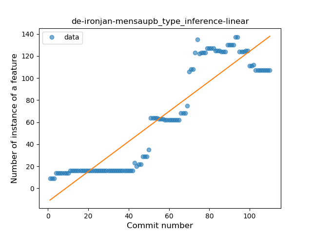
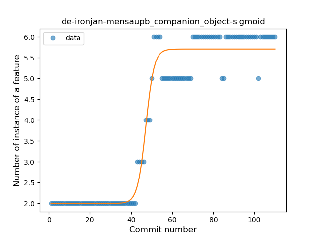
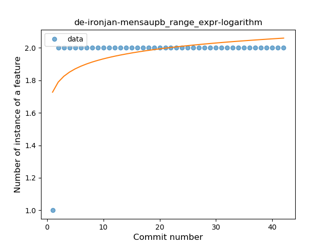
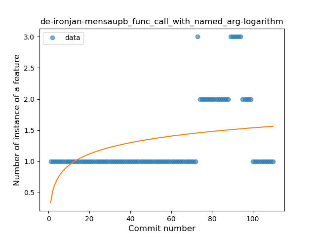

## de-ironjan-mensaupb
----
#### Metrics provided by Detekt
* Number of lines of code 1080
* Number of Kotlin files: 13
* Cyclomatic complexity: 157
* Cyclomatic complexity by thousands of lines: 250 

----
**10** features analyzed

*	<a href="#type_inference">Type Inference</a> 
*	<a href="#lambda">Lambda</a> 
*	<a href="#when_expr">When expression</a> 
*	<a href="#unsafe_call">Unsafe Call</a> 
*	<a href="#companion_object">Companion Object</a> 
*	<a href="#string_template">String Template</a> 
*	<a href="#singleton">Singleton</a> 
*	<a href="#range_expr">Range Expression</a> 
*	<a href="#func_call_with_named_arg">Function call with Named Argument</a> 
*	<a href="#destructuring_declaration">Destructuring Declaration</a> 

### <a name="type_inference">Type Inference</a>
----
#### Functions
* **Instability - Polinomial 3:** )
    * **R_Squared:** 0.94361159
* **Constant Rise - Linear:** 
    * **R_Squared:** 0.83814402
* **Sudden Rise - Exponential:** 
    * **R_Squared:** 0.83947977
* **Plateau Gradual Rise - Sigmoid:** 
    * **R_Squared:** 0.62479475
* **Sudden Rise Plateau - Logarithm:** 
    * **R_Squared:** 0.40765559

**Plots** :chart_with_upwards_trend:
-----

### <a name="lambda">Lambda</a>
----
#### Functions
* **Plateau Gradual Rise - Sigmoid:** 
    * **R_Squared:** 0.61477312
* **Sudden Rise Plateau - Logarithm:** 
    * **R_Squared:** 0.40009907
* **Constant Rise - Linear:** 
    * **R_Squared:** 0.26917091

**Plots** :chart_with_upwards_trend:
-----

### <a name="when_expr">When expression</a>
----
#### Functions
* **Sudden Rise Plateau - Logarithm:** 
    * **R_Squared:** 0.84496839
* **Constant Rise - Linear:** 
    * **R_Squared:** 0.57918839

**Plots** :chart_with_upwards_trend:
-----

### <a name="unsafe_call">Unsafe Call</a>
----
#### Functions
* **Instability - Polinomial 3:** )
    * **R_Squared:** 0.87008356
* **Plateau Gradual Rise - Sigmoid:** 
    * **R_Squared:** 0.85544614
* **Constant Rise - Linear:** 
    * **R_Squared:** 0.72975665
* **Sudden Rise Plateau - Logarithm:** 
    * **R_Squared:** 0.40585575

**Plots** :chart_with_upwards_trend:
-----

### <a name="companion_object">Companion Object</a>
----
#### Functions
* **Plateau Gradual Rise - Sigmoid:** 
    * **R_Squared:** 0.95914747
* **Constant Rise - Linear:** 
    * **R_Squared:** 0.81852556
* **Sudden Rise Plateau - Logarithm:** 
    * **R_Squared:** 0.58077442

**Plots** :chart_with_upwards_trend:
-----

### <a name="string_template">String Template</a>
----
#### Functions
* **Plateau Gradual Rise - Sigmoid:** 
    * **R_Squared:** 0.83822847
* **Constant Rise - Linear:** 
    * **R_Squared:** 0.68653712
* **Sudden Rise - Exponential:** 
    * **R_Squared:** 0.6866384
* **Sudden Rise Plateau - Logarithm:** 
    * **R_Squared:** 0.41186511

**Plots** :chart_with_upwards_trend:
-----

### <a name="singleton">Singleton</a>
----
#### Functions
* **Plateau Gradual Rise - Sigmoid:** 
    * **R_Squared:** 0.89267492
* **Constant Rise - Linear:** 
    * **R_Squared:** 0.7070576
* **Sudden Rise Plateau - Logarithm:** 
    * **R_Squared:** 0.4329937

**Plots** :chart_with_upwards_trend:
-----

### <a name="range_expr">Range Expression</a>
----
#### Functions
* **Sudden Rise Plateau - Logarithm:** 
    * **R_Squared:** 0.25543441
* **Constant Rise - Linear:** 
    * **R_Squared:** 0.06976744

**Plots** :chart_with_upwards_trend:
-----

### <a name="func_call_with_named_arg">Function call with Named Argument</a>
----
#### Functions
* **Constant Rise - Linear:** 
    * **R_Squared:** 0.26869717
* **Sudden Rise - Exponential:** 
    * **R_Squared:** 0.26874311
* **Sudden Rise Plateau - Logarithm:** 
    * **R_Squared:** 0.17197224

**Plots** :chart_with_upwards_trend:
-----

### <a name="destructuring_declaration">Destructuring Declaration</a>
----
#### Functions
* **Constant Decline - Linear:** 
    * **R_Squared:** 0.2227853
* **Sudden Rise Plateau - Logarithm:** 
    * **R_Squared:** -0.0

**Plots** :chart_with_upwards_trend:
-----

