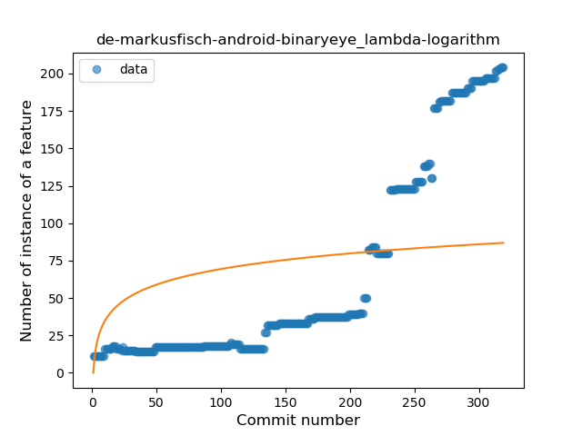
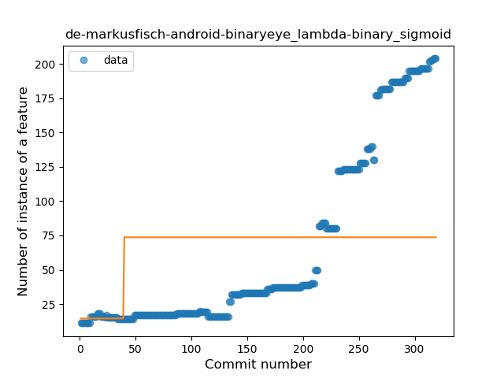
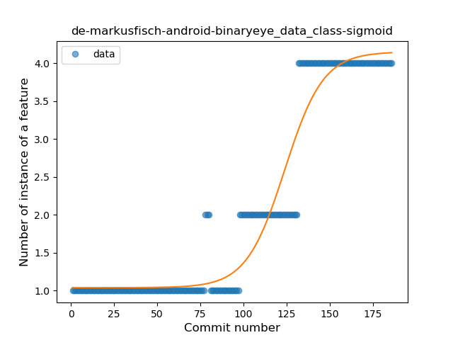
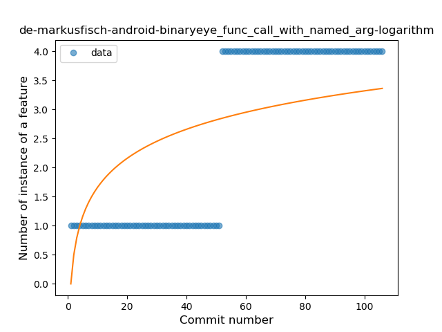
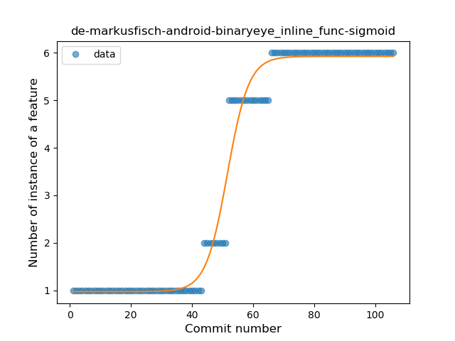
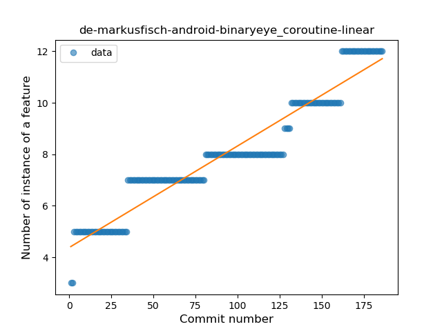

## de-markusfisch-android-binaryeye
----
#### Metrics provided by Detekt
* Number of lines of code 4140
* Number of Kotlin files: 44
* Cyclomatic complexity: 564
* Cyclomatic complexity by thousands of lines: 216 

----
**17** features analyzed

*	<a href="#type_inference">Type Inference</a> 
*	<a href="#lambda">Lambda</a> 
*	<a href="#safe_call">Safe Call</a> 
*	<a href="#when_expr">When expression</a> 
*	<a href="#unsafe_call">Unsafe Call</a> 
*	<a href="#companion_object">Companion Object</a> 
*	<a href="#string_template">String Template</a> 
*	<a href="#func_with_default_value">Function with Default Value</a> 
*	<a href="#singleton">Singleton</a> 
*	<a href="#range_expr">Range Expression</a> 
*	<a href="#data_class">Data Class</a> 
*	<a href="#func_call_with_named_arg">Function call with Named Argument</a> 
*	<a href="#extension_function">Extension Function</a> 
*	<a href="#destructuring_declaration">Destructuring Declaration</a> 
*	<a href="#inline_func">Inline Function</a> 
*	<a href="#overloaded_op">Overloaded Operator</a> 
*	<a href="#coroutine">Coroutine</a> 

### <a name="type_inference">Type Inference</a>
----
#### Functions
* **Sudden Rise - Exponential:** 
    * **R_Squared:** 0.97836246
* **Constant Rise - Linear:** 
    * **R_Squared:** 0.90918952
* **Sudden Rise Plateau - Logarithm:** 
    * **R_Squared:** 0.45435093

**Plots** :chart_with_upwards_trend:
-----

### <a name="lambda">Lambda</a>
----
#### Functions
* **Sudden Rise - Exponential:** 
    * **R_Squared:** 0.94598056
* **Constant Rise - Linear:** 
    * **R_Squared:** 0.77217842
* **Sudden Rise Plateau - Logarithm:** 
    * **R_Squared:** 0.22340655
* **Plateau Sudden Rise - Binary Sigmoid:** 
    * **R_Squared:** 0.08622952

**Plots** :chart_with_upwards_trend:
-----

### <a name="safe_call">Safe Call</a>
----
#### Functions
* **Sudden Rise - Exponential:** 
    * **R_Squared:** 0.90306636
* **Constant Rise - Linear:** 
    * **R_Squared:** 0.75669392
* **Sudden Rise Plateau - Logarithm:** 
    * **R_Squared:** 0.29328259

**Plots** :chart_with_upwards_trend:
-----

### <a name="when_expr">When expression</a>
----
#### Functions
* **Plateau Gradual Rise - Sigmoid:** 
    * **R_Squared:** 0.97730354
* **Sudden Rise - Exponential:** 
    * **R_Squared:** 0.91426585
* **Constant Rise - Linear:** 
    * **R_Squared:** 0.71761275
* **Sudden Rise Plateau - Logarithm:** 
    * **R_Squared:** 0.27135786

**Plots** :chart_with_upwards_trend:
-----

### <a name="unsafe_call">Unsafe Call</a>
----
#### Functions
* **Plateau Sudden Decline - Binary Sigmoid:** 
    * **R_Squared:** 0.86087418
* **Sudden Decline - Exponential:** 
    * **R_Squared:** 0.65857635
* **Constant Decline - Linear:** 
    * **R_Squared:** 0.48030476
* **Sudden Rise Plateau - Logarithm:** 
    * **R_Squared:** -0.0

**Plots** :chart_with_upwards_trend:
-----

### <a name="companion_object">Companion Object</a>
----
#### Functions
* **Constant Rise - Linear:** 
    * **R_Squared:** 0.88102904
* **Sudden Rise Plateau - Logarithm:** 
    * **R_Squared:** 0.78282329

**Plots** :chart_with_upwards_trend:
-----

### <a name="string_template">String Template</a>
----
#### Functions
* **Plateau Gradual Rise - Sigmoid:** 
    * **R_Squared:** 0.95771479
* **Sudden Rise - Exponential:** 
    * **R_Squared:** 0.94598895
* **Constant Rise - Linear:** 
    * **R_Squared:** 0.89472256
* **Sudden Rise Plateau - Logarithm:** 
    * **R_Squared:** 0.30283482

**Plots** :chart_with_upwards_trend:
-----

### <a name="func_with_default_value">Function with Default Value</a>
----
#### Functions
* **Sudden Rise - Exponential:** 
    * **R_Squared:** 0.94733469
* **Constant Rise - Linear:** 
    * **R_Squared:** 0.88707356
* **Sudden Rise Plateau - Logarithm:** 
    * **R_Squared:** 0.33270872

**Plots** :chart_with_upwards_trend:
-----

### <a name="singleton">Singleton</a>
----
#### Functions
* **Plateau Gradual Rise - Sigmoid:** 
    * **R_Squared:** 0.97946328
* **Sudden Rise - Exponential:** 
    * **R_Squared:** 0.83796696
* **Constant Rise - Linear:** 
    * **R_Squared:** 0.63472184
* **Sudden Rise Plateau - Logarithm:** 
    * **R_Squared:** 0.14105356

**Plots** :chart_with_upwards_trend:
-----

### <a name="range_expr">Range Expression</a>
----
#### Functions
* **Plateau Sudden Rise - Binary Sigmoid:** 
    * **R_Squared:** 0.91826693
* **Constant Rise - Linear:** 
    * **R_Squared:** 0.64329246
* **Sudden Rise Plateau - Logarithm:** 
    * **R_Squared:** 0.45761416

**Plots** :chart_with_upwards_trend:
-----

### <a name="data_class">Data Class</a>
----
#### Functions
* **Plateau Gradual Rise - Sigmoid:** 
    * **R_Squared:** 0.94097257
* **Sudden Rise - Exponential:** 
    * **R_Squared:** 0.85509301
* **Constant Rise - Linear:** 
    * **R_Squared:** 0.78589689
* **Sudden Rise Plateau - Logarithm:** 
    * **R_Squared:** 0.35356741

**Plots** :chart_with_upwards_trend:
-----

### <a name="func_call_with_named_arg">Function call with Named Argument</a>
----
#### Functions
* **Plateau Sudden Rise - Binary Sigmoid:** 
    * **R_Squared:** 1.0
* **Constant Rise - Linear:** 
    * **R_Squared:** 0.74899866
* **Sudden Rise Plateau - Logarithm:** 
    * **R_Squared:** 0.45012867

**Plots** :chart_with_upwards_trend:
-----

### <a name="extension_function">Extension Function</a>
----
#### Functions
* **Plateau Gradual Rise - Sigmoid:** 
    * **R_Squared:** 0.94274447
* **Constant Rise - Linear:** 
    * **R_Squared:** 0.88483978
* **Sudden Rise Plateau - Logarithm:** 
    * **R_Squared:** 0.65432619

**Plots** :chart_with_upwards_trend:
-----

### <a name="destructuring_declaration">Destructuring Declaration</a>
----
#### Functions
* **Sudden Rise Plateau - Logarithm:** 
    * **R_Squared:** 0.82889534
* **Constant Rise - Linear:** 
    * **R_Squared:** 0.69584889

**Plots** :chart_with_upwards_trend:
-----

### <a name="inline_func">Inline Function</a>
----
#### Functions
* **Plateau Gradual Rise - Sigmoid:** 
    * **R_Squared:** 0.98118333
* **Constant Rise - Linear:** 
    * **R_Squared:** 0.83393451
* **Sudden Rise Plateau - Logarithm:** 
    * **R_Squared:** 0.45084882

**Plots** :chart_with_upwards_trend:
-----

### <a name="overloaded_op">Overloaded Operator</a>
----
#### Functions
* **Plateau Sudden Decline - Binary Sigmoid:** 
    * **R_Squared:** 1.0
* **Sudden Decline - Exponential:** 
    * **R_Squared:** 0.80098904
* **Constant Decline - Linear:** 
    * **R_Squared:** 0.25856855
* **Sudden Rise Plateau - Logarithm:** 
    * **R_Squared:** -0.0

**Plots** :chart_with_upwards_trend:
-----

### <a name="coroutine">Coroutine</a>
----
#### Functions
* **Constant Rise - Linear:** 
    * **R_Squared:** 0.91951817
* **Sudden Rise - Exponential:** 
    * **R_Squared:** 0.92951562
* **Sudden Rise Plateau - Logarithm:** 
    * **R_Squared:** 0.7200097

**Plots** :chart_with_upwards_trend:
-----

