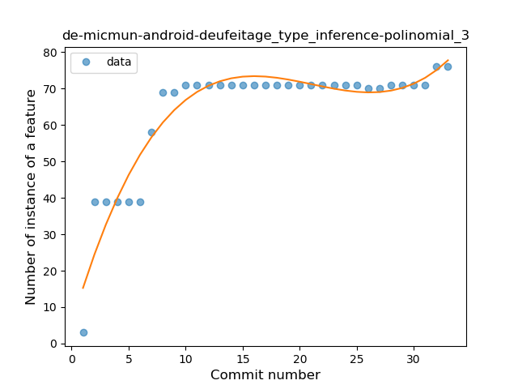
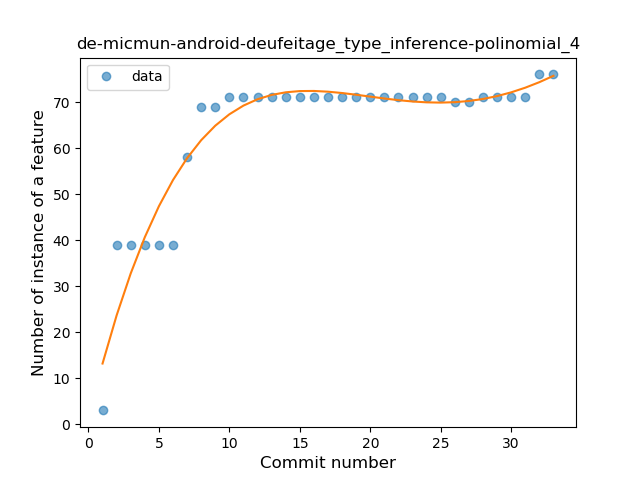
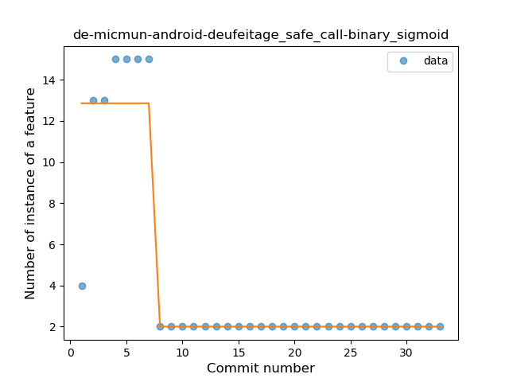
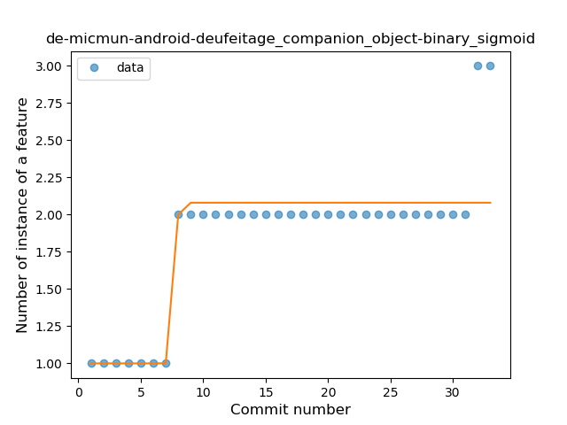
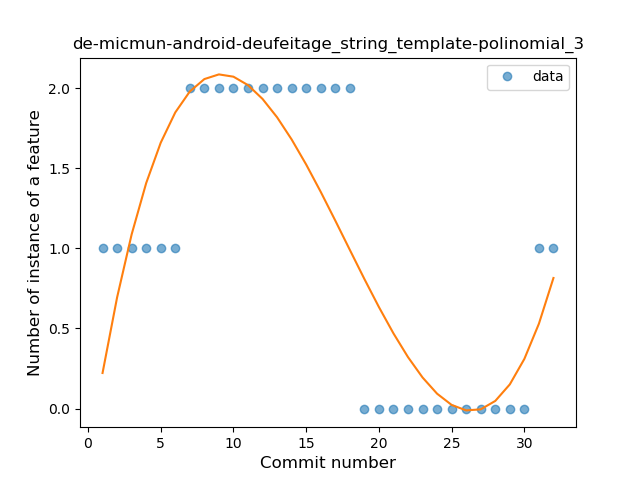
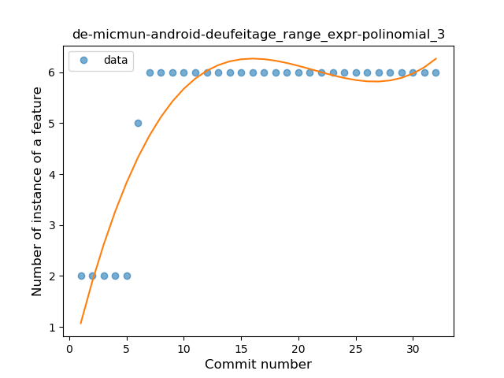
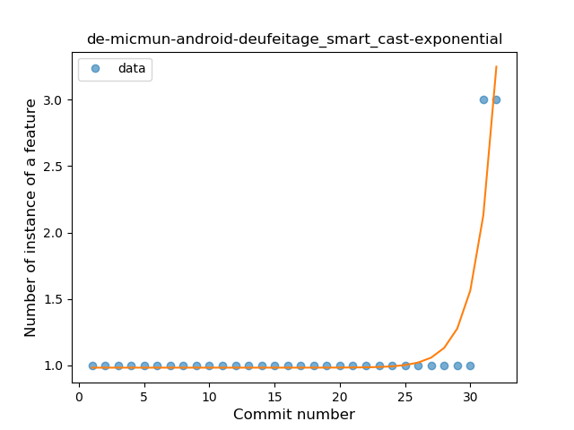

## de-micmun-android-deufeitage
----
#### Metrics provided by Detekt
* Number of lines of code 983
* Number of Kotlin files: 13
* Cyclomatic complexity: 135
* Cyclomatic complexity by thousands of lines: 306 

----
**10** features analyzed

*	<a href="#type_inference">Type Inference</a> 
*	<a href="#lambda">Lambda</a> 
*	<a href="#safe_call">Safe Call</a> 
*	<a href="#when_expr">When expression</a> 
*	<a href="#unsafe_call">Unsafe Call</a> 
*	<a href="#companion_object">Companion Object</a> 
*	<a href="#string_template">String Template</a> 
*	<a href="#range_expr">Range Expression</a> 
*	<a href="#smart_cast">Smart Cast</a> 
*	<a href="#data_class">Data Class</a> 

### <a name="type_inference">Type Inference</a>
----
#### Functions
* **Instability - Polinomial 3:** )
    * **R_Squared:** 0.90507163
* **Instability - Polinomial 4:** 
    * **R_Squared:** 0.90859532
* **Sudden Rise Plateau - Logarithm:** 
    * **R_Squared:** 0.79892865
* **Constant Rise - Linear:** 
    * **R_Squared:** 0.48600791

**Plots** :chart_with_upwards_trend:
-----

### <a name="lambda">Lambda</a>
----
#### Functions
* **Constant Rise - Linear:** 
    * **R_Squared:** 0.86282184
* **Sudden Rise - Exponential:** 
    * **R_Squared:** 0.86408071
* **Sudden Rise Plateau - Logarithm:** 
    * **R_Squared:** 0.7653339

**Plots** :chart_with_upwards_trend:
-----

### <a name="safe_call">Safe Call</a>
----
#### Functions
* **Plateau Sudden Decline - Binary Sigmoid:** 
    * **R_Squared:** 0.87033324
* **Instability - Polinomial 4:** 
    * **R_Squared:** 0.65784893
* **Sudden Decline - Exponential:** 
    * **R_Squared:** 0.53637266
* **Constant Decline - Linear:** 
    * **R_Squared:** 0.40296549
* **Sudden Rise Plateau - Logarithm:** 
    * **R_Squared:** -0.0

**Plots** :chart_with_upwards_trend:
-----

### <a name="when_expr">When expression</a>
----
#### Functions
* **Instability - Polinomial 4:** 
    * **R_Squared:** 0.81223915
* **Plateau Sudden Rise - Binary Sigmoid:** 
    * **R_Squared:** 0.78927599
* **Sudden Rise - Exponential:** 
    * **R_Squared:** 0.52797811
* **Constant Rise - Linear:** 
    * **R_Squared:** 0.34828405
* **Sudden Rise Plateau - Logarithm:** 
    * **R_Squared:** 0.18240467

**Plots** :chart_with_upwards_trend:
-----

### <a name="unsafe_call">Unsafe Call</a>
----
#### Functions
* **Instability - Polinomial 3:** )
    * **R_Squared:** 0.81837217
* **Sudden Rise Plateau - Logarithm:** 
    * **R_Squared:** 0.68578392
* **Plateau Sudden Rise - Binary Sigmoid:** 
    * **R_Squared:** 0.50769231
* **Constant Rise - Linear:** 
    * **R_Squared:** 0.45747801

**Plots** :chart_with_upwards_trend:
-----

### <a name="companion_object">Companion Object</a>
----
#### Functions
* **Plateau Sudden Rise - Binary Sigmoid:** 
    * **R_Squared:** 0.77676474
* **Instability - Polinomial 3:** )
    * **R_Squared:** 0.77927789
* **Sudden Rise Plateau - Logarithm:** 
    * **R_Squared:** 0.65984842
* **Constant Rise - Linear:** 
    * **R_Squared:** 0.6035359

**Plots** :chart_with_upwards_trend:
-----

### <a name="string_template">String Template</a>
----
#### Functions
* **Instability - Polinomial 3:** )
    * **R_Squared:** 0.73602279
* **Constant Decline - Linear:** 
    * **R_Squared:** 0.31671554
* **Sudden Rise Plateau - Logarithm:** 
    * **R_Squared:** -0.0

**Plots** :chart_with_upwards_trend:
-----

### <a name="range_expr">Range Expression</a>
----
#### Functions
* **Instability - Polinomial 3:** )
    * **R_Squared:** 0.85098663
* **Sudden Rise Plateau - Logarithm:** 
    * **R_Squared:** 0.69545623
* **Constant Rise - Linear:** 
    * **R_Squared:** 0.42907275

**Plots** :chart_with_upwards_trend:
-----

### <a name="smart_cast">Smart Cast</a>
----
#### Functions
* **Plateau Sudden Rise - Binary Sigmoid:** 
    * **R_Squared:** 1.0
* **Sudden Rise - Exponential:** 
    * **R_Squared:** 0.83457008
* **Instability - Polinomial 3:** )
    * **R_Squared:** 0.60979817
* **Constant Rise - Linear:** 
    * **R_Squared:** 0.17595308
* **Sudden Rise Plateau - Logarithm:** 
    * **R_Squared:** 0.0762987

**Plots** :chart_with_upwards_trend:
-----

### <a name="data_class">Data Class</a>
----
#### Functions
* **Plateau Sudden Rise - Binary Sigmoid:** 
    * **R_Squared:** 1.0
* **Instability - Polinomial 3:** )
    * **R_Squared:** 0.81837217
* **Sudden Rise Plateau - Logarithm:** 
    * **R_Squared:** 0.68578392
* **Constant Rise - Linear:** 
    * **R_Squared:** 0.45747801

**Plots** :chart_with_upwards_trend:
-----

