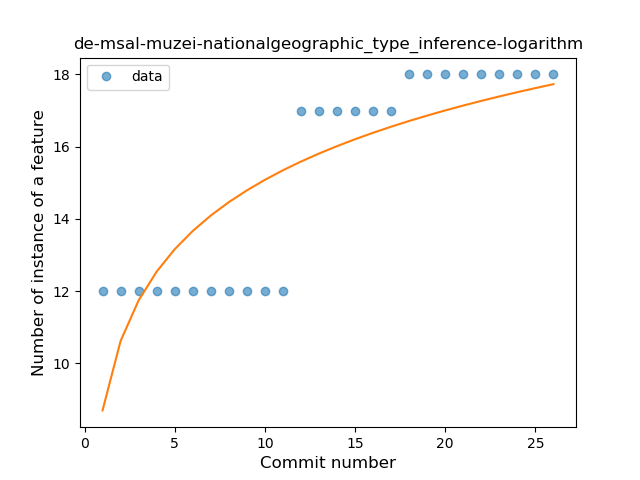

## de-msal-muzei-nationalgeographic
----
#### Metrics provided by Detekt
* Number of lines of code 193
* Number of Kotlin files: 3
* Cyclomatic complexity: 30
* Cyclomatic complexity by thousands of lines: 270 

----
**3** features analyzed

*	<a href="#type_inference">Type Inference</a> 
*	<a href="#lambda">Lambda</a> 
*	<a href="#safe_call">Safe Call</a> 

### <a name="type_inference">Type Inference</a>
----
#### Functions
* **Instability - Polinomial 4:** 
    * **R_Squared:** 0.906792
* **Instability - Polinomial 3:** )
    * **R_Squared:** 0.89668586
* **Constant Rise - Linear:** 
    * **R_Squared:** 0.8069552
* **Sudden Rise Plateau - Logarithm:** 
    * **R_Squared:** 0.66508484

**Plots** :chart_with_upwards_trend:
-----

### <a name="lambda">Lambda</a>
----
#### Functions
* **Plateau Sudden Rise - Binary Sigmoid:** 
    * **R_Squared:** 1.0
* **Instability - Polinomial 3:** )
    * **R_Squared:** 0.84605316
* **Constant Rise - Linear:** 
    * **R_Squared:** 0.73333333
* **Sudden Rise Plateau - Logarithm:** 
    * **R_Squared:** 0.63596255

**Plots** :chart_with_upwards_trend:
-----

### <a name="safe_call">Safe Call</a>
----
#### Functions
* **Instability - Polinomial 4:** 
    * **R_Squared:** 0.87278694
* **Instability - Polinomial 3:** )
    * **R_Squared:** 0.84605316
* **Constant Rise - Linear:** 
    * **R_Squared:** 0.73333333
* **Sudden Rise Plateau - Logarithm:** 
    * **R_Squared:** 0.63596255

**Plots** :chart_with_upwards_trend:
-----

