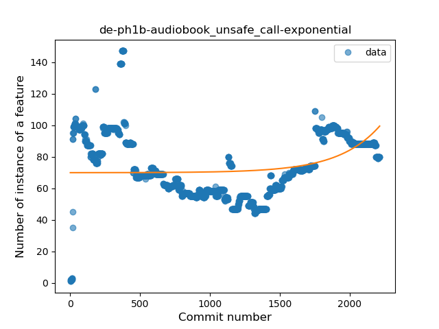
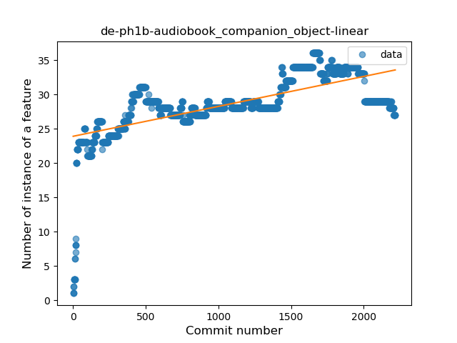
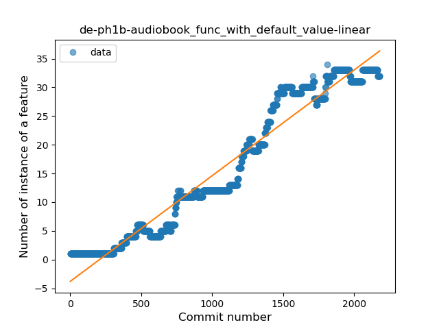
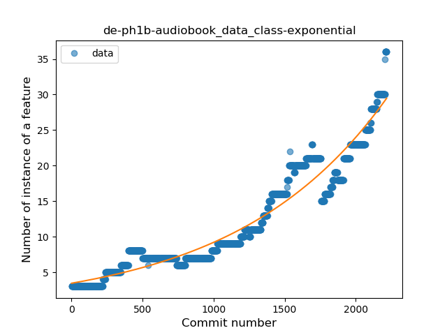
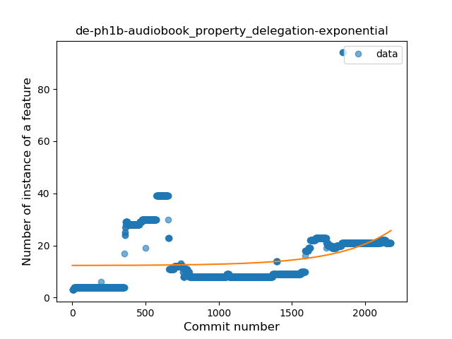
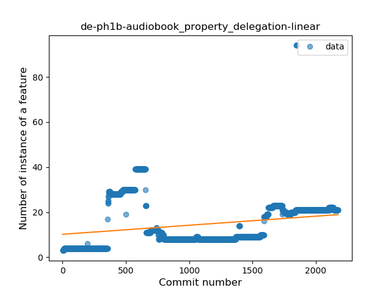
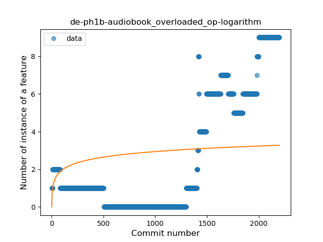
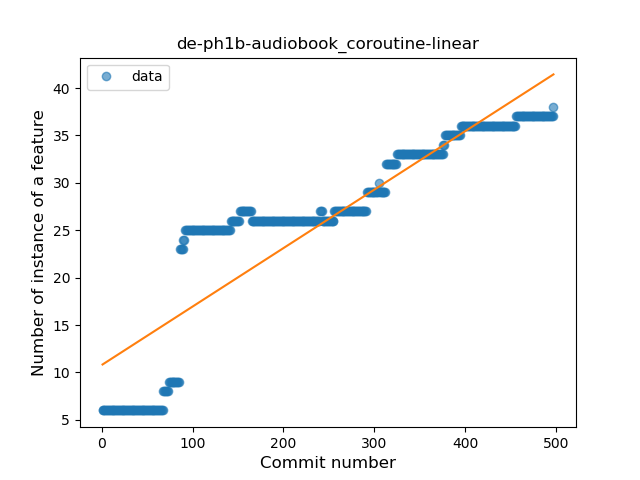
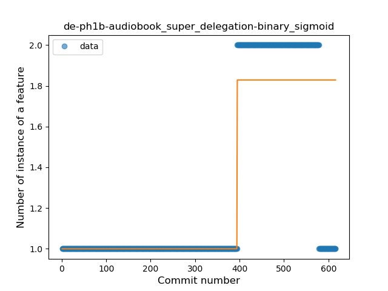
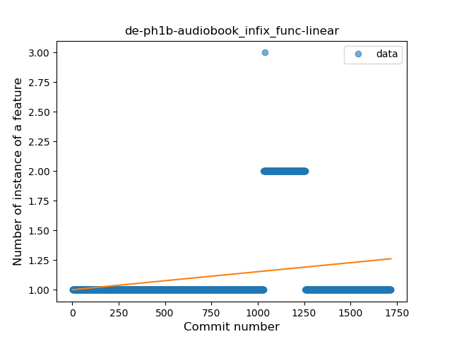

## de-ph1b-audiobook
----
#### Metrics provided by Detekt
* Number of lines of code 17647
* Number of Kotlin files: 248
* Cyclomatic complexity: 2006
* Cyclomatic complexity by thousands of lines: 209 

----
**23** features analyzed

*	<a href="#type_inference">Type Inference</a> 
*	<a href="#lambda">Lambda</a> 
*	<a href="#safe_call">Safe Call</a> 
*	<a href="#when_expr">When expression</a> 
*	<a href="#unsafe_call">Unsafe Call</a> 
*	<a href="#companion_object">Companion Object</a> 
*	<a href="#string_template">String Template</a> 
*	<a href="#func_with_default_value">Function with Default Value</a> 
*	<a href="#singleton">Singleton</a> 
*	<a href="#range_expr">Range Expression</a> 
*	<a href="#smart_cast">Smart Cast</a> 
*	<a href="#data_class">Data Class</a> 
*	<a href="#func_call_with_named_arg">Function call with Named Argument</a> 
*	<a href="#extension_function">Extension Function</a> 
*	<a href="#property_delegation">Property Delegation</a> 
*	<a href="#destructuring_declaration">Destructuring Declaration</a> 
*	<a href="#inline_func">Inline Function</a> 
*	<a href="#overloaded_op">Overloaded Operator</a> 
*	<a href="#coroutine">Coroutine</a> 
*	<a href="#sealed_class">Sealed Class</a> 
*	<a href="#type_alias">Type Alias</a> 
*	<a href="#super_delegation">Super Delegation</a> 
*	<a href="#infix_func">Infix Function</a> 

### <a name="type_inference">Type Inference</a>
----
#### Functions
* **Constant Rise - Linear:** 
    * **R_Squared:** 0.81415804
* **Sudden Rise - Exponential:** 
    * **R_Squared:** 0.81682585
* **Sudden Rise Plateau - Logarithm:** 
    * **R_Squared:** 0.66331707
* **Plateau Sudden Rise - Binary Sigmoid:** 
    * **R_Squared:** 0.14783594

**Plots** :chart_with_upwards_trend:
-----

### <a name="lambda">Lambda</a>
----
#### Functions
* **Constant Rise - Linear:** 
    * **R_Squared:** 0.83875757
* **Sudden Rise Plateau - Logarithm:** 
    * **R_Squared:** 0.65418019
* **Plateau Sudden Rise - Binary Sigmoid:** 
    * **R_Squared:** 0.44303075

**Plots** :chart_with_upwards_trend:
-----

### <a name="safe_call">Safe Call</a>
----
#### Functions
* **Constant Rise - Linear:** 
    * **R_Squared:** 0.94161139
* **Sudden Rise - Exponential:** 
    * **R_Squared:** 0.94318882
* **Sudden Rise Plateau - Logarithm:** 
    * **R_Squared:** 0.42206641

**Plots** :chart_with_upwards_trend:
-----

### <a name="when_expr">When expression</a>
----
#### Functions
* **Sudden Rise - Exponential:** 
    * **R_Squared:** 0.62651858
* **Constant Rise - Linear:** 
    * **R_Squared:** 0.60372089
* **Sudden Rise Plateau - Logarithm:** 
    * **R_Squared:** 0.50212241

**Plots** :chart_with_upwards_trend:
-----

### <a name="unsafe_call">Unsafe Call</a>
----
#### Functions
* **Sudden Rise - Exponential:** 
    * **R_Squared:** 0.11266188
* **Constant Rise - Linear:** 
    * **R_Squared:** 0.00024981
* **Sudden Rise Plateau - Logarithm:** 
    * **R_Squared:** 0.0
* **Plateau Gradual Decline - Sigmoid:** 
    * **R_Squared:** 1.737e-05

**Plots** :chart_with_upwards_trend:
-----

### <a name="companion_object">Companion Object</a>
----
#### Functions
* **Sudden Rise Plateau - Logarithm:** 
    * **R_Squared:** 0.65495145
* **Constant Rise - Linear:** 
    * **R_Squared:** 0.46221928
* **Plateau Sudden Rise - Binary Sigmoid:** 
    * **R_Squared:** 0.27683796

**Plots** :chart_with_upwards_trend:
-----

### <a name="string_template">String Template</a>
----
#### Functions
* **Sudden Rise Plateau - Logarithm:** 
    * **R_Squared:** 0.67281471
* **Constant Rise - Linear:** 
    * **R_Squared:** 0.39708338
* **Plateau Sudden Rise - Binary Sigmoid:** 
    * **R_Squared:** 0.3795035

**Plots** :chart_with_upwards_trend:
-----

### <a name="func_with_default_value">Function with Default Value</a>
----
#### Functions
* **Constant Rise - Linear:** 
    * **R_Squared:** 0.95000847
* **Sudden Rise - Exponential:** 
    * **R_Squared:** 0.95181685
* **Sudden Rise Plateau - Logarithm:** 
    * **R_Squared:** 0.2928131
* **Plateau Sudden Rise - Binary Sigmoid:** 
    * **R_Squared:** 0.0106828

**Plots** :chart_with_upwards_trend:
-----

### <a name="singleton">Singleton</a>
----
#### Functions
* **Sudden Rise - Exponential:** 
    * **R_Squared:** 0.94420257
* **Constant Rise - Linear:** 
    * **R_Squared:** 0.8620873
* **Sudden Rise Plateau - Logarithm:** 
    * **R_Squared:** 0.30197915

**Plots** :chart_with_upwards_trend:
-----

### <a name="range_expr">Range Expression</a>
----
#### Functions
* **Sudden Rise - Exponential:** 
    * **R_Squared:** 0.09235504
* **Plateau Sudden Rise - Binary Sigmoid:** 
    * **R_Squared:** 0.02623684
* **Constant Rise - Linear:** 
    * **R_Squared:** 0.01142179
* **Sudden Rise Plateau - Logarithm:** 
    * **R_Squared:** -0.0

**Plots** :chart_with_upwards_trend:
-----

### <a name="smart_cast">Smart Cast</a>
----
#### Functions
* **Plateau Gradual Rise - Sigmoid:** 
    * **R_Squared:** 0.8862955
* **Sudden Rise - Exponential:** 
    * **R_Squared:** 0.85549919
* **Constant Rise - Linear:** 
    * **R_Squared:** 0.48174538
* **Sudden Rise Plateau - Logarithm:** 
    * **R_Squared:** 0.10352313

**Plots** :chart_with_upwards_trend:
-----

### <a name="data_class">Data Class</a>
----
#### Functions
* **Sudden Rise - Exponential:** 
    * **R_Squared:** 0.93372451
* **Constant Rise - Linear:** 
    * **R_Squared:** 0.87243058
* **Sudden Rise Plateau - Logarithm:** 
    * **R_Squared:** 0.30288205

**Plots** :chart_with_upwards_trend:
-----

### <a name="func_call_with_named_arg">Function call with Named Argument</a>
----
#### Functions
* **Sudden Rise - Exponential:** 
    * **R_Squared:** 0.98034907
* **Constant Rise - Linear:** 
    * **R_Squared:** 0.79975876
* **Sudden Rise Plateau - Logarithm:** 
    * **R_Squared:** 0.19439583

**Plots** :chart_with_upwards_trend:
-----

### <a name="extension_function">Extension Function</a>
----
#### Functions
* **Constant Rise - Linear:** 
    * **R_Squared:** 0.77009757
* **Sudden Rise Plateau - Logarithm:** 
    * **R_Squared:** 0.52942392

**Plots** :chart_with_upwards_trend:
-----

### <a name="property_delegation">Property Delegation</a>
----
#### Functions
* **Sudden Rise - Exponential:** 
    * **R_Squared:** 0.10403579
* **Sudden Rise Plateau - Logarithm:** 
    * **R_Squared:** 0.08094753
* **Constant Rise - Linear:** 
    * **R_Squared:** 0.0657621

**Plots** :chart_with_upwards_trend:
-----

### <a name="destructuring_declaration">Destructuring Declaration</a>
----
#### Functions
* **Plateau Gradual Decline - Sigmoid:** 
    * **R_Squared:** 0.04891508
* **Constant Decline - Linear:** 
    * **R_Squared:** 0.01230558
* **Sudden Rise Plateau - Logarithm:** 
    * **R_Squared:** 0.0

**Plots** :chart_with_upwards_trend:
-----

### <a name="inline_func">Inline Function</a>
----
#### Functions
* **Constant Rise - Linear:** 
    * **R_Squared:** 0.77327306
* **Sudden Rise - Exponential:** 
    * **R_Squared:** 0.77978954
* **Sudden Rise Plateau - Logarithm:** 
    * **R_Squared:** 0.31971537

**Plots** :chart_with_upwards_trend:
-----

### <a name="overloaded_op">Overloaded Operator</a>
----
#### Functions
* **Plateau Gradual Rise - Sigmoid:** 
    * **R_Squared:** 0.90129448
* **Sudden Rise - Exponential:** 
    * **R_Squared:** 0.81779618
* **Constant Rise - Linear:** 
    * **R_Squared:** 0.61571598
* **Sudden Rise Plateau - Logarithm:** 
    * **R_Squared:** 0.11166811

**Plots** :chart_with_upwards_trend:
-----

### <a name="coroutine">Coroutine</a>
----
#### Functions
* **Constant Rise - Linear:** 
    * **R_Squared:** 0.80770756
* **Sudden Rise Plateau - Logarithm:** 
    * **R_Squared:** 0.66058387
* **Plateau Sudden Rise - Binary Sigmoid:** 
    * **R_Squared:** 0.24974368

**Plots** :chart_with_upwards_trend:
-----

### <a name="sealed_class">Sealed Class</a>
----
#### Functions
* **Sudden Rise - Exponential:** 
    * **R_Squared:** 0.91080961
* **Constant Rise - Linear:** 
    * **R_Squared:** 0.8643257
* **Sudden Rise Plateau - Logarithm:** 
    * **R_Squared:** 0.47890306

**Plots** :chart_with_upwards_trend:
-----

### <a name="type_alias">Type Alias</a>
----
#### Functions
* **Plateau Sudden Rise - Binary Sigmoid:** 
    * **R_Squared:** 1.0
* **Sudden Rise - Exponential:** 
    * **R_Squared:** 0.76212302
* **Constant Rise - Linear:** 
    * **R_Squared:** 0.63930894
* **Sudden Rise Plateau - Logarithm:** 
    * **R_Squared:** 0.31778629

**Plots** :chart_with_upwards_trend:
-----

### <a name="super_delegation">Super Delegation</a>
----
#### Functions
* **Plateau Sudden Rise - Binary Sigmoid:** 
    * **R_Squared:** 0.75592259
* **Constant Rise - Linear:** 
    * **R_Squared:** 0.42677114
* **Sudden Rise - Exponential:** 
    * **R_Squared:** 0.42909117
* **Sudden Rise Plateau - Logarithm:** 
    * **R_Squared:** 0.25106992

**Plots** :chart_with_upwards_trend:
-----

### <a name="infix_func">Infix Function</a>
----
#### Functions
* **Constant Rise - Linear:** 
    * **R_Squared:** 0.04918471
* **Sudden Rise Plateau - Logarithm:** 
    * **R_Squared:** 0.05300957

**Plots** :chart_with_upwards_trend:
-----

