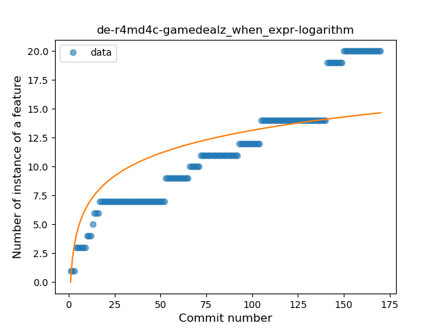
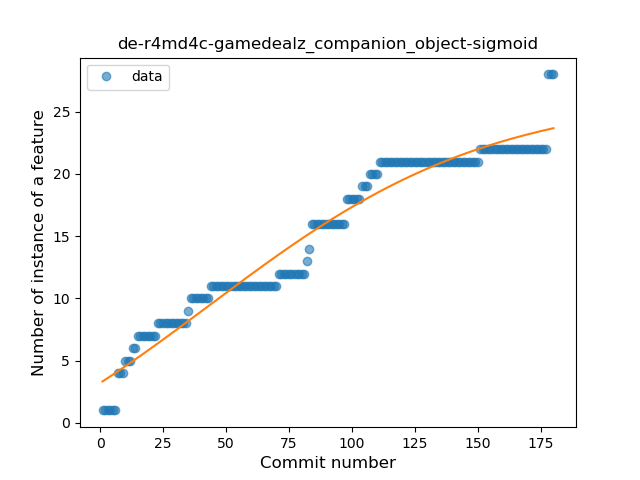
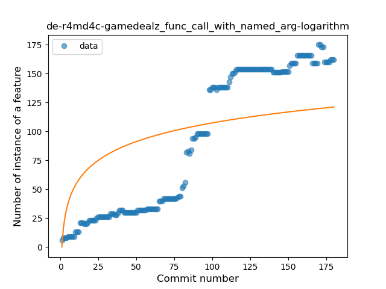
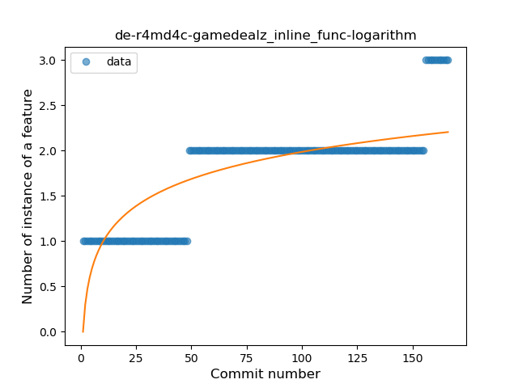
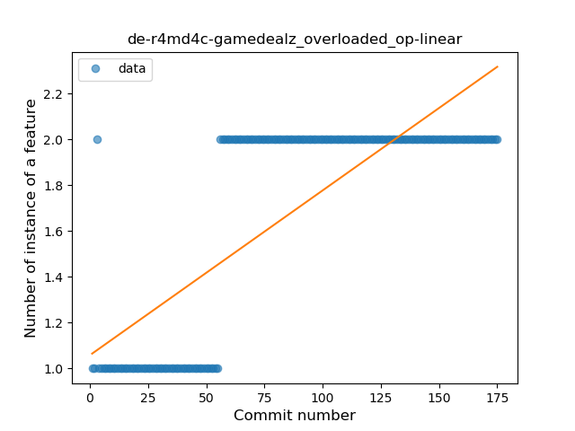

## de-r4md4c-gamedealz
----
#### Metrics provided by Detekt
* Number of lines of code 17261
* Number of Kotlin files: 256
* Cyclomatic complexity: 1137
* Cyclomatic complexity by thousands of lines: 177 

----
**21** features analyzed

*	<a href="#type_inference">Type Inference</a> 
*	<a href="#lambda">Lambda</a> 
*	<a href="#safe_call">Safe Call</a> 
*	<a href="#when_expr">When expression</a> 
*	<a href="#unsafe_call">Unsafe Call</a> 
*	<a href="#companion_object">Companion Object</a> 
*	<a href="#string_template">String Template</a> 
*	<a href="#func_with_default_value">Function with Default Value</a> 
*	<a href="#singleton">Singleton</a> 
*	<a href="#range_expr">Range Expression</a> 
*	<a href="#smart_cast">Smart Cast</a> 
*	<a href="#data_class">Data Class</a> 
*	<a href="#func_call_with_named_arg">Function call with Named Argument</a> 
*	<a href="#extension_function">Extension Function</a> 
*	<a href="#property_delegation">Property Delegation</a> 
*	<a href="#destructuring_declaration">Destructuring Declaration</a> 
*	<a href="#inline_func">Inline Function</a> 
*	<a href="#overloaded_op">Overloaded Operator</a> 
*	<a href="#coroutine">Coroutine</a> 
*	<a href="#sealed_class">Sealed Class</a> 
*	<a href="#type_alias">Type Alias</a> 

### <a name="type_inference">Type Inference</a>
----
#### Functions
* **Constant Rise - Linear:** 
    * **R_Squared:** 0.94188413
* **Sudden Rise Plateau - Logarithm:** 
    * **R_Squared:** 0.70671669

**Plots** :chart_with_upwards_trend:
-----

### <a name="lambda">Lambda</a>
----
#### Functions
* **Constant Rise - Linear:** 
    * **R_Squared:** 0.91200705
* **Sudden Rise Plateau - Logarithm:** 
    * **R_Squared:** 0.75483377
* **Plateau Sudden Rise - Binary Sigmoid:** 
    * **R_Squared:** 0.53719154

**Plots** :chart_with_upwards_trend:
-----

### <a name="safe_call">Safe Call</a>
----
#### Functions
* **Instability - Polinomial 3:** )
    * **R_Squared:** 0.96451651
* **Sudden Rise Plateau - Logarithm:** 
    * **R_Squared:** 0.84618762
* **Constant Rise - Linear:** 
    * **R_Squared:** 0.68291641
* **Plateau Sudden Rise - Binary Sigmoid:** 
    * **R_Squared:** 0.01348057

**Plots** :chart_with_upwards_trend:
-----

### <a name="when_expr">When expression</a>
----
#### Functions
* **Constant Rise - Linear:** 
    * **R_Squared:** 0.94277324
* **Sudden Rise - Exponential:** 
    * **R_Squared:** 0.94837011
* **Sudden Rise Plateau - Logarithm:** 
    * **R_Squared:** 0.64768369

**Plots** :chart_with_upwards_trend:
-----

### <a name="unsafe_call">Unsafe Call</a>
----
#### Functions
* **Constant Rise - Linear:** 
    * **R_Squared:** 0.89063706
* **Sudden Rise Plateau - Logarithm:** 
    * **R_Squared:** 0.66866332
* **Plateau Sudden Rise - Binary Sigmoid:** 
    * **R_Squared:** 0.39659296

**Plots** :chart_with_upwards_trend:
-----

### <a name="companion_object">Companion Object</a>
----
#### Functions
* **Plateau Gradual Rise - Sigmoid:** 
    * **R_Squared:** 0.95316717
* **Constant Rise - Linear:** 
    * **R_Squared:** 0.9337193
* **Sudden Rise Plateau - Logarithm:** 
    * **R_Squared:** 0.70192354

**Plots** :chart_with_upwards_trend:
-----

### <a name="string_template">String Template</a>
----
#### Functions
* **Constant Rise - Linear:** 
    * **R_Squared:** 0.79443035
* **Sudden Rise - Exponential:** 
    * **R_Squared:** 0.7983005
* **Sudden Rise Plateau - Logarithm:** 
    * **R_Squared:** 0.52810001

**Plots** :chart_with_upwards_trend:
-----

### <a name="func_with_default_value">Function with Default Value</a>
----
#### Functions
* **Sudden Rise Plateau - Logarithm:** 
    * **R_Squared:** 0.93820532
* **Constant Rise - Linear:** 
    * **R_Squared:** 0.85365678
* **Plateau Gradual Rise - Sigmoid:** 
    * **R_Squared:** 0.58283095

**Plots** :chart_with_upwards_trend:
-----

### <a name="singleton">Singleton</a>
----
#### Functions
* **Sudden Rise Plateau - Logarithm:** 
    * **R_Squared:** 0.80622245
* **Constant Rise - Linear:** 
    * **R_Squared:** 0.58975633
* **Plateau Sudden Rise - Binary Sigmoid:** 
    * **R_Squared:** 0.56018728

**Plots** :chart_with_upwards_trend:
-----

### <a name="range_expr">Range Expression</a>
----
#### Functions
* **Constant Rise - Linear:** 
    * **R_Squared:** 0.85308823
* **Sudden Rise Plateau - Logarithm:** 
    * **R_Squared:** 0.65508913

**Plots** :chart_with_upwards_trend:
-----

### <a name="smart_cast">Smart Cast</a>
----
#### Functions
* **Sudden Rise - Exponential:** 
    * **R_Squared:** 0.82446781
* **Constant Rise - Linear:** 
    * **R_Squared:** 0.72891175
* **Sudden Rise Plateau - Logarithm:** 
    * **R_Squared:** 0.59034872

**Plots** :chart_with_upwards_trend:
-----

### <a name="data_class">Data Class</a>
----
#### Functions
* **Sudden Rise Plateau - Logarithm:** 
    * **R_Squared:** 0.94596433
* **Constant Rise - Linear:** 
    * **R_Squared:** 0.73677798

**Plots** :chart_with_upwards_trend:
-----

### <a name="func_call_with_named_arg">Function call with Named Argument</a>
----
#### Functions
* **Instability - Polinomial 3:** )
    * **R_Squared:** 0.95788954
* **Constant Rise - Linear:** 
    * **R_Squared:** 0.90353657
* **Sudden Rise Plateau - Logarithm:** 
    * **R_Squared:** 0.45283705

**Plots** :chart_with_upwards_trend:
-----

### <a name="extension_function">Extension Function</a>
----
#### Functions
* **Constant Rise - Linear:** 
    * **R_Squared:** 0.881405
* **Sudden Rise Plateau - Logarithm:** 
    * **R_Squared:** 0.83896234
* **Plateau Gradual Rise - Sigmoid:** 
    * **R_Squared:** 0.40428145

**Plots** :chart_with_upwards_trend:
-----

### <a name="property_delegation">Property Delegation</a>
----
#### Functions
* **Constant Rise - Linear:** 
    * **R_Squared:** 0.87662219
* **Sudden Rise Plateau - Logarithm:** 
    * **R_Squared:** 0.78585002
* **Plateau Sudden Rise - Binary Sigmoid:** 
    * **R_Squared:** 0.66239009

**Plots** :chart_with_upwards_trend:
-----

### <a name="destructuring_declaration">Destructuring Declaration</a>
----
#### Functions
* **Plateau Gradual Rise - Sigmoid:** 
    * **R_Squared:** 0.29320736
* **Constant Rise - Linear:** 
    * **R_Squared:** 0.21380966
* **Sudden Rise Plateau - Logarithm:** 
    * **R_Squared:** 0.20085878

**Plots** :chart_with_upwards_trend:
-----

### <a name="inline_func">Inline Function</a>
----
#### Functions
* **Constant Rise - Linear:** 
    * **R_Squared:** 0.70172677
* **Sudden Rise Plateau - Logarithm:** 
    * **R_Squared:** 0.61402112

**Plots** :chart_with_upwards_trend:
-----

### <a name="overloaded_op">Overloaded Operator</a>
----
#### Functions
* **Plateau Sudden Rise - Binary Sigmoid:** 
    * **R_Squared:** 0.97370398
* **Constant Rise - Linear:** 
    * **R_Squared:** 0.61987219
* **Sudden Rise Plateau - Logarithm:** 
    * **R_Squared:** 0.58844792

**Plots** :chart_with_upwards_trend:
-----

### <a name="coroutine">Coroutine</a>
----
#### Functions
* **Constant Rise - Linear:** 
    * **R_Squared:** 0.92304647
* **Sudden Rise Plateau - Logarithm:** 
    * **R_Squared:** 0.81163446
* **Plateau Gradual Rise - Sigmoid:** 
    * **R_Squared:** 0.69696395

**Plots** :chart_with_upwards_trend:
-----

### <a name="sealed_class">Sealed Class</a>
----
#### Functions
* **Sudden Rise Plateau - Logarithm:** 
    * **R_Squared:** 0.70601727
* **Constant Rise - Linear:** 
    * **R_Squared:** 0.57117061

**Plots** :chart_with_upwards_trend:
-----

### <a name="type_alias">Type Alias</a>
----
#### Functions
* **Plateau Gradual Rise - Sigmoid:** 
    * **R_Squared:** 0.94032994
* **Sudden Rise Plateau - Logarithm:** 
    * **R_Squared:** 0.8711041
* **Constant Rise - Linear:** 
    * **R_Squared:** 0.75128434

**Plots** :chart_with_upwards_trend:
-----

