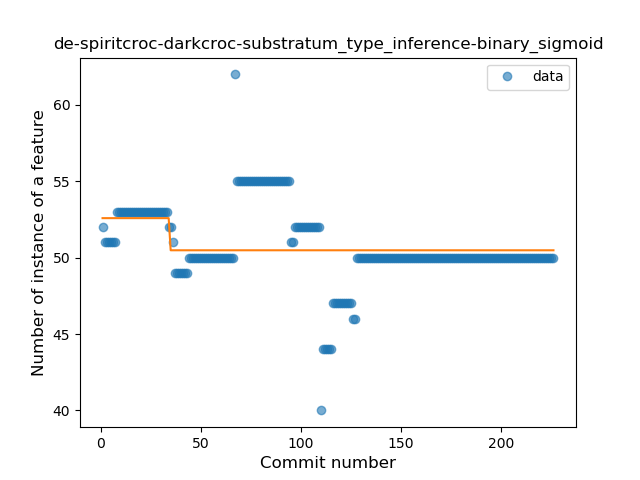
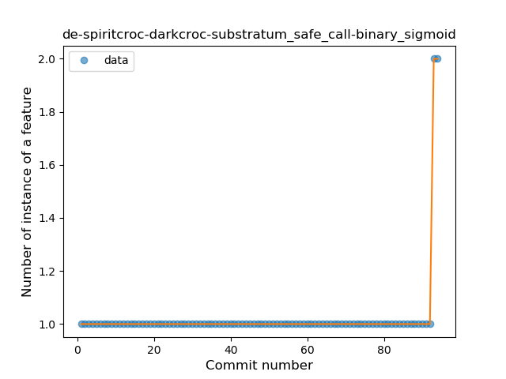
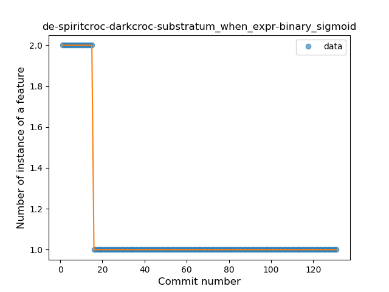
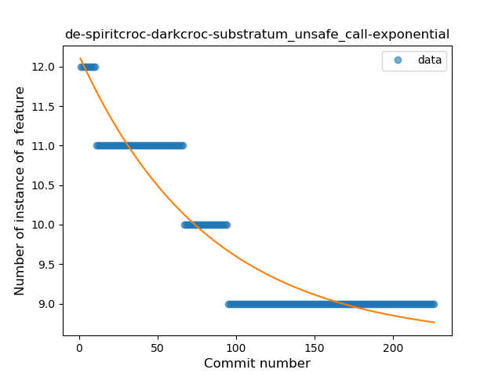
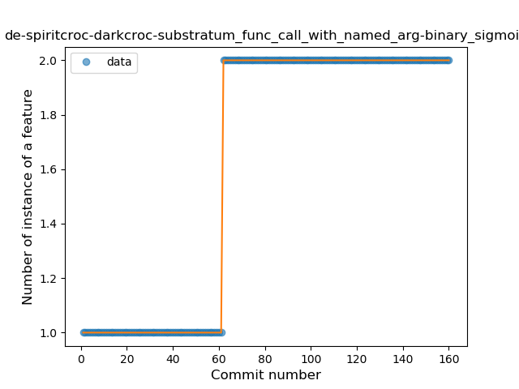

## de-spiritcroc-darkcroc-substratum
----
#### Metrics provided by Detekt
* Number of lines of code 578
* Number of Kotlin files: 3
* Cyclomatic complexity: 102
* Cyclomatic complexity by thousands of lines: 306 

----
**8** features analyzed

*	<a href="#type_inference">Type Inference</a> 
*	<a href="#lambda">Lambda</a> 
*	<a href="#safe_call">Safe Call</a> 
*	<a href="#when_expr">When expression</a> 
*	<a href="#unsafe_call">Unsafe Call</a> 
*	<a href="#string_template">String Template</a> 
*	<a href="#singleton">Singleton</a> 
*	<a href="#func_call_with_named_arg">Function call with Named Argument</a> 

### <a name="type_inference">Type Inference</a>
----
#### Functions
* **Constant Decline - Linear:** 
    * **R_Squared:** 0.13691937
* **Sudden Decline - Exponential:** 
    * **R_Squared:** 0.14097308
* **Plateau Sudden Decline - Binary Sigmoid:** 
    * **R_Squared:** 0.09197679
* **Sudden Rise Plateau - Logarithm:** 
    * **R_Squared:** -0.0

**Plots** :chart_with_upwards_trend:
-----

### <a name="lambda">Lambda</a>
----
#### Functions
* **Plateau Gradual Rise - Sigmoid:** 
    * **R_Squared:** 0.87572545
* **Sudden Rise Plateau - Logarithm:** 
    * **R_Squared:** 0.73874784
* **Constant Rise - Linear:** 
    * **R_Squared:** 0.6361633

**Plots** :chart_with_upwards_trend:
-----

### <a name="safe_call">Safe Call</a>
----
#### Functions
* **Plateau Sudden Rise - Binary Sigmoid:** 
    * **R_Squared:** 1.0
* **Sudden Rise - Exponential:** 
    * **R_Squared:** 0.84071207
* **Constant Rise - Linear:** 
    * **R_Squared:** 0.06247878
* **Sudden Rise Plateau - Logarithm:** 
    * **R_Squared:** 0.02369447

**Plots** :chart_with_upwards_trend:
-----

### <a name="when_expr">When expression</a>
----
#### Functions
* **Plateau Sudden Decline - Binary Sigmoid:** 
    * **R_Squared:** 1.0
* **Sudden Decline - Exponential:** 
    * **R_Squared:** 0.79467444
* **Constant Decline - Linear:** 
    * **R_Squared:** 0.3041958
* **Sudden Rise Plateau - Logarithm:** 
    * **R_Squared:** -0.0

**Plots** :chart_with_upwards_trend:
-----

### <a name="unsafe_call">Unsafe Call</a>
----
#### Functions
* **Sudden Decline - Exponential:** 
    * **R_Squared:** 0.88739834
* **Constant Decline - Linear:** 
    * **R_Squared:** 0.7663994
* **Sudden Rise Plateau - Logarithm:** 
    * **R_Squared:** -0.0

**Plots** :chart_with_upwards_trend:
-----

### <a name="string_template">String Template</a>
----
#### Functions
* **Plateau Sudden Rise - Binary Sigmoid:** 
    * **R_Squared:** 1.0
* **Constant Rise - Linear:** 
    * **R_Squared:** 0.70772296
* **Sudden Rise Plateau - Logarithm:** 
    * **R_Squared:** 0.60691084

**Plots** :chart_with_upwards_trend:
-----

### <a name="singleton">Singleton</a>
----
#### Functions
* **Plateau Sudden Decline - Binary Sigmoid:** 
    * **R_Squared:** 1.0
* **Sudden Decline - Exponential:** 
    * **R_Squared:** 0.76417766
* **Constant Decline - Linear:** 
    * **R_Squared:** 0.62026432
* **Sudden Rise Plateau - Logarithm:** 
    * **R_Squared:** -0.0

**Plots** :chart_with_upwards_trend:
-----

### <a name="func_call_with_named_arg">Function call with Named Argument</a>
----
#### Functions
* **Plateau Sudden Rise - Binary Sigmoid:** 
    * **R_Squared:** 1.0
* **Constant Rise - Linear:** 
    * **R_Squared:** 0.70772296
* **Sudden Rise Plateau - Logarithm:** 
    * **R_Squared:** 0.60691084

**Plots** :chart_with_upwards_trend:
-----

