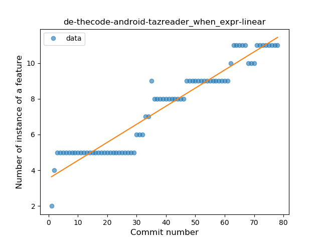
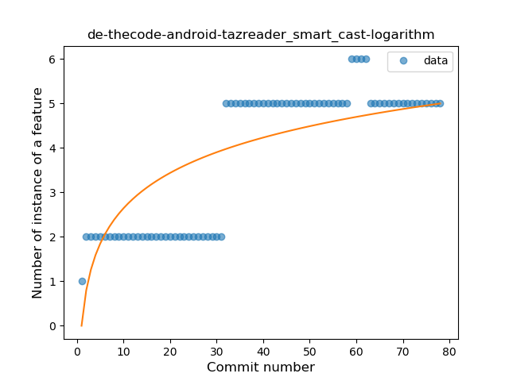

## de-thecode-android-tazreader
----
#### Metrics provided by Detekt
* Number of lines of code 2895
* Number of Kotlin files: 24
* Cyclomatic complexity: 417
* Cyclomatic complexity by thousands of lines: 247 

----
**13** features analyzed

*	<a href="#type_inference">Type Inference</a> 
*	<a href="#lambda">Lambda</a> 
*	<a href="#safe_call">Safe Call</a> 
*	<a href="#when_expr">When expression</a> 
*	<a href="#unsafe_call">Unsafe Call</a> 
*	<a href="#companion_object">Companion Object</a> 
*	<a href="#string_template">String Template</a> 
*	<a href="#func_with_default_value">Function with Default Value</a> 
*	<a href="#smart_cast">Smart Cast</a> 
*	<a href="#data_class">Data Class</a> 
*	<a href="#func_call_with_named_arg">Function call with Named Argument</a> 
*	<a href="#extension_function">Extension Function</a> 
*	<a href="#property_delegation">Property Delegation</a> 

### <a name="type_inference">Type Inference</a>
----
#### Functions
* **Constant Rise - Linear:** 
    * **R_Squared:** 0.84534923
* **Sudden Rise Plateau - Logarithm:** 
    * **R_Squared:** 0.75812294

**Plots** :chart_with_upwards_trend:
-----

### <a name="lambda">Lambda</a>
----
#### Functions
* **Constant Rise - Linear:** 
    * **R_Squared:** 0.92209874
* **Sudden Rise Plateau - Logarithm:** 
    * **R_Squared:** 0.70424789
* **Plateau Gradual Rise - Sigmoid:** 
    * **R_Squared:** 0.49152802

**Plots** :chart_with_upwards_trend:
-----

### <a name="safe_call">Safe Call</a>
----
#### Functions
* **Instability - Polinomial 3:** )
    * **R_Squared:** 0.94002003
* **Sudden Rise - Exponential:** 
    * **R_Squared:** 0.91250009
* **Constant Rise - Linear:** 
    * **R_Squared:** 0.70068172
* **Sudden Rise Plateau - Logarithm:** 
    * **R_Squared:** 0.35222527
* **Plateau Gradual Rise - Sigmoid:** 
    * **R_Squared:** 0.15505305

**Plots** :chart_with_upwards_trend:
-----

### <a name="when_expr">When expression</a>
----
#### Functions
* **Plateau Gradual Rise - Sigmoid:** 
    * **R_Squared:** 0.93212951
* **Constant Rise - Linear:** 
    * **R_Squared:** 0.91908711
* **Sudden Rise - Exponential:** 
    * **R_Squared:** 0.91990999
* **Sudden Rise Plateau - Logarithm:** 
    * **R_Squared:** 0.71994651

**Plots** :chart_with_upwards_trend:
-----

### <a name="unsafe_call">Unsafe Call</a>
----
#### Functions
* **Plateau Gradual Rise - Sigmoid:** 
    * **R_Squared:** 0.97858583
* **Instability - Polinomial 3:** )
    * **R_Squared:** 0.90565633
* **Constant Rise - Linear:** 
    * **R_Squared:** 0.83792094
* **Sudden Rise Plateau - Logarithm:** 
    * **R_Squared:** 0.5102597

**Plots** :chart_with_upwards_trend:
-----

### <a name="companion_object">Companion Object</a>
----
#### Functions
* **Plateau Gradual Rise - Sigmoid:** 
    * **R_Squared:** 0.93392404
* **Sudden Rise Plateau - Logarithm:** 
    * **R_Squared:** 0.83850815
* **Constant Rise - Linear:** 
    * **R_Squared:** 0.82765164

**Plots** :chart_with_upwards_trend:
-----

### <a name="string_template">String Template</a>
----
#### Functions
* **Constant Rise - Linear:** 
    * **R_Squared:** 0.90691701
* **Sudden Rise Plateau - Logarithm:** 
    * **R_Squared:** 0.83070173

**Plots** :chart_with_upwards_trend:
-----

### <a name="func_with_default_value">Function with Default Value</a>
----
#### Functions
* **Sudden Rise Plateau - Logarithm:** 
    * **R_Squared:** 0.87968441
* **Constant Rise - Linear:** 
    * **R_Squared:** 0.73553902

**Plots** :chart_with_upwards_trend:
-----

### <a name="smart_cast">Smart Cast</a>
----
#### Functions
* **Plateau Sudden Rise - Binary Sigmoid:** 
    * **R_Squared:** 0.97518808
* **Constant Rise - Linear:** 
    * **R_Squared:** 0.72371641
* **Sudden Rise Plateau - Logarithm:** 
    * **R_Squared:** 0.62475839

**Plots** :chart_with_upwards_trend:
-----

### <a name="data_class">Data Class</a>
----
#### Functions
* **Constant Rise - Linear:** 
    * **R_Squared:** 0.87518642
* **Sudden Rise Plateau - Logarithm:** 
    * **R_Squared:** 0.70927884

**Plots** :chart_with_upwards_trend:
-----

### <a name="func_call_with_named_arg">Function call with Named Argument</a>
----
#### Functions
* **Sudden Rise Plateau - Logarithm:** 
    * **R_Squared:** 0.80949871
* **Constant Rise - Linear:** 
    * **R_Squared:** 0.73838046

**Plots** :chart_with_upwards_trend:
-----

### <a name="extension_function">Extension Function</a>
----
#### Functions
* **Plateau Gradual Rise - Sigmoid:** 
    * **R_Squared:** 0.92155145
* **Sudden Rise Plateau - Logarithm:** 
    * **R_Squared:** 0.7897599
* **Constant Rise - Linear:** 
    * **R_Squared:** 0.71721999

**Plots** :chart_with_upwards_trend:
-----

### <a name="property_delegation">Property Delegation</a>
----
#### Functions
* **Constant Rise - Linear:** 
    * **R_Squared:** 0.8493199
* **Plateau Sudden Rise - Binary Sigmoid:** 
    * **R_Squared:** 0.69850593
* **Sudden Rise Plateau - Logarithm:** 
    * **R_Squared:** 0.65797094

**Plots** :chart_with_upwards_trend:
-----

