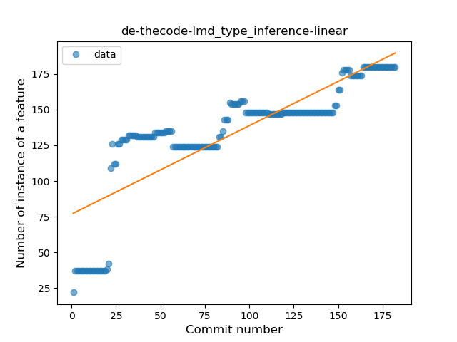
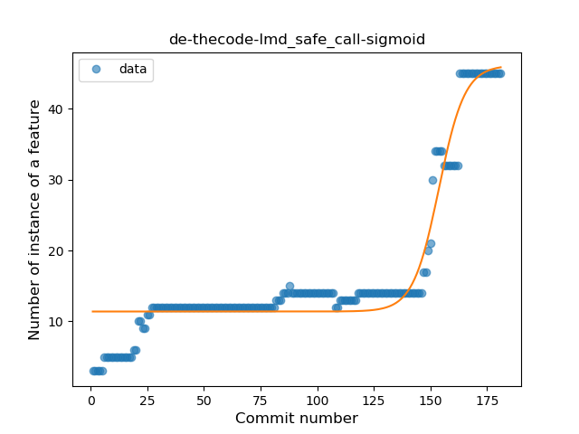
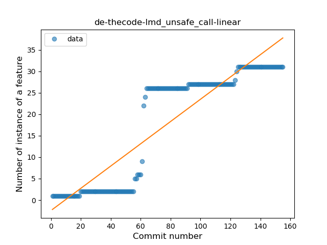
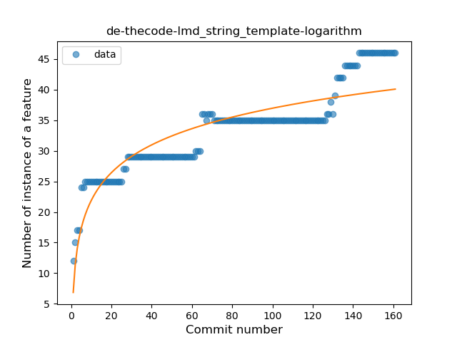
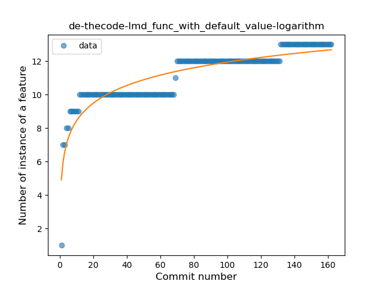
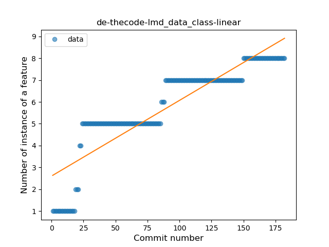
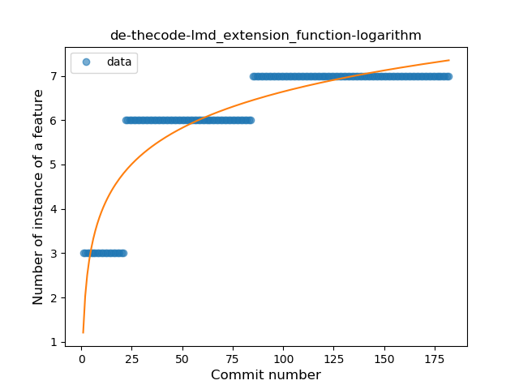

## de-thecode-lmd
----
#### Metrics provided by Detekt
* Number of lines of code 2716
* Number of Kotlin files: 22
* Cyclomatic complexity: 393
* Cyclomatic complexity by thousands of lines: 248 

----
**13** features analyzed

*	<a href="#type_inference">Type Inference</a> 
*	<a href="#lambda">Lambda</a> 
*	<a href="#safe_call">Safe Call</a> 
*	<a href="#when_expr">When expression</a> 
*	<a href="#unsafe_call">Unsafe Call</a> 
*	<a href="#companion_object">Companion Object</a> 
*	<a href="#string_template">String Template</a> 
*	<a href="#func_with_default_value">Function with Default Value</a> 
*	<a href="#smart_cast">Smart Cast</a> 
*	<a href="#data_class">Data Class</a> 
*	<a href="#func_call_with_named_arg">Function call with Named Argument</a> 
*	<a href="#extension_function">Extension Function</a> 
*	<a href="#property_delegation">Property Delegation</a> 

### <a name="type_inference">Type Inference</a>
----
#### Functions
* **Sudden Rise Plateau - Logarithm:** 
    * **R_Squared:** 0.80296299
* **Constant Rise - Linear:** 
    * **R_Squared:** 0.68680507
* **Plateau Sudden Rise - Binary Sigmoid:** 
    * **R_Squared:** 0.32828452

**Plots** :chart_with_upwards_trend:
-----

### <a name="lambda">Lambda</a>
----
#### Functions
* **Constant Rise - Linear:** 
    * **R_Squared:** 0.8182607
* **Sudden Rise Plateau - Logarithm:** 
    * **R_Squared:** 0.72456689
* **Plateau Gradual Rise - Sigmoid:** 
    * **R_Squared:** 0.42657925

**Plots** :chart_with_upwards_trend:
-----

### <a name="safe_call">Safe Call</a>
----
#### Functions
* **Plateau Gradual Rise - Sigmoid:** 
    * **R_Squared:** 0.92604853
* **Sudden Rise - Exponential:** 
    * **R_Squared:** 0.88252511
* **Constant Rise - Linear:** 
    * **R_Squared:** 0.61423948
* **Sudden Rise Plateau - Logarithm:** 
    * **R_Squared:** 0.30485181

**Plots** :chart_with_upwards_trend:
-----

### <a name="when_expr">When expression</a>
----
#### Functions
* **Plateau Gradual Rise - Sigmoid:** 
    * **R_Squared:** 0.91731217
* **Constant Rise - Linear:** 
    * **R_Squared:** 0.89698494
* **Sudden Rise Plateau - Logarithm:** 
    * **R_Squared:** 0.67369399

**Plots** :chart_with_upwards_trend:
-----

### <a name="unsafe_call">Unsafe Call</a>
----
#### Functions
* **Constant Rise - Linear:** 
    * **R_Squared:** 0.82253512
* **Sudden Rise Plateau - Logarithm:** 
    * **R_Squared:** 0.43336685
* **Plateau Sudden Rise - Binary Sigmoid:** 
    * **R_Squared:** 0.14448059

**Plots** :chart_with_upwards_trend:
-----

### <a name="companion_object">Companion Object</a>
----
#### Functions
* **Sudden Rise Plateau - Logarithm:** 
    * **R_Squared:** 0.82467418
* **Constant Rise - Linear:** 
    * **R_Squared:** 0.60542446
* **Plateau Sudden Rise - Binary Sigmoid:** 
    * **R_Squared:** 0.31266898

**Plots** :chart_with_upwards_trend:
-----

### <a name="string_template">String Template</a>
----
#### Functions
* **Constant Rise - Linear:** 
    * **R_Squared:** 0.87364437
* **Sudden Rise - Exponential:** 
    * **R_Squared:** 0.87482994
* **Sudden Rise Plateau - Logarithm:** 
    * **R_Squared:** 0.77141998

**Plots** :chart_with_upwards_trend:
-----

### <a name="func_with_default_value">Function with Default Value</a>
----
#### Functions
* **Sudden Rise Plateau - Logarithm:** 
    * **R_Squared:** 0.81965944
* **Constant Rise - Linear:** 
    * **R_Squared:** 0.73976206

**Plots** :chart_with_upwards_trend:
-----

### <a name="smart_cast">Smart Cast</a>
----
#### Functions
* **Plateau Sudden Rise - Binary Sigmoid:** 
    * **R_Squared:** 0.98672905
* **Constant Rise - Linear:** 
    * **R_Squared:** 0.71936536
* **Sudden Rise Plateau - Logarithm:** 
    * **R_Squared:** 0.58134018

**Plots** :chart_with_upwards_trend:
-----

### <a name="data_class">Data Class</a>
----
#### Functions
* **Constant Rise - Linear:** 
    * **R_Squared:** 0.80190349
* **Sudden Rise Plateau - Logarithm:** 
    * **R_Squared:** 0.78522412

**Plots** :chart_with_upwards_trend:
-----

### <a name="func_call_with_named_arg">Function call with Named Argument</a>
----
#### Functions
* **Plateau Gradual Rise - Sigmoid:** 
    * **R_Squared:** 0.88917278
* **Sudden Rise Plateau - Logarithm:** 
    * **R_Squared:** 0.61614532
* **Constant Rise - Linear:** 
    * **R_Squared:** 0.32739814

**Plots** :chart_with_upwards_trend:
-----

### <a name="extension_function">Extension Function</a>
----
#### Functions
* **Sudden Rise Plateau - Logarithm:** 
    * **R_Squared:** 0.81417209
* **Constant Rise - Linear:** 
    * **R_Squared:** 0.5995142

**Plots** :chart_with_upwards_trend:
-----

### <a name="property_delegation">Property Delegation</a>
----
#### Functions
* **Constant Rise - Linear:** 
    * **R_Squared:** 0.76304195
* **Sudden Rise Plateau - Logarithm:** 
    * **R_Squared:** 0.72115644
* **Plateau Gradual Rise - Sigmoid:** 
    * **R_Squared:** 0.63498421

**Plots** :chart_with_upwards_trend:
-----

