## de-tubaf-mandelGL
----
#### Metrics provided by Detekt
* Number of lines of code 902
* Number of Kotlin files: 4
* Cyclomatic complexity: 71
* Cyclomatic complexity by thousands of lines: 156 

----
**5** features analyzed

*	<a href="#type_inference">Type Inference</a> 
*	<a href="#lambda">Lambda</a> 
*	<a href="#safe_call">Safe Call</a> 
*	<a href="#unsafe_call">Unsafe Call</a> 
*	<a href="#range_expr">Range Expression</a> 

### <a name="type_inference">Type Inference</a>
----
#### Functions
* **Instability - Polinomial 4:** 
    * **R_Squared:** 0.91851142
* **Sudden Rise Plateau - Logarithm:** 
    * **R_Squared:** 0.72903177
* **Constant Rise - Linear:** 
    * **R_Squared:** 0.70454136

**Plots** :chart_with_upwards_trend:
-----

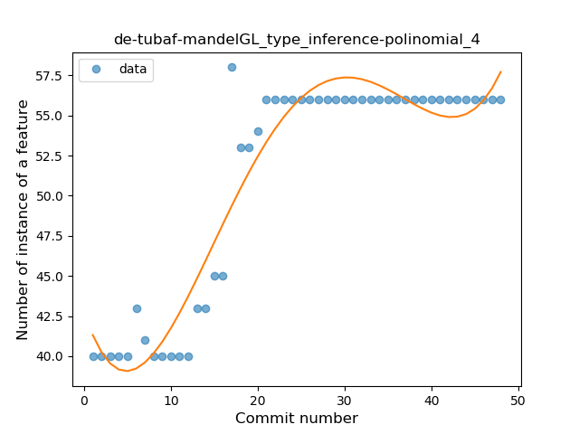
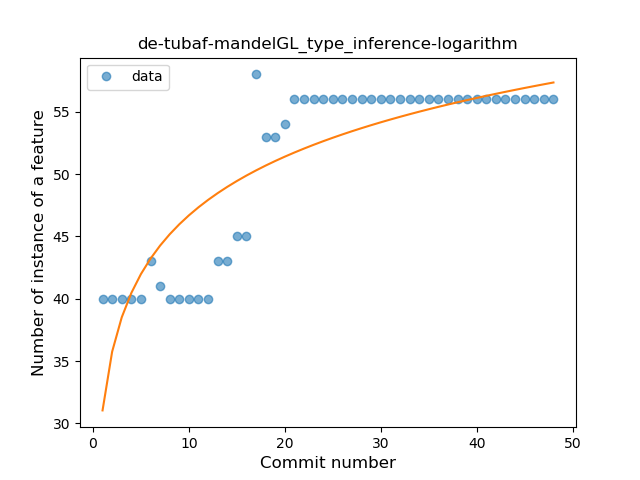
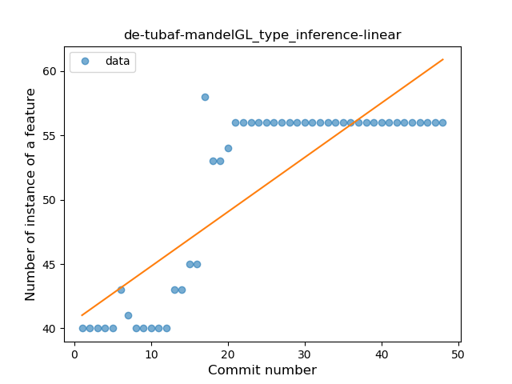
### <a name="lambda">Lambda</a>
----
#### Functions
* **Plateau Gradual Rise - Sigmoid:** 
    * **R_Squared:** 0.99184322
* **Sudden Rise Plateau - Logarithm:** 
    * **R_Squared:** 0.79828928
* **Constant Rise - Linear:** 
    * **R_Squared:** 0.71948334

**Plots** :chart_with_upwards_trend:
-----

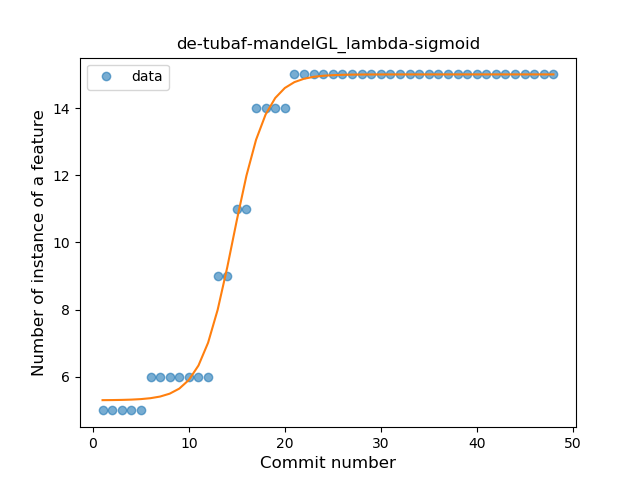
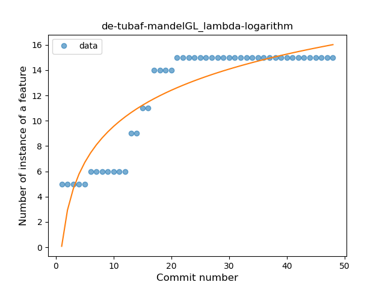
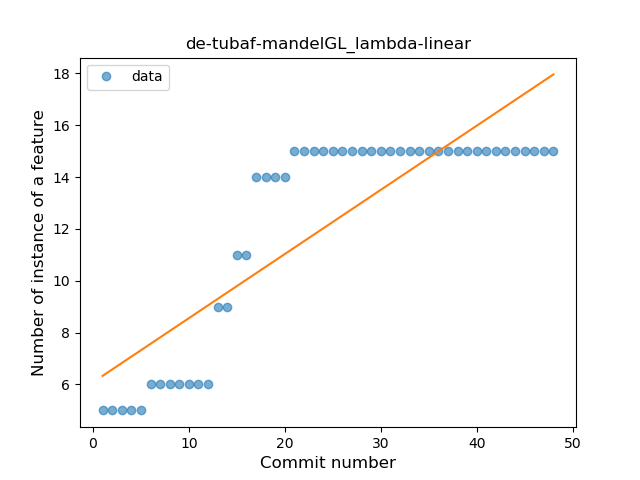
### <a name="safe_call">Safe Call</a>
----
#### Functions
* **Instability - Polinomial 4:** 
    * **R_Squared:** 0.94348644
* **Sudden Rise Plateau - Logarithm:** 
    * **R_Squared:** 0.90126325
* **Constant Rise - Linear:** 
    * **R_Squared:** 0.7956921

**Plots** :chart_with_upwards_trend:
-----

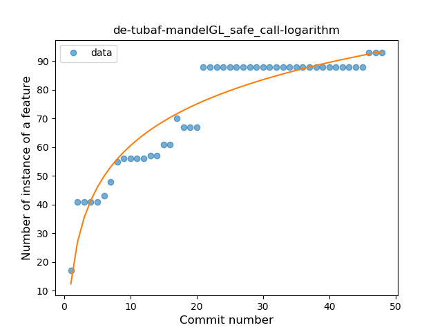
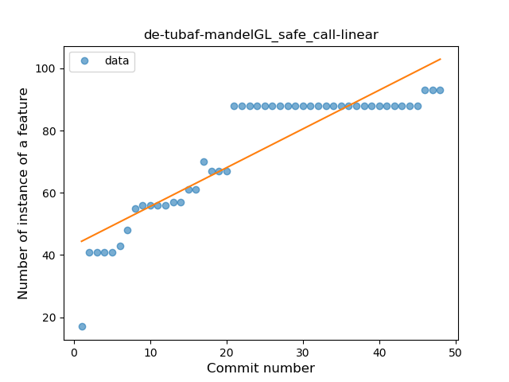
### <a name="unsafe_call">Unsafe Call</a>
----
#### Functions
* **Sudden Rise Plateau - Logarithm:** 
    * **R_Squared:** 0.2375354
* **Constant Rise - Linear:** 
    * **R_Squared:** 0.06122449

**Plots** :chart_with_upwards_trend:
-----

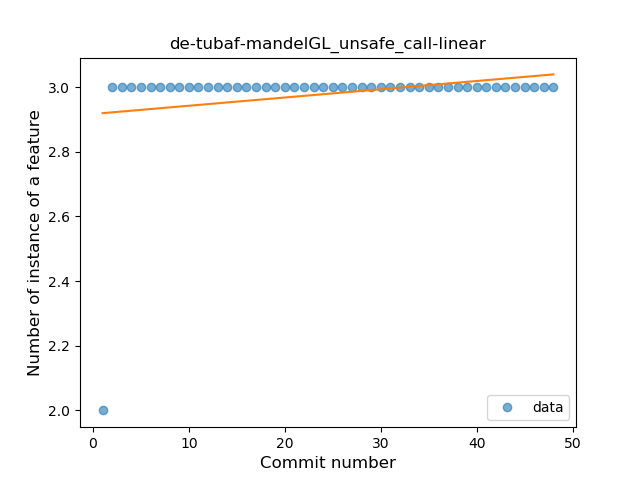
### <a name="range_expr">Range Expression</a>
----
#### Functions
* **Constant Decline - Linear:** 
    * **R_Squared:** 0.01546073
* **Sudden Rise Plateau - Logarithm:** 
    * **R_Squared:** -0.0
* **Plateau Gradual Rise - Sigmoid:** 
    * **R_Squared:** 0.0080682

**Plots** :chart_with_upwards_trend:
-----

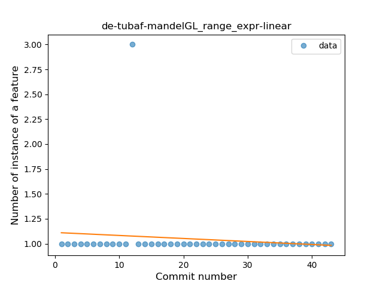
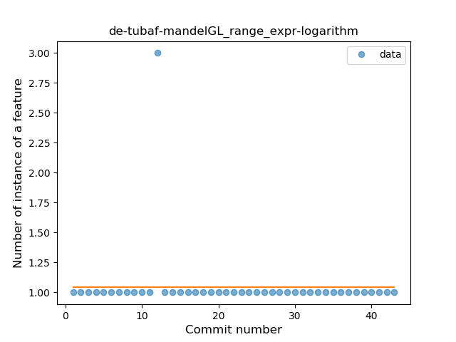
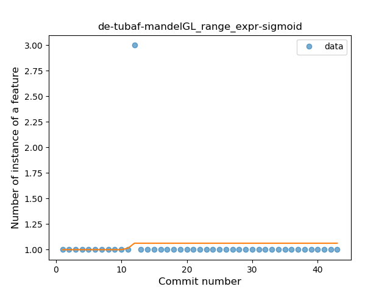
