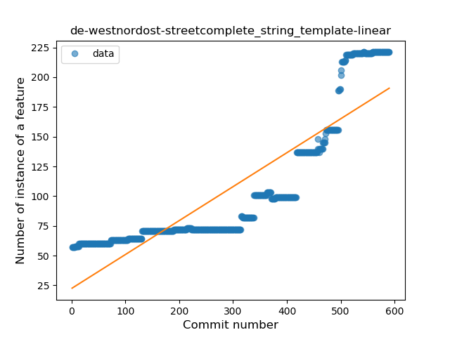
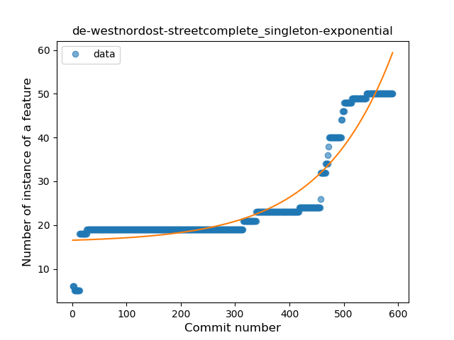
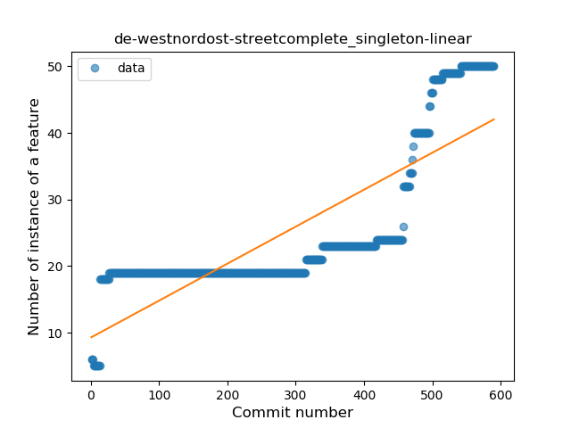
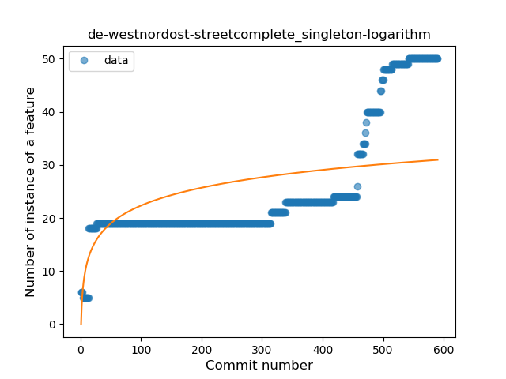
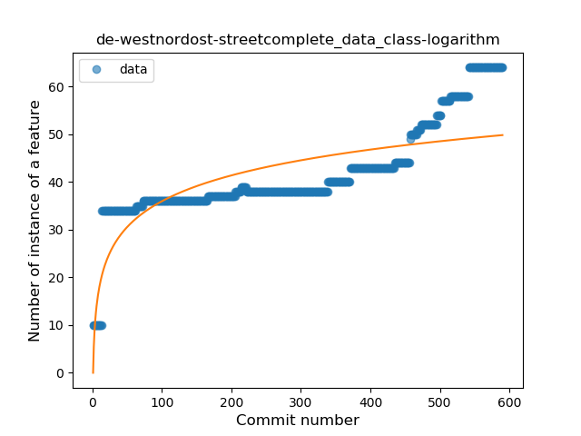
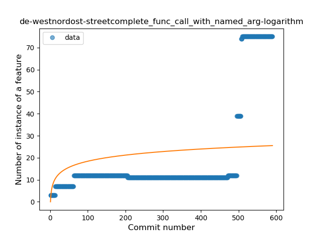
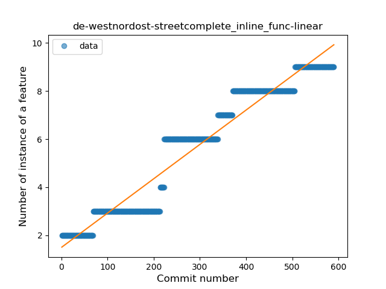
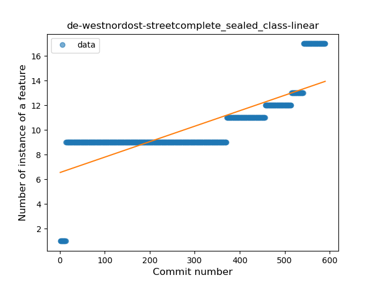

## de-westnordost-streetcomplete
----
#### Metrics provided by Detekt
* Number of lines of code 26757
* Number of Kotlin files: 427
* Cyclomatic complexity: 3746
* Cyclomatic complexity by thousands of lines: 255 

----
**19** features analyzed

*	<a href="#type_inference">Type Inference</a> 
*	<a href="#lambda">Lambda</a> 
*	<a href="#safe_call">Safe Call</a> 
*	<a href="#when_expr">When expression</a> 
*	<a href="#unsafe_call">Unsafe Call</a> 
*	<a href="#companion_object">Companion Object</a> 
*	<a href="#string_template">String Template</a> 
*	<a href="#func_with_default_value">Function with Default Value</a> 
*	<a href="#singleton">Singleton</a> 
*	<a href="#range_expr">Range Expression</a> 
*	<a href="#smart_cast">Smart Cast</a> 
*	<a href="#data_class">Data Class</a> 
*	<a href="#func_call_with_named_arg">Function call with Named Argument</a> 
*	<a href="#extension_function">Extension Function</a> 
*	<a href="#property_delegation">Property Delegation</a> 
*	<a href="#destructuring_declaration">Destructuring Declaration</a> 
*	<a href="#inline_func">Inline Function</a> 
*	<a href="#sealed_class">Sealed Class</a> 
*	<a href="#type_alias">Type Alias</a> 

### <a name="type_inference">Type Inference</a>
----
#### Functions
* **Sudden Rise - Exponential:** 
    * **R_Squared:** 0.96906838
* **Constant Rise - Linear:** 
    * **R_Squared:** 0.87257668
* **Sudden Rise Plateau - Logarithm:** 
    * **R_Squared:** 0.49218987

**Plots** :chart_with_upwards_trend:
-----

### <a name="lambda">Lambda</a>
----
#### Functions
* **Sudden Rise - Exponential:** 
    * **R_Squared:** 0.97235143
* **Constant Rise - Linear:** 
    * **R_Squared:** 0.93358713
* **Sudden Rise Plateau - Logarithm:** 
    * **R_Squared:** 0.60636201

**Plots** :chart_with_upwards_trend:
-----

### <a name="safe_call">Safe Call</a>
----
#### Functions
* **Constant Rise - Linear:** 
    * **R_Squared:** 0.98072317
* **Sudden Rise - Exponential:** 
    * **R_Squared:** 0.9835253
* **Sudden Rise Plateau - Logarithm:** 
    * **R_Squared:** 0.63439677
* **Plateau Sudden Rise - Binary Sigmoid:** 
    * **R_Squared:** 0.3385238

**Plots** :chart_with_upwards_trend:
-----

### <a name="when_expr">When expression</a>
----
#### Functions
* **Sudden Rise - Exponential:** 
    * **R_Squared:** 0.96061338
* **Constant Rise - Linear:** 
    * **R_Squared:** 0.91090659
* **Sudden Rise Plateau - Logarithm:** 
    * **R_Squared:** 0.61401673

**Plots** :chart_with_upwards_trend:
-----

### <a name="unsafe_call">Unsafe Call</a>
----
#### Functions
* **Sudden Rise - Exponential:** 
    * **R_Squared:** 0.89415069
* **Constant Rise - Linear:** 
    * **R_Squared:** 0.64011351
* **Sudden Rise Plateau - Logarithm:** 
    * **R_Squared:** 0.24916866

**Plots** :chart_with_upwards_trend:
-----

### <a name="companion_object">Companion Object</a>
----
#### Functions
* **Plateau Sudden Decline - Binary Sigmoid:** 
    * **R_Squared:** 0.23516449
* **Constant Rise - Linear:** 
    * **R_Squared:** 0.14321635
* **Sudden Rise - Exponential:** 
    * **R_Squared:** 0.14476768
* **Sudden Rise Plateau - Logarithm:** 
    * **R_Squared:** 0.01387695

**Plots** :chart_with_upwards_trend:
-----

### <a name="string_template">String Template</a>
----
#### Functions
* **Sudden Rise - Exponential:** 
    * **R_Squared:** 0.95118981
* **Constant Rise - Linear:** 
    * **R_Squared:** 0.77115832
* **Sudden Rise Plateau - Logarithm:** 
    * **R_Squared:** 0.32717176

**Plots** :chart_with_upwards_trend:
-----

### <a name="func_with_default_value">Function with Default Value</a>
----
#### Functions
* **Sudden Rise - Exponential:** 
    * **R_Squared:** 0.96626752
* **Constant Rise - Linear:** 
    * **R_Squared:** 0.86621538
* **Sudden Rise Plateau - Logarithm:** 
    * **R_Squared:** 0.42289098

**Plots** :chart_with_upwards_trend:
-----

### <a name="singleton">Singleton</a>
----
#### Functions
* **Sudden Rise - Exponential:** 
    * **R_Squared:** 0.89673095
* **Constant Rise - Linear:** 
    * **R_Squared:** 0.67320947
* **Sudden Rise Plateau - Logarithm:** 
    * **R_Squared:** 0.34474203

**Plots** :chart_with_upwards_trend:
-----

### <a name="range_expr">Range Expression</a>
----
#### Functions
* **Sudden Rise - Exponential:** 
    * **R_Squared:** 0.89072428
* **Constant Rise - Linear:** 
    * **R_Squared:** 0.85309416
* **Sudden Rise Plateau - Logarithm:** 
    * **R_Squared:** 0.5400858

**Plots** :chart_with_upwards_trend:
-----

### <a name="smart_cast">Smart Cast</a>
----
#### Functions
* **Sudden Rise - Exponential:** 
    * **R_Squared:** 0.90670555
* **Constant Rise - Linear:** 
    * **R_Squared:** 0.8630442
* **Sudden Rise Plateau - Logarithm:** 
    * **R_Squared:** 0.50155795
* **Plateau Gradual Rise - Sigmoid:** 
    * **R_Squared:** 0.1059157

**Plots** :chart_with_upwards_trend:
-----

### <a name="data_class">Data Class</a>
----
#### Functions
* **Sudden Rise - Exponential:** 
    * **R_Squared:** 0.8586133
* **Constant Rise - Linear:** 
    * **R_Squared:** 0.75791175
* **Sudden Rise Plateau - Logarithm:** 
    * **R_Squared:** 0.5959668

**Plots** :chart_with_upwards_trend:
-----

### <a name="func_call_with_named_arg">Function call with Named Argument</a>
----
#### Functions
* **Sudden Rise - Exponential:** 
    * **R_Squared:** 0.81761009
* **Constant Rise - Linear:** 
    * **R_Squared:** 0.42657752
* **Sudden Rise Plateau - Logarithm:** 
    * **R_Squared:** 0.12319418
* **Plateau Sudden Rise - Binary Sigmoid:** 
    * **R_Squared:** 0.01818634

**Plots** :chart_with_upwards_trend:
-----

### <a name="extension_function">Extension Function</a>
----
#### Functions
* **Sudden Rise - Exponential:** 
    * **R_Squared:** 0.94868085
* **Constant Rise - Linear:** 
    * **R_Squared:** 0.91304197
* **Sudden Rise Plateau - Logarithm:** 
    * **R_Squared:** 0.39577967
* **Plateau Sudden Rise - Binary Sigmoid:** 
    * **R_Squared:** 0.2275588

**Plots** :chart_with_upwards_trend:
-----

### <a name="property_delegation">Property Delegation</a>
----
#### Functions
* **Plateau Gradual Rise - Sigmoid:** 
    * **R_Squared:** 0.96683287
* **Sudden Rise - Exponential:** 
    * **R_Squared:** 0.92345042
* **Constant Rise - Linear:** 
    * **R_Squared:** 0.69269571
* **Sudden Rise Plateau - Logarithm:** 
    * **R_Squared:** 0.34440361

**Plots** :chart_with_upwards_trend:
-----

### <a name="destructuring_declaration">Destructuring Declaration</a>
----
#### Functions
* **Sudden Rise - Exponential:** 
    * **R_Squared:** 0.82501497
* **Constant Rise - Linear:** 
    * **R_Squared:** 0.80699276
* **Sudden Rise Plateau - Logarithm:** 
    * **R_Squared:** 0.54878801

**Plots** :chart_with_upwards_trend:
-----

### <a name="inline_func">Inline Function</a>
----
#### Functions
* **Plateau Gradual Rise - Sigmoid:** 
    * **R_Squared:** 0.96057765
* **Constant Rise - Linear:** 
    * **R_Squared:** 0.93822064
* **Sudden Rise Plateau - Logarithm:** 
    * **R_Squared:** 0.5344552

**Plots** :chart_with_upwards_trend:
-----

### <a name="sealed_class">Sealed Class</a>
----
#### Functions
* **Sudden Rise - Exponential:** 
    * **R_Squared:** 0.78181534
* **Constant Rise - Linear:** 
    * **R_Squared:** 0.62048692
* **Sudden Rise Plateau - Logarithm:** 
    * **R_Squared:** 0.49133171

**Plots** :chart_with_upwards_trend:
-----

### <a name="type_alias">Type Alias</a>
----
#### Functions
* **Plateau Gradual Rise - Sigmoid:** 
    * **R_Squared:** 0.92604681
* **Sudden Rise - Exponential:** 
    * **R_Squared:** 0.80681984
* **Constant Rise - Linear:** 
    * **R_Squared:** 0.64157209
* **Sudden Rise Plateau - Logarithm:** 
    * **R_Squared:** 0.26552481

**Plots** :chart_with_upwards_trend:
-----

