## devmil-PaperLaunch
----
#### Metrics provided by Detekt
* Number of lines of code 7085
* Number of Kotlin files: 63
* Cyclomatic complexity: 862
* Cyclomatic complexity by thousands of lines: 237 

----
**9** features analyzed

*	<a href="#type_inference">Type Inference</a> 
*	<a href="#lambda">Lambda</a> 
*	<a href="#safe_call">Safe Call</a> 
*	<a href="#when_expr">When expression</a> 
*	<a href="#companion_object">Companion Object</a> 
*	<a href="#unsafe_call">Unsafe Call</a> 
*	<a href="#singleton">Singleton</a> 
*	<a href="#smart_cast">Smart Cast</a> 
*	<a href="#range_expr">Range Expression</a> 

### <a name="type_inference">Type Inference</a>
----
#### Functions
* **Sudden Rise Plateau - Logarithm:** 
    * **R_Squared:** 0.86313363
* **Constant Rise - Linear:** 
    * **R_Squared:** 0.8400122

**Plots** :chart_with_upwards_trend:
-----

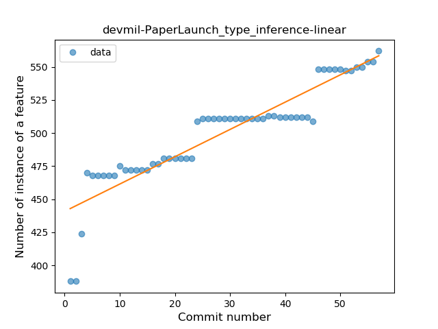
### <a name="lambda">Lambda</a>
----
#### Functions
* **Sudden Rise - Exponential:** 
    * **R_Squared:** 0.91271147
* **Constant Rise - Linear:** 
    * **R_Squared:** 0.83752936
* **Sudden Rise Plateau - Logarithm:** 
    * **R_Squared:** 0.6162519

**Plots** :chart_with_upwards_trend:
-----

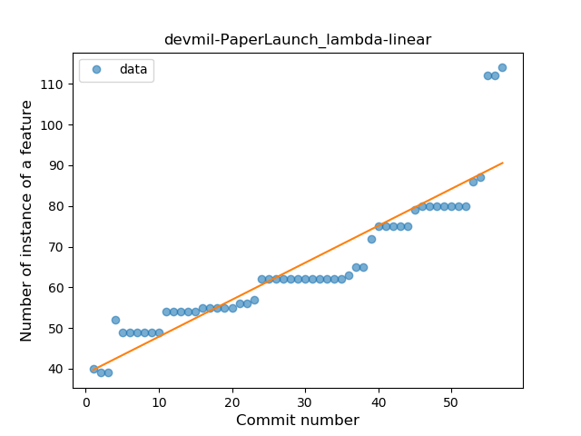
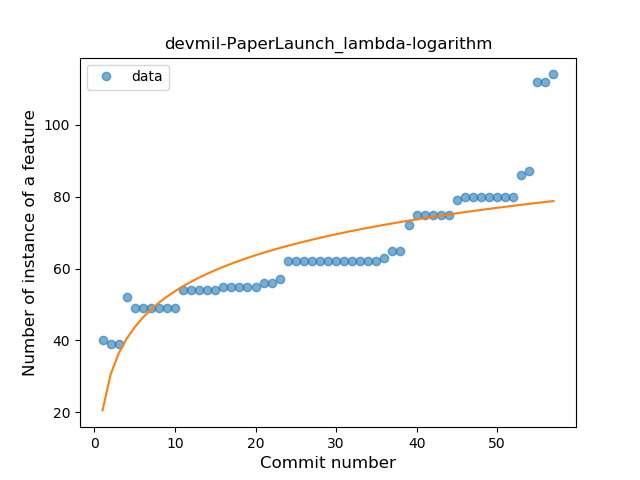
### <a name="safe_call">Safe Call</a>
----
#### Functions
* **Sudden Rise - Exponential:** 
    * **R_Squared:** 0.94306854
* **Constant Rise - Linear:** 
    * **R_Squared:** 0.70140421
* **Sudden Rise Plateau - Logarithm:** 
    * **R_Squared:** 0.29897249

**Plots** :chart_with_upwards_trend:
-----

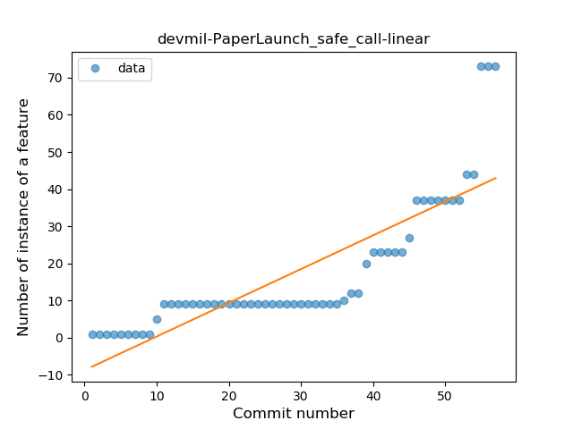
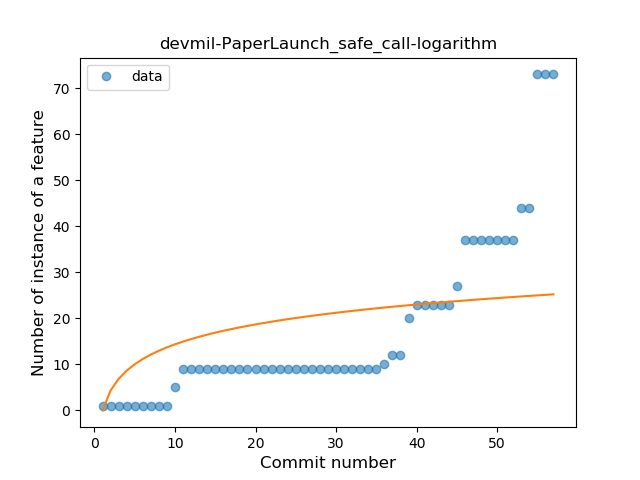
### <a name="when_expr">When expression</a>
----
#### Functions
* **Constant Rise - Linear:** 
    * **R_Squared:** 0.82159791
* **Sudden Rise Plateau - Logarithm:** 
    * **R_Squared:** 0.78900402

**Plots** :chart_with_upwards_trend:
-----

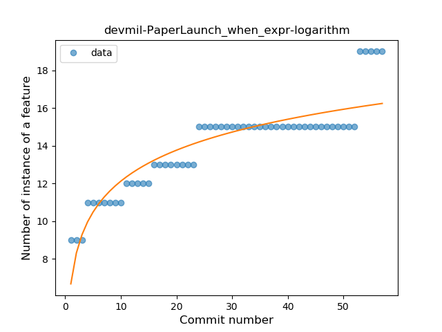
### <a name="companion_object">Companion Object</a>
----
#### Functions
* **Instability - Polinomial 3:** )
    * **R_Squared:** 0.52579099
* **Sudden Rise Plateau - Logarithm:** 
    * **R_Squared:** 0.4942411
* **Constant Rise - Linear:** 
    * **R_Squared:** 0.40398884

**Plots** :chart_with_upwards_trend:
-----

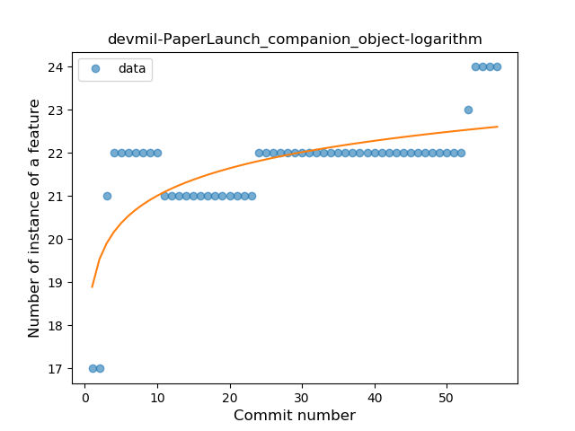
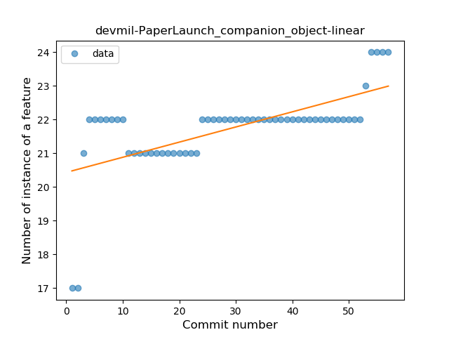
### <a name="unsafe_call">Unsafe Call</a>
----
#### Functions
* **Instability - Polinomial 4:** 
    * **R_Squared:** 0.90344391
* **Constant Decline - Linear:** 
    * **R_Squared:** 0.56501838
* **Sudden Rise Plateau - Logarithm:** 
    * **R_Squared:** -0.0

**Plots** :chart_with_upwards_trend:
-----

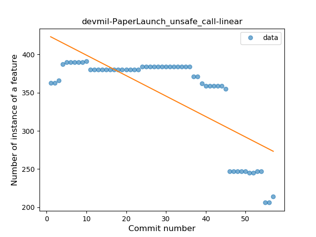
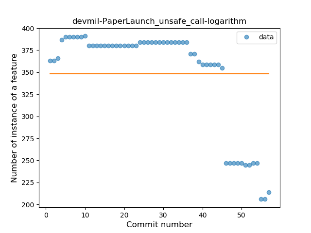
### <a name="singleton">Singleton</a>
----
#### Functions
* **Sudden Rise Plateau - Logarithm:** 
    * **R_Squared:** 0.68779857
* **Constant Rise - Linear:** 
    * **R_Squared:** 0.58189655
* **Plateau Gradual Rise - Sigmoid:** 
    * **R_Squared:** 0.00637755

**Plots** :chart_with_upwards_trend:
-----

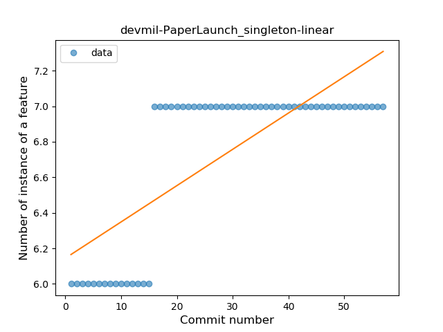
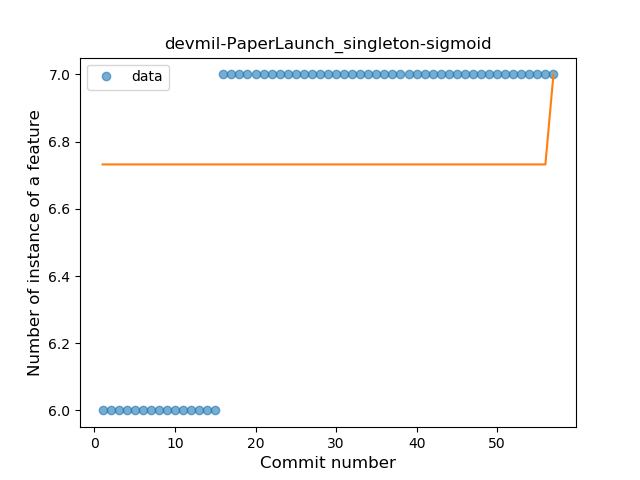
### <a name="smart_cast">Smart Cast</a>
----
#### Functions
* **Sudden Rise Plateau - Logarithm:** 
    * **R_Squared:** 0.80939686
* **Constant Rise - Linear:** 
    * **R_Squared:** 0.61990148

**Plots** :chart_with_upwards_trend:
-----

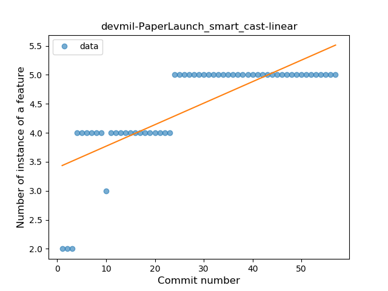
### <a name="range_expr">Range Expression</a>
----
#### Functions
* **Plateau Sudden Rise - Binary Sigmoid:** 
    * **R_Squared:** 1.0
* **Sudden Rise Plateau - Logarithm:** 
    * **R_Squared:** 0.34691006
* **Constant Rise - Linear:** 
    * **R_Squared:** 0.10160099

**Plots** :chart_with_upwards_trend:
-----

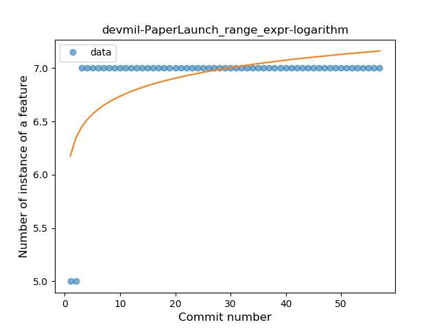
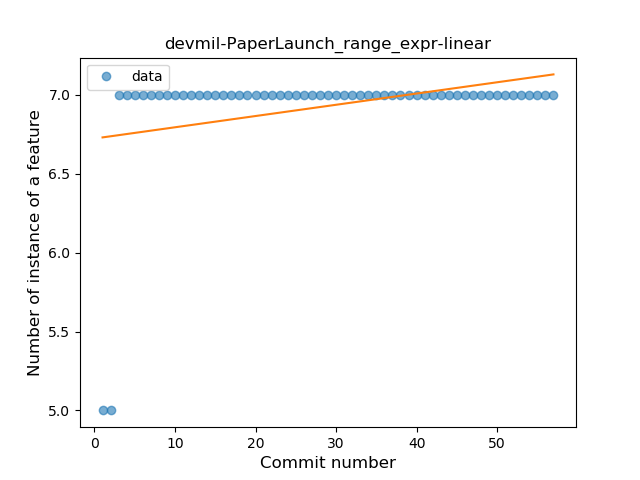
