## devmil-muzei-bingimageoftheday
----
#### Metrics provided by Detekt
* Number of lines of code 2299
* Number of Kotlin files: 25
* Cyclomatic complexity: 224
* Cyclomatic complexity by thousands of lines: 219 

----
**5** features analyzed

*	<a href="#type_inference">Type Inference</a> 
*	<a href="#lambda">Lambda</a> 
*	<a href="#safe_call">Safe Call</a> 
*	<a href="#unsafe_call">Unsafe Call</a> 
*	<a href="#string_template">String Template</a> 

### <a name="type_inference">Type Inference</a>
----
#### Functions
* **Instability - Polinomial 4:** 
    * **R_Squared:** 0.85631548
* **Sudden Decline - Exponential:** 
    * **R_Squared:** 0.1542174
* **Constant Decline - Linear:** 
    * **R_Squared:** 0.00660475
* **Sudden Rise Plateau - Logarithm:** 
    * **R_Squared:** -0.0

**Plots** :chart_with_upwards_trend:
-----

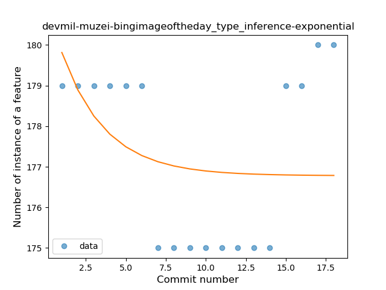
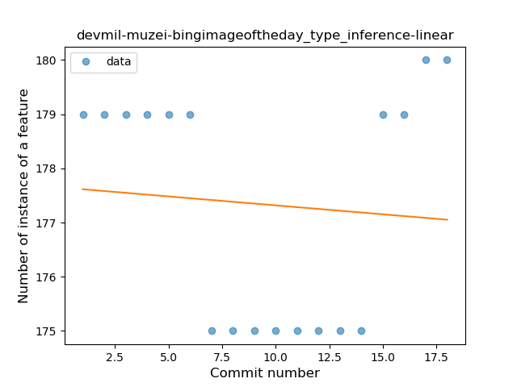
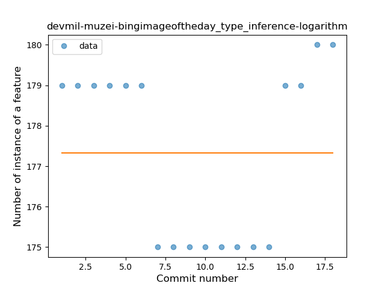
### <a name="lambda">Lambda</a>
----
#### Functions
* **Instability - Polinomial 4:** 
    * **R_Squared:** 0.88432311
* **Sudden Rise Plateau - Logarithm:** 
    * **R_Squared:** 0.70518116
* **Constant Rise - Linear:** 
    * **R_Squared:** 0.66873065

**Plots** :chart_with_upwards_trend:
-----

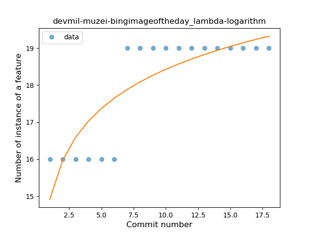

### <a name="safe_call">Safe Call</a>
----
#### Functions
* **Plateau Sudden Decline - Binary Sigmoid:** 
    * **R_Squared:** 1.0
* **Instability - Polinomial 4:** 
    * **R_Squared:** 0.88432311
* **Sudden Decline - Exponential:** 
    * **R_Squared:** 0.76289121
* **Constant Decline - Linear:** 
    * **R_Squared:** 0.66873065
* **Sudden Rise Plateau - Logarithm:** 
    * **R_Squared:** -0.0

**Plots** :chart_with_upwards_trend:
-----

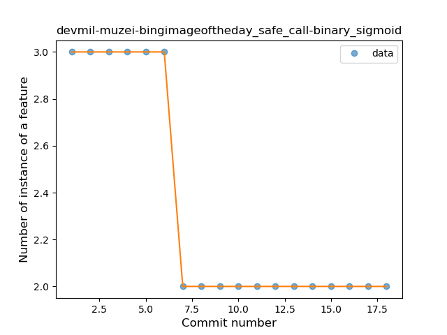
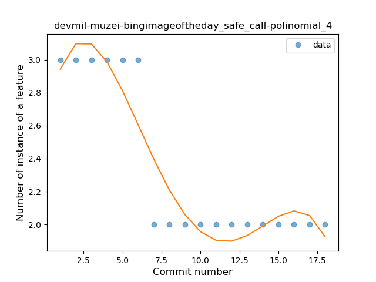
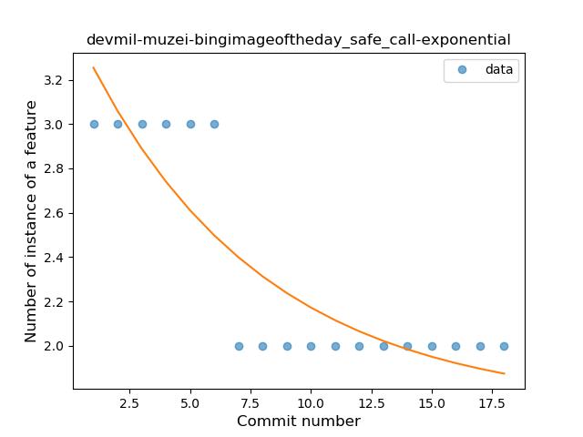
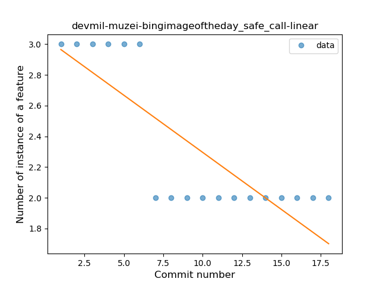
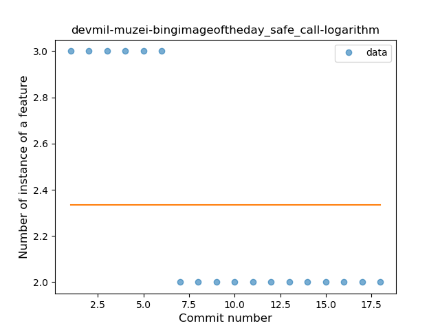
### <a name="unsafe_call">Unsafe Call</a>
----
#### Functions
* **Instability - Polinomial 4:** 
    * **R_Squared:** 0.89752009
* **Sudden Rise - Exponential:** 
    * **R_Squared:** 0.47127987
* **Constant Rise - Linear:** 
    * **R_Squared:** 0.01651187
* **Sudden Rise Plateau - Logarithm:** 
    * **R_Squared:** -0.0

**Plots** :chart_with_upwards_trend:
-----

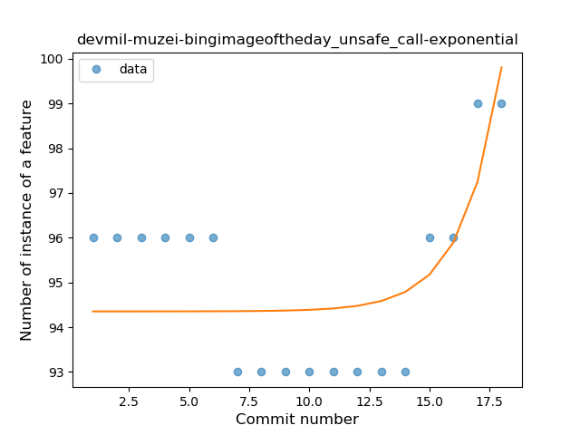
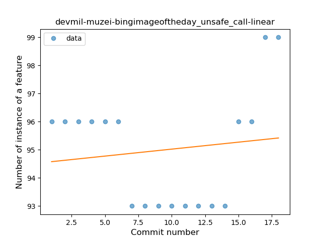
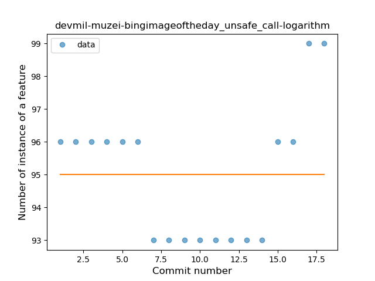
### <a name="string_template">String Template</a>
----
#### Functions
* **Plateau Sudden Rise - Binary Sigmoid:** 
    * **R_Squared:** 1.0
* **Instability - Polinomial 4:** 
    * **R_Squared:** 0.89277389
* **Sudden Rise - Exponential:** 
    * **R_Squared:** 0.76765152
* **Constant Rise - Linear:** 
    * **R_Squared:** 0.67132867
* **Sudden Rise Plateau - Logarithm:** 
    * **R_Squared:** 0.44155684

**Plots** :chart_with_upwards_trend:
-----

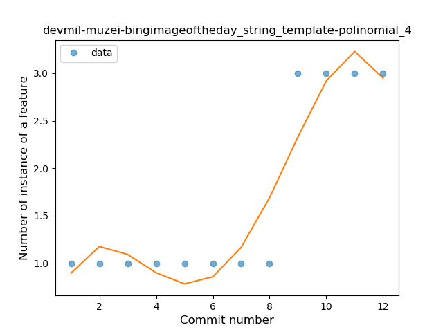
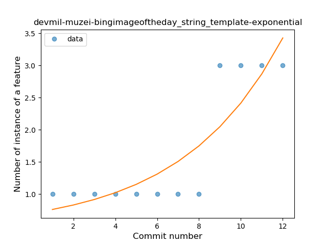
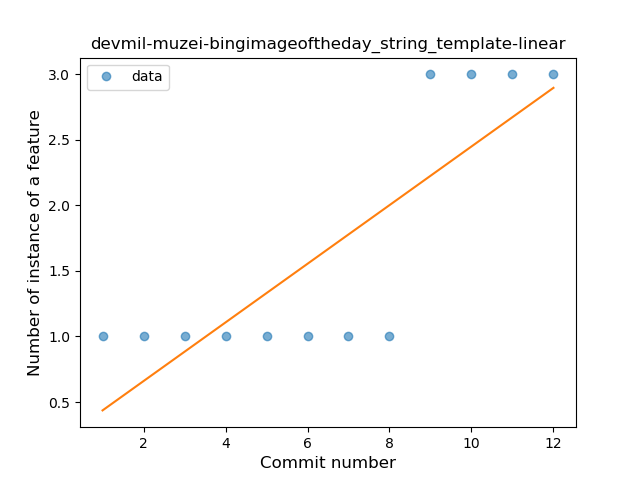
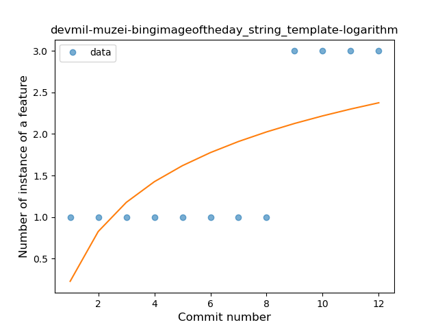
