## die-tageszeitung-tazapp-android
----
#### Metrics provided by Detekt
* Number of lines of code 454
* Number of Kotlin files: 7
* Cyclomatic complexity: 60
* Cyclomatic complexity by thousands of lines: 266 

----
**6** features analyzed

*	<a href="#type_inference">Type Inference</a> 
*	<a href="#lambda">Lambda</a> 
*	<a href="#safe_call">Safe Call</a> 
*	<a href="#companion_object">Companion Object</a> 
*	<a href="#func_call_with_named_arg">Function call with Named Argument</a> 
*	<a href="#property_delegation">Property Delegation</a> 

### <a name="type_inference">Type Inference</a>
----
#### Functions
* **Instability - Polinomial 4:** 
    * **R_Squared:** 0.81737161
* **Instability - Polinomial 3:** )
    * **R_Squared:** 0.6912182
* **Sudden Rise Plateau - Logarithm:** 
    * **R_Squared:** 0.54607394
* **Constant Rise - Linear:** 
    * **R_Squared:** 0.28105824

**Plots** :chart_with_upwards_trend:
-----

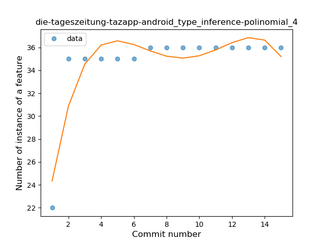
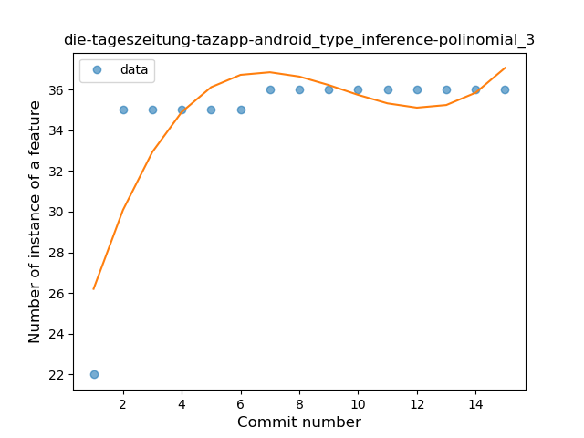
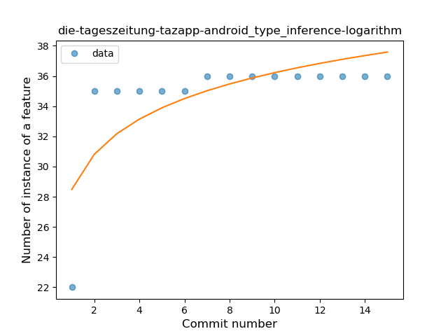
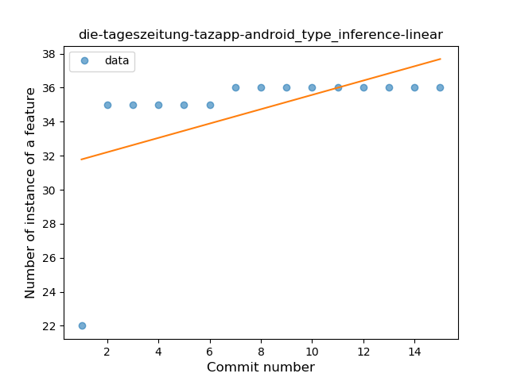
### <a name="lambda">Lambda</a>
----
#### Functions
* **Instability - Polinomial 4:** 
    * **R_Squared:** 0.82481084
* **Instability - Polinomial 3:** )
    * **R_Squared:** 0.7541768
* **Sudden Rise Plateau - Logarithm:** 
    * **R_Squared:** 0.69564431
* **Constant Rise - Linear:** 
    * **R_Squared:** 0.43062773

**Plots** :chart_with_upwards_trend:
-----

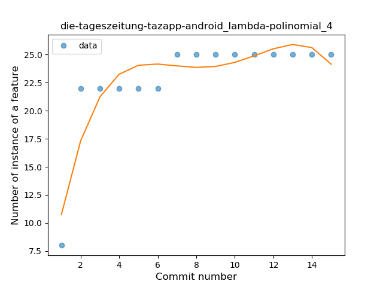
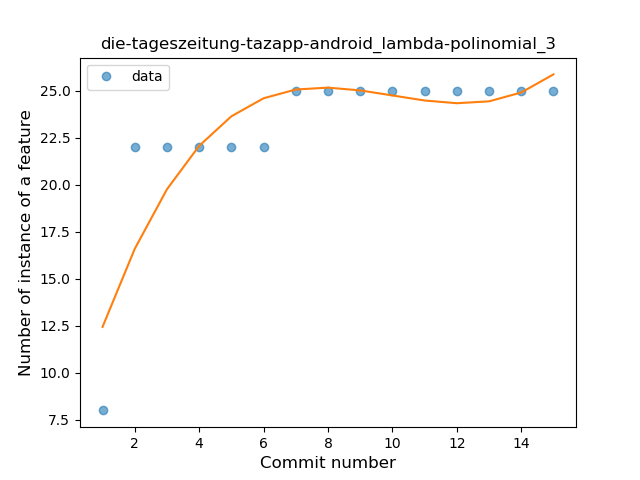
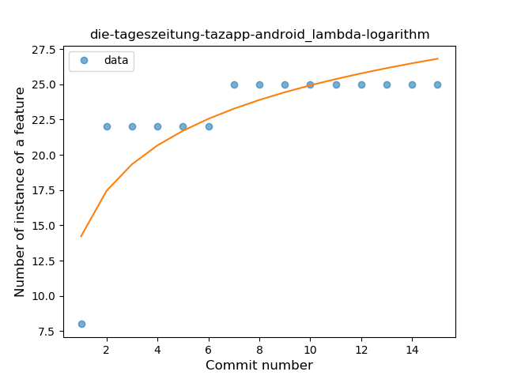
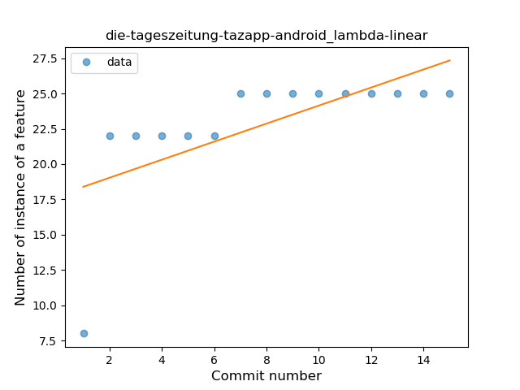
### <a name="safe_call">Safe Call</a>
----
#### Functions
* **Plateau Sudden Rise - Binary Sigmoid:** 
    * **R_Squared:** 1.0
* **Instability - Polinomial 4:** 
    * **R_Squared:** 0.89055944
* **Sudden Rise Plateau - Logarithm:** 
    * **R_Squared:** 0.70763232
* **Constant Rise - Linear:** 
    * **R_Squared:** 0.69230769

**Plots** :chart_with_upwards_trend:
-----

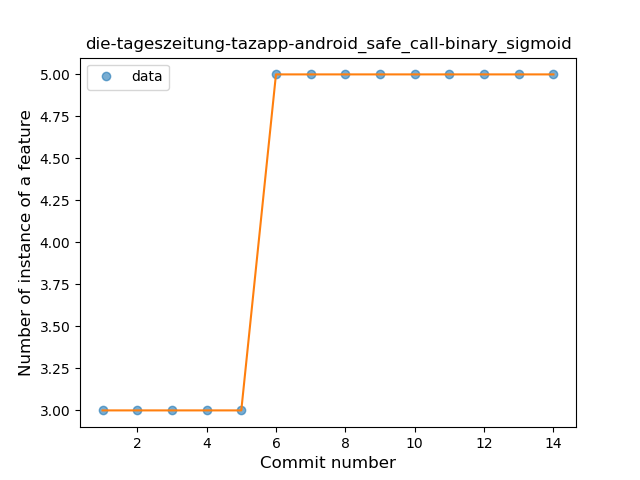
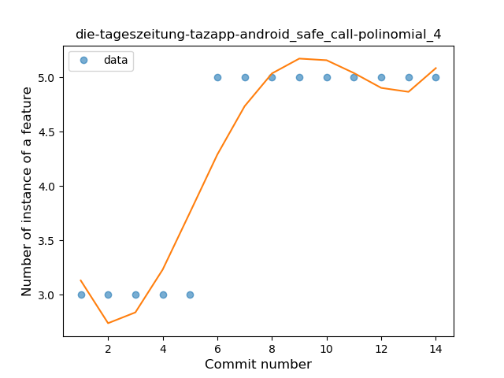
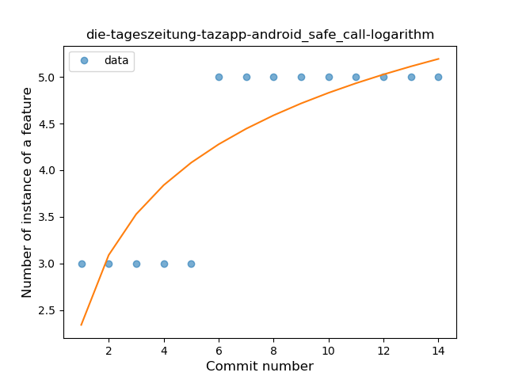
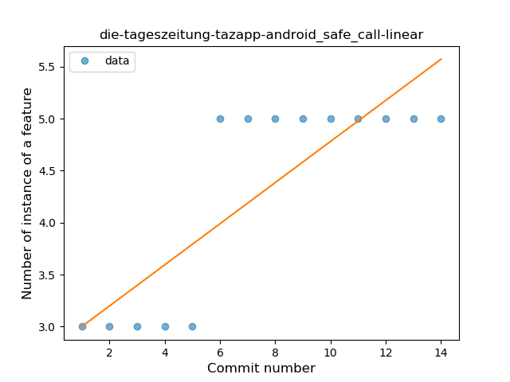
### <a name="companion_object">Companion Object</a>
----
#### Functions
* **Sudden Rise Plateau - Logarithm:** 
    * **R_Squared:** 0.82683887
* **Constant Rise - Linear:** 
    * **R_Squared:** 0.61680528

**Plots** :chart_with_upwards_trend:
-----

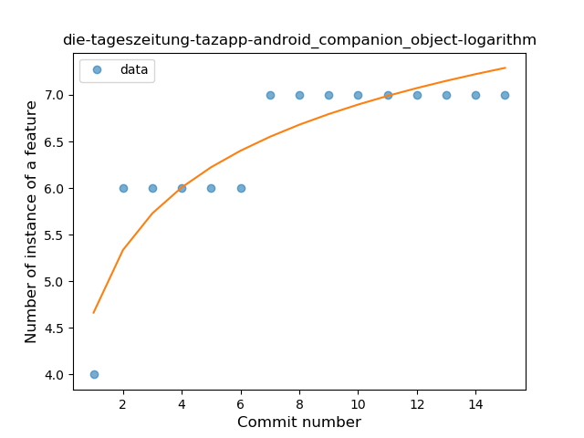
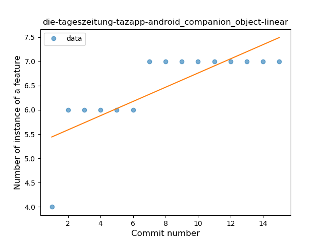
### <a name="func_call_with_named_arg">Function call with Named Argument</a>
----
#### Functions
* **Instability - Polinomial 4:** 
    * **R_Squared:** 0.67052192
* **Sudden Rise Plateau - Logarithm:** 
    * **R_Squared:** 0.23030167
* **Constant Rise - Linear:** 
    * **R_Squared:** 0.06574675

**Plots** :chart_with_upwards_trend:
-----

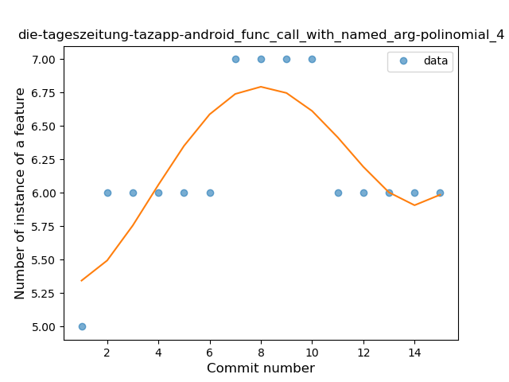
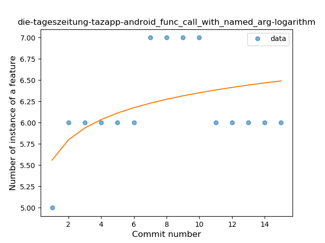
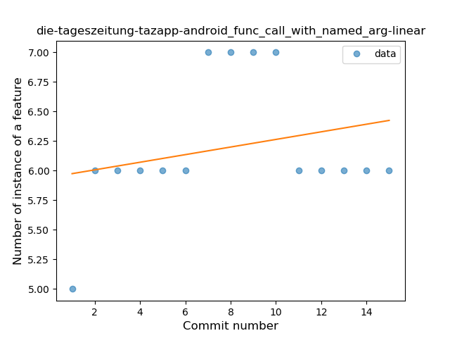
### <a name="property_delegation">Property Delegation</a>
----
#### Functions
* **Instability - Polinomial 4:** 
    * **R_Squared:** 0.84249699
* **Instability - Polinomial 3:** )
    * **R_Squared:** 0.54764213
* **Constant Decline - Linear:** 
    * **R_Squared:** 0.01530612
* **Sudden Rise Plateau - Logarithm:** 
    * **R_Squared:** 0.01388946

**Plots** :chart_with_upwards_trend:
-----

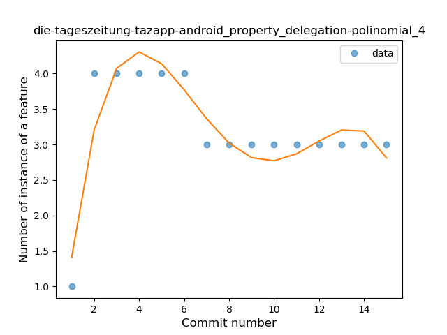
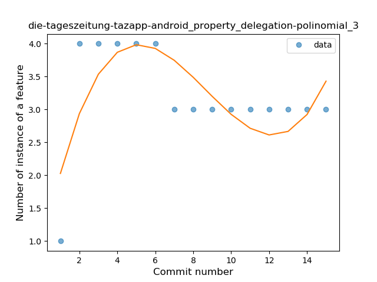
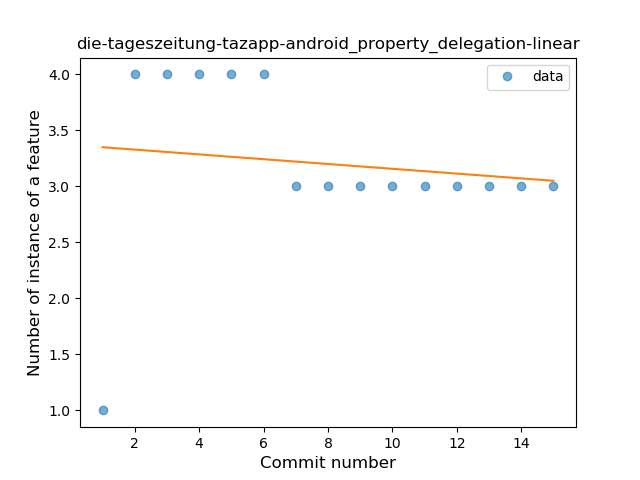
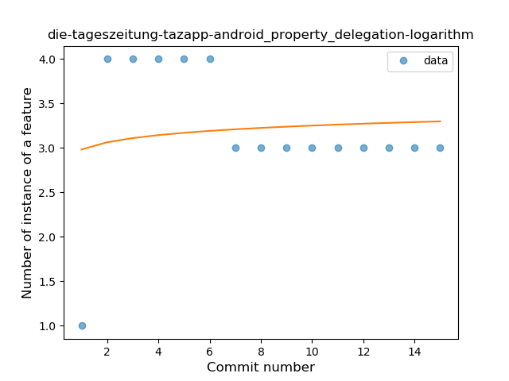
