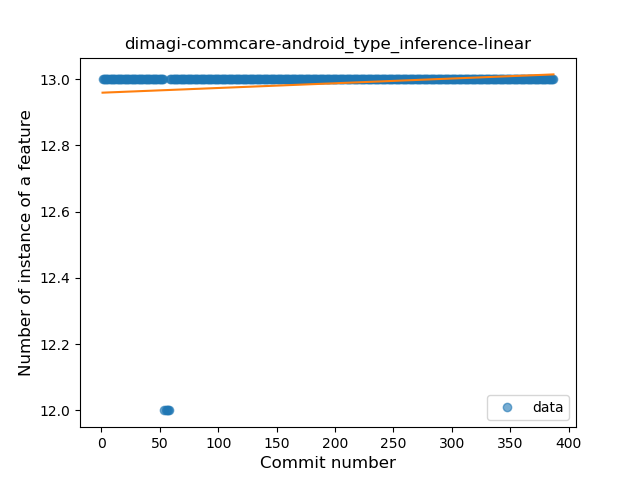
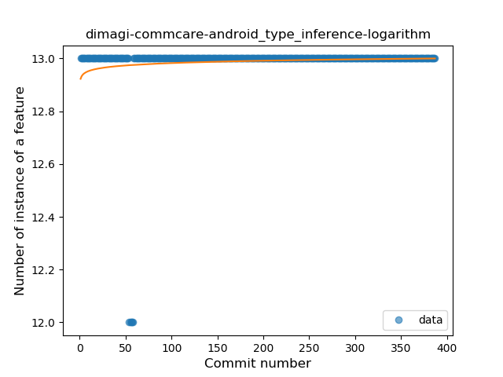
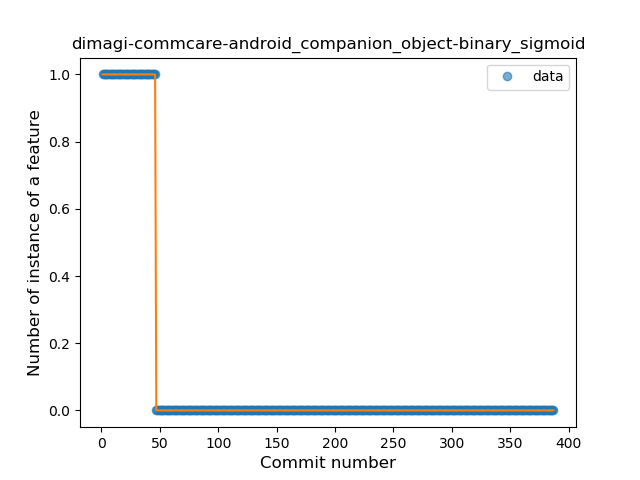
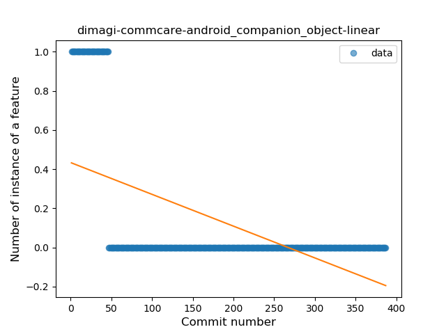
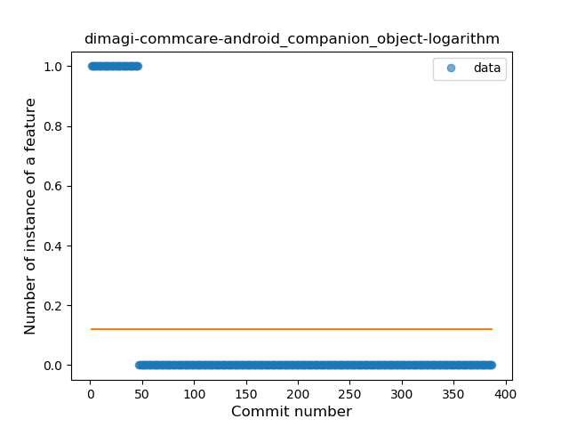
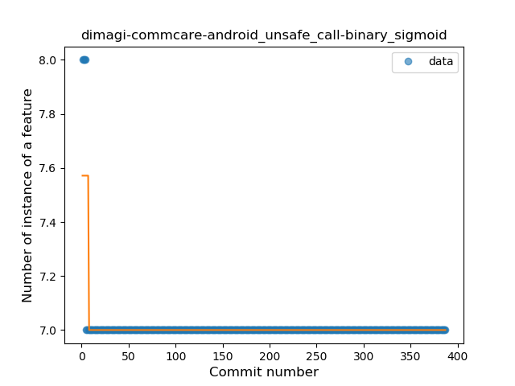
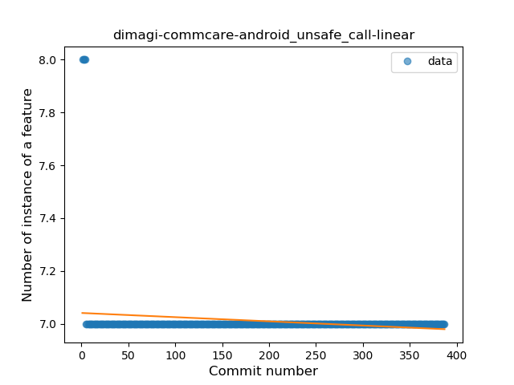
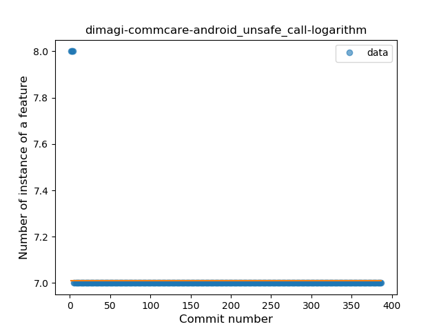

## dimagi-commcare-android
----
#### Metrics provided by Detekt
* Number of lines of code 194
* Number of Kotlin files: 2
* Cyclomatic complexity: 32
* Cyclomatic complexity by thousands of lines: 288 

----
**3** features analyzed

*	<a href="#type_inference">Type Inference</a> 
*	<a href="#companion_object">Companion Object</a> 
*	<a href="#unsafe_call">Unsafe Call</a> 

### <a name="type_inference">Type Inference</a>
----
#### Functions
* **Constant Rise - Linear:** 
    * **R_Squared:** 0.01997225
* **Sudden Rise Plateau - Logarithm:** 
    * **R_Squared:** 0.0123854

**Plots** :chart_with_upwards_trend:
-----

### <a name="companion_object">Companion Object</a>
----
#### Functions
* **Plateau Sudden Decline - Binary Sigmoid:** 
    * **R_Squared:** 1.0
* **Sudden Decline - Exponential:** 
    * **R_Squared:** 0.79339117
* **Constant Decline - Linear:** 
    * **R_Squared:** 0.31420597
* **Sudden Rise Plateau - Logarithm:** 
    * **R_Squared:** -0.0

**Plots** :chart_with_upwards_trend:
-----

### <a name="unsafe_call">Unsafe Call</a>
----
#### Functions
* **Sudden Decline - Exponential:** 
    * **R_Squared:** 0.8196959
* **Plateau Sudden Decline - Binary Sigmoid:** 
    * **R_Squared:** 0.56695263
* **Constant Decline - Linear:** 
    * **R_Squared:** 0.03068746
* **Sudden Rise Plateau - Logarithm:** 
    * **R_Squared:** -0.0

**Plots** :chart_with_upwards_trend:
-----

