## dkrivoruchko-ScreenStream
----
#### Metrics provided by Detekt
* Number of lines of code 3738
* Number of Kotlin files: 38
* Cyclomatic complexity: 521
* Cyclomatic complexity by thousands of lines: 239 

----
**15** features analyzed

*	<a href="#type_inference">Type Inference</a> 
*	<a href="#lambda">Lambda</a> 
*	<a href="#safe_call">Safe Call</a> 
*	<a href="#when_expr">When expression</a> 
*	<a href="#companion_object">Companion Object</a> 
*	<a href="#unsafe_call">Unsafe Call</a> 
*	<a href="#string_template">String Template</a> 
*	<a href="#func_with_default_value">Function with Default Value</a> 
*	<a href="#singleton">Singleton</a> 
*	<a href="#smart_cast">Smart Cast</a> 
*	<a href="#range_expr">Range Expression</a> 
*	<a href="#func_call_with_named_arg">Function call with Named Argument</a> 
*	<a href="#data_class">Data Class</a> 
*	<a href="#property_delegation">Property Delegation</a> 
*	<a href="#destructuring_declaration">Destructuring Declaration</a> 

### <a name="type_inference">Type Inference</a>
----
#### Functions
* **Constant Decline - Linear:** 
    * **R_Squared:** 0.30905278
* **Sudden Decline - Exponential:** 
    * **R_Squared:** 0.00076041
* **Sudden Rise Plateau - Logarithm:** 
    * **R_Squared:** -0.0

**Plots** :chart_with_upwards_trend:
-----

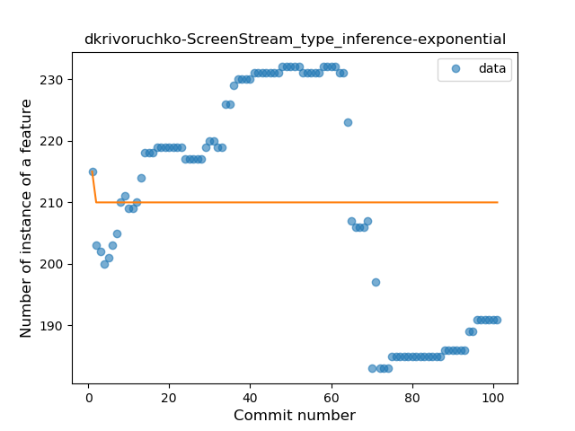
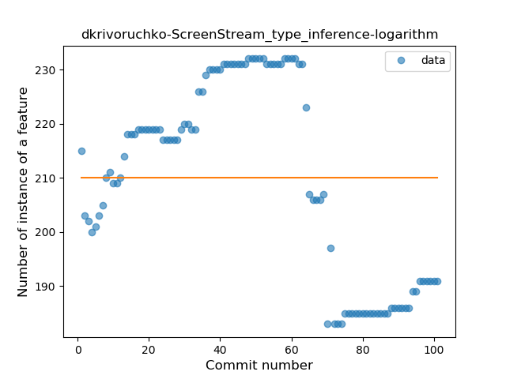
### <a name="lambda">Lambda</a>
----
#### Functions
* **Constant Rise - Linear:** 
    * **R_Squared:** 0.94491522
* **Sudden Rise - Exponential:** 
    * **R_Squared:** 0.94753525
* **Sudden Rise Plateau - Logarithm:** 
    * **R_Squared:** 0.72859804
* **Plateau Gradual Decline - Sigmoid:** 
    * **R_Squared:** -0.0

**Plots** :chart_with_upwards_trend:
-----

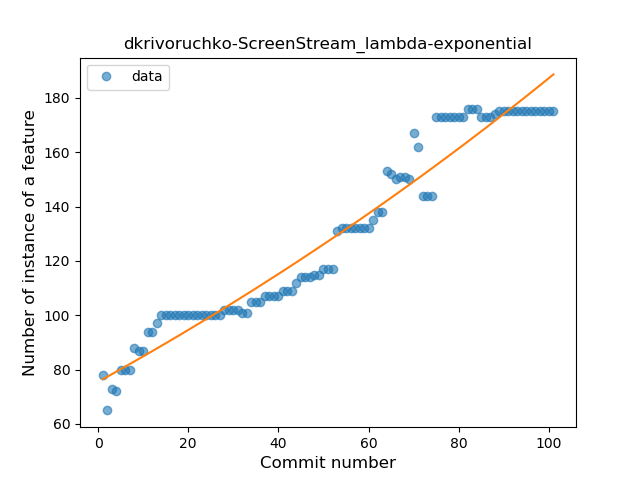
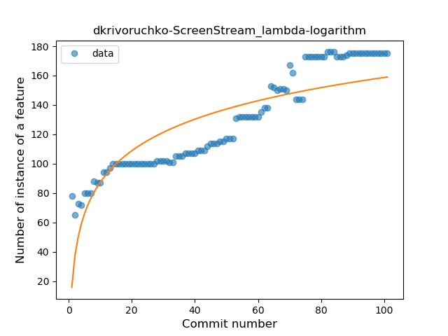
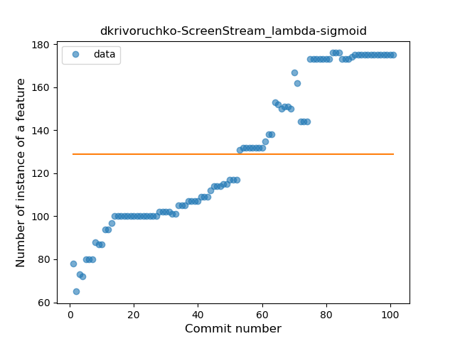
### <a name="safe_call">Safe Call</a>
----
#### Functions
* **Constant Decline - Linear:** 
    * **R_Squared:** 0.29036714
* **Sudden Decline - Exponential:** 
    * **R_Squared:** 0.0
* **Sudden Rise Plateau - Logarithm:** 
    * **R_Squared:** -0.0

**Plots** :chart_with_upwards_trend:
-----

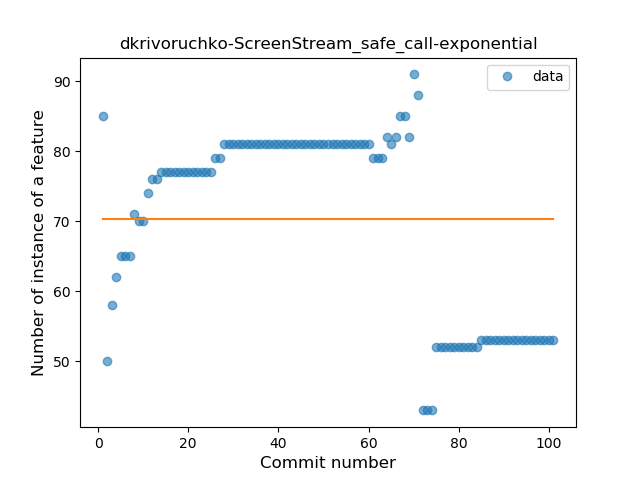
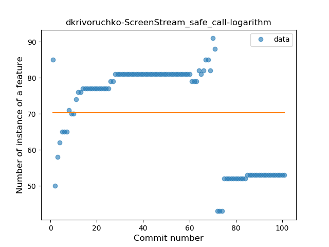
### <a name="when_expr">When expression</a>
----
#### Functions
* **Sudden Rise - Exponential:** 
    * **R_Squared:** 0.71976975
* **Constant Rise - Linear:** 
    * **R_Squared:** 0.70248427
* **Sudden Rise Plateau - Logarithm:** 
    * **R_Squared:** 0.68388473

**Plots** :chart_with_upwards_trend:
-----

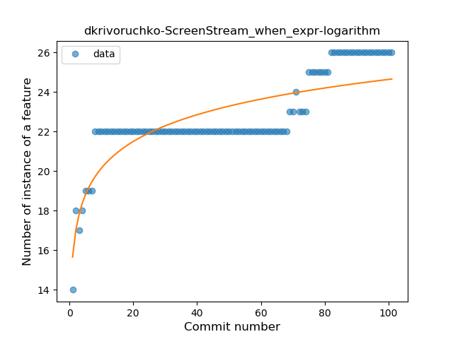
### <a name="companion_object">Companion Object</a>
----
#### Functions
* **Sudden Rise - Exponential:** 
    * **R_Squared:** 0.82105785
* **Constant Rise - Linear:** 
    * **R_Squared:** 0.75541747
* **Sudden Rise Plateau - Logarithm:** 
    * **R_Squared:** 0.4128644

**Plots** :chart_with_upwards_trend:
-----

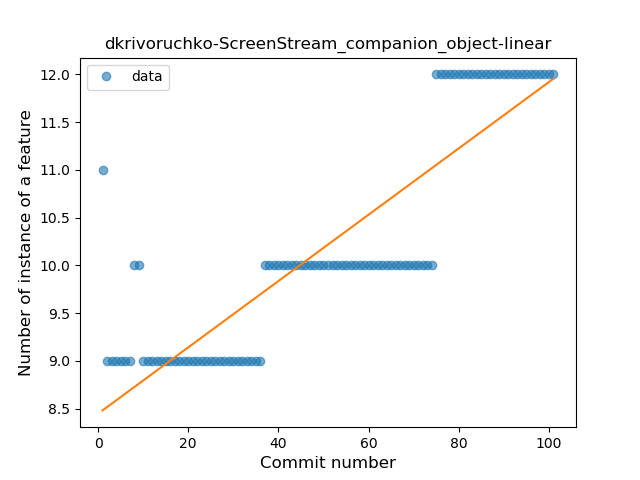
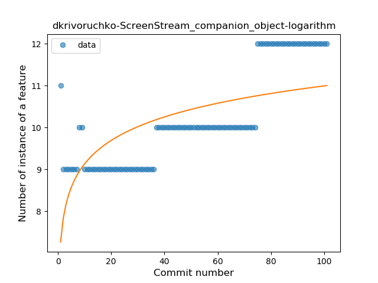
### <a name="unsafe_call">Unsafe Call</a>
----
#### Functions
* **Plateau Sudden Decline - Binary Sigmoid:** 
    * **R_Squared:** 1.0
* **Sudden Decline - Exponential:** 
    * **R_Squared:** 0.75191585
* **Constant Decline - Linear:** 
    * **R_Squared:** 0.73352941
* **Sudden Rise Plateau - Logarithm:** 
    * **R_Squared:** -0.0

**Plots** :chart_with_upwards_trend:
-----

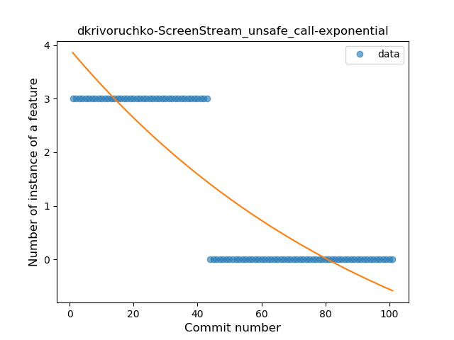
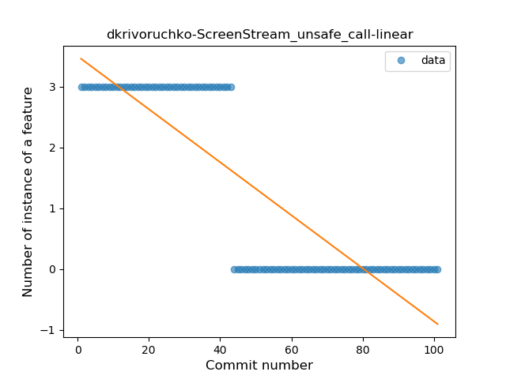
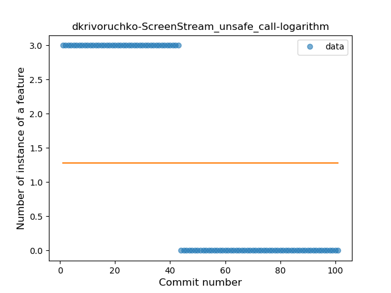
### <a name="string_template">String Template</a>
----
#### Functions
* **Instability - Polinomial 3:** )
    * **R_Squared:** 0.76262639
* **Constant Decline - Linear:** 
    * **R_Squared:** 0.3258727
* **Sudden Decline - Exponential:** 
    * **R_Squared:** -0.0
* **Sudden Rise Plateau - Logarithm:** 
    * **R_Squared:** -0.0

**Plots** :chart_with_upwards_trend:
-----

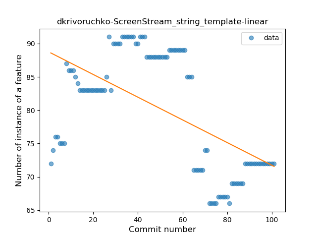
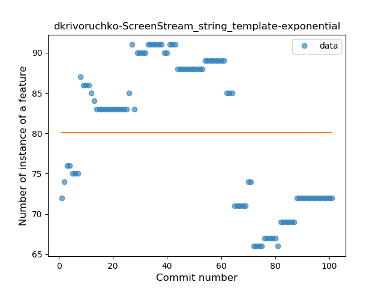

### <a name="func_with_default_value">Function with Default Value</a>
----
#### Functions
* **Plateau Gradual Rise - Sigmoid:** 
    * **R_Squared:** 0.95877658
* **Sudden Rise - Exponential:** 
    * **R_Squared:** 0.85677033
* **Constant Rise - Linear:** 
    * **R_Squared:** 0.78711072
* **Sudden Rise Plateau - Logarithm:** 
    * **R_Squared:** 0.47049907

**Plots** :chart_with_upwards_trend:
-----

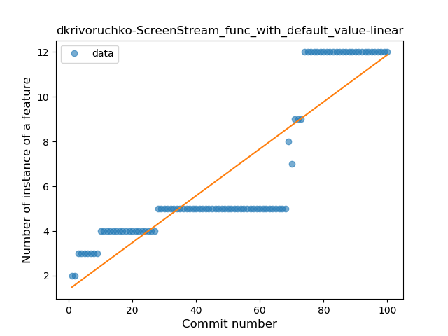
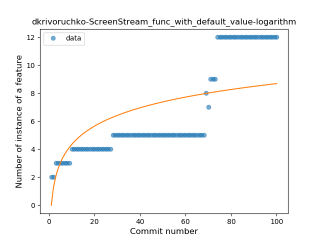
### <a name="singleton">Singleton</a>
----
#### Functions
* **Instability - Polinomial 4:** 
    * **R_Squared:** 0.90225913
* **Sudden Rise Plateau - Logarithm:** 
    * **R_Squared:** 0.72702815
* **Constant Rise - Linear:** 
    * **R_Squared:** 0.68984254

**Plots** :chart_with_upwards_trend:
-----

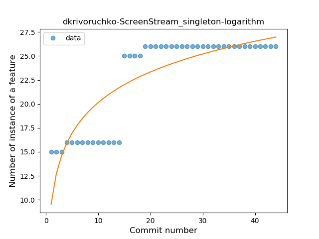
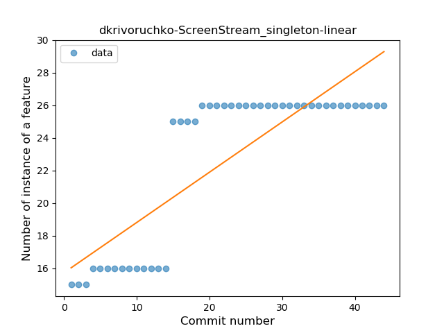
### <a name="smart_cast">Smart Cast</a>
----
#### Functions
* **Constant Decline - Linear:** 
    * **R_Squared:** 0.04057493
* **Sudden Rise Plateau - Logarithm:** 
    * **R_Squared:** 0.04092248
* **Sudden Decline - Exponential:** 
    * **R_Squared:** -0.0

**Plots** :chart_with_upwards_trend:
-----

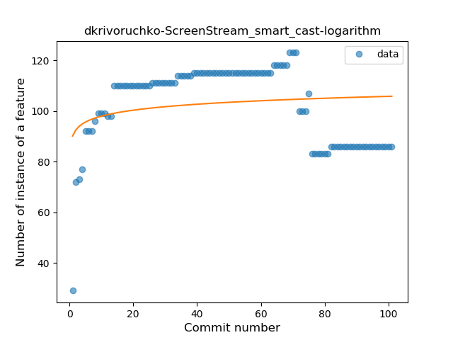
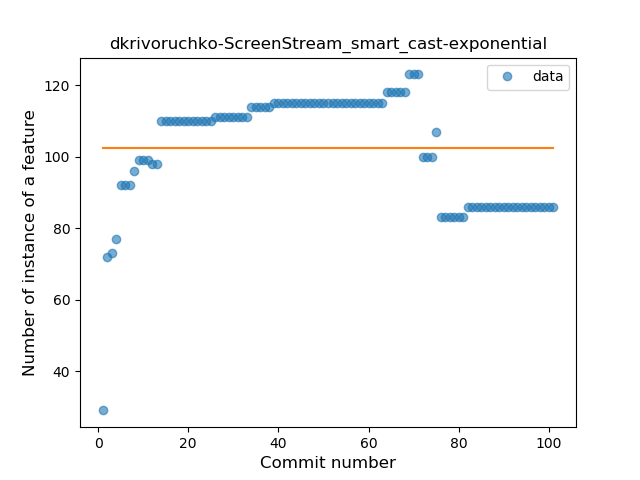
### <a name="range_expr">Range Expression</a>
----
#### Functions
* **Constant Rise - Linear:** 
    * **R_Squared:** 0.9032902
* **Plateau Sudden Rise - Binary Sigmoid:** 
    * **R_Squared:** 0.70409275
* **Sudden Rise Plateau - Logarithm:** 
    * **R_Squared:** 0.68915064

**Plots** :chart_with_upwards_trend:
-----

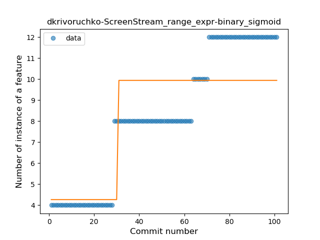
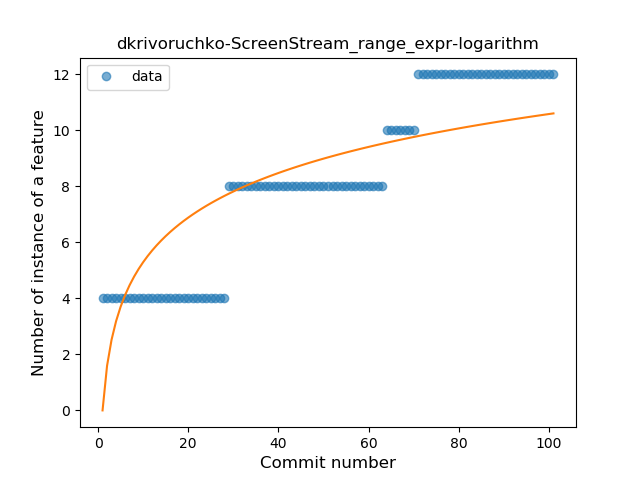
### <a name="func_call_with_named_arg">Function call with Named Argument</a>
----
#### Functions
* **Sudden Rise - Exponential:** 
    * **R_Squared:** 0.76235838
* **Constant Rise - Linear:** 
    * **R_Squared:** 0.73877735
* **Sudden Rise Plateau - Logarithm:** 
    * **R_Squared:** 0.52129287

**Plots** :chart_with_upwards_trend:
-----

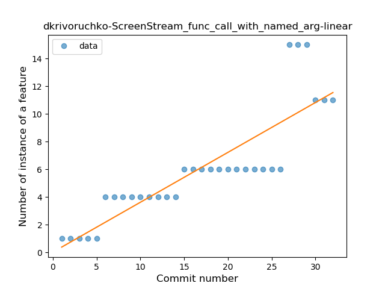
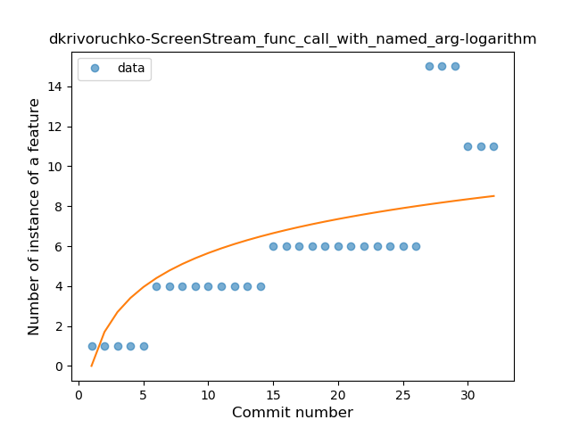
### <a name="data_class">Data Class</a>
----
#### Functions
* **Constant Decline - Linear:** 
    * **R_Squared:** 0.49851273
* **Sudden Decline - Exponential:** 
    * **R_Squared:** -0.0
* **Sudden Rise Plateau - Logarithm:** 
    * **R_Squared:** -0.0

**Plots** :chart_with_upwards_trend:
-----

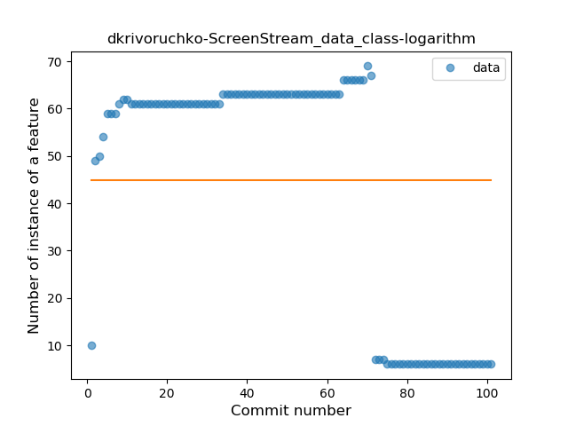
### <a name="property_delegation">Property Delegation</a>
----
#### Functions
* **Instability - Polinomial 4:** 
    * **R_Squared:** 0.96378843
* **Plateau Gradual Rise - Sigmoid:** 
    * **R_Squared:** 0.91968562
* **Instability - Polinomial 3:** )
    * **R_Squared:** 0.92522089
* **Constant Rise - Linear:** 
    * **R_Squared:** 0.79820301
* **Sudden Rise Plateau - Logarithm:** 
    * **R_Squared:** 0.57800422

**Plots** :chart_with_upwards_trend:
-----

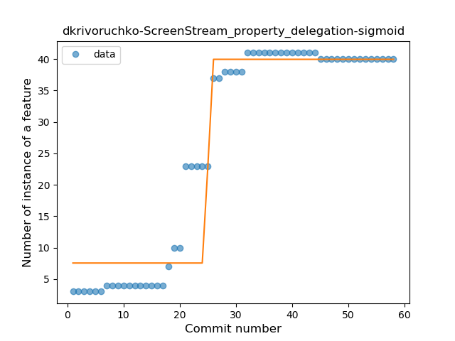
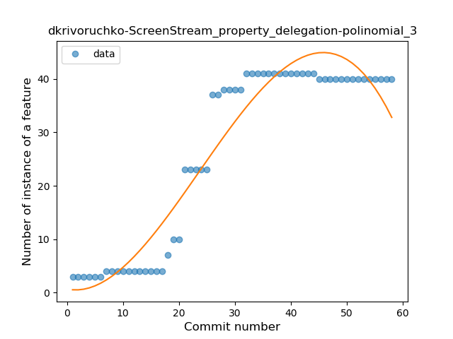
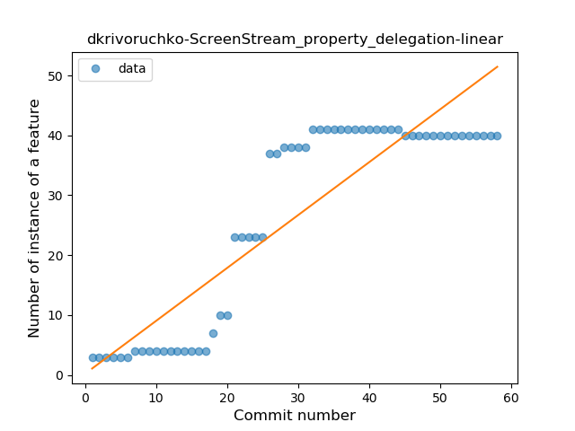
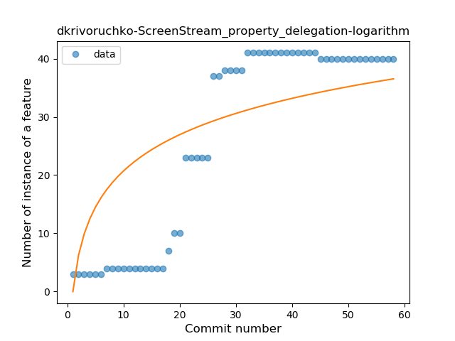
### <a name="destructuring_declaration">Destructuring Declaration</a>
----
#### Functions
* **Sudden Rise Plateau - Logarithm:** 
    * **R_Squared:** 0.12736666
* **Constant Rise - Linear:** 
    * **R_Squared:** 0.06824526

**Plots** :chart_with_upwards_trend:
-----

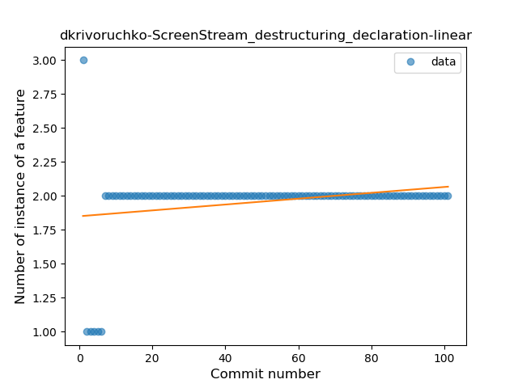
