## duckduckgo-Android
----
#### Metrics provided by Detekt
* Number of lines of code 26229
* Number of Kotlin files: 312
* Cyclomatic complexity: 2618
* Cyclomatic complexity by thousands of lines: 228 

----
**17** features analyzed

*	<a href="#type_inference">Type Inference</a> 
*	<a href="#lambda">Lambda</a> 
*	<a href="#safe_call">Safe Call</a> 
*	<a href="#when_expr">When expression</a> 
*	<a href="#companion_object">Companion Object</a> 
*	<a href="#unsafe_call">Unsafe Call</a> 
*	<a href="#string_template">String Template</a> 
*	<a href="#func_with_default_value">Function with Default Value</a> 
*	<a href="#singleton">Singleton</a> 
*	<a href="#smart_cast">Smart Cast</a> 
*	<a href="#range_expr">Range Expression</a> 
*	<a href="#func_call_with_named_arg">Function call with Named Argument</a> 
*	<a href="#data_class">Data Class</a> 
*	<a href="#extension_function">Extension Function</a> 
*	<a href="#property_delegation">Property Delegation</a> 
*	<a href="#destructuring_declaration">Destructuring Declaration</a> 
*	<a href="#inline_func">Inline Function</a> 

### <a name="type_inference">Type Inference</a>
----
#### Functions
* **Constant Rise - Linear:** 
    * **R_Squared:** 0.95549983
* **Sudden Rise Plateau - Logarithm:** 
    * **R_Squared:** 0.68005502
* **Plateau Sudden Rise - Binary Sigmoid:** 
    * **R_Squared:** 0.53296695

**Plots** :chart_with_upwards_trend:
-----

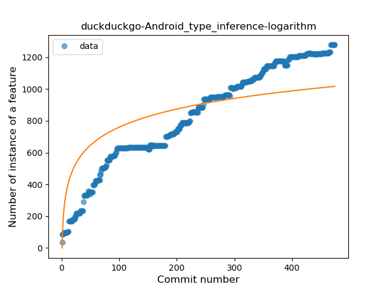
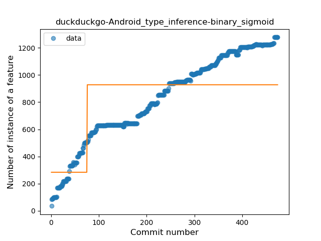
### <a name="lambda">Lambda</a>
----
#### Functions
* **Constant Rise - Linear:** 
    * **R_Squared:** 0.96054144
* **Sudden Rise Plateau - Logarithm:** 
    * **R_Squared:** 0.60818455
* **Plateau Sudden Rise - Binary Sigmoid:** 
    * **R_Squared:** 0.30845902

**Plots** :chart_with_upwards_trend:
-----

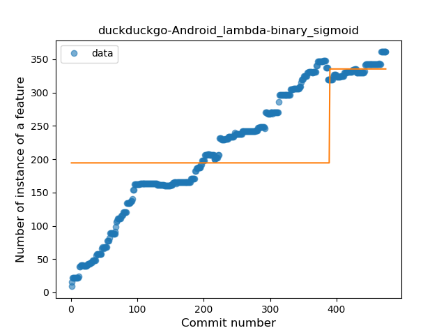
### <a name="safe_call">Safe Call</a>
----
#### Functions
* **Constant Rise - Linear:** 
    * **R_Squared:** 0.93523521
* **Plateau Sudden Rise - Binary Sigmoid:** 
    * **R_Squared:** 0.57795497
* **Sudden Rise Plateau - Logarithm:** 
    * **R_Squared:** 0.5240801

**Plots** :chart_with_upwards_trend:
-----

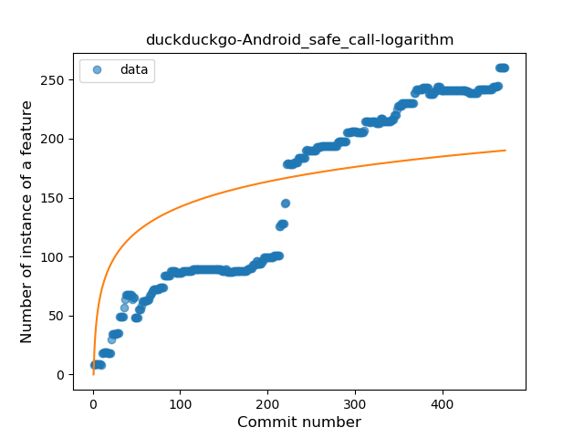
### <a name="when_expr">When expression</a>
----
#### Functions
* **Sudden Rise Plateau - Logarithm:** 
    * **R_Squared:** 0.77445761
* **Constant Rise - Linear:** 
    * **R_Squared:** 0.51470317

**Plots** :chart_with_upwards_trend:
-----

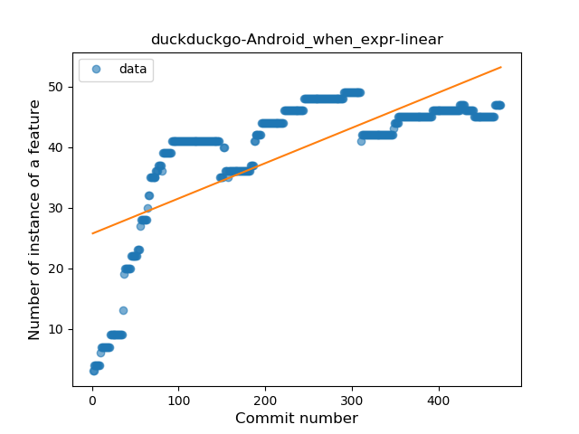
### <a name="companion_object">Companion Object</a>
----
#### Functions
* **Constant Rise - Linear:** 
    * **R_Squared:** 0.96817633
* **Sudden Rise Plateau - Logarithm:** 
    * **R_Squared:** 0.67307367
* **Plateau Gradual Rise - Sigmoid:** 
    * **R_Squared:** 0.29588821

**Plots** :chart_with_upwards_trend:
-----

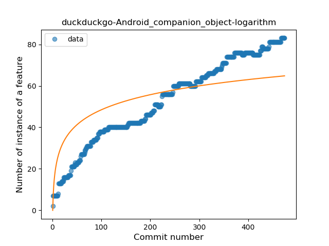
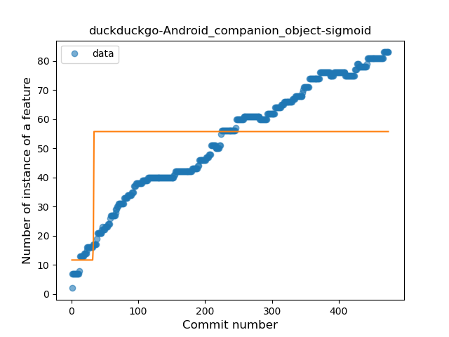
### <a name="unsafe_call">Unsafe Call</a>
----
#### Functions
* **Plateau Sudden Rise - Binary Sigmoid:** 
    * **R_Squared:** 0.76046316
* **Sudden Rise Plateau - Logarithm:** 
    * **R_Squared:** 0.63611721
* **Constant Rise - Linear:** 
    * **R_Squared:** 0.4603657

**Plots** :chart_with_upwards_trend:
-----

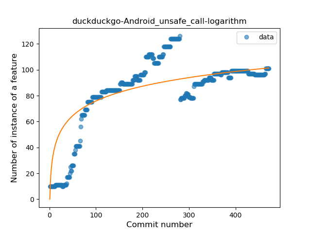
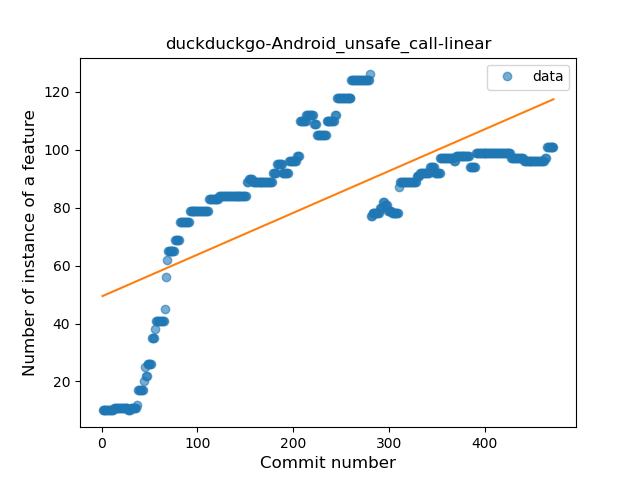
### <a name="string_template">String Template</a>
----
#### Functions
* **Constant Rise - Linear:** 
    * **R_Squared:** 0.92570845
* **Sudden Rise Plateau - Logarithm:** 
    * **R_Squared:** 0.67051018
* **Plateau Sudden Rise - Binary Sigmoid:** 
    * **R_Squared:** 0.48372692

**Plots** :chart_with_upwards_trend:
-----

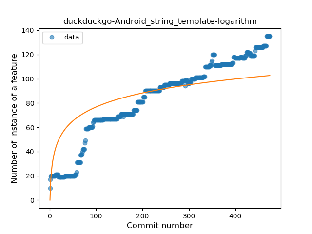
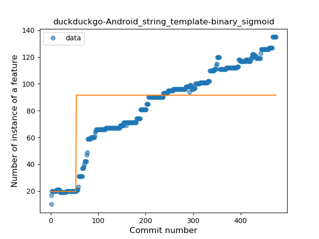
### <a name="func_with_default_value">Function with Default Value</a>
----
#### Functions
* **Constant Rise - Linear:** 
    * **R_Squared:** 0.96011803
* **Sudden Rise Plateau - Logarithm:** 
    * **R_Squared:** 0.46845963
* **Plateau Gradual Rise - Sigmoid:** 
    * **R_Squared:** 0.20316202

**Plots** :chart_with_upwards_trend:
-----

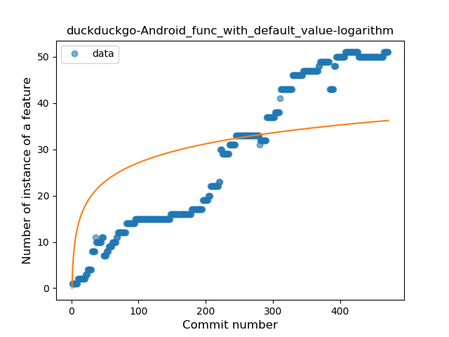
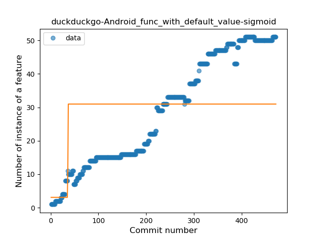
### <a name="singleton">Singleton</a>
----
#### Functions
* **Constant Rise - Linear:** 
    * **R_Squared:** 0.84757364
* **Sudden Rise Plateau - Logarithm:** 
    * **R_Squared:** 0.71393595
* **Plateau Sudden Rise - Binary Sigmoid:** 
    * **R_Squared:** 0.17985653

**Plots** :chart_with_upwards_trend:
-----

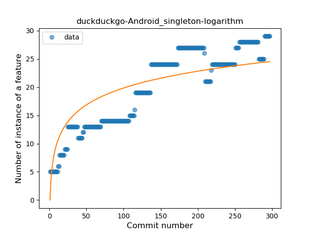
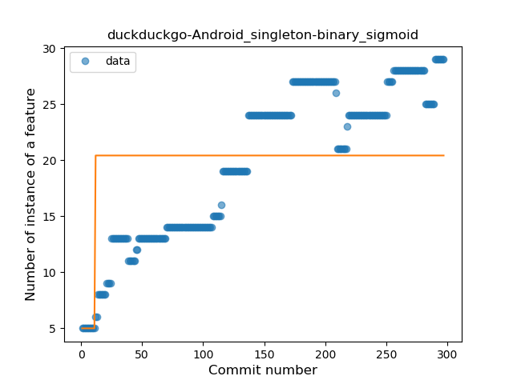
### <a name="smart_cast">Smart Cast</a>
----
#### Functions
* **Constant Rise - Linear:** 
    * **R_Squared:** 0.9499871
* **Sudden Rise Plateau - Logarithm:** 
    * **R_Squared:** 0.63062419

**Plots** :chart_with_upwards_trend:
-----

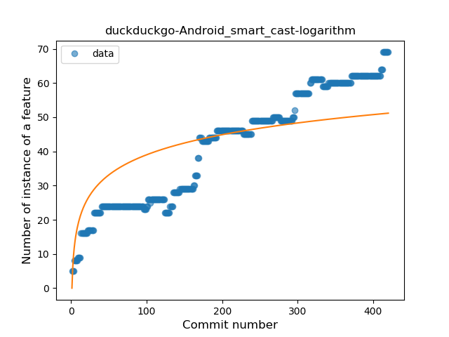
### <a name="range_expr">Range Expression</a>
----
#### Functions
* **Plateau Sudden Rise - Binary Sigmoid:** 
    * **R_Squared:** 0.82448197
* **Constant Rise - Linear:** 
    * **R_Squared:** 0.59336787
* **Sudden Rise Plateau - Logarithm:** 
    * **R_Squared:** 0.57017453

**Plots** :chart_with_upwards_trend:
-----

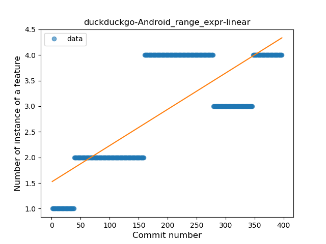
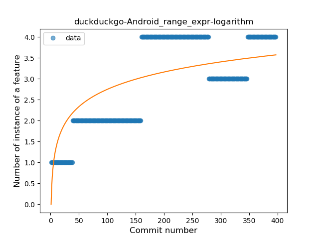
### <a name="func_call_with_named_arg">Function call with Named Argument</a>
----
#### Functions
* **Constant Rise - Linear:** 
    * **R_Squared:** 0.9250037
* **Plateau Sudden Rise - Binary Sigmoid:** 
    * **R_Squared:** 0.72406989
* **Sudden Rise Plateau - Logarithm:** 
    * **R_Squared:** 0.64589253

**Plots** :chart_with_upwards_trend:
-----

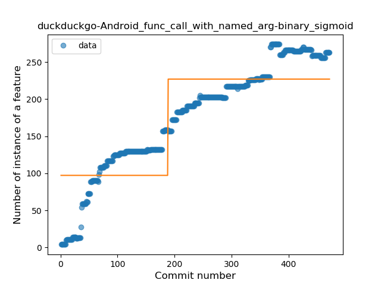
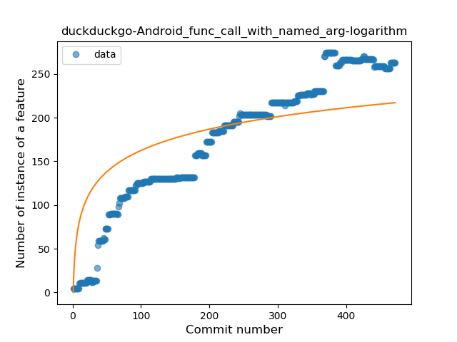
### <a name="data_class">Data Class</a>
----
#### Functions
* **Constant Rise - Linear:** 
    * **R_Squared:** 0.93014373
* **Sudden Rise Plateau - Logarithm:** 
    * **R_Squared:** 0.62388249
* **Plateau Gradual Rise - Sigmoid:** 
    * **R_Squared:** 0.55285484

**Plots** :chart_with_upwards_trend:
-----

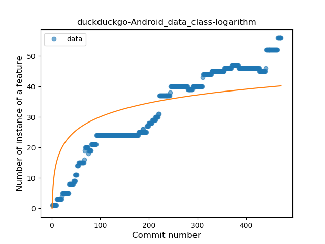
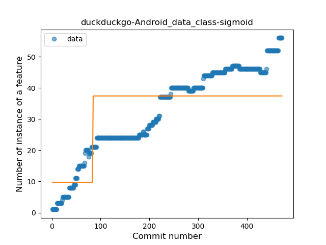
### <a name="extension_function">Extension Function</a>
----
#### Functions
* **Constant Rise - Linear:** 
    * **R_Squared:** 0.91418878
* **Sudden Rise Plateau - Logarithm:** 
    * **R_Squared:** 0.77052053

**Plots** :chart_with_upwards_trend:
-----

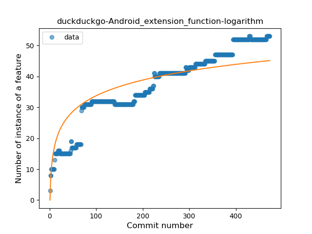
### <a name="property_delegation">Property Delegation</a>
----
#### Functions
* **Constant Rise - Linear:** 
    * **R_Squared:** 0.75391849
* **Sudden Rise Plateau - Logarithm:** 
    * **R_Squared:** 0.75658883

**Plots** :chart_with_upwards_trend:
-----

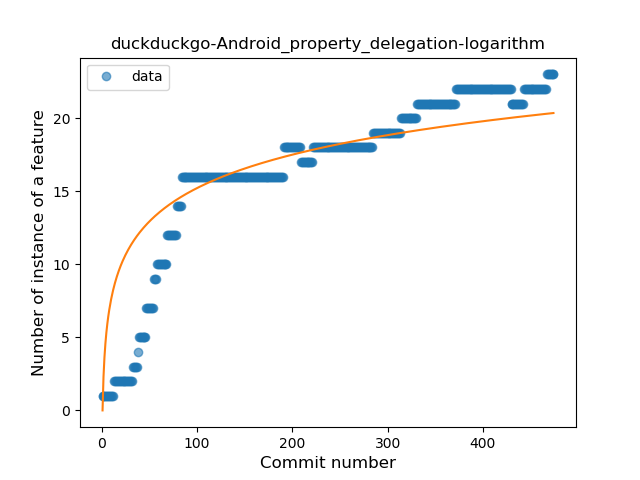
### <a name="destructuring_declaration">Destructuring Declaration</a>
----
#### Functions
* **Plateau Sudden Rise - Binary Sigmoid:** 
    * **R_Squared:** 1.0
* **Sudden Rise - Exponential:** 
    * **R_Squared:** 0.76905241
* **Constant Rise - Linear:** 
    * **R_Squared:** 0.57369415
* **Sudden Rise Plateau - Logarithm:** 
    * **R_Squared:** 0.26517426

**Plots** :chart_with_upwards_trend:
-----

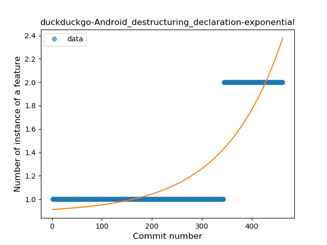
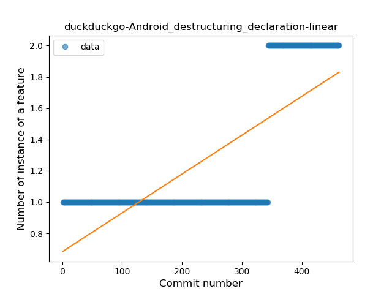
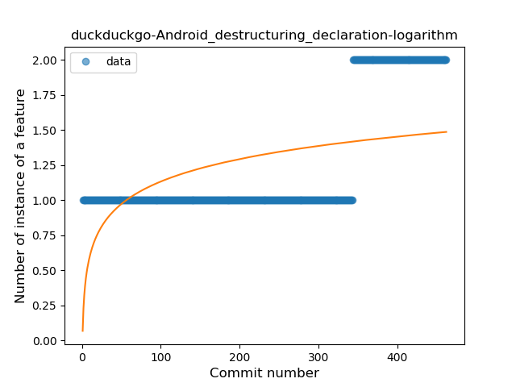
### <a name="inline_func">Inline Function</a>
----
#### Functions
* **Constant Rise - Linear:** 
    * **R_Squared:** 0.80398774
* **Sudden Rise Plateau - Logarithm:** 
    * **R_Squared:** 0.51556636

**Plots** :chart_with_upwards_trend:
-----

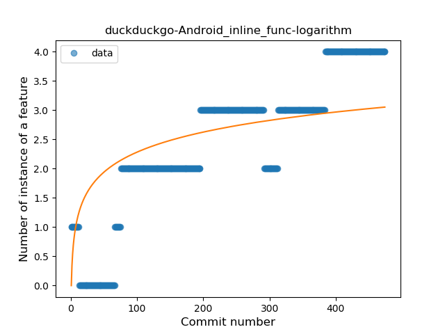
