## emansih-FireflyMobile
----
#### Metrics provided by Detekt
* Number of lines of code 9643
* Number of Kotlin files: 211
* Cyclomatic complexity: 1112
* Cyclomatic complexity by thousands of lines: 198 

----
**16** features analyzed

*	<a href="#type_inference">Type Inference</a> 
*	<a href="#lambda">Lambda</a> 
*	<a href="#safe_call">Safe Call</a> 
*	<a href="#when_expr">When expression</a> 
*	<a href="#companion_object">Companion Object</a> 
*	<a href="#unsafe_call">Unsafe Call</a> 
*	<a href="#string_template">String Template</a> 
*	<a href="#func_with_default_value">Function with Default Value</a> 
*	<a href="#singleton">Singleton</a> 
*	<a href="#smart_cast">Smart Cast</a> 
*	<a href="#range_expr">Range Expression</a> 
*	<a href="#func_call_with_named_arg">Function call with Named Argument</a> 
*	<a href="#data_class">Data Class</a> 
*	<a href="#extension_function">Extension Function</a> 
*	<a href="#property_delegation">Property Delegation</a> 
*	<a href="#inline_func">Inline Function</a> 

### <a name="type_inference">Type Inference</a>
----
#### Functions
* **Constant Rise - Linear:** 
    * **R_Squared:** 0.93448286
* **Plateau Sudden Rise - Binary Sigmoid:** 
    * **R_Squared:** 0.73176372
* **Sudden Rise Plateau - Logarithm:** 
    * **R_Squared:** 0.67093793

**Plots** :chart_with_upwards_trend:
-----

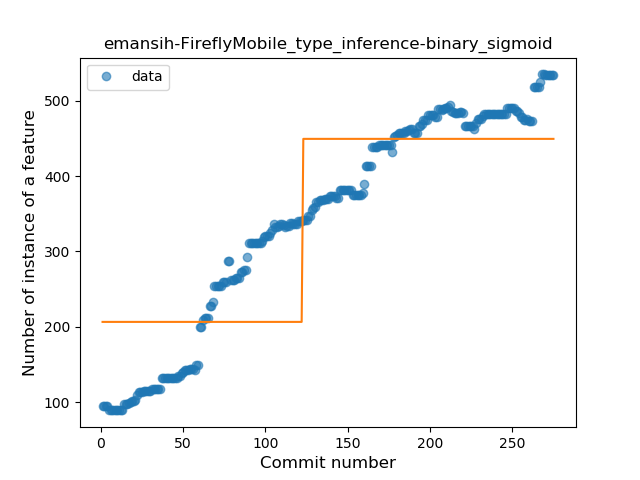
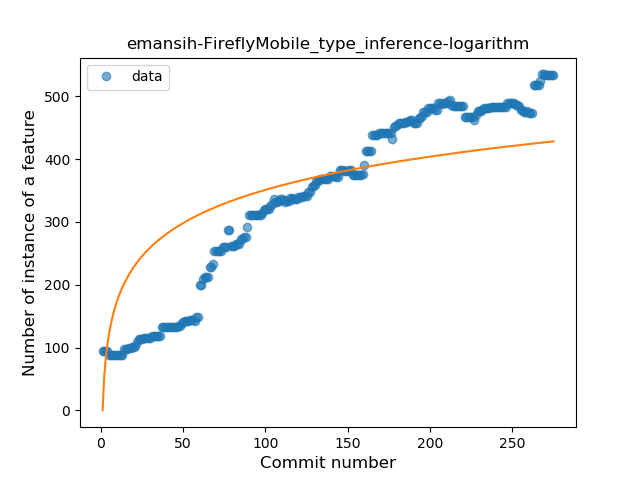
### <a name="lambda">Lambda</a>
----
#### Functions
* **Constant Rise - Linear:** 
    * **R_Squared:** 0.95252937
* **Sudden Rise Plateau - Logarithm:** 
    * **R_Squared:** 0.74053538
* **Plateau Sudden Rise - Binary Sigmoid:** 
    * **R_Squared:** 0.55477182

**Plots** :chart_with_upwards_trend:
-----

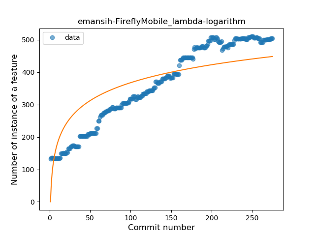
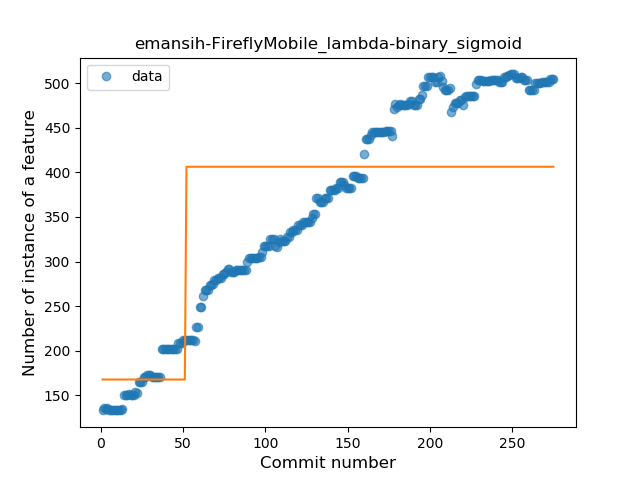
### <a name="safe_call">Safe Call</a>
----
#### Functions
* **Sudden Rise Plateau - Logarithm:** 
    * **R_Squared:** 0.68462302
* **Plateau Sudden Rise - Binary Sigmoid:** 
    * **R_Squared:** 0.68643502
* **Constant Rise - Linear:** 
    * **R_Squared:** 0.58854687

**Plots** :chart_with_upwards_trend:
-----

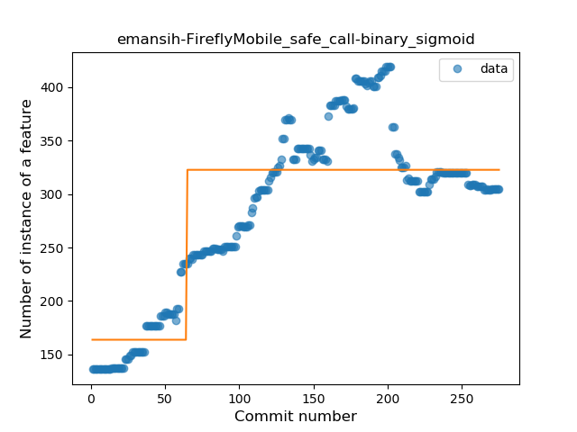
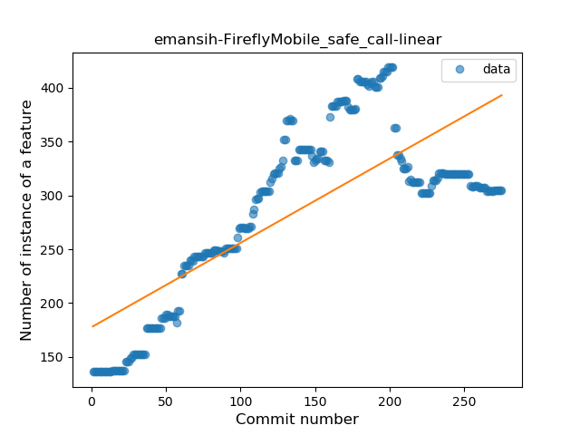
### <a name="when_expr">When expression</a>
----
#### Functions
* **Constant Rise - Linear:** 
    * **R_Squared:** 0.88958398
* **Plateau Sudden Rise - Binary Sigmoid:** 
    * **R_Squared:** 0.71384702
* **Sudden Rise Plateau - Logarithm:** 
    * **R_Squared:** 0.62200566

**Plots** :chart_with_upwards_trend:
-----

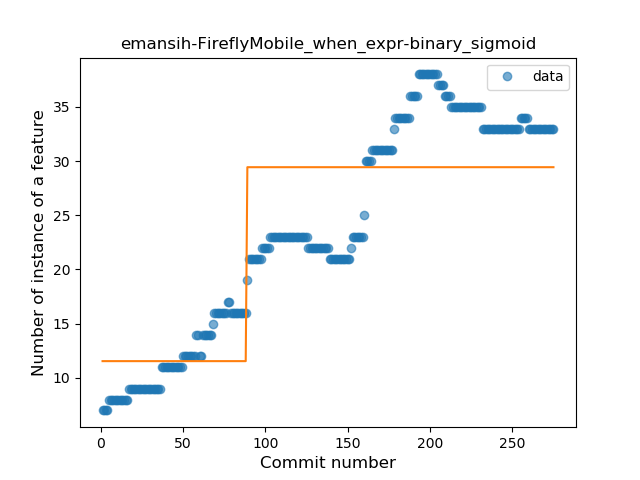
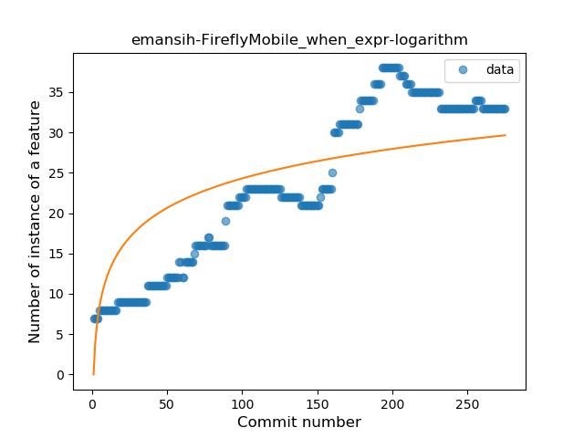
### <a name="companion_object">Companion Object</a>
----
#### Functions
* **Sudden Rise - Exponential:** 
    * **R_Squared:** 0.39021246
* **Constant Rise - Linear:** 
    * **R_Squared:** 0.02097213
* **Sudden Rise Plateau - Logarithm:** 
    * **R_Squared:** 0.00780808

**Plots** :chart_with_upwards_trend:
-----

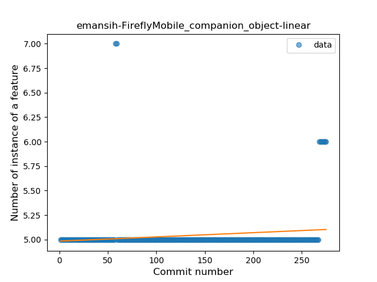
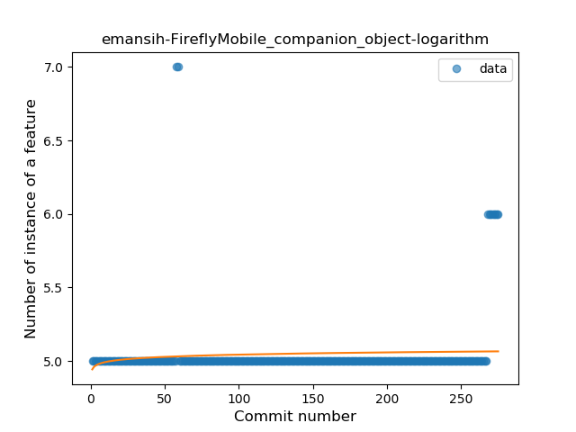
### <a name="unsafe_call">Unsafe Call</a>
----
#### Functions
* **Constant Rise - Linear:** 
    * **R_Squared:** 0.56106163
* **Sudden Rise Plateau - Logarithm:** 
    * **R_Squared:** 0.45326961

**Plots** :chart_with_upwards_trend:
-----

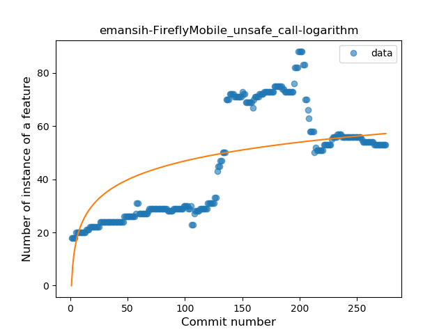
### <a name="string_template">String Template</a>
----
#### Functions
* **Sudden Rise - Exponential:** 
    * **R_Squared:** 0.88488348
* **Constant Rise - Linear:** 
    * **R_Squared:** 0.85826185
* **Sudden Rise Plateau - Logarithm:** 
    * **R_Squared:** 0.51183504

**Plots** :chart_with_upwards_trend:
-----

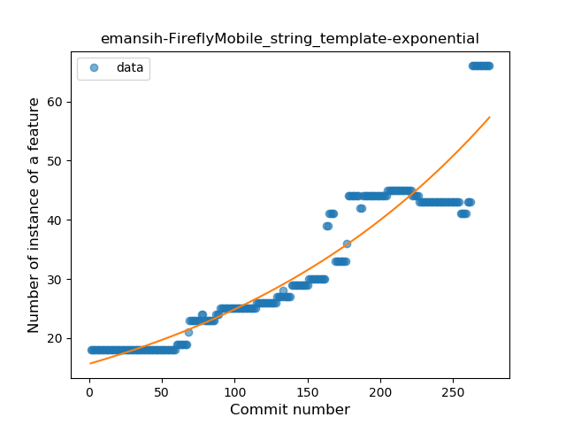
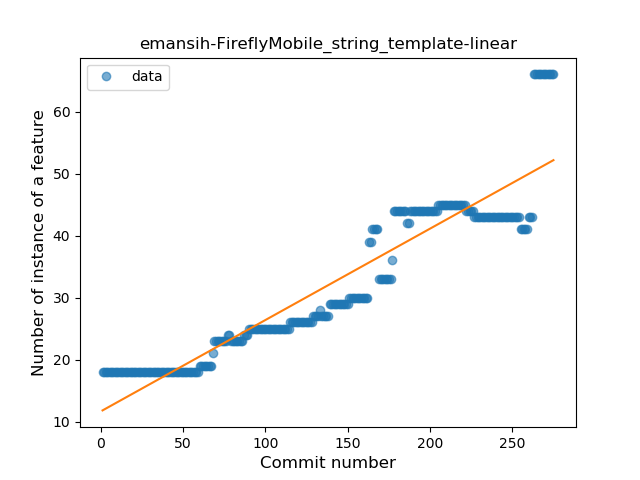
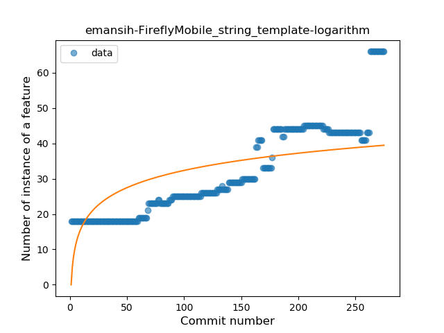
### <a name="func_with_default_value">Function with Default Value</a>
----
#### Functions
* **Sudden Rise - Exponential:** 
    * **R_Squared:** 0.92154037
* **Constant Rise - Linear:** 
    * **R_Squared:** 0.88926591
* **Sudden Rise Plateau - Logarithm:** 
    * **R_Squared:** 0.5608743

**Plots** :chart_with_upwards_trend:
-----

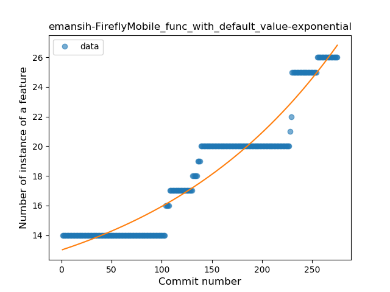
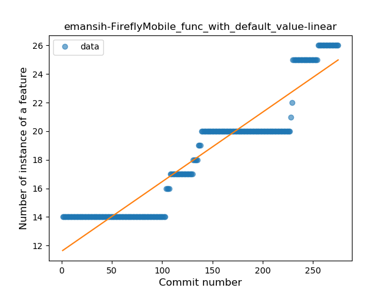
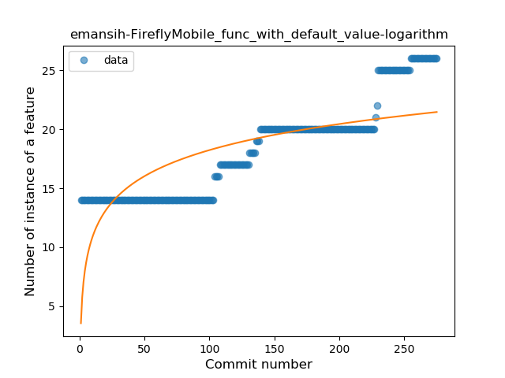
### <a name="singleton">Singleton</a>
----
#### Functions
* **Plateau Sudden Rise - Binary Sigmoid:** 
    * **R_Squared:** 1.0
* **Sudden Rise - Exponential:** 
    * **R_Squared:** 0.80707973
* **Constant Rise - Linear:** 
    * **R_Squared:** 0.13511584
* **Sudden Rise Plateau - Logarithm:** 
    * **R_Squared:** 0.04989305

**Plots** :chart_with_upwards_trend:
-----

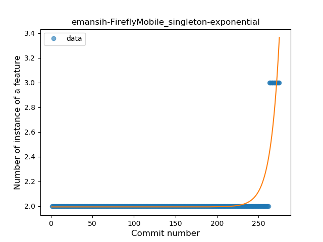
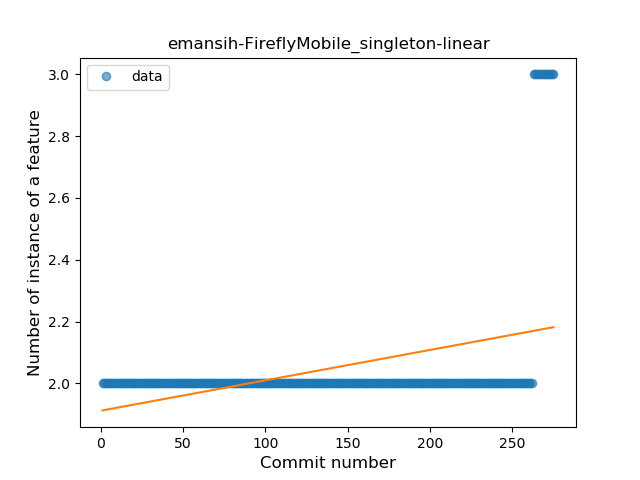
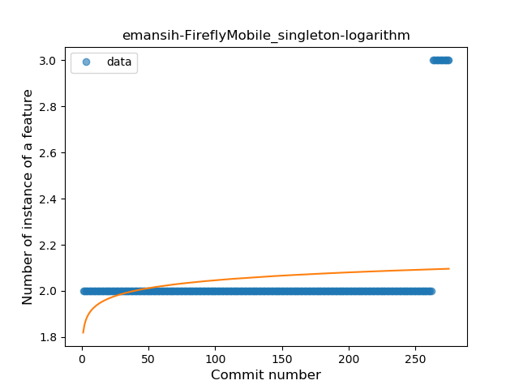
### <a name="smart_cast">Smart Cast</a>
----
#### Functions
* **Plateau Sudden Rise - Binary Sigmoid:** 
    * **R_Squared:** 0.50454077
* **Sudden Rise Plateau - Logarithm:** 
    * **R_Squared:** 0.28261682
* **Constant Rise - Linear:** 
    * **R_Squared:** 0.13866422

**Plots** :chart_with_upwards_trend:
-----

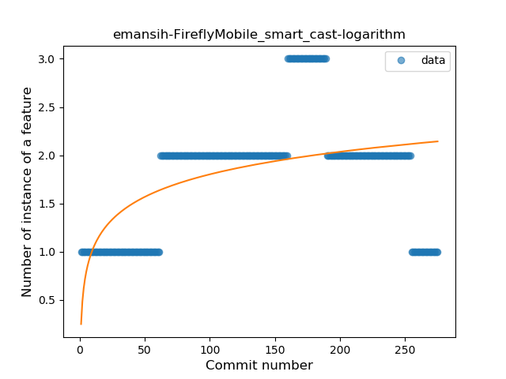

### <a name="range_expr">Range Expression</a>
----
#### Functions
* **Constant Rise - Linear:** 
    * **R_Squared:** 0.85312427
* **Sudden Rise Plateau - Logarithm:** 
    * **R_Squared:** 0.8006062

**Plots** :chart_with_upwards_trend:
-----

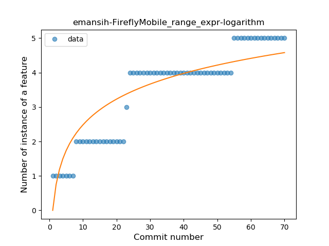
### <a name="func_call_with_named_arg">Function call with Named Argument</a>
----
#### Functions
* **Plateau Gradual Rise - Sigmoid:** 
    * **R_Squared:** 0.43857227
* **Constant Rise - Linear:** 
    * **R_Squared:** 0.15053739
* **Sudden Rise Plateau - Logarithm:** 
    * **R_Squared:** 0.10789794

**Plots** :chart_with_upwards_trend:
-----

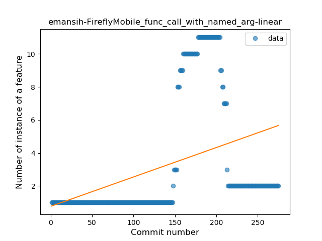
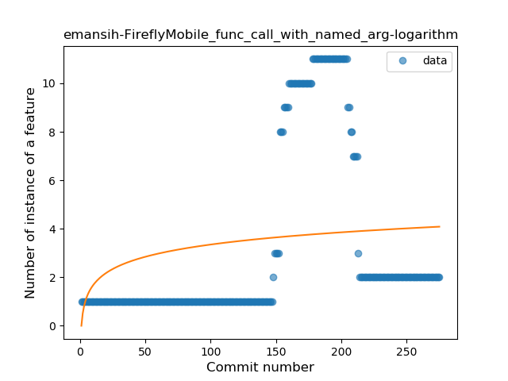
### <a name="data_class">Data Class</a>
----
#### Functions
* **Sudden Rise Plateau - Logarithm:** 
    * **R_Squared:** 0.7797212
* **Constant Rise - Linear:** 
    * **R_Squared:** 0.58429765

**Plots** :chart_with_upwards_trend:
-----

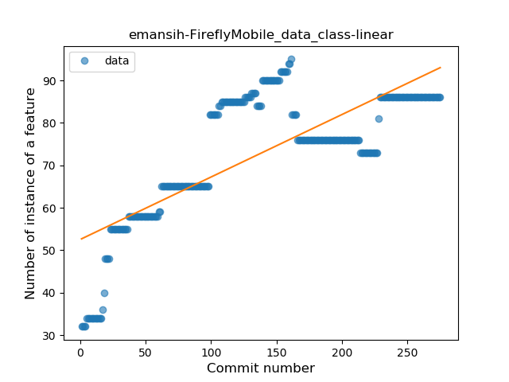
### <a name="extension_function">Extension Function</a>
----
#### Functions
* **Constant Rise - Linear:** 
    * **R_Squared:** 0.91854491
* **Sudden Rise Plateau - Logarithm:** 
    * **R_Squared:** 0.79592904

**Plots** :chart_with_upwards_trend:
-----

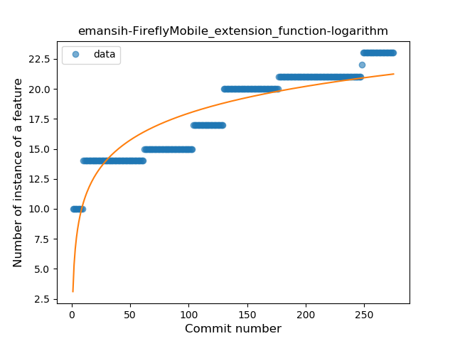
### <a name="property_delegation">Property Delegation</a>
----
#### Functions
* **Sudden Rise Plateau - Logarithm:** 
    * **R_Squared:** 0.7397301
* **Constant Rise - Linear:** 
    * **R_Squared:** 0.59964056

**Plots** :chart_with_upwards_trend:
-----

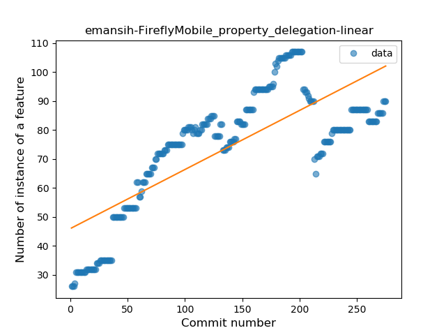
### <a name="inline_func">Inline Function</a>
----
#### Functions
* **Plateau Gradual Rise - Sigmoid:** 
    * **R_Squared:** 1.0
* **Sudden Rise - Exponential:** 
    * **R_Squared:** 0.80494041
* **Constant Rise - Linear:** 
    * **R_Squared:** 0.27273867
* **Sudden Rise Plateau - Logarithm:** 
    * **R_Squared:** 0.10647451

**Plots** :chart_with_upwards_trend:
-----

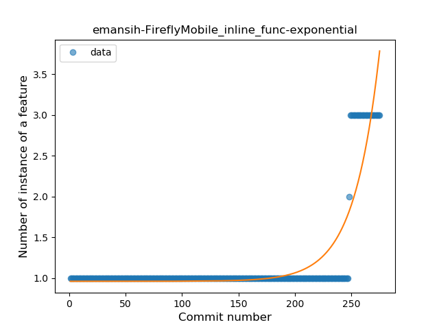
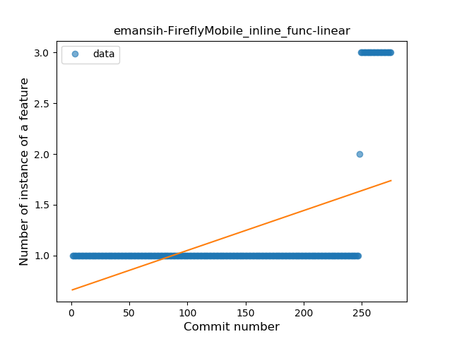
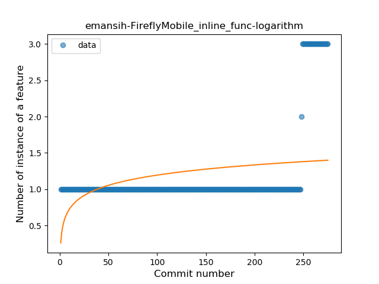
