## enjoyingfoss-om
----
#### Metrics provided by Detekt
* Number of lines of code 956
* Number of Kotlin files: 11
* Cyclomatic complexity: 108
* Cyclomatic complexity by thousands of lines: 238 

----
**11** features analyzed

*	<a href="#type_inference">Type Inference</a> 
*	<a href="#lambda">Lambda</a> 
*	<a href="#safe_call">Safe Call</a> 
*	<a href="#when_expr">When expression</a> 
*	<a href="#companion_object">Companion Object</a> 
*	<a href="#unsafe_call">Unsafe Call</a> 
*	<a href="#string_template">String Template</a> 
*	<a href="#singleton">Singleton</a> 
*	<a href="#func_call_with_named_arg">Function call with Named Argument</a> 
*	<a href="#data_class">Data Class</a> 
*	<a href="#property_delegation">Property Delegation</a> 

### <a name="type_inference">Type Inference</a>
----
#### Functions
* **Constant Rise - Linear:** 
    * **R_Squared:** 0.82967494
* **Sudden Rise Plateau - Logarithm:** 
    * **R_Squared:** 0.82811689

**Plots** :chart_with_upwards_trend:
-----

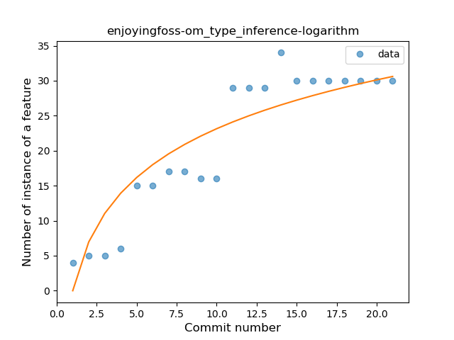
### <a name="lambda">Lambda</a>
----
#### Functions
* **Sudden Rise - Exponential:** 
    * **R_Squared:** 0.91586982
* **Constant Rise - Linear:** 
    * **R_Squared:** 0.86822977
* **Sudden Rise Plateau - Logarithm:** 
    * **R_Squared:** 0.61642381
* **Plateau Sudden Rise - Binary Sigmoid:** 
    * **R_Squared:** 0.1781208

**Plots** :chart_with_upwards_trend:
-----

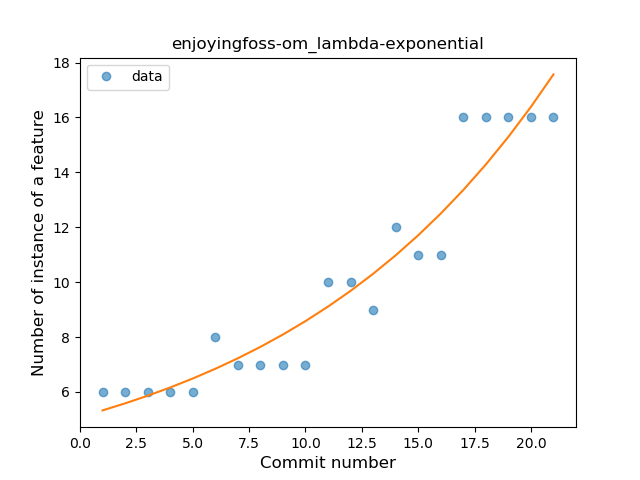
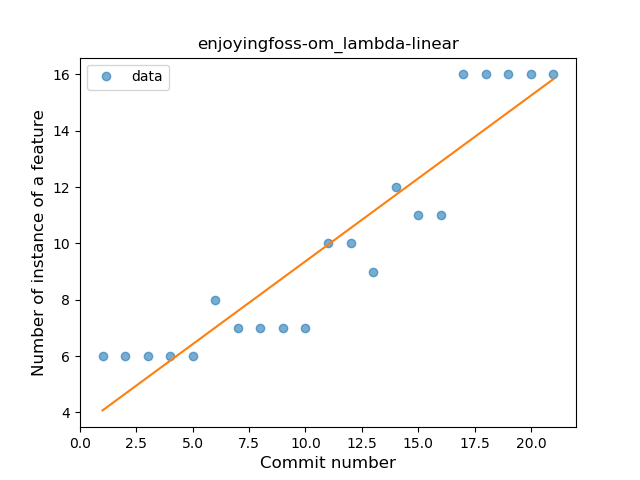
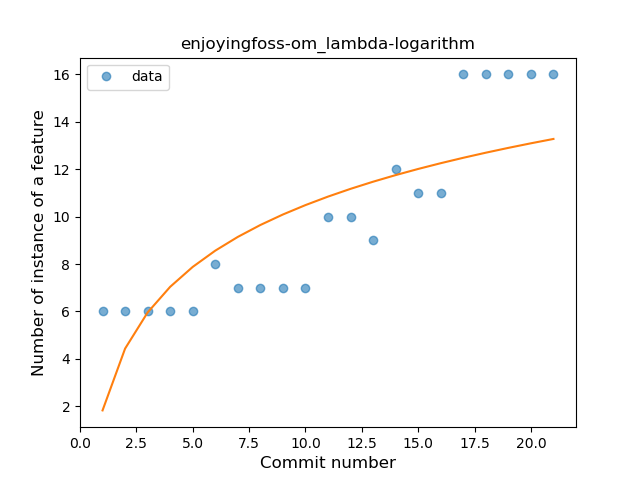

### <a name="safe_call">Safe Call</a>
----
#### Functions
* **Instability - Polinomial 4:** 
    * **R_Squared:** 0.26264053
* **Instability - Polinomial 3:** )
    * **R_Squared:** 0.195856
* **Sudden Rise Plateau - Logarithm:** 
    * **R_Squared:** 0.181961
* **Plateau Sudden Rise - Binary Sigmoid:** 
    * **R_Squared:** 0.18492215
* **Constant Rise - Linear:** 
    * **R_Squared:** 0.14284428

**Plots** :chart_with_upwards_trend:
-----

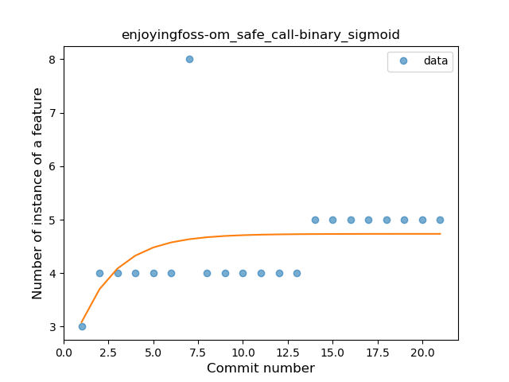
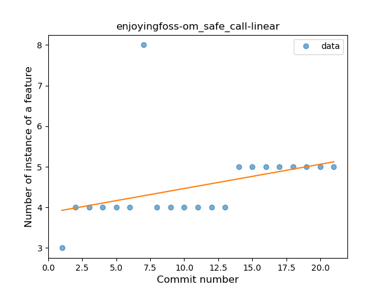
### <a name="when_expr">When expression</a>
----
#### Functions
* **Plateau Gradual Rise - Sigmoid:** 
    * **R_Squared:** 0.83040463
* **Instability - Polinomial 3:** )
    * **R_Squared:** 0.73145595
* **Instability - Polinomial 4:** 
    * **R_Squared:** 0.73730065
* **Constant Rise - Linear:** 
    * **R_Squared:** 0.58624231
* **Sudden Rise Plateau - Logarithm:** 
    * **R_Squared:** 0.49266696

**Plots** :chart_with_upwards_trend:
-----

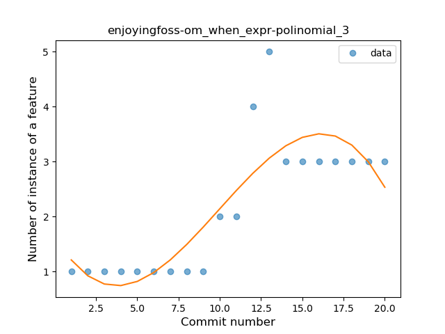
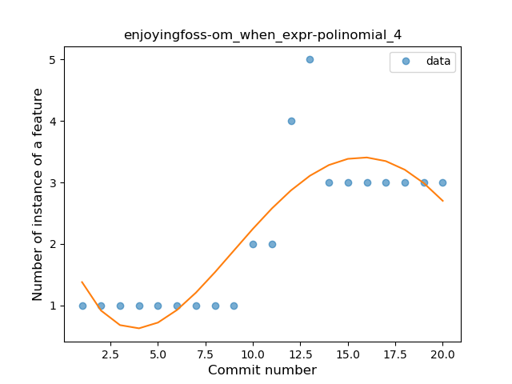
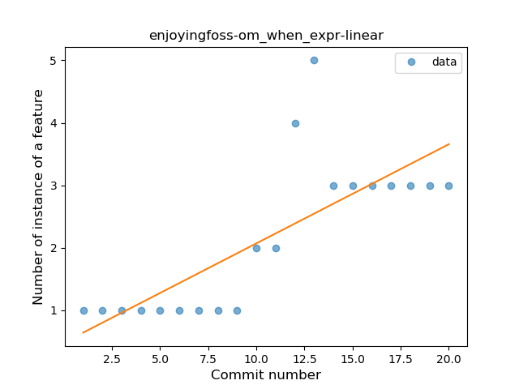
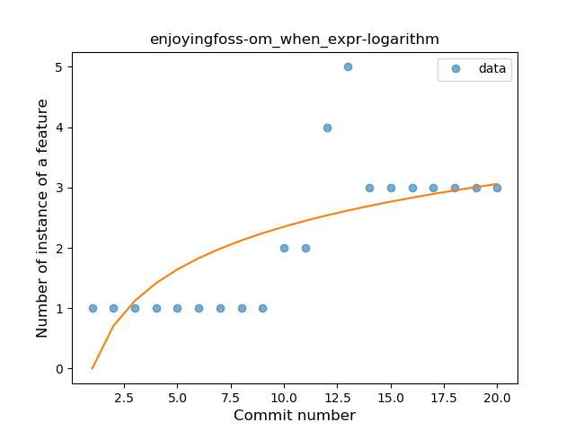
### <a name="companion_object">Companion Object</a>
----
#### Functions
* **Instability - Polinomial 3:** )
    * **R_Squared:** 0.81468506
* **Instability - Polinomial 4:** 
    * **R_Squared:** 0.82375838
* **Sudden Rise Plateau - Logarithm:** 
    * **R_Squared:** 0.72380015
* **Constant Rise - Linear:** 
    * **R_Squared:** 0.53739528

**Plots** :chart_with_upwards_trend:
-----

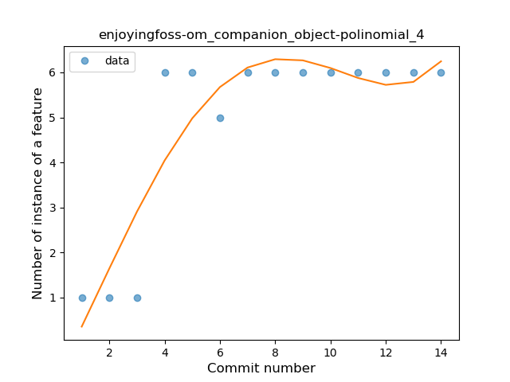
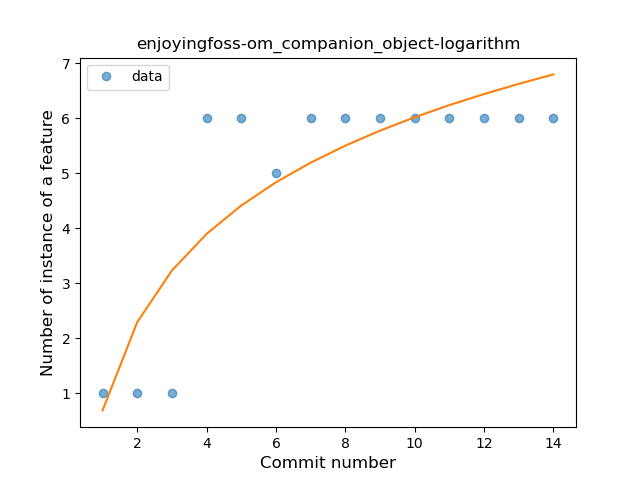
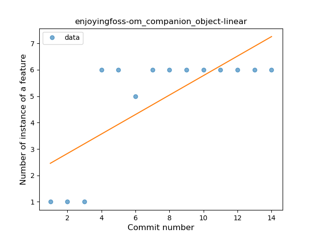
### <a name="unsafe_call">Unsafe Call</a>
----
#### Functions
* **Instability - Polinomial 4:** 
    * **R_Squared:** 0.59888294
* **Plateau Sudden Rise - Binary Sigmoid:** 
    * **R_Squared:** 0.37306843
* **Sudden Rise Plateau - Logarithm:** 
    * **R_Squared:** 0.10844889
* **Constant Rise - Linear:** 
    * **R_Squared:** 0.01991734

**Plots** :chart_with_upwards_trend:
-----

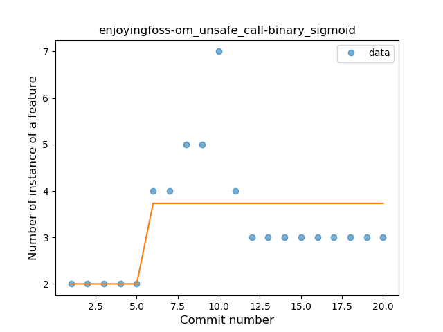
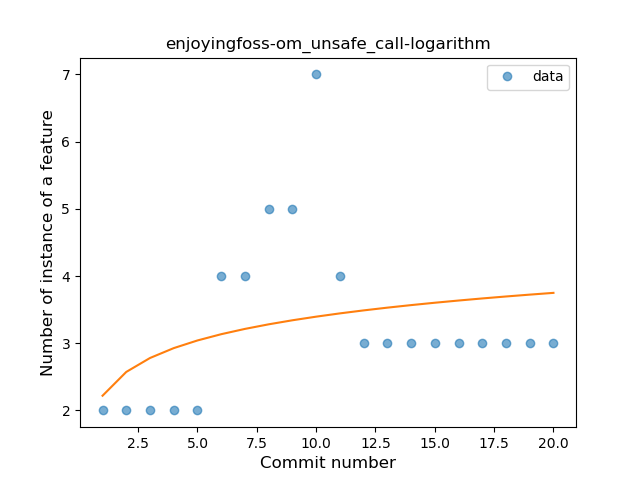
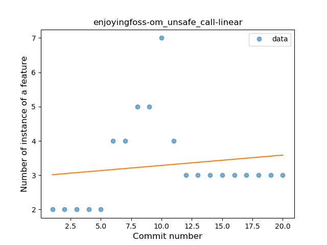
### <a name="string_template">String Template</a>
----
#### Functions
* **Plateau Sudden Decline - Binary Sigmoid:** 
    * **R_Squared:** 0.65789474
* **Instability - Polinomial 4:** 
    * **R_Squared:** 0.51257266
* **Constant Decline - Linear:** 
    * **R_Squared:** 0.4145749
* **Sudden Rise Plateau - Logarithm:** 
    * **R_Squared:** -0.0

**Plots** :chart_with_upwards_trend:
-----

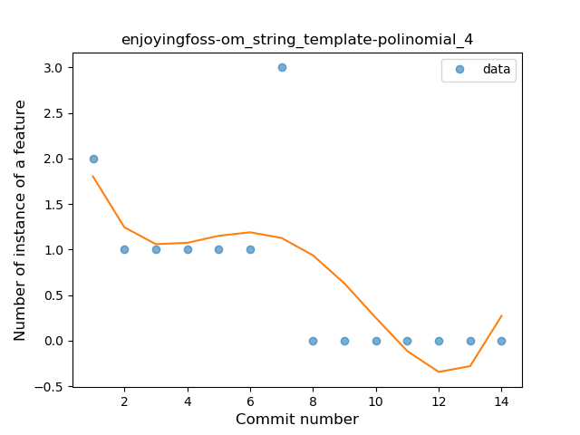
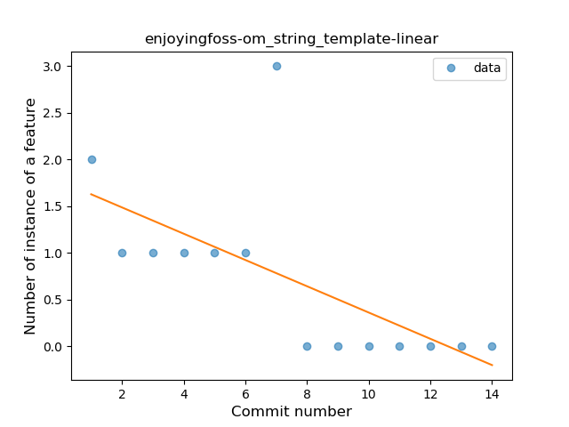
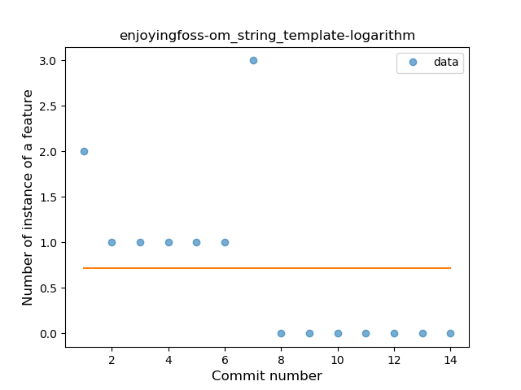
### <a name="singleton">Singleton</a>
----
#### Functions
* **Instability - Polinomial 4:** 
    * **R_Squared:** 0.60719814
* **Constant Decline - Linear:** 
    * **R_Squared:** 0.10046382
* **Sudden Rise Plateau - Logarithm:** 
    * **R_Squared:** -0.0

**Plots** :chart_with_upwards_trend:
-----

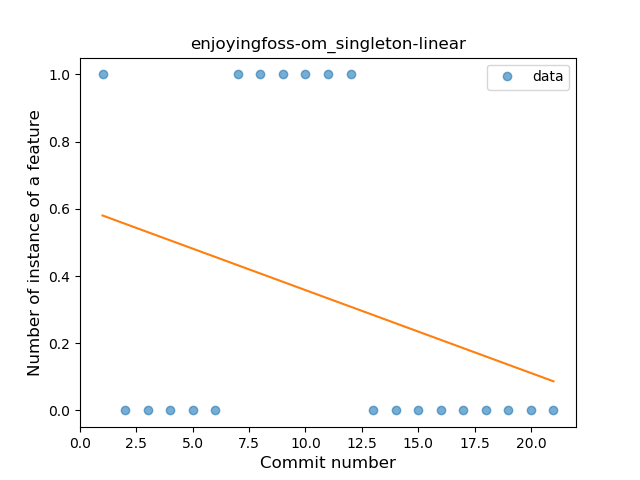
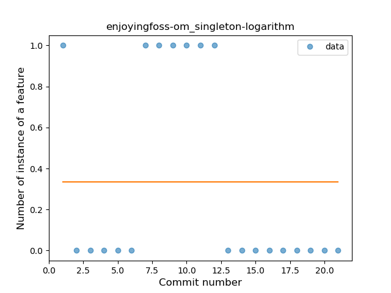
### <a name="func_call_with_named_arg">Function call with Named Argument</a>
----
#### Functions
* **Instability - Polinomial 4:** 
    * **R_Squared:** 0.63601476
* **Instability - Polinomial 3:** )
    * **R_Squared:** 0.61839725
* **Sudden Rise Plateau - Logarithm:** 
    * **R_Squared:** 0.25738534
* **Constant Rise - Linear:** 
    * **R_Squared:** 0.10085796

**Plots** :chart_with_upwards_trend:
-----

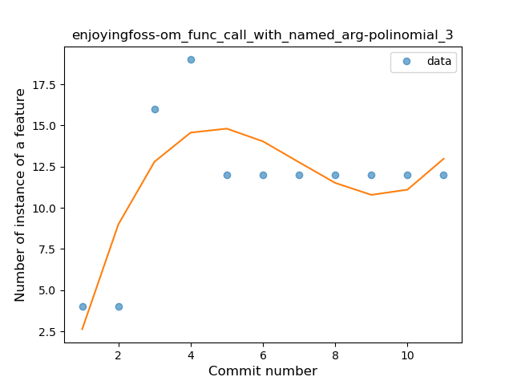
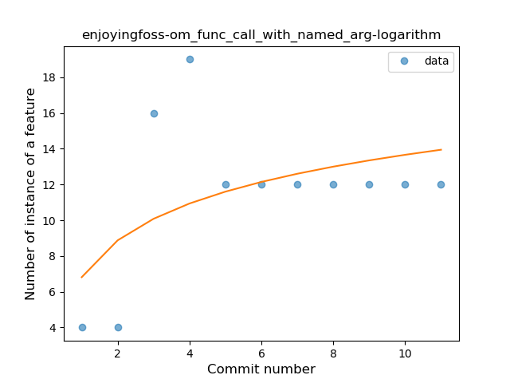
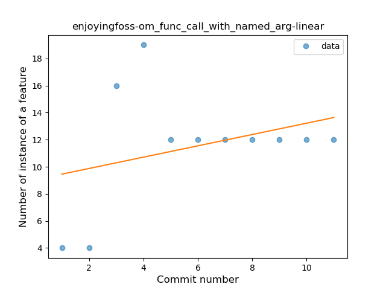
### <a name="data_class">Data Class</a>
----
#### Functions
* **Plateau Sudden Rise - Binary Sigmoid:** 
    * **R_Squared:** 1.0
* **Instability - Polinomial 4:** 
    * **R_Squared:** 0.87179487
* **Sudden Rise Plateau - Logarithm:** 
    * **R_Squared:** 0.73390242
* **Constant Rise - Linear:** 
    * **R_Squared:** 0.6

**Plots** :chart_with_upwards_trend:
-----

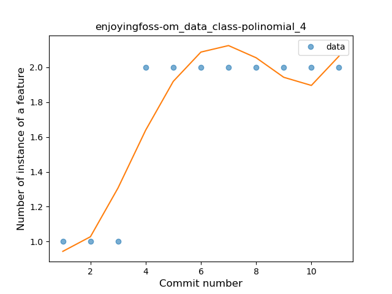
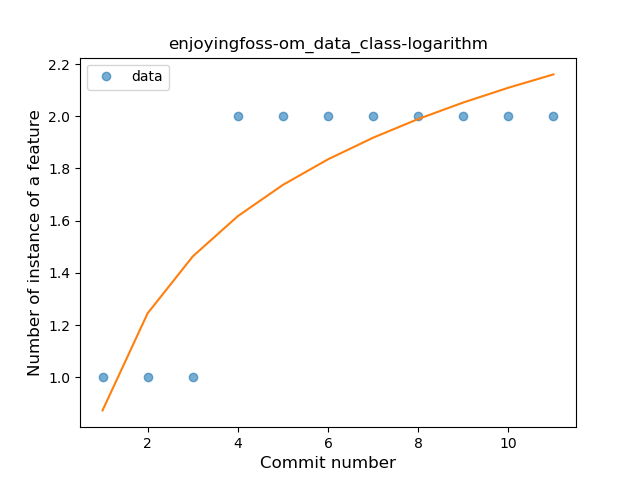
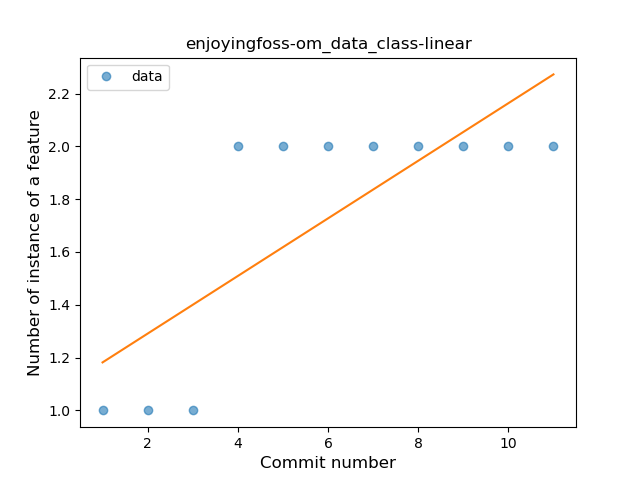
### <a name="property_delegation">Property Delegation</a>
----
#### Functions
* **Plateau Gradual Decline - Sigmoid:** 
    * **R_Squared:** 0.92473991
* **Sudden Decline - Exponential:** 
    * **R_Squared:** 0.88931748
* **Constant Decline - Linear:** 
    * **R_Squared:** 0.87352941
* **Sudden Rise Plateau - Logarithm:** 
    * **R_Squared:** -0.0

**Plots** :chart_with_upwards_trend:
-----

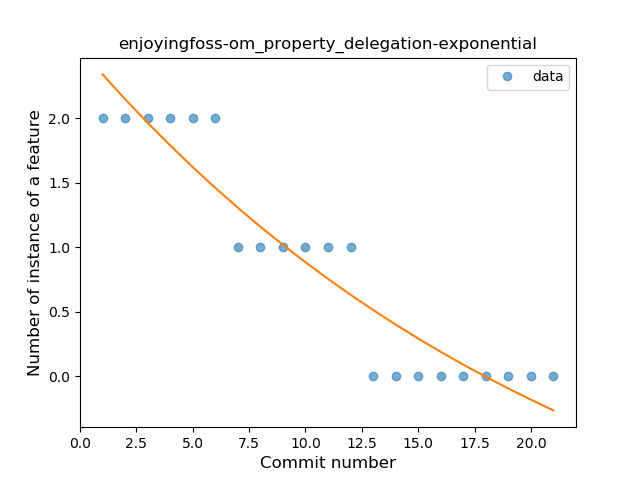
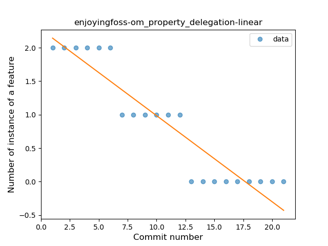
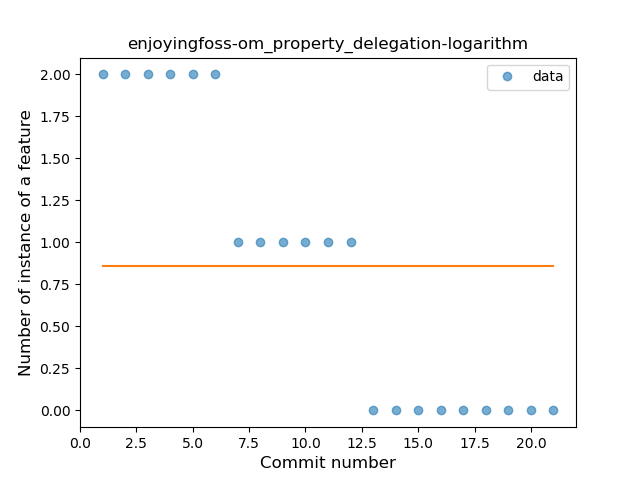
