## equeim-tremotesf-android
----
#### Metrics provided by Detekt
* Number of lines of code 9252
* Number of Kotlin files: 45
* Cyclomatic complexity: 1394
* Cyclomatic complexity by thousands of lines: 277 

----
**14** features analyzed

*	<a href="#type_inference">Type Inference</a> 
*	<a href="#lambda">Lambda</a> 
*	<a href="#safe_call">Safe Call</a> 
*	<a href="#when_expr">When expression</a> 
*	<a href="#companion_object">Companion Object</a> 
*	<a href="#unsafe_call">Unsafe Call</a> 
*	<a href="#string_template">String Template</a> 
*	<a href="#func_with_default_value">Function with Default Value</a> 
*	<a href="#singleton">Singleton</a> 
*	<a href="#smart_cast">Smart Cast</a> 
*	<a href="#range_expr">Range Expression</a> 
*	<a href="#property_delegation">Property Delegation</a> 
*	<a href="#destructuring_declaration">Destructuring Declaration</a> 
*	<a href="#overloaded_op">Overloaded Operator</a> 

### <a name="type_inference">Type Inference</a>
----
#### Functions
* **Instability - Polinomial 3:** )
    * **R_Squared:** 0.80691266
* **Constant Decline - Linear:** 
    * **R_Squared:** 0.7186062
* **Sudden Rise Plateau - Logarithm:** 
    * **R_Squared:** -0.0

**Plots** :chart_with_upwards_trend:
-----

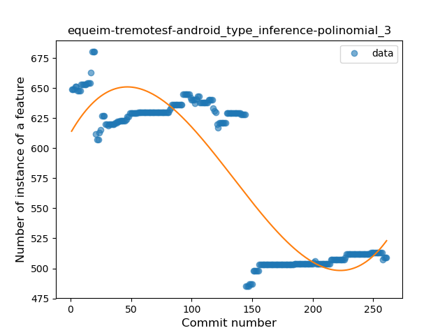
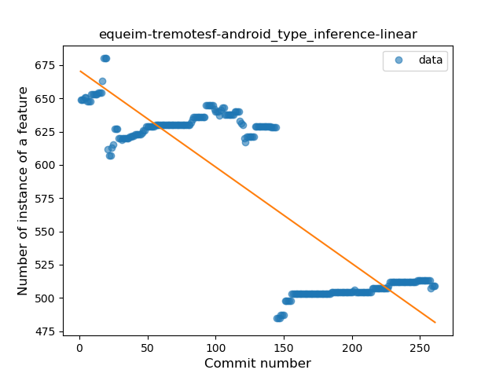

### <a name="lambda">Lambda</a>
----
#### Functions
* **Sudden Rise - Exponential:** 
    * **R_Squared:** 0.80950946
* **Constant Rise - Linear:** 
    * **R_Squared:** 0.44636422
* **Sudden Rise Plateau - Logarithm:** 
    * **R_Squared:** 0.22512887

**Plots** :chart_with_upwards_trend:
-----

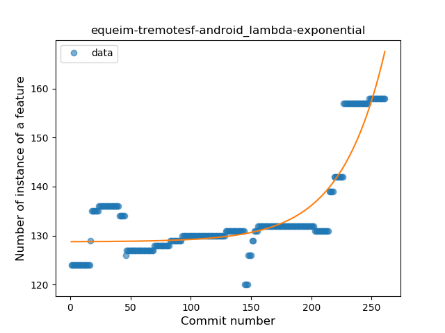
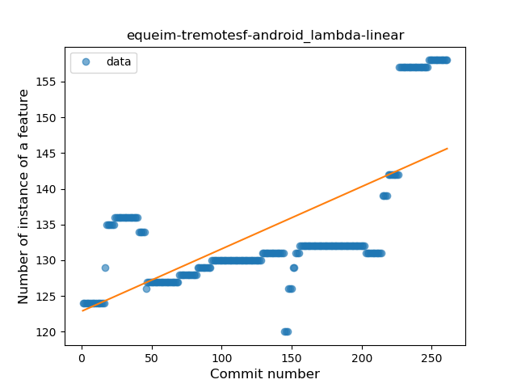
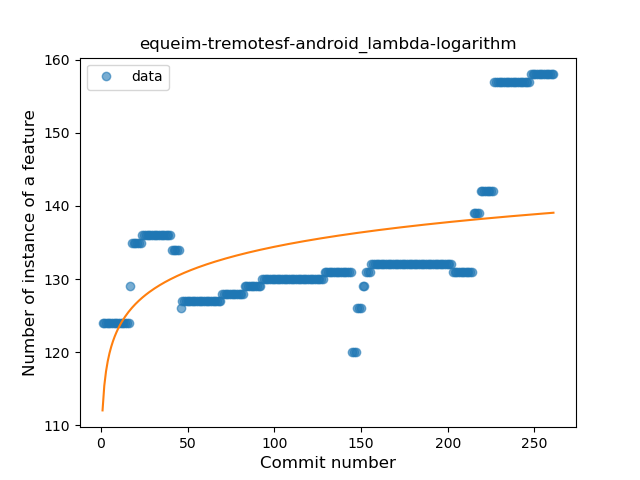
### <a name="safe_call">Safe Call</a>
----
#### Functions
* **Sudden Rise Plateau - Logarithm:** 
    * **R_Squared:** 0.49370812
* **Constant Rise - Linear:** 
    * **R_Squared:** 0.33290069

**Plots** :chart_with_upwards_trend:
-----

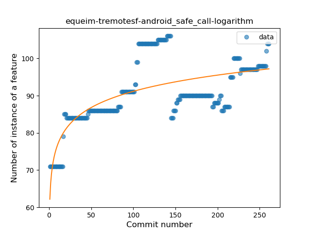
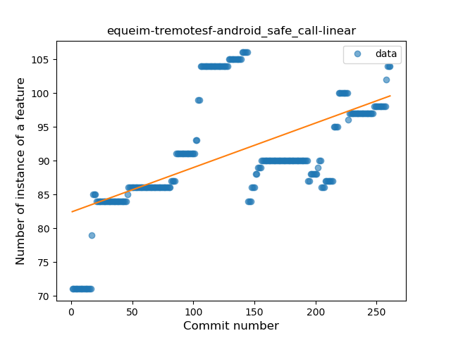
### <a name="when_expr">When expression</a>
----
#### Functions
* **Constant Decline - Linear:** 
    * **R_Squared:** 0.29314046
* **Sudden Rise Plateau - Logarithm:** 
    * **R_Squared:** -0.0

**Plots** :chart_with_upwards_trend:
-----

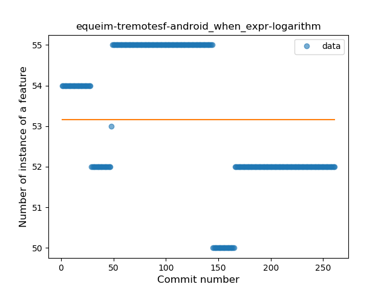
### <a name="companion_object">Companion Object</a>
----
#### Functions
* **Constant Rise - Linear:** 
    * **R_Squared:** 0.66812002
* **Sudden Rise Plateau - Logarithm:** 
    * **R_Squared:** 0.50882844

**Plots** :chart_with_upwards_trend:
-----

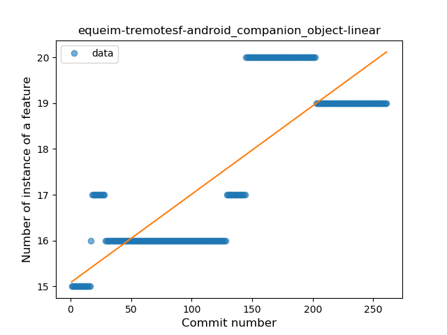
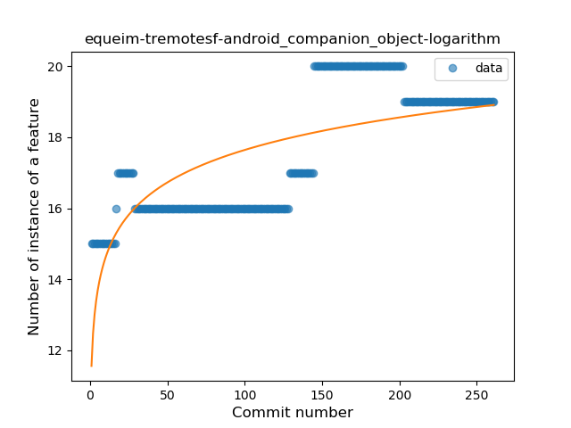
### <a name="unsafe_call">Unsafe Call</a>
----
#### Functions
* **Instability - Polinomial 3:** )
    * **R_Squared:** 0.66378256
* **Constant Rise - Linear:** 
    * **R_Squared:** 0.27665933
* **Sudden Rise - Exponential:** 
    * **R_Squared:** 0.28136206
* **Sudden Rise Plateau - Logarithm:** 
    * **R_Squared:** 0.06300248

**Plots** :chart_with_upwards_trend:
-----

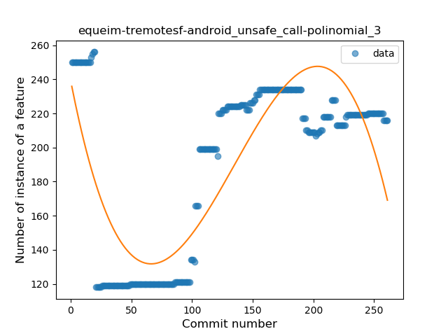
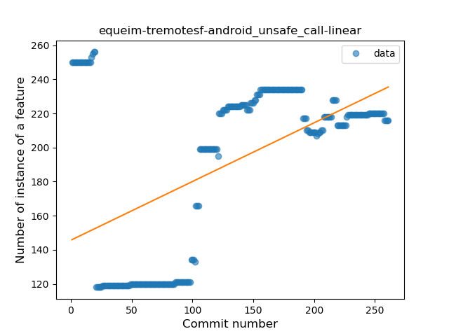

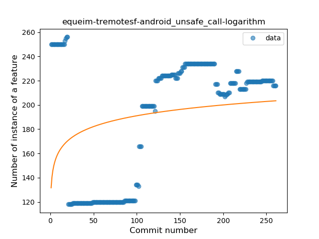
### <a name="string_template">String Template</a>
----
#### Functions
* **Constant Decline - Linear:** 
    * **R_Squared:** 0.83198067
* **Sudden Decline - Exponential:** 
    * **R_Squared:** 0.83268288
* **Sudden Rise Plateau - Logarithm:** 
    * **R_Squared:** -0.0

**Plots** :chart_with_upwards_trend:
-----

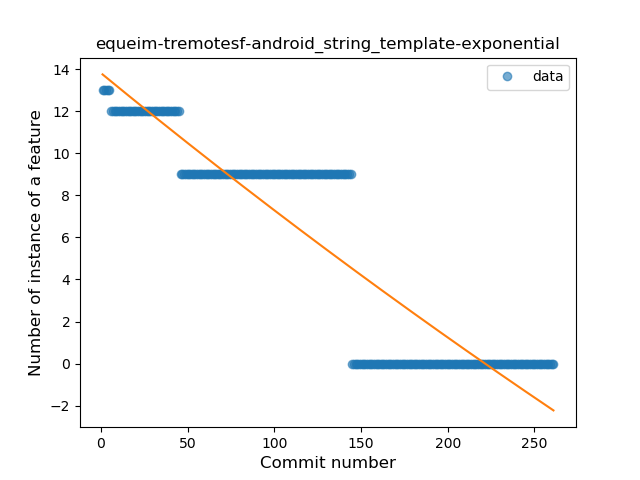
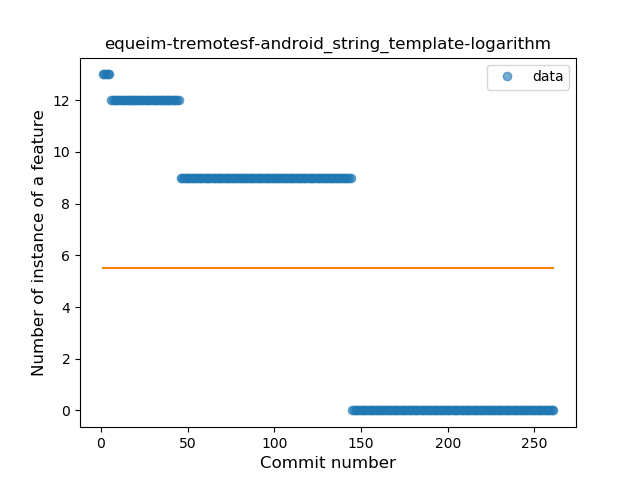
### <a name="func_with_default_value">Function with Default Value</a>
----
#### Functions
* **Plateau Gradual Rise - Sigmoid:** 
    * **R_Squared:** 0.75000363
* **Sudden Rise Plateau - Logarithm:** 
    * **R_Squared:** 0.67831095
* **Constant Rise - Linear:** 
    * **R_Squared:** 0.57012298

**Plots** :chart_with_upwards_trend:
-----

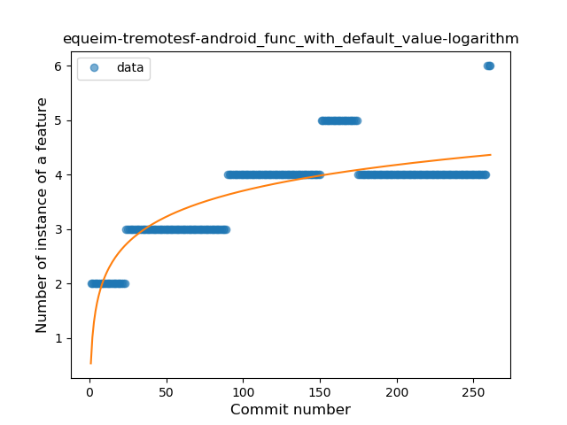
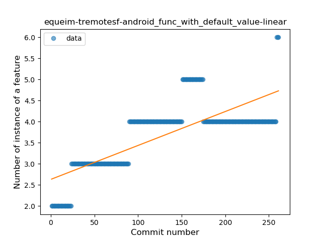
### <a name="singleton">Singleton</a>
----
#### Functions
* **Plateau Gradual Decline - Sigmoid:** 
    * **R_Squared:** 0.99340592
* **Constant Decline - Linear:** 
    * **R_Squared:** 0.77554071
* **Sudden Rise Plateau - Logarithm:** 
    * **R_Squared:** -0.0

**Plots** :chart_with_upwards_trend:
-----

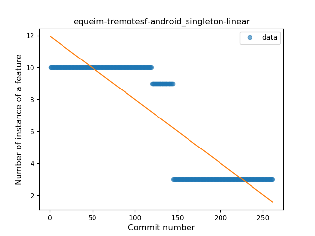
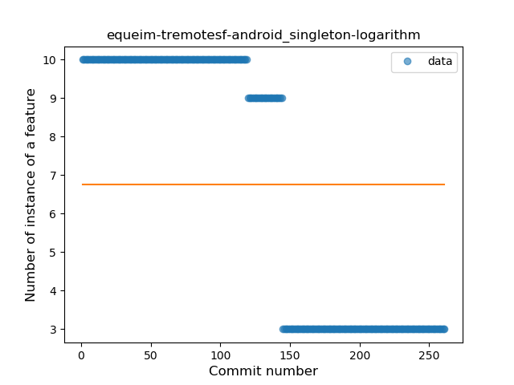
### <a name="smart_cast">Smart Cast</a>
----
#### Functions
* **Constant Decline - Linear:** 
    * **R_Squared:** 0.81734053
* **Sudden Decline - Exponential:** 
    * **R_Squared:** 0.81909133
* **Sudden Rise Plateau - Logarithm:** 
    * **R_Squared:** 0.0

**Plots** :chart_with_upwards_trend:
-----

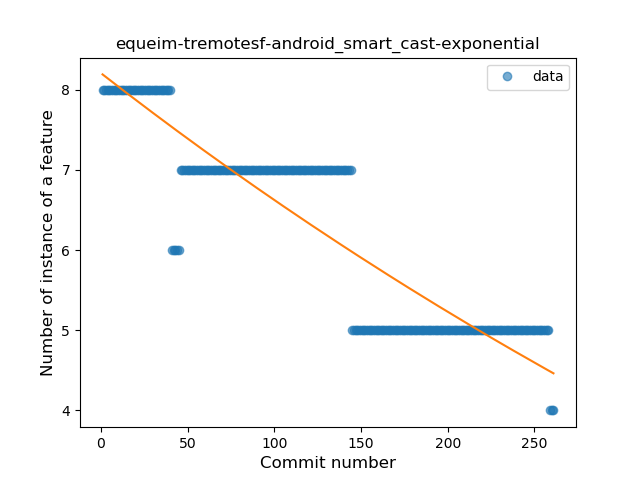
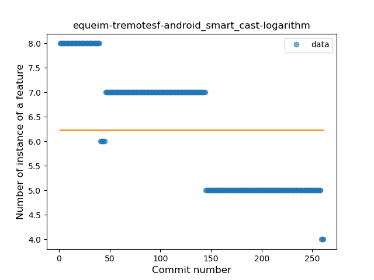
### <a name="range_expr">Range Expression</a>
----
#### Functions
* **Constant Rise - Linear:** 
    * **R_Squared:** 0.77383069
* **Sudden Rise - Exponential:** 
    * **R_Squared:** 0.7789843
* **Sudden Rise Plateau - Logarithm:** 
    * **R_Squared:** 0.51286418

**Plots** :chart_with_upwards_trend:
-----

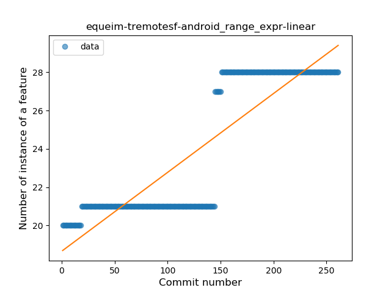
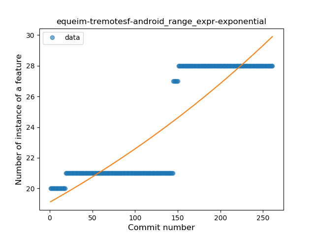
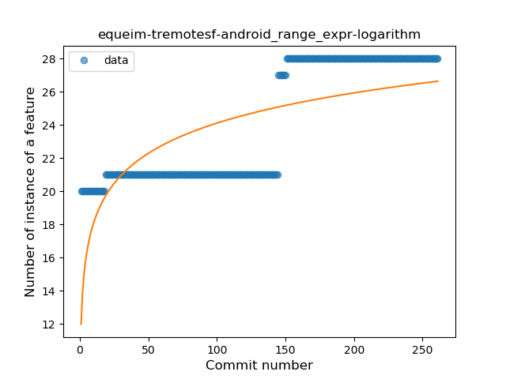
### <a name="property_delegation">Property Delegation</a>
----
#### Functions
* **Constant Decline - Linear:** 
    * **R_Squared:** 0.74198473
* **Plateau Sudden Decline - Binary Sigmoid:** 
    * **R_Squared:** 0.40625
* **Sudden Rise Plateau - Logarithm:** 
    * **R_Squared:** -0.0

**Plots** :chart_with_upwards_trend:
-----

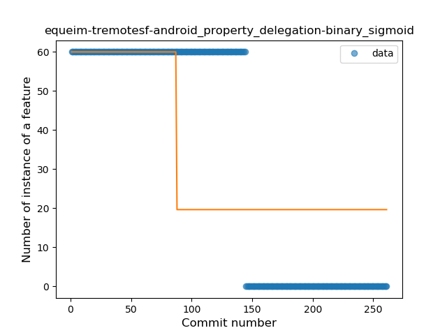
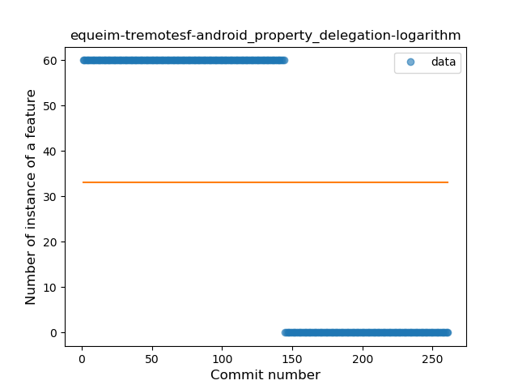
### <a name="destructuring_declaration">Destructuring Declaration</a>
----
#### Functions
* **Plateau Sudden Decline - Binary Sigmoid:** 
    * **R_Squared:** 0.85594292
* **Constant Decline - Linear:** 
    * **R_Squared:** 0.45165723
* **Sudden Rise Plateau - Logarithm:** 
    * **R_Squared:** -0.0

**Plots** :chart_with_upwards_trend:
-----

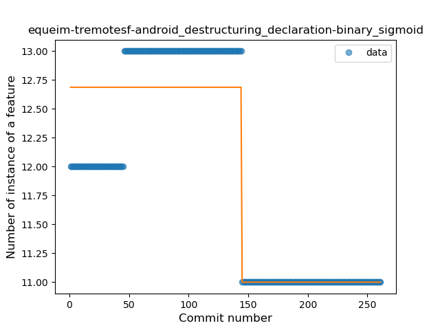
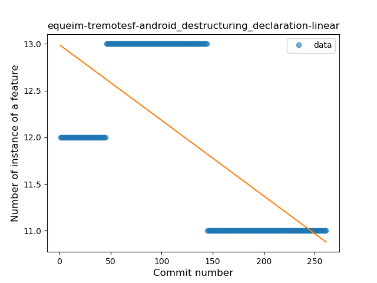
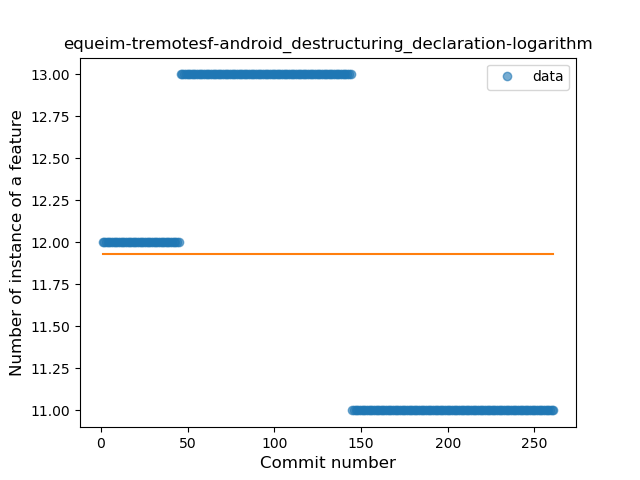
### <a name="overloaded_op">Overloaded Operator</a>
----
#### Functions
* **Constant Decline - Linear:** 
    * **R_Squared:** 0.74198473
* **Sudden Rise Plateau - Logarithm:** 
    * **R_Squared:** -0.0

**Plots** :chart_with_upwards_trend:
-----

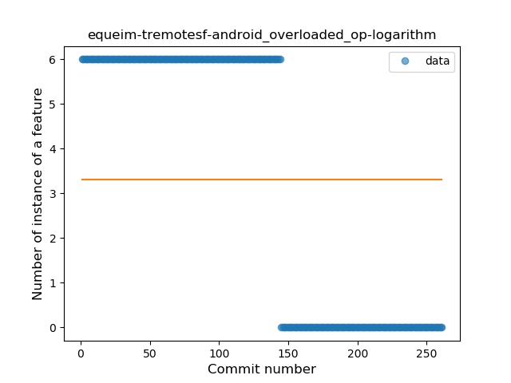
