## erickok-borefts2015
----
#### Metrics provided by Detekt
* Number of lines of code 3167
* Number of Kotlin files: 62
* Cyclomatic complexity: 356
* Cyclomatic complexity by thousands of lines: 250 

----
**17** features analyzed

*	<a href="#type_inference">Type Inference</a> 
*	<a href="#lambda">Lambda</a> 
*	<a href="#safe_call">Safe Call</a> 
*	<a href="#when_expr">When expression</a> 
*	<a href="#companion_object">Companion Object</a> 
*	<a href="#unsafe_call">Unsafe Call</a> 
*	<a href="#string_template">String Template</a> 
*	<a href="#func_with_default_value">Function with Default Value</a> 
*	<a href="#singleton">Singleton</a> 
*	<a href="#smart_cast">Smart Cast</a> 
*	<a href="#func_call_with_named_arg">Function call with Named Argument</a> 
*	<a href="#data_class">Data Class</a> 
*	<a href="#extension_function">Extension Function</a> 
*	<a href="#property_delegation">Property Delegation</a> 
*	<a href="#destructuring_declaration">Destructuring Declaration</a> 
*	<a href="#inline_func">Inline Function</a> 
*	<a href="#overloaded_op">Overloaded Operator</a> 

### <a name="type_inference">Type Inference</a>
----
#### Functions
* **Constant Rise - Linear:** 
    * **R_Squared:** 0.89754622
* **Sudden Rise Plateau - Logarithm:** 
    * **R_Squared:** 0.79873598

**Plots** :chart_with_upwards_trend:
-----

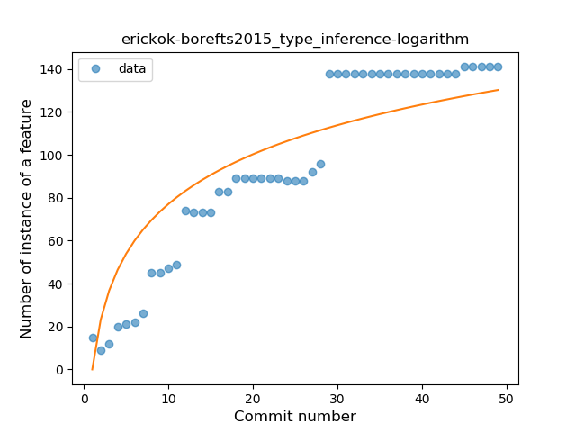
### <a name="lambda">Lambda</a>
----
#### Functions
* **Sudden Rise Plateau - Logarithm:** 
    * **R_Squared:** 0.91980437
* **Constant Rise - Linear:** 
    * **R_Squared:** 0.82154832

**Plots** :chart_with_upwards_trend:
-----

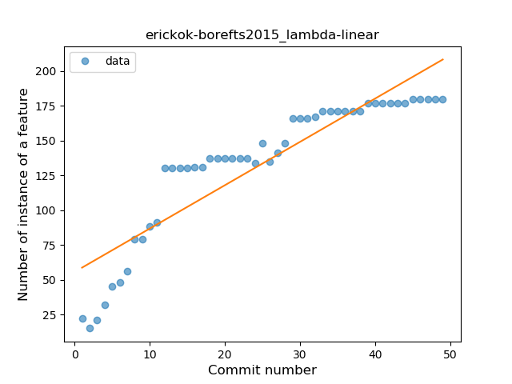
### <a name="safe_call">Safe Call</a>
----
#### Functions
* **Instability - Polinomial 3:** )
    * **R_Squared:** 0.89331879
* **Sudden Rise Plateau - Logarithm:** 
    * **R_Squared:** 0.78024227
* **Constant Rise - Linear:** 
    * **R_Squared:** 0.56224091
* **Plateau Sudden Rise - Binary Sigmoid:** 
    * **R_Squared:** 0.29169769

**Plots** :chart_with_upwards_trend:
-----

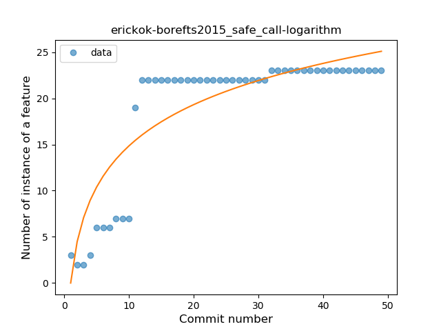
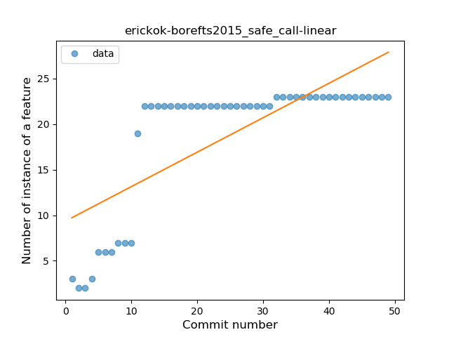

### <a name="when_expr">When expression</a>
----
#### Functions
* **Instability - Polinomial 3:** )
    * **R_Squared:** 0.96199886
* **Sudden Rise Plateau - Logarithm:** 
    * **R_Squared:** 0.86934222
* **Plateau Gradual Rise - Sigmoid:** 
    * **R_Squared:** 0.84565905
* **Constant Rise - Linear:** 
    * **R_Squared:** 0.55742215

**Plots** :chart_with_upwards_trend:
-----

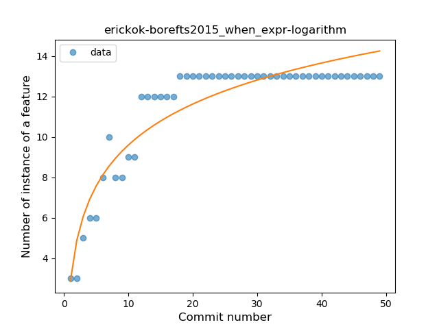
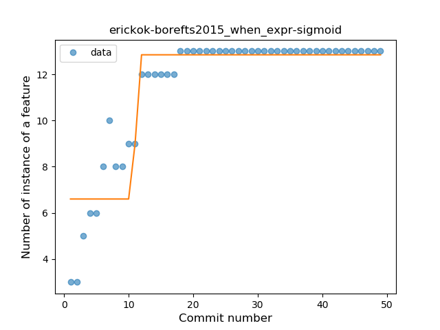
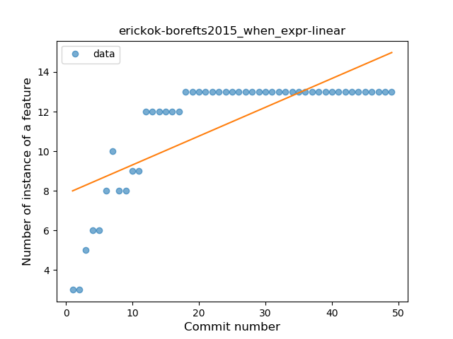
### <a name="companion_object">Companion Object</a>
----
#### Functions
* **Plateau Gradual Rise - Sigmoid:** 
    * **R_Squared:** 0.983652
* **Instability - Polinomial 3:** )
    * **R_Squared:** 0.94809607
* **Sudden Rise Plateau - Logarithm:** 
    * **R_Squared:** 0.79408527
* **Constant Rise - Linear:** 
    * **R_Squared:** 0.46706997

**Plots** :chart_with_upwards_trend:
-----

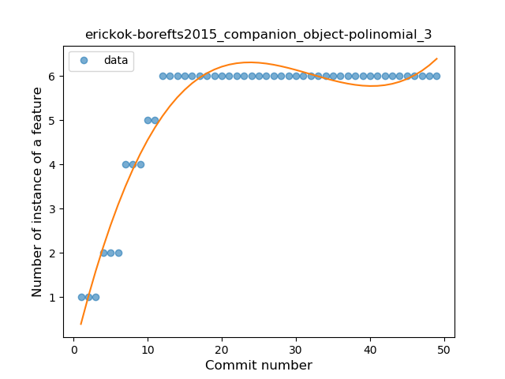
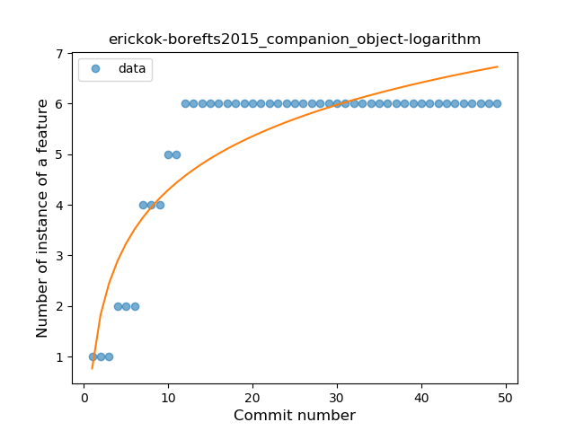
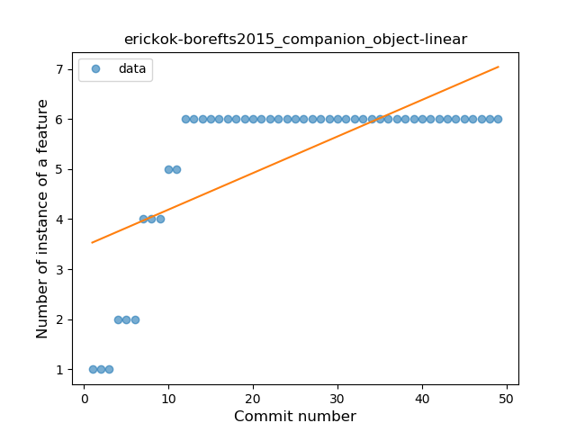
### <a name="unsafe_call">Unsafe Call</a>
----
#### Functions
* **Plateau Gradual Rise - Sigmoid:** 
    * **R_Squared:** 0.97214186
* **Instability - Polinomial 3:** )
    * **R_Squared:** 0.89809486
* **Constant Rise - Linear:** 
    * **R_Squared:** 0.81921374
* **Sudden Rise Plateau - Logarithm:** 
    * **R_Squared:** 0.59451169

**Plots** :chart_with_upwards_trend:
-----

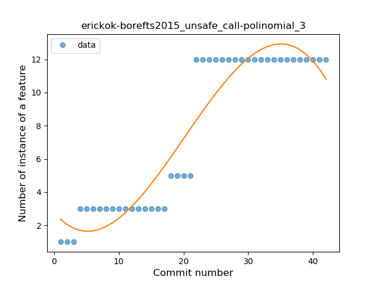
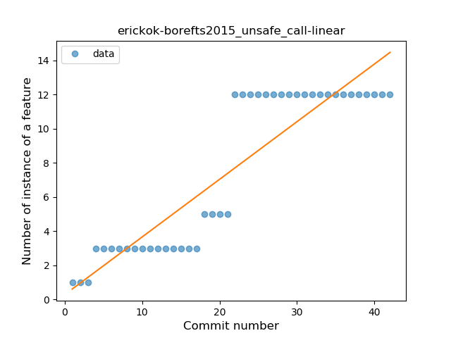
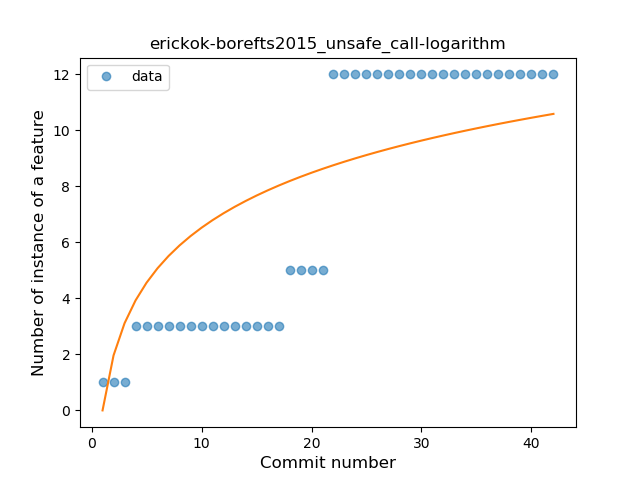
### <a name="string_template">String Template</a>
----
#### Functions
* **Sudden Rise - Exponential:** 
    * **R_Squared:** 0.76150269
* **Constant Rise - Linear:** 
    * **R_Squared:** 0.74403044
* **Sudden Rise Plateau - Logarithm:** 
    * **R_Squared:** 0.68197203

**Plots** :chart_with_upwards_trend:
-----

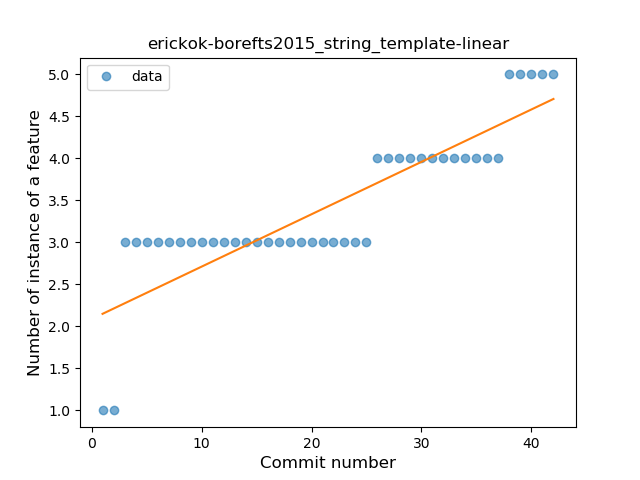
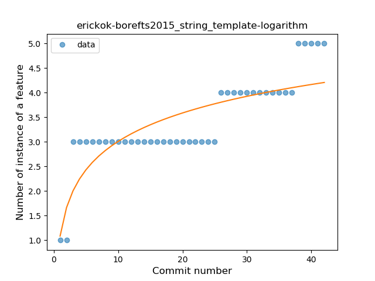
### <a name="func_with_default_value">Function with Default Value</a>
----
#### Functions
* **Sudden Rise Plateau - Logarithm:** 
    * **R_Squared:** 0.73467507
* **Constant Rise - Linear:** 
    * **R_Squared:** 0.64910158

**Plots** :chart_with_upwards_trend:
-----

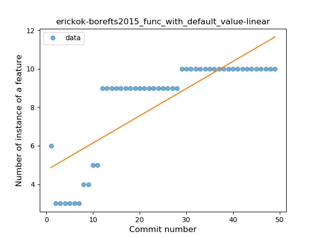
### <a name="singleton">Singleton</a>
----
#### Functions
* **Plateau Gradual Rise - Sigmoid:** 
    * **R_Squared:** 0.96498634
* **Instability - Polinomial 3:** )
    * **R_Squared:** 0.94559012
* **Sudden Rise Plateau - Logarithm:** 
    * **R_Squared:** 0.83534661
* **Constant Rise - Linear:** 
    * **R_Squared:** 0.67041882

**Plots** :chart_with_upwards_trend:
-----

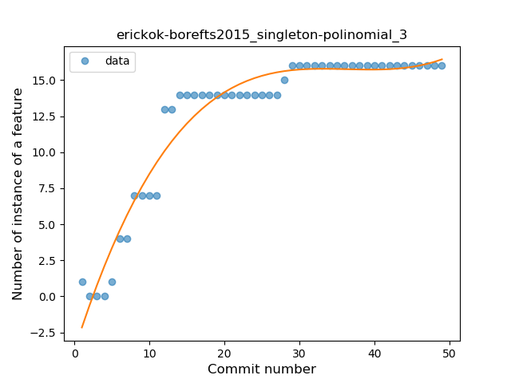
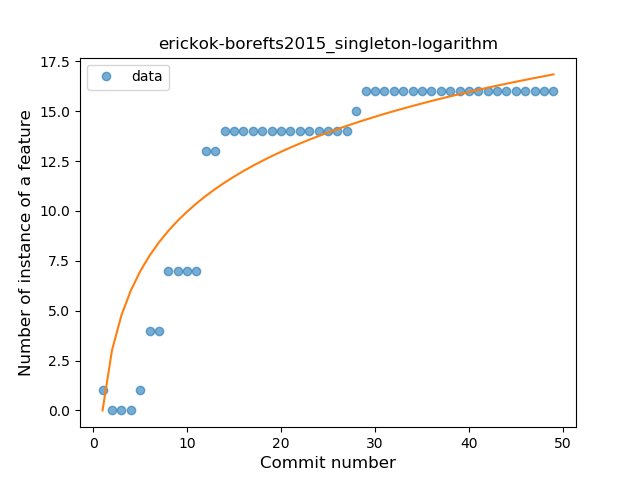
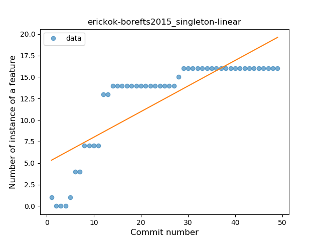
### <a name="smart_cast">Smart Cast</a>
----
#### Functions
* **Instability - Polinomial 3:** )
    * **R_Squared:** 0.80160709
* **Sudden Rise Plateau - Logarithm:** 
    * **R_Squared:** 0.69282617
* **Constant Rise - Linear:** 
    * **R_Squared:** 0.40989578
* **Plateau Sudden Rise - Binary Sigmoid:** 
    * **R_Squared:** 0.17532874

**Plots** :chart_with_upwards_trend:
-----

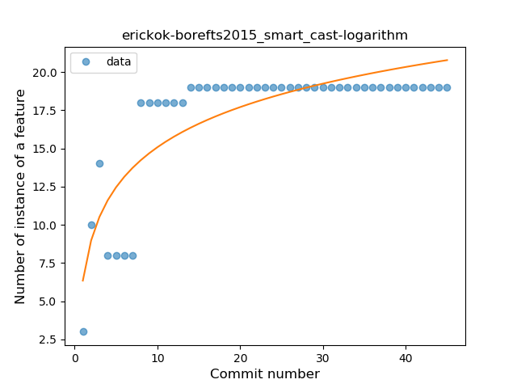
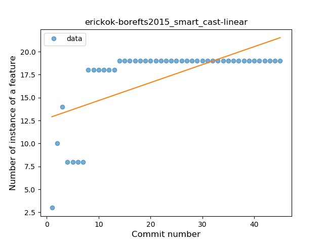

### <a name="func_call_with_named_arg">Function call with Named Argument</a>
----
#### Functions
* **Constant Rise - Linear:** 
    * **R_Squared:** 0.72144003
* **Sudden Rise Plateau - Logarithm:** 
    * **R_Squared:** 0.63957548

**Plots** :chart_with_upwards_trend:
-----

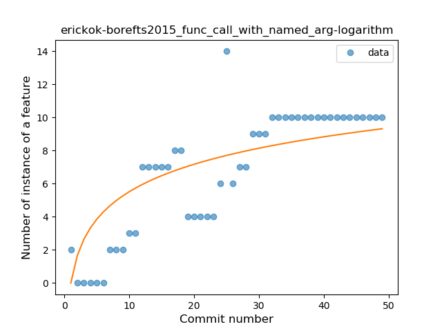
### <a name="data_class">Data Class</a>
----
#### Functions
* **Instability - Polinomial 3:** )
    * **R_Squared:** 0.89135716
* **Sudden Rise Plateau - Logarithm:** 
    * **R_Squared:** 0.77088718
* **Constant Rise - Linear:** 
    * **R_Squared:** 0.45684401
* **Plateau Gradual Decline - Sigmoid:** 
    * **R_Squared:** -0.0

**Plots** :chart_with_upwards_trend:
-----

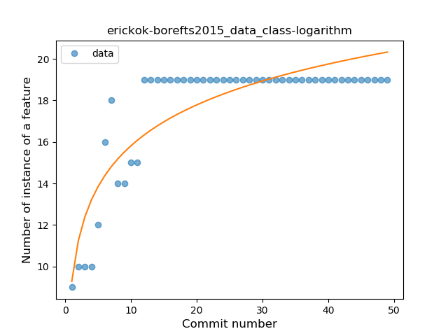
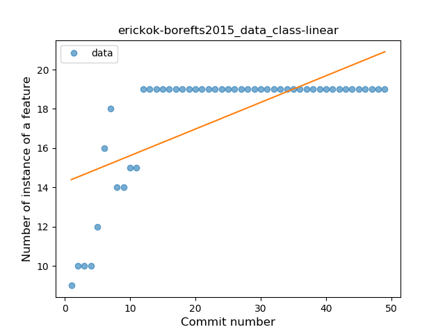
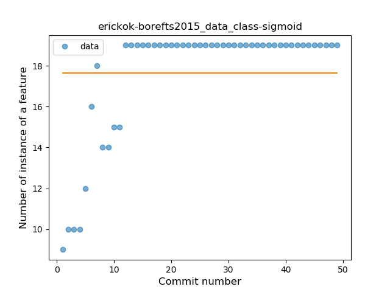
### <a name="extension_function">Extension Function</a>
----
#### Functions
* **Instability - Polinomial 3:** )
    * **R_Squared:** 0.96023355
* **Sudden Rise Plateau - Logarithm:** 
    * **R_Squared:** 0.8215311
* **Constant Rise - Linear:** 
    * **R_Squared:** 0.50495303

**Plots** :chart_with_upwards_trend:
-----

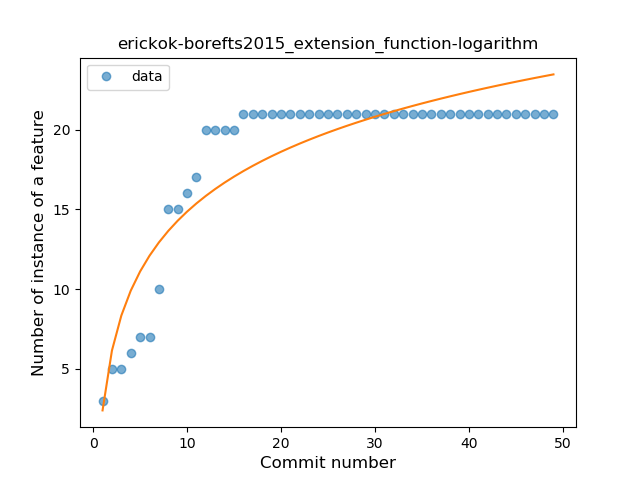
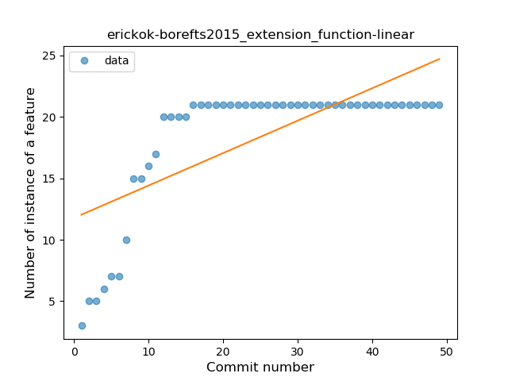
### <a name="property_delegation">Property Delegation</a>
----
#### Functions
* **Constant Rise - Linear:** 
    * **R_Squared:** 0.87092305
* **Sudden Rise Plateau - Logarithm:** 
    * **R_Squared:** 0.74778084
* **Plateau Sudden Rise - Binary Sigmoid:** 
    * **R_Squared:** 0.70418148

**Plots** :chart_with_upwards_trend:
-----

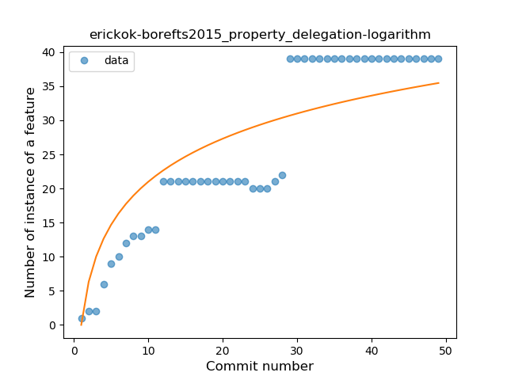
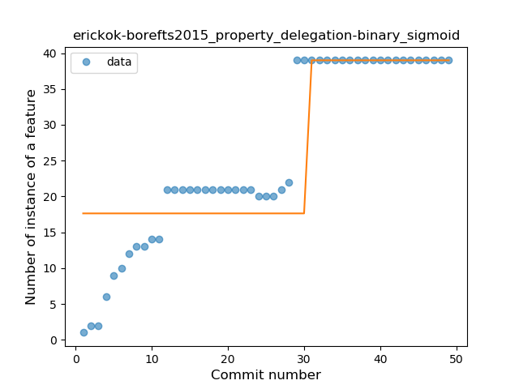
### <a name="destructuring_declaration">Destructuring Declaration</a>
----
#### Functions
* **Instability - Polinomial 3:** )
    * **R_Squared:** 0.06784606
* **Constant Decline - Linear:** 
    * **R_Squared:** 0.03375
* **Sudden Decline - Exponential:** 
    * **R_Squared:** 0.03375095
* **Sudden Rise Plateau - Logarithm:** 
    * **R_Squared:** -0.0

**Plots** :chart_with_upwards_trend:
-----

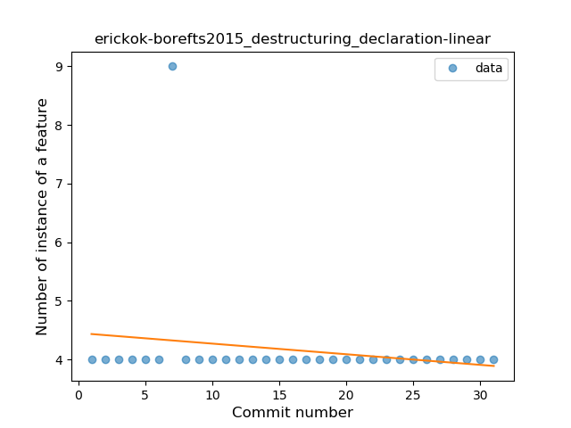
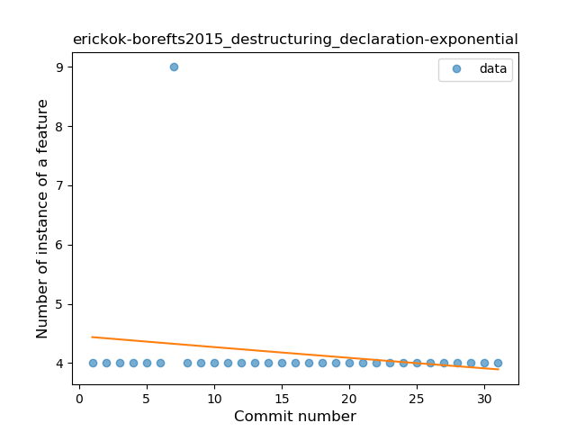
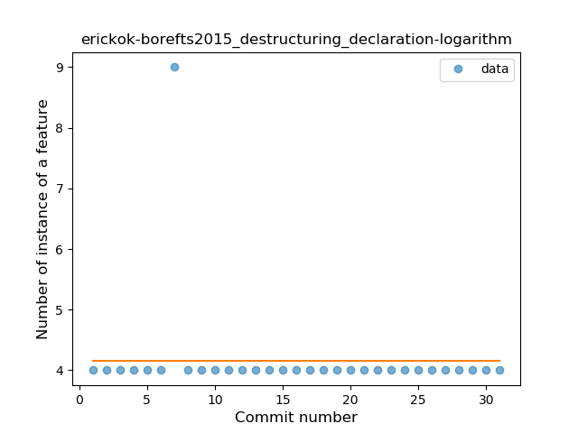
### <a name="inline_func">Inline Function</a>
----
#### Functions
* **Plateau Gradual Rise - Sigmoid:** 
    * **R_Squared:** 0.04218529
* **Constant Decline - Linear:** 
    * **R_Squared:** 7.919e-05
* **Sudden Decline - Exponential:** 
    * **R_Squared:** 7.566e-05
* **Sudden Rise Plateau - Logarithm:** 
    * **R_Squared:** 0.00377035

**Plots** :chart_with_upwards_trend:
-----

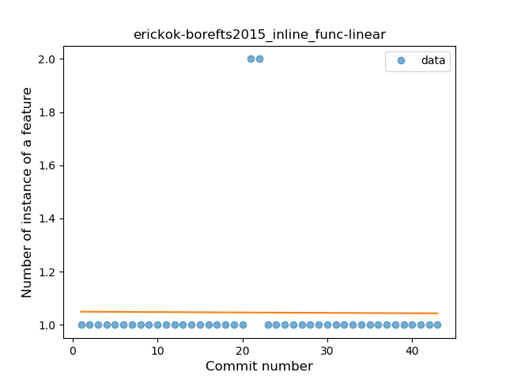
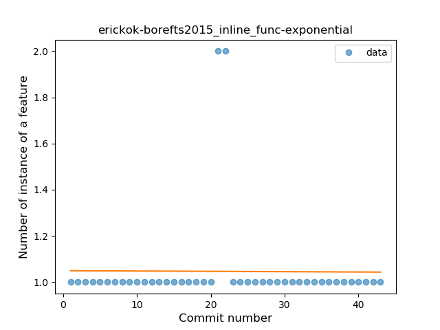
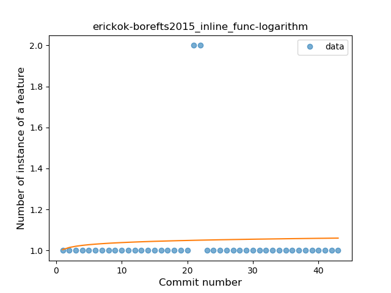
### <a name="overloaded_op">Overloaded Operator</a>
----
#### Functions
* **Plateau Gradual Rise - Sigmoid:** 
    * **R_Squared:** 0.97081997
* **Instability - Polinomial 3:** )
    * **R_Squared:** 0.94102609
* **Sudden Rise Plateau - Logarithm:** 
    * **R_Squared:** 0.78508719
* **Constant Rise - Linear:** 
    * **R_Squared:** 0.44380403

**Plots** :chart_with_upwards_trend:
-----

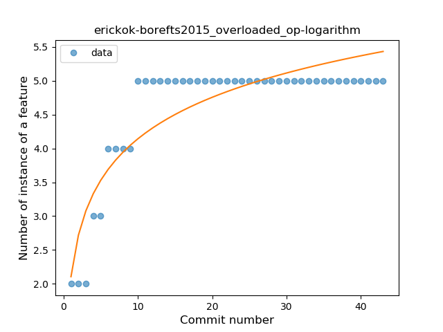

