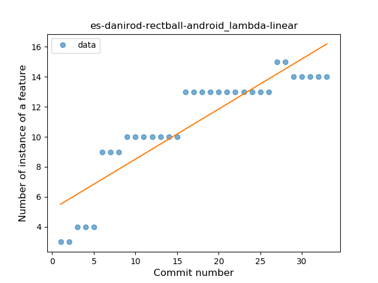

## es-danirod-rectball-android
----
#### Metrics provided by Detekt
* Number of lines of code 1440
* Number of Kotlin files: 16
* Cyclomatic complexity: 164
* Cyclomatic complexity by thousands of lines: 281 

----
**9** features analyzed

*	<a href="#type_inference">Type Inference</a> 
*	<a href="#lambda">Lambda</a> 
*	<a href="#safe_call">Safe Call</a> 
*	<a href="#companion_object">Companion Object</a> 
*	<a href="#string_template">String Template</a> 
*	<a href="#singleton">Singleton</a> 
*	<a href="#property_delegation">Property Delegation</a> 
*	<a href="#destructuring_declaration">Destructuring Declaration</a> 
*	<a href="#inline_func">Inline Function</a> 

### <a name="type_inference">Type Inference</a>
----
#### Functions
* **Sudden Rise - Exponential:** 
    * **R_Squared:** 0.89319276
* **Constant Rise - Linear:** 
    * **R_Squared:** 0.7274549
* **Plateau Sudden Rise - Binary Sigmoid:** 
    * **R_Squared:** 0.53632461
* **Sudden Rise Plateau - Logarithm:** 
    * **R_Squared:** 0.20751815

**Plots** :chart_with_upwards_trend:
-----

### <a name="lambda">Lambda</a>
----
#### Functions
* **Sudden Rise Plateau - Logarithm:** 
    * **R_Squared:** 0.91400752
* **Constant Rise - Linear:** 
    * **R_Squared:** 0.80360923

**Plots** :chart_with_upwards_trend:
-----

### <a name="safe_call">Safe Call</a>
----
#### Functions
* **Plateau Sudden Decline - Binary Sigmoid:** 
    * **R_Squared:** 1.0
* **Instability - Polinomial 3:** )
    * **R_Squared:** 0.81663109
* **Sudden Decline - Exponential:** 
    * **R_Squared:** 0.79216804
* **Constant Decline - Linear:** 
    * **R_Squared:** 0.38602941
* **Sudden Rise Plateau - Logarithm:** 
    * **R_Squared:** 0.0

**Plots** :chart_with_upwards_trend:
-----

### <a name="companion_object">Companion Object</a>
----
#### Functions
* **Plateau Sudden Rise - Binary Sigmoid:** 
    * **R_Squared:** 1.0
* **Instability - Polinomial 3:** )
    * **R_Squared:** 0.84411304
* **Constant Rise - Linear:** 
    * **R_Squared:** 0.73125
* **Sudden Rise Plateau - Logarithm:** 
    * **R_Squared:** 0.63065303

**Plots** :chart_with_upwards_trend:
-----

### <a name="string_template">String Template</a>
----
#### Functions
* **Instability - Polinomial 4:** 
    * **R_Squared:** 0.93901463
* **Instability - Polinomial 3:** )
    * **R_Squared:** 0.91099456
* **Sudden Rise Plateau - Logarithm:** 
    * **R_Squared:** 0.83321475
* **Constant Rise - Linear:** 
    * **R_Squared:** 0.56453225

**Plots** :chart_with_upwards_trend:
-----

### <a name="singleton">Singleton</a>
----
#### Functions
* **Instability - Polinomial 4:** 
    * **R_Squared:** 0.98484848
* **Instability - Polinomial 3:** )
    * **R_Squared:** 0.91666667
* **Sudden Rise Plateau - Logarithm:** 
    * **R_Squared:** 0.61497203
* **Constant Rise - Linear:** 
    * **R_Squared:** 0.375

**Plots** :chart_with_upwards_trend:
-----

### <a name="property_delegation">Property Delegation</a>
----
#### Functions
* **Plateau Sudden Rise - Binary Sigmoid:** 
    * **R_Squared:** 0.86246673
* **Sudden Rise - Exponential:** 
    * **R_Squared:** 0.53378044
* **Constant Rise - Linear:** 
    * **R_Squared:** 0.41184006
* **Sudden Rise Plateau - Logarithm:** 
    * **R_Squared:** 0.22300937

**Plots** :chart_with_upwards_trend:
-----

### <a name="destructuring_declaration">Destructuring Declaration</a>
----
#### Functions
* **Instability - Polinomial 3:** )
    * **R_Squared:** 0.8806434
* **Constant Rise - Linear:** 
    * **R_Squared:** 0.79228651
* **Sudden Rise Plateau - Logarithm:** 
    * **R_Squared:** 0.70682787

**Plots** :chart_with_upwards_trend:
-----

### <a name="inline_func">Inline Function</a>
----
#### Functions
* **Sudden Decline - Exponential:** 
    * **R_Squared:** 0.83319755
* **Instability - Polinomial 4:** 
    * **R_Squared:** 0.79035348
* **Instability - Polinomial 3:** )
    * **R_Squared:** 0.65640835
* **Constant Decline - Linear:** 
    * **R_Squared:** 0.19923372
* **Sudden Rise Plateau - Logarithm:** 
    * **R_Squared:** -0.0

**Plots** :chart_with_upwards_trend:
-----

