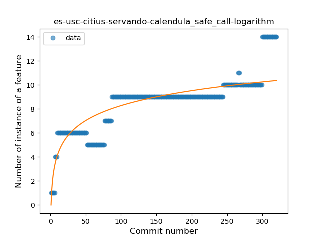
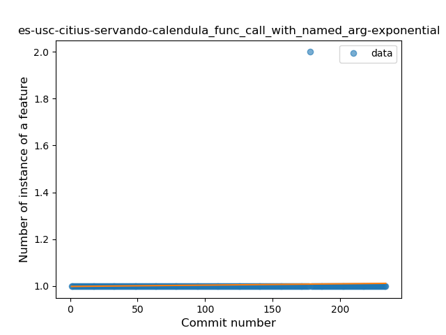

## es-usc-citius-servando-calendula
----
#### Metrics provided by Detekt
* Number of lines of code 3444
* Number of Kotlin files: 43
* Cyclomatic complexity: 312
* Cyclomatic complexity by thousands of lines: 235 

----
**14** features analyzed

*	<a href="#type_inference">Type Inference</a> 
*	<a href="#lambda">Lambda</a> 
*	<a href="#safe_call">Safe Call</a> 
*	<a href="#when_expr">When expression</a> 
*	<a href="#unsafe_call">Unsafe Call</a> 
*	<a href="#companion_object">Companion Object</a> 
*	<a href="#string_template">String Template</a> 
*	<a href="#func_with_default_value">Function with Default Value</a> 
*	<a href="#singleton">Singleton</a> 
*	<a href="#smart_cast">Smart Cast</a> 
*	<a href="#func_call_with_named_arg">Function call with Named Argument</a> 
*	<a href="#property_delegation">Property Delegation</a> 
*	<a href="#destructuring_declaration">Destructuring Declaration</a> 
*	<a href="#overloaded_op">Overloaded Operator</a> 

### <a name="type_inference">Type Inference</a>
----
#### Functions
* **Constant Rise - Linear:** 
    * **R_Squared:** 0.92712348
* **Sudden Rise Plateau - Logarithm:** 
    * **R_Squared:** 0.61734296
* **Plateau Sudden Rise - Binary Sigmoid:** 
    * **R_Squared:** 0.59008467

**Plots** :chart_with_upwards_trend:
-----

### <a name="lambda">Lambda</a>
----
#### Functions
* **Constant Rise - Linear:** 
    * **R_Squared:** 0.70774365
* **Sudden Rise Plateau - Logarithm:** 
    * **R_Squared:** 0.67438209
* **Plateau Sudden Rise - Binary Sigmoid:** 
    * **R_Squared:** 0.14207383

**Plots** :chart_with_upwards_trend:
-----

### <a name="safe_call">Safe Call</a>
----
#### Functions
* **Constant Rise - Linear:** 
    * **R_Squared:** 0.72149471
* **Sudden Rise Plateau - Logarithm:** 
    * **R_Squared:** 0.70127032

**Plots** :chart_with_upwards_trend:
-----

### <a name="when_expr">When expression</a>
----
#### Functions
* **Constant Rise - Linear:** 
    * **R_Squared:** 0.87133876
* **Sudden Rise - Exponential:** 
    * **R_Squared:** 0.87310171
* **Sudden Rise Plateau - Logarithm:** 
    * **R_Squared:** 0.71736553

**Plots** :chart_with_upwards_trend:
-----

### <a name="unsafe_call">Unsafe Call</a>
----
#### Functions
* **Sudden Rise - Exponential:** 
    * **R_Squared:** 0.88755984
* **Constant Rise - Linear:** 
    * **R_Squared:** 0.80062112
* **Sudden Rise Plateau - Logarithm:** 
    * **R_Squared:** 0.4157999

**Plots** :chart_with_upwards_trend:
-----

### <a name="companion_object">Companion Object</a>
----
#### Functions
* **Constant Rise - Linear:** 
    * **R_Squared:** 0.78726354
* **Sudden Rise Plateau - Logarithm:** 
    * **R_Squared:** 0.77435573

**Plots** :chart_with_upwards_trend:
-----

### <a name="string_template">String Template</a>
----
#### Functions
* **Sudden Rise Plateau - Logarithm:** 
    * **R_Squared:** 0.68591946
* **Constant Rise - Linear:** 
    * **R_Squared:** 0.6235394
* **Plateau Sudden Rise - Binary Sigmoid:** 
    * **R_Squared:** 0.10345495

**Plots** :chart_with_upwards_trend:
-----

### <a name="func_with_default_value">Function with Default Value</a>
----
#### Functions
* **Constant Decline - Linear:** 
    * **R_Squared:** 0.05172414
* **Sudden Rise Plateau - Logarithm:** 
    * **R_Squared:** 0.0

**Plots** :chart_with_upwards_trend:
-----

### <a name="singleton">Singleton</a>
----
#### Functions
* **Plateau Gradual Rise - Sigmoid:** 
    * **R_Squared:** 0.92185699
* **Constant Rise - Linear:** 
    * **R_Squared:** 0.85898201
* **Sudden Rise Plateau - Logarithm:** 
    * **R_Squared:** 0.42655783

**Plots** :chart_with_upwards_trend:
-----

### <a name="smart_cast">Smart Cast</a>
----
#### Functions
* **Constant Rise - Linear:** 
    * **R_Squared:** 0.00566048
* **Sudden Rise - Exponential:** 
    * **R_Squared:** 0.00565513
* **Sudden Rise Plateau - Logarithm:** 
    * **R_Squared:** 0.00384333

**Plots** :chart_with_upwards_trend:
-----

### <a name="func_call_with_named_arg">Function call with Named Argument</a>
----
#### Functions
* **Constant Rise - Linear:** 
    * **R_Squared:** 0.0034428
* **Sudden Rise - Exponential:** 
    * **R_Squared:** 0.0034399
* **Sudden Rise Plateau - Logarithm:** 
    * **R_Squared:** 0.00236798

**Plots** :chart_with_upwards_trend:
-----

### <a name="property_delegation">Property Delegation</a>
----
#### Functions
* **Constant Rise - Linear:** 
    * **R_Squared:** 0.80184547
* **Sudden Rise Plateau - Logarithm:** 
    * **R_Squared:** 0.80323764

**Plots** :chart_with_upwards_trend:
-----

### <a name="destructuring_declaration">Destructuring Declaration</a>
----
#### Functions
* **Constant Rise - Linear:** 
    * **R_Squared:** 0.00393296
* **Sudden Rise - Exponential:** 
    * **R_Squared:** 0.00393598
* **Sudden Rise Plateau - Logarithm:** 
    * **R_Squared:** 0.00213583

**Plots** :chart_with_upwards_trend:
-----

### <a name="overloaded_op">Overloaded Operator</a>
----
#### Functions
* **Plateau Sudden Decline - Binary Sigmoid:** 
    * **R_Squared:** 1.0
* **Sudden Decline - Exponential:** 
    * **R_Squared:** 0.79556751
* **Constant Decline - Linear:** 
    * **R_Squared:** 0.28828829
* **Sudden Rise Plateau - Logarithm:** 
    * **R_Squared:** -0.0

**Plots** :chart_with_upwards_trend:
-----

