## esafirm-android-playground
----
#### Metrics provided by Detekt
* Number of lines of code 2672
* Number of Kotlin files: 63
* Cyclomatic complexity: 355
* Cyclomatic complexity by thousands of lines: 287 

----
**13** features analyzed

*	<a href="#type_inference">Type Inference</a> 
*	<a href="#lambda">Lambda</a> 
*	<a href="#safe_call">Safe Call</a> 
*	<a href="#when_expr">When expression</a> 
*	<a href="#companion_object">Companion Object</a> 
*	<a href="#unsafe_call">Unsafe Call</a> 
*	<a href="#string_template">String Template</a> 
*	<a href="#func_with_default_value">Function with Default Value</a> 
*	<a href="#range_expr">Range Expression</a> 
*	<a href="#func_call_with_named_arg">Function call with Named Argument</a> 
*	<a href="#data_class">Data Class</a> 
*	<a href="#extension_function">Extension Function</a> 
*	<a href="#property_delegation">Property Delegation</a> 

### <a name="type_inference">Type Inference</a>
----
#### Functions
* **Sudden Rise - Exponential:** 
    * **R_Squared:** 0.98883006
* **Constant Rise - Linear:** 
    * **R_Squared:** 0.96843256
* **Sudden Rise Plateau - Logarithm:** 
    * **R_Squared:** 0.55003258

**Plots** :chart_with_upwards_trend:
-----

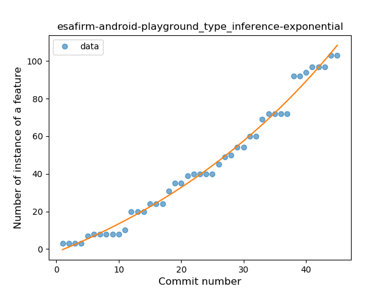
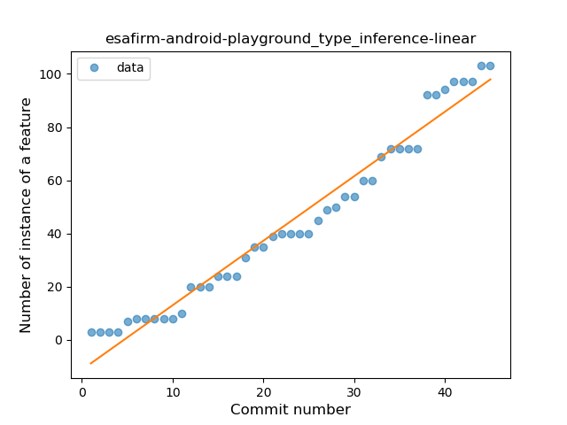
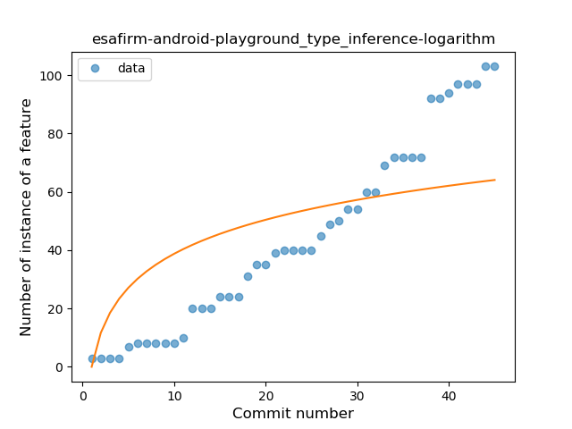
### <a name="lambda">Lambda</a>
----
#### Functions
* **Sudden Rise - Exponential:** 
    * **R_Squared:** 0.98869464
* **Constant Rise - Linear:** 
    * **R_Squared:** 0.9644405
* **Sudden Rise Plateau - Logarithm:** 
    * **R_Squared:** 0.54233891

**Plots** :chart_with_upwards_trend:
-----

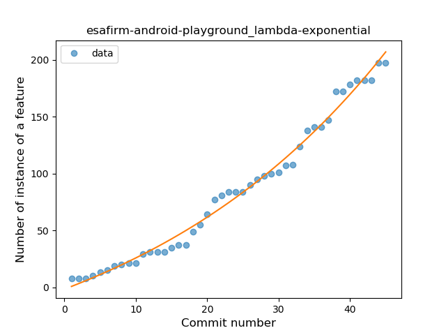
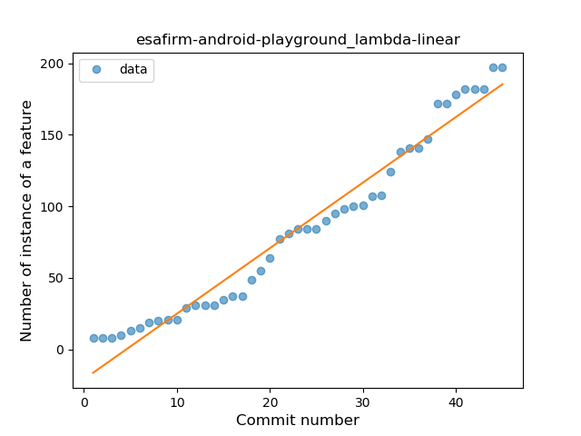
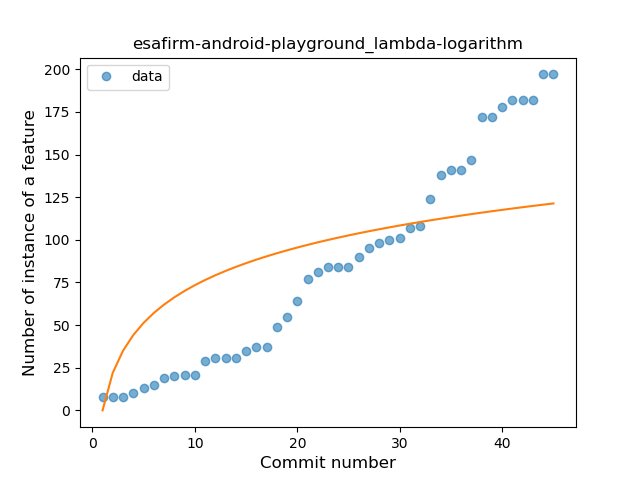
### <a name="safe_call">Safe Call</a>
----
#### Functions
* **Plateau Gradual Rise - Sigmoid:** 
    * **R_Squared:** 0.96784811
* **Instability - Polinomial 3:** )
    * **R_Squared:** 0.95921613
* **Instability - Polinomial 4:** 
    * **R_Squared:** 0.96164044
* **Constant Rise - Linear:** 
    * **R_Squared:** 0.87828561
* **Sudden Rise - Exponential:** 
    * **R_Squared:** 0.87852818
* **Sudden Rise Plateau - Logarithm:** 
    * **R_Squared:** 0.55696422

**Plots** :chart_with_upwards_trend:
-----

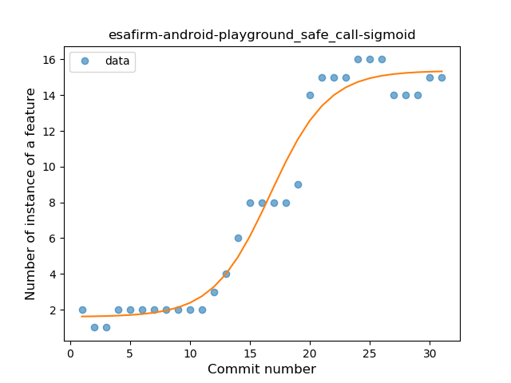
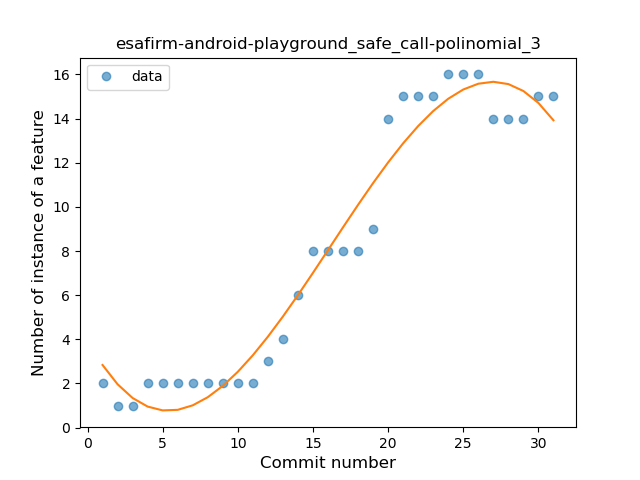
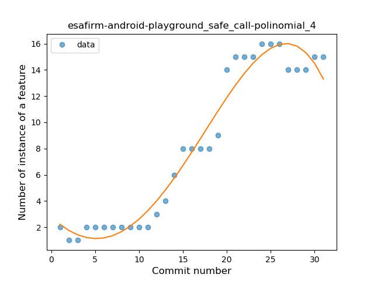

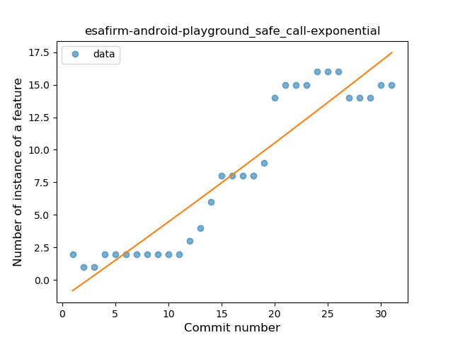
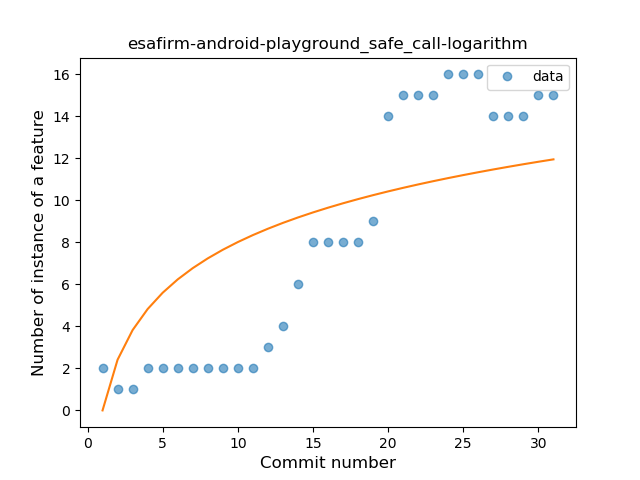
### <a name="when_expr">When expression</a>
----
#### Functions
* **Constant Rise - Linear:** 
    * **R_Squared:** 0.90623797
* **Sudden Rise Plateau - Logarithm:** 
    * **R_Squared:** 0.73610725

**Plots** :chart_with_upwards_trend:
-----

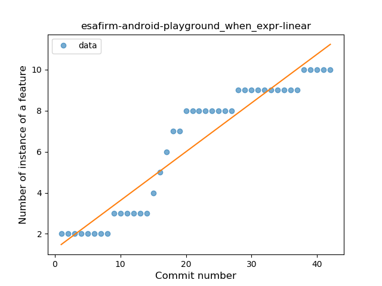
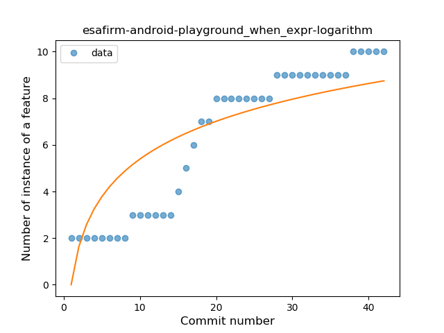
### <a name="companion_object">Companion Object</a>
----
#### Functions
* **Constant Rise - Linear:** 
    * **R_Squared:** 0.84744246
* **Sudden Rise Plateau - Logarithm:** 
    * **R_Squared:** 0.83502209

**Plots** :chart_with_upwards_trend:
-----

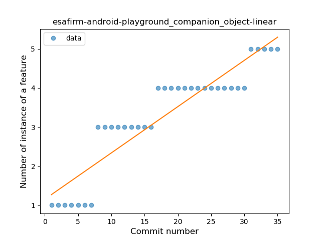
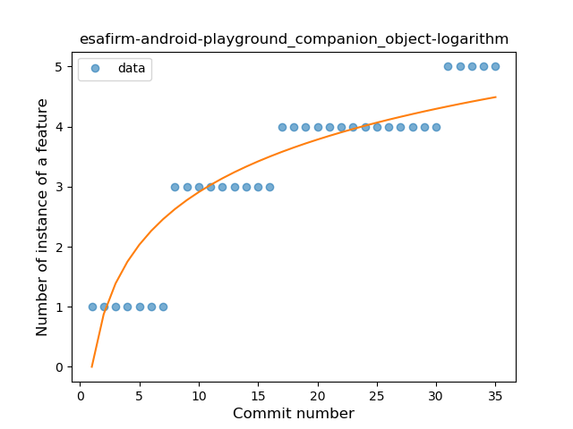
### <a name="unsafe_call">Unsafe Call</a>
----
#### Functions
* **Constant Rise - Linear:** 
    * **R_Squared:** 0.9559217
* **Sudden Rise - Exponential:** 
    * **R_Squared:** 0.95631145
* **Plateau Gradual Rise - Sigmoid:** 
    * **R_Squared:** 0.95768932
* **Sudden Rise Plateau - Logarithm:** 
    * **R_Squared:** 0.7378399

**Plots** :chart_with_upwards_trend:
-----

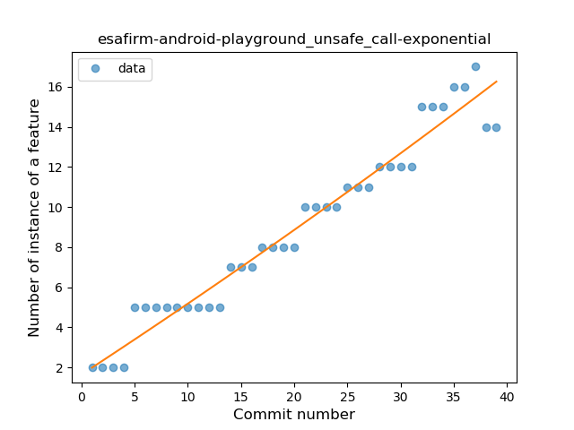
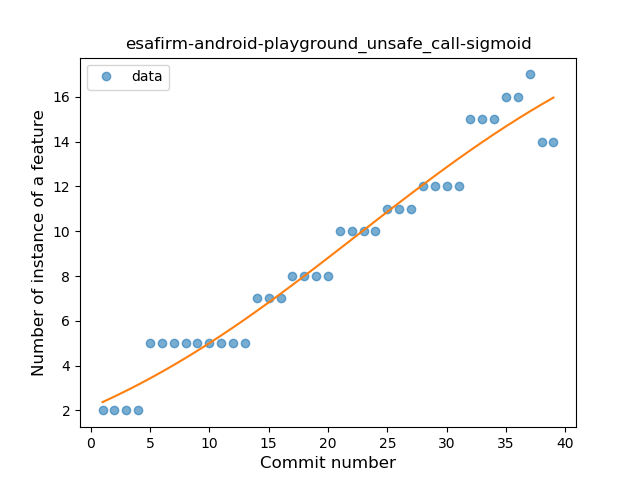
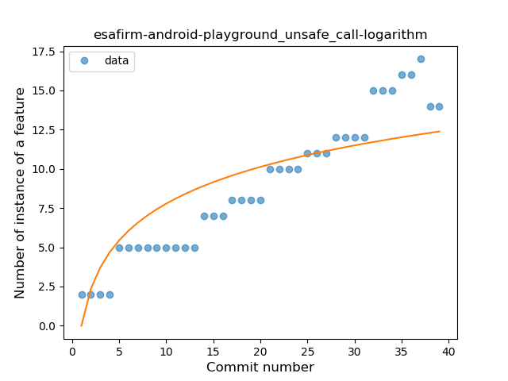
### <a name="string_template">String Template</a>
----
#### Functions
* **Instability - Polinomial 4:** 
    * **R_Squared:** 0.95842938
* **Constant Rise - Linear:** 
    * **R_Squared:** 0.83457872
* **Sudden Rise Plateau - Logarithm:** 
    * **R_Squared:** 0.79197633
* **Plateau Sudden Rise - Binary Sigmoid:** 
    * **R_Squared:** 0.379225

**Plots** :chart_with_upwards_trend:
-----

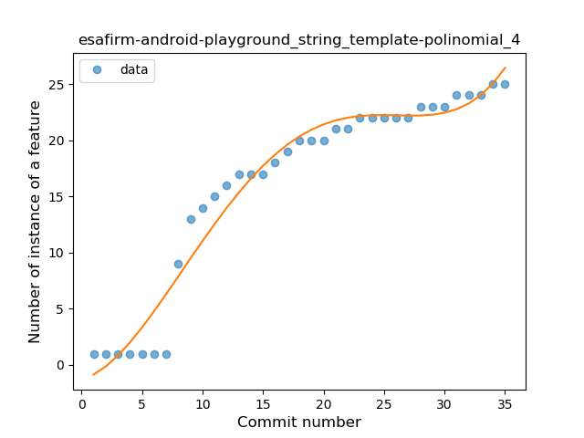
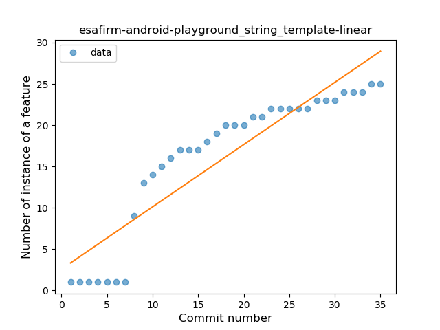
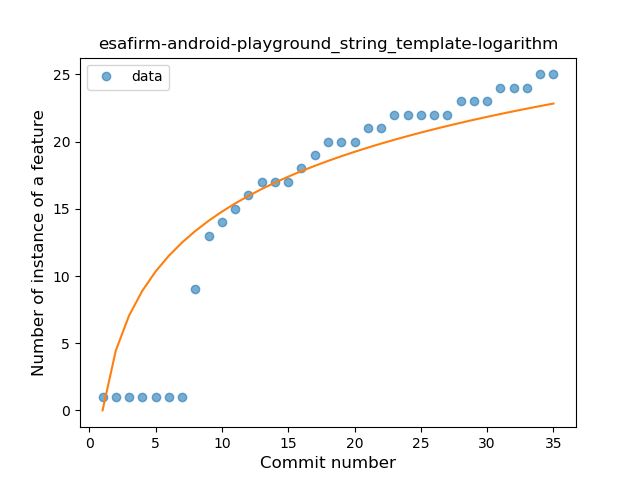
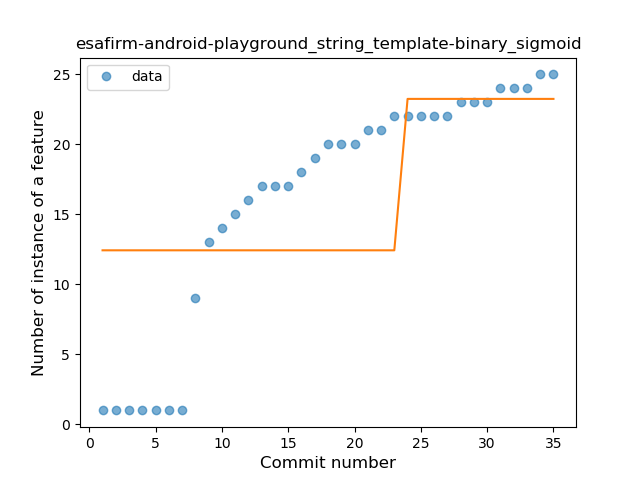
### <a name="func_with_default_value">Function with Default Value</a>
----
#### Functions
* **Plateau Gradual Rise - Sigmoid:** 
    * **R_Squared:** 0.96420954
* **Constant Rise - Linear:** 
    * **R_Squared:** 0.90116494
* **Sudden Rise Plateau - Logarithm:** 
    * **R_Squared:** 0.77505512

**Plots** :chart_with_upwards_trend:
-----

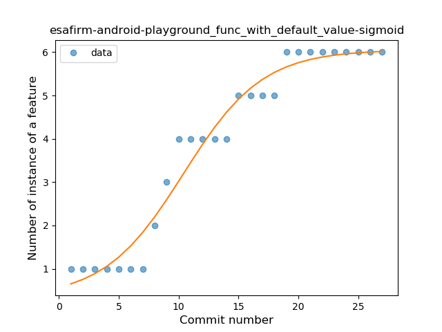
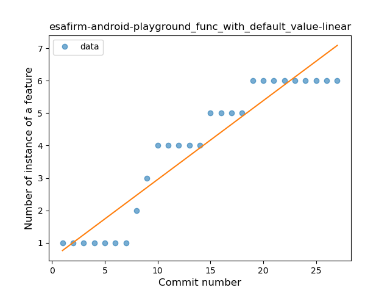
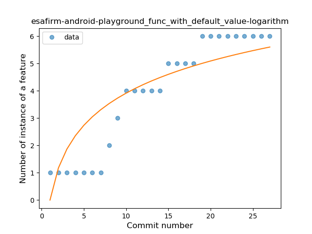
### <a name="range_expr">Range Expression</a>
----
#### Functions
* **Plateau Sudden Rise - Binary Sigmoid:** 
    * **R_Squared:** 1.0
* **Instability - Polinomial 4:** 
    * **R_Squared:** 0.87813028
* **Instability - Polinomial 3:** )
    * **R_Squared:** 0.83717611
* **Constant Rise - Linear:** 
    * **R_Squared:** 0.72115385
* **Sudden Rise Plateau - Logarithm:** 
    * **R_Squared:** 0.65414564

**Plots** :chart_with_upwards_trend:
-----

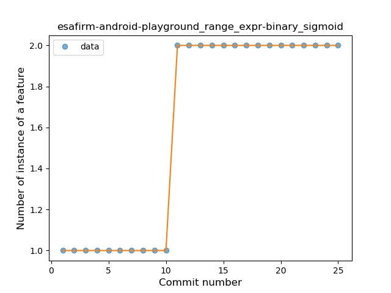
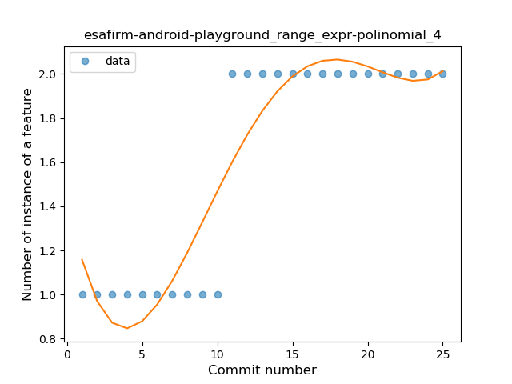
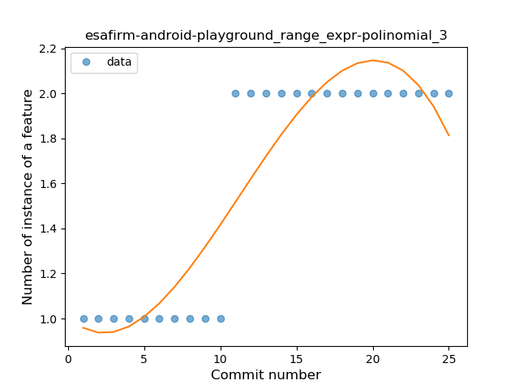
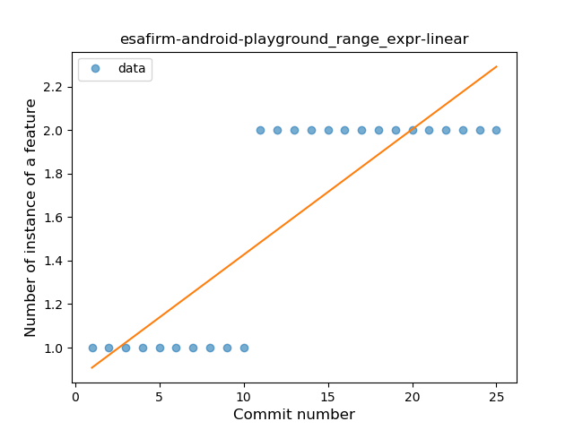
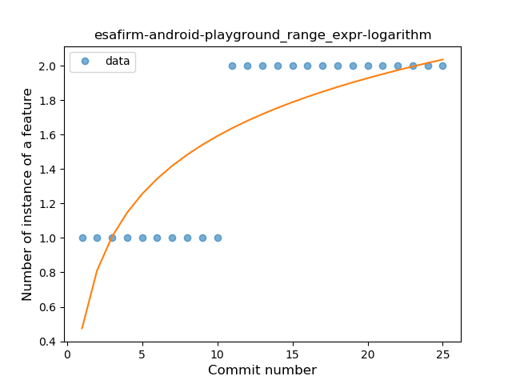
### <a name="func_call_with_named_arg">Function call with Named Argument</a>
----
#### Functions
* **Plateau Gradual Rise - Sigmoid:** 
    * **R_Squared:** 0.96408621
* **Instability - Polinomial 4:** 
    * **R_Squared:** 0.89509303
* **Sudden Rise - Exponential:** 
    * **R_Squared:** 0.83355549
* **Constant Rise - Linear:** 
    * **R_Squared:** 0.80264639
* **Sudden Rise Plateau - Logarithm:** 
    * **R_Squared:** 0.60130533

**Plots** :chart_with_upwards_trend:
-----

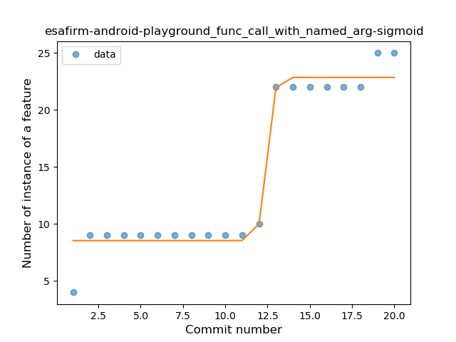
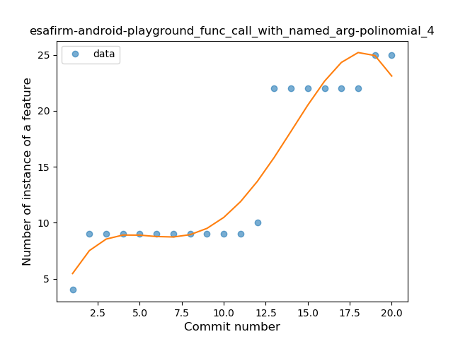
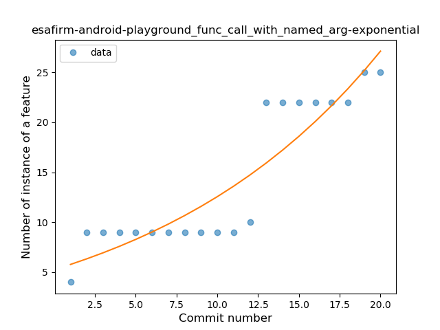
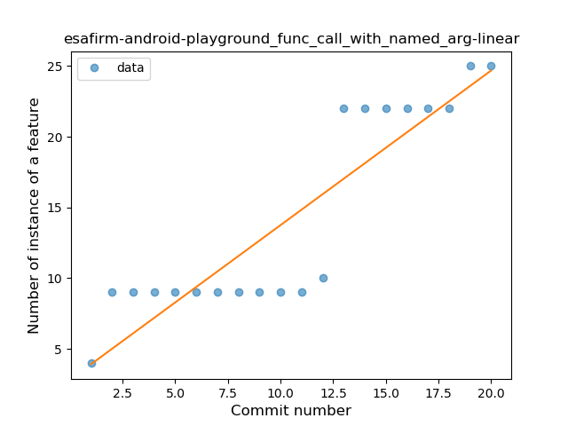
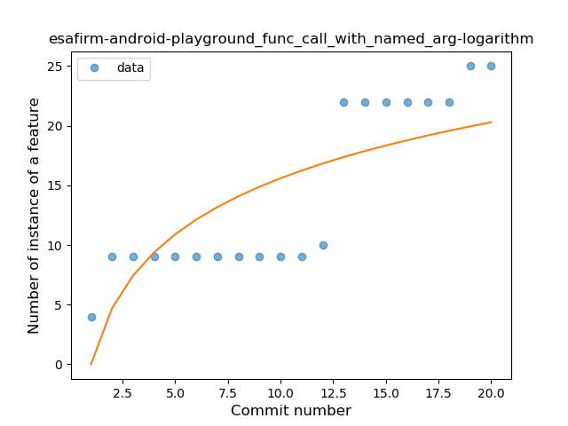
### <a name="data_class">Data Class</a>
----
#### Functions
* **Plateau Gradual Rise - Sigmoid:** 
    * **R_Squared:** 0.99794815
* **Instability - Polinomial 4:** 
    * **R_Squared:** 0.93150894
* **Sudden Rise Plateau - Logarithm:** 
    * **R_Squared:** 0.73298868
* **Constant Rise - Linear:** 
    * **R_Squared:** 0.70109573

**Plots** :chart_with_upwards_trend:
-----

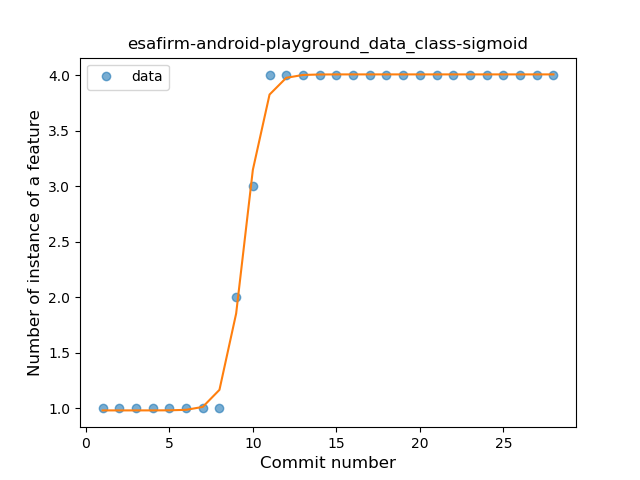
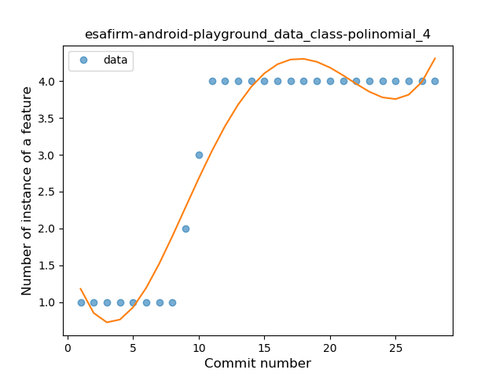
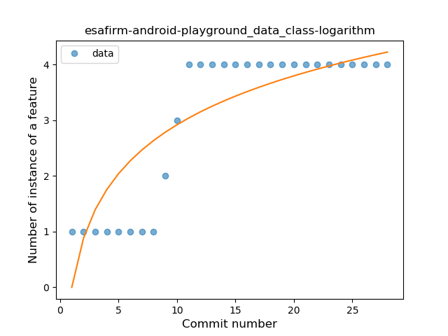
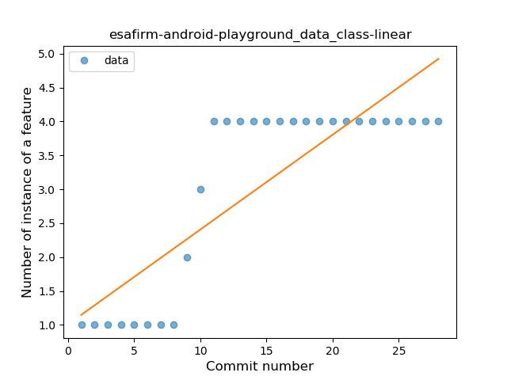
### <a name="extension_function">Extension Function</a>
----
#### Functions
* **Sudden Rise - Exponential:** 
    * **R_Squared:** 0.96242967
* **Instability - Polinomial 3:** )
    * **R_Squared:** 0.96155418
* **Constant Rise - Linear:** 
    * **R_Squared:** 0.6398838
* **Sudden Rise Plateau - Logarithm:** 
    * **R_Squared:** 0.31556103

**Plots** :chart_with_upwards_trend:
-----

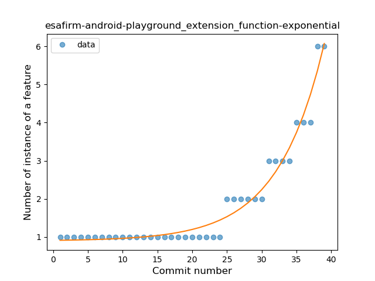
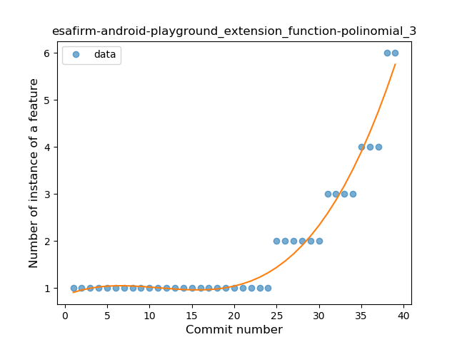
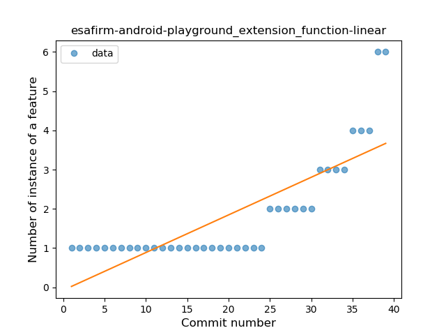
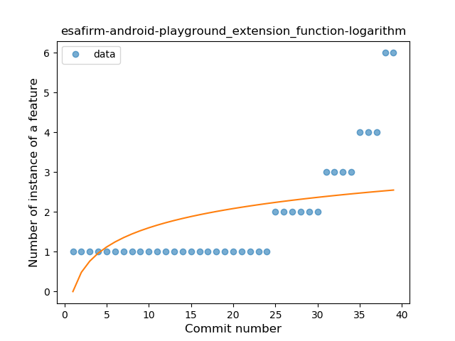
### <a name="property_delegation">Property Delegation</a>
----
#### Functions
* **Plateau Gradual Rise - Sigmoid:** 
    * **R_Squared:** 0.94386278
* **Sudden Rise - Exponential:** 
    * **R_Squared:** 0.92378702
* **Constant Rise - Linear:** 
    * **R_Squared:** 0.90702517
* **Sudden Rise Plateau - Logarithm:** 
    * **R_Squared:** 0.51132532

**Plots** :chart_with_upwards_trend:
-----

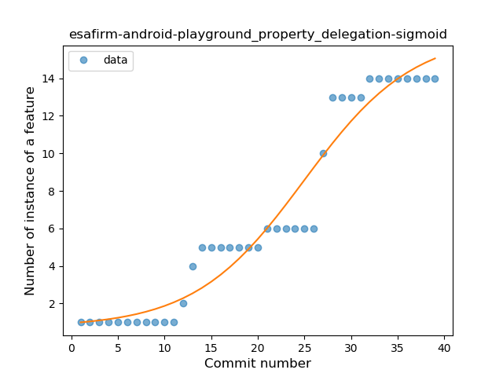
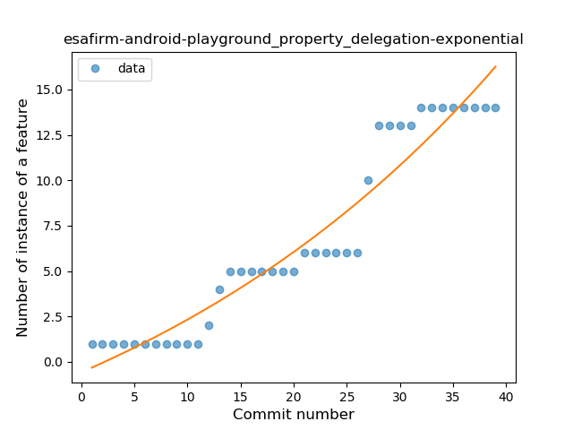
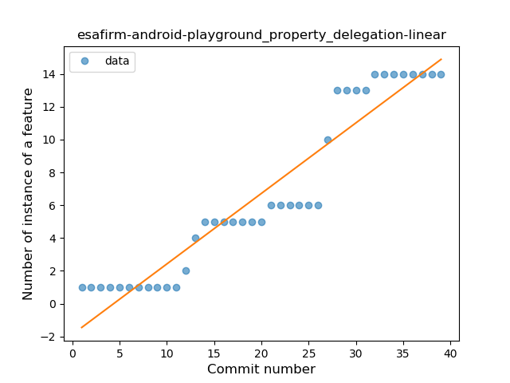
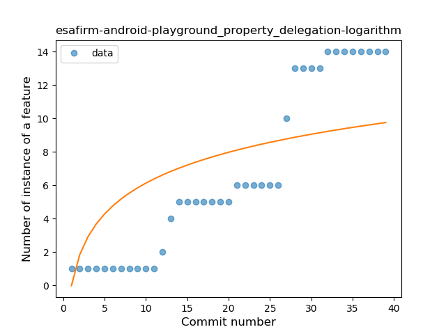
