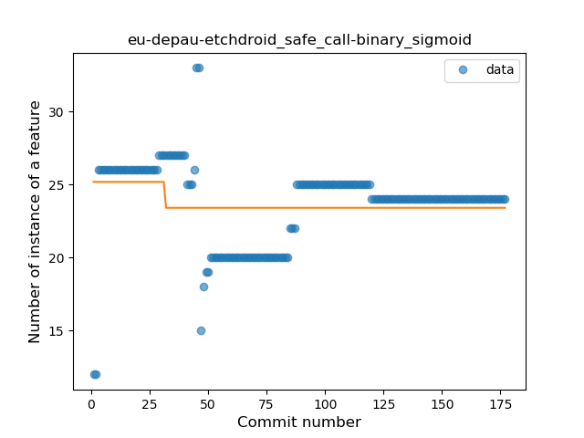
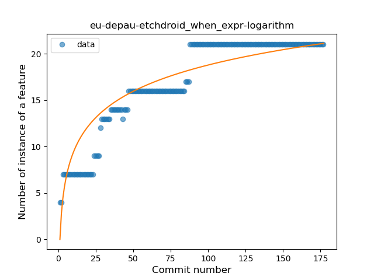
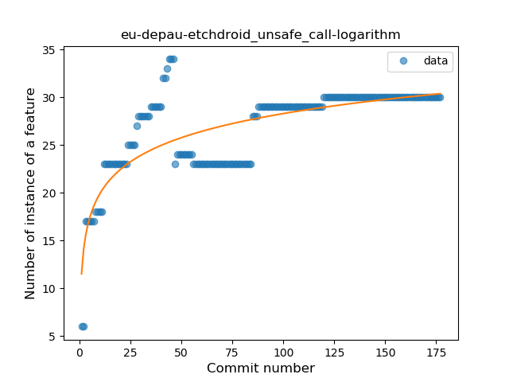
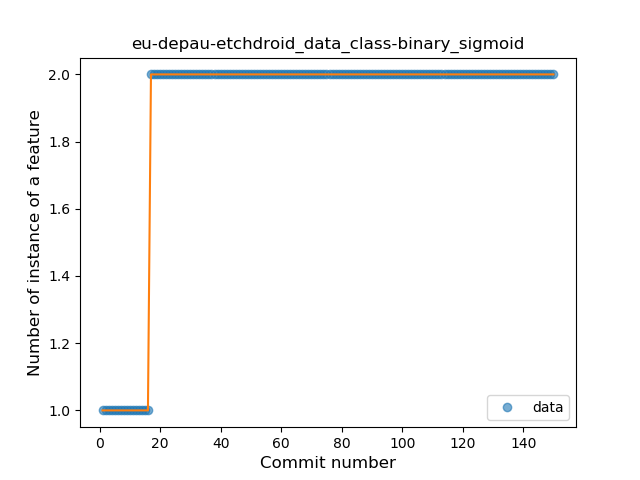
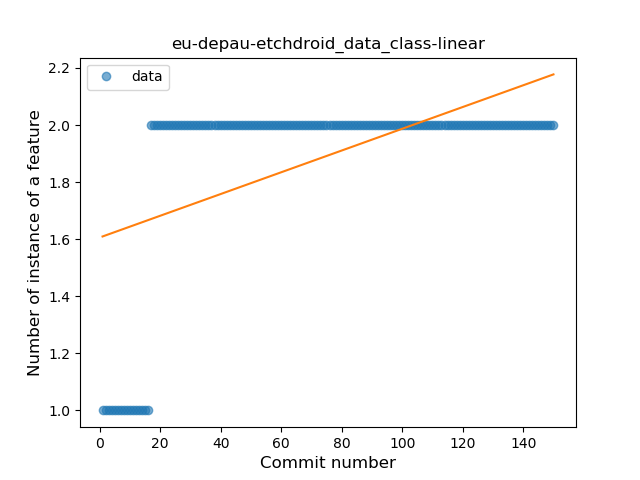

## eu-depau-etchdroid
----
#### Metrics provided by Detekt
* Number of lines of code 2330
* Number of Kotlin files: 45
* Cyclomatic complexity: 376
* Cyclomatic complexity by thousands of lines: 305 

----
**13** features analyzed

*	<a href="#type_inference">Type Inference</a> 
*	<a href="#lambda">Lambda</a> 
*	<a href="#safe_call">Safe Call</a> 
*	<a href="#when_expr">When expression</a> 
*	<a href="#unsafe_call">Unsafe Call</a> 
*	<a href="#string_template">String Template</a> 
*	<a href="#func_with_default_value">Function with Default Value</a> 
*	<a href="#range_expr">Range Expression</a> 
*	<a href="#smart_cast">Smart Cast</a> 
*	<a href="#data_class">Data Class</a> 
*	<a href="#func_call_with_named_arg">Function call with Named Argument</a> 
*	<a href="#extension_function">Extension Function</a> 
*	<a href="#destructuring_declaration">Destructuring Declaration</a> 

### <a name="type_inference">Type Inference</a>
----
#### Functions
* **Sudden Rise Plateau - Logarithm:** 
    * **R_Squared:** 0.92176587
* **Constant Rise - Linear:** 
    * **R_Squared:** 0.73177026

**Plots** :chart_with_upwards_trend:
-----

### <a name="lambda">Lambda</a>
----
#### Functions
* **Constant Rise - Linear:** 
    * **R_Squared:** 0.83940078
* **Sudden Rise Plateau - Logarithm:** 
    * **R_Squared:** 0.80909772

**Plots** :chart_with_upwards_trend:
-----

### <a name="safe_call">Safe Call</a>
----
#### Functions
* **Plateau Sudden Decline - Binary Sigmoid:** 
    * **R_Squared:** 0.05714501
* **Sudden Decline - Exponential:** 
    * **R_Squared:** 0.0152247
* **Constant Decline - Linear:** 
    * **R_Squared:** 0.00011431
* **Sudden Rise Plateau - Logarithm:** 
    * **R_Squared:** -0.0

**Plots** :chart_with_upwards_trend:
-----

### <a name="when_expr">When expression</a>
----
#### Functions
* **Sudden Rise Plateau - Logarithm:** 
    * **R_Squared:** 0.85307016
* **Constant Rise - Linear:** 
    * **R_Squared:** 0.79736894

**Plots** :chart_with_upwards_trend:
-----

### <a name="unsafe_call">Unsafe Call</a>
----
#### Functions
* **Sudden Rise Plateau - Logarithm:** 
    * **R_Squared:** 0.62496912
* **Constant Rise - Linear:** 
    * **R_Squared:** 0.4529531
* **Plateau Sudden Rise - Binary Sigmoid:** 
    * **R_Squared:** 0.33031566

**Plots** :chart_with_upwards_trend:
-----

### <a name="string_template">String Template</a>
----
#### Functions
* **Sudden Rise Plateau - Logarithm:** 
    * **R_Squared:** 0.70088327
* **Plateau Sudden Rise - Binary Sigmoid:** 
    * **R_Squared:** 0.70065571
* **Constant Rise - Linear:** 
    * **R_Squared:** 0.29750912

**Plots** :chart_with_upwards_trend:
-----

### <a name="func_with_default_value">Function with Default Value</a>
----
#### Functions
* **Plateau Gradual Rise - Sigmoid:** 
    * **R_Squared:** 0.92576061
* **Sudden Rise Plateau - Logarithm:** 
    * **R_Squared:** 0.81014232
* **Constant Rise - Linear:** 
    * **R_Squared:** 0.57831032

**Plots** :chart_with_upwards_trend:
-----

### <a name="range_expr">Range Expression</a>
----
#### Functions
* **Plateau Sudden Rise - Binary Sigmoid:** 
    * **R_Squared:** 0.93419037
* **Sudden Rise Plateau - Logarithm:** 
    * **R_Squared:** 0.71545395
* **Constant Rise - Linear:** 
    * **R_Squared:** 0.38343262

**Plots** :chart_with_upwards_trend:
-----

### <a name="smart_cast">Smart Cast</a>
----
#### Functions
* **Plateau Gradual Decline - Sigmoid:** 
    * **R_Squared:** 0.73859647
* **Sudden Decline - Exponential:** 
    * **R_Squared:** 0.42069141
* **Constant Decline - Linear:** 
    * **R_Squared:** 0.36209852
* **Sudden Rise Plateau - Logarithm:** 
    * **R_Squared:** -0.0

**Plots** :chart_with_upwards_trend:
-----

### <a name="data_class">Data Class</a>
----
#### Functions
* **Plateau Sudden Rise - Binary Sigmoid:** 
    * **R_Squared:** 1.0
* **Sudden Rise Plateau - Logarithm:** 
    * **R_Squared:** 0.60321489
* **Constant Rise - Linear:** 
    * **R_Squared:** 0.28587937

**Plots** :chart_with_upwards_trend:
-----

### <a name="func_call_with_named_arg">Function call with Named Argument</a>
----
#### Functions
* **Plateau Sudden Rise - Binary Sigmoid:** 
    * **R_Squared:** 1.0
* **Constant Rise - Linear:** 
    * **R_Squared:** 0.6328125
* **Sudden Rise Plateau - Logarithm:** 
    * **R_Squared:** 0.58791655

**Plots** :chart_with_upwards_trend:
-----

### <a name="extension_function">Extension Function</a>
----
#### Functions
* **Sudden Rise Plateau - Logarithm:** 
    * **R_Squared:** 0.87612881
* **Constant Rise - Linear:** 
    * **R_Squared:** 0.68536544

**Plots** :chart_with_upwards_trend:
-----

### <a name="destructuring_declaration">Destructuring Declaration</a>
----
#### Functions
* **Plateau Sudden Rise - Binary Sigmoid:** 
    * **R_Squared:** 1.0
* **Sudden Rise Plateau - Logarithm:** 
    * **R_Squared:** 0.43765318
* **Constant Rise - Linear:** 
    * **R_Squared:** 0.1334726

**Plots** :chart_with_upwards_trend:
-----

