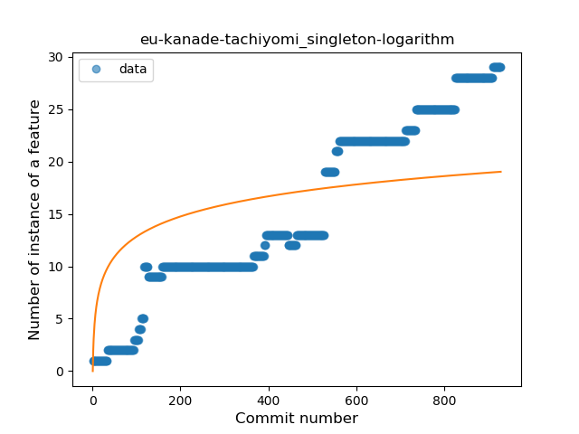
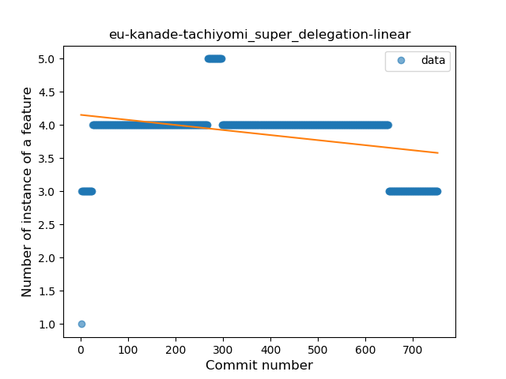

## eu-kanade-tachiyomi
----
#### Metrics provided by Detekt
* Number of lines of code 40204
* Number of Kotlin files: 428
* Cyclomatic complexity: 5028
* Cyclomatic complexity by thousands of lines: 276 

----
**21** features analyzed

*	<a href="#type_inference">Type Inference</a> 
*	<a href="#lambda">Lambda</a> 
*	<a href="#safe_call">Safe Call</a> 
*	<a href="#when_expr">When expression</a> 
*	<a href="#unsafe_call">Unsafe Call</a> 
*	<a href="#companion_object">Companion Object</a> 
*	<a href="#string_template">String Template</a> 
*	<a href="#func_with_default_value">Function with Default Value</a> 
*	<a href="#singleton">Singleton</a> 
*	<a href="#range_expr">Range Expression</a> 
*	<a href="#smart_cast">Smart Cast</a> 
*	<a href="#data_class">Data Class</a> 
*	<a href="#func_call_with_named_arg">Function call with Named Argument</a> 
*	<a href="#extension_function">Extension Function</a> 
*	<a href="#property_delegation">Property Delegation</a> 
*	<a href="#destructuring_declaration">Destructuring Declaration</a> 
*	<a href="#inline_func">Inline Function</a> 
*	<a href="#coroutine">Coroutine</a> 
*	<a href="#sealed_class">Sealed Class</a> 
*	<a href="#type_alias">Type Alias</a> 
*	<a href="#super_delegation">Super Delegation</a> 

### <a name="type_inference">Type Inference</a>
----
#### Functions
* **Constant Rise - Linear:** 
    * **R_Squared:** 0.97641145
* **Sudden Rise Plateau - Logarithm:** 
    * **R_Squared:** 0.53266425

**Plots** :chart_with_upwards_trend:
-----

### <a name="lambda">Lambda</a>
----
#### Functions
* **Constant Rise - Linear:** 
    * **R_Squared:** 0.97003741
* **Sudden Rise Plateau - Logarithm:** 
    * **R_Squared:** 0.57380028

**Plots** :chart_with_upwards_trend:
-----

### <a name="safe_call">Safe Call</a>
----
#### Functions
* **Constant Rise - Linear:** 
    * **R_Squared:** 0.92747323
* **Plateau Sudden Rise - Binary Sigmoid:** 
    * **R_Squared:** 0.52969622
* **Sudden Rise Plateau - Logarithm:** 
    * **R_Squared:** 0.46764147

**Plots** :chart_with_upwards_trend:
-----

### <a name="when_expr">When expression</a>
----
#### Functions
* **Constant Rise - Linear:** 
    * **R_Squared:** 0.96444608
* **Sudden Rise Plateau - Logarithm:** 
    * **R_Squared:** 0.52579296
* **Plateau Sudden Rise - Binary Sigmoid:** 
    * **R_Squared:** 0.04341172

**Plots** :chart_with_upwards_trend:
-----

### <a name="unsafe_call">Unsafe Call</a>
----
#### Functions
* **Constant Rise - Linear:** 
    * **R_Squared:** 0.93217315
* **Sudden Rise Plateau - Logarithm:** 
    * **R_Squared:** 0.4407096
* **Plateau Sudden Rise - Binary Sigmoid:** 
    * **R_Squared:** 0.28544655

**Plots** :chart_with_upwards_trend:
-----

### <a name="companion_object">Companion Object</a>
----
#### Functions
* **Sudden Rise Plateau - Logarithm:** 
    * **R_Squared:** 0.87987238
* **Constant Rise - Linear:** 
    * **R_Squared:** 0.61447253
* **Plateau Sudden Rise - Binary Sigmoid:** 
    * **R_Squared:** 0.49314041

**Plots** :chart_with_upwards_trend:
-----

### <a name="string_template">String Template</a>
----
#### Functions
* **Constant Rise - Linear:** 
    * **R_Squared:** 0.94900989
* **Sudden Rise Plateau - Logarithm:** 
    * **R_Squared:** 0.50404943
* **Plateau Sudden Rise - Binary Sigmoid:** 
    * **R_Squared:** 0.40773637

**Plots** :chart_with_upwards_trend:
-----

### <a name="func_with_default_value">Function with Default Value</a>
----
#### Functions
* **Sudden Rise - Exponential:** 
    * **R_Squared:** 0.9629612
* **Constant Rise - Linear:** 
    * **R_Squared:** 0.94653092
* **Sudden Rise Plateau - Logarithm:** 
    * **R_Squared:** 0.36097893
* **Plateau Sudden Rise - Binary Sigmoid:** 
    * **R_Squared:** 0.10719536

**Plots** :chart_with_upwards_trend:
-----

### <a name="singleton">Singleton</a>
----
#### Functions
* **Constant Rise - Linear:** 
    * **R_Squared:** 0.94690015
* **Sudden Rise - Exponential:** 
    * **R_Squared:** 0.94737802
* **Sudden Rise Plateau - Logarithm:** 
    * **R_Squared:** 0.44967505

**Plots** :chart_with_upwards_trend:
-----

### <a name="range_expr">Range Expression</a>
----
#### Functions
* **Constant Rise - Linear:** 
    * **R_Squared:** 0.92686956
* **Sudden Rise Plateau - Logarithm:** 
    * **R_Squared:** 0.38691402

**Plots** :chart_with_upwards_trend:
-----

### <a name="smart_cast">Smart Cast</a>
----
#### Functions
* **Sudden Rise - Exponential:** 
    * **R_Squared:** 0.91352472
* **Constant Rise - Linear:** 
    * **R_Squared:** 0.89967045
* **Sudden Rise Plateau - Logarithm:** 
    * **R_Squared:** 0.28458752
* **Plateau Sudden Rise - Binary Sigmoid:** 
    * **R_Squared:** 0.06009664

**Plots** :chart_with_upwards_trend:
-----

### <a name="data_class">Data Class</a>
----
#### Functions
* **Sudden Rise - Exponential:** 
    * **R_Squared:** 0.96724155
* **Constant Rise - Linear:** 
    * **R_Squared:** 0.93732565
* **Sudden Rise Plateau - Logarithm:** 
    * **R_Squared:** 0.37351351
* **Plateau Sudden Rise - Binary Sigmoid:** 
    * **R_Squared:** 0.0168124

**Plots** :chart_with_upwards_trend:
-----

### <a name="func_call_with_named_arg">Function call with Named Argument</a>
----
#### Functions
* **Sudden Rise - Exponential:** 
    * **R_Squared:** 0.95945712
* **Constant Rise - Linear:** 
    * **R_Squared:** 0.90346816
* **Sudden Rise Plateau - Logarithm:** 
    * **R_Squared:** 0.26951172

**Plots** :chart_with_upwards_trend:
-----

### <a name="extension_function">Extension Function</a>
----
#### Functions
* **Sudden Rise - Exponential:** 
    * **R_Squared:** 0.98162653
* **Constant Rise - Linear:** 
    * **R_Squared:** 0.96675674
* **Sudden Rise Plateau - Logarithm:** 
    * **R_Squared:** 0.35631489

**Plots** :chart_with_upwards_trend:
-----

### <a name="property_delegation">Property Delegation</a>
----
#### Functions
* **Constant Rise - Linear:** 
    * **R_Squared:** 0.38186478
* **Sudden Rise Plateau - Logarithm:** 
    * **R_Squared:** 0.38837893
* **Plateau Gradual Rise - Sigmoid:** 
    * **R_Squared:** 0.27098966

**Plots** :chart_with_upwards_trend:
-----

### <a name="destructuring_declaration">Destructuring Declaration</a>
----
#### Functions
* **Constant Rise - Linear:** 
    * **R_Squared:** 0.93381557
* **Plateau Gradual Rise - Sigmoid:** 
    * **R_Squared:** 0.93520605
* **Sudden Rise Plateau - Logarithm:** 
    * **R_Squared:** 0.40234792

**Plots** :chart_with_upwards_trend:
-----

### <a name="inline_func">Inline Function</a>
----
#### Functions
* **Sudden Rise - Exponential:** 
    * **R_Squared:** 0.87943236
* **Constant Rise - Linear:** 
    * **R_Squared:** 0.85828694
* **Sudden Rise Plateau - Logarithm:** 
    * **R_Squared:** 0.27721877
* **Plateau Sudden Rise - Binary Sigmoid:** 
    * **R_Squared:** 0.01669223

**Plots** :chart_with_upwards_trend:
-----

### <a name="coroutine">Coroutine</a>
----
#### Functions
* **Constant Rise - Linear:** 
    * **R_Squared:** 0.64815423
* **Sudden Rise Plateau - Logarithm:** 
    * **R_Squared:** 0.58397303

**Plots** :chart_with_upwards_trend:
-----

### <a name="sealed_class">Sealed Class</a>
----
#### Functions
* **Sudden Rise - Exponential:** 
    * **R_Squared:** 0.90272105
* **Constant Rise - Linear:** 
    * **R_Squared:** 0.78102041
* **Sudden Rise Plateau - Logarithm:** 
    * **R_Squared:** 0.35098338

**Plots** :chart_with_upwards_trend:
-----

### <a name="type_alias">Type Alias</a>
----
#### Functions
* **Plateau Sudden Rise - Binary Sigmoid:** 
    * **R_Squared:** 1.0
* **Constant Rise - Linear:** 
    * **R_Squared:** 0.6412614
* **Sudden Rise Plateau - Logarithm:** 
    * **R_Squared:** 0.63820384

**Plots** :chart_with_upwards_trend:
-----

### <a name="super_delegation">Super Delegation</a>
----
#### Functions
* **Plateau Sudden Rise - Binary Sigmoid:** 
    * **R_Squared:** 0.14667783
* **Constant Decline - Linear:** 
    * **R_Squared:** 0.13500298
* **Sudden Rise Plateau - Logarithm:** 
    * **R_Squared:** -0.0

**Plots** :chart_with_upwards_trend:
-----

