## eu-the4thfloor-msync
----
#### Metrics provided by Detekt
* Number of lines of code 2099
* Number of Kotlin files: 26
* Cyclomatic complexity: 214
* Cyclomatic complexity by thousands of lines: 261 

----
**18** features analyzed

*	<a href="#type_inference">Type Inference</a> 
*	<a href="#lambda">Lambda</a> 
*	<a href="#safe_call">Safe Call</a> 
*	<a href="#when_expr">When expression</a> 
*	<a href="#unsafe_call">Unsafe Call</a> 
*	<a href="#companion_object">Companion Object</a> 
*	<a href="#string_template">String Template</a> 
*	<a href="#func_with_default_value">Function with Default Value</a> 
*	<a href="#singleton">Singleton</a> 
*	<a href="#range_expr">Range Expression</a> 
*	<a href="#smart_cast">Smart Cast</a> 
*	<a href="#data_class">Data Class</a> 
*	<a href="#func_call_with_named_arg">Function call with Named Argument</a> 
*	<a href="#extension_function">Extension Function</a> 
*	<a href="#property_delegation">Property Delegation</a> 
*	<a href="#destructuring_declaration">Destructuring Declaration</a> 
*	<a href="#coroutine">Coroutine</a> 
*	<a href="#sealed_class">Sealed Class</a> 

### <a name="type_inference">Type Inference</a>
----
#### Functions
* **Sudden Rise Plateau - Logarithm:** 
    * **R_Squared:** 0.45397518
* **Constant Rise - Linear:** 
    * **R_Squared:** 0.19867333

**Plots** :chart_with_upwards_trend:
-----

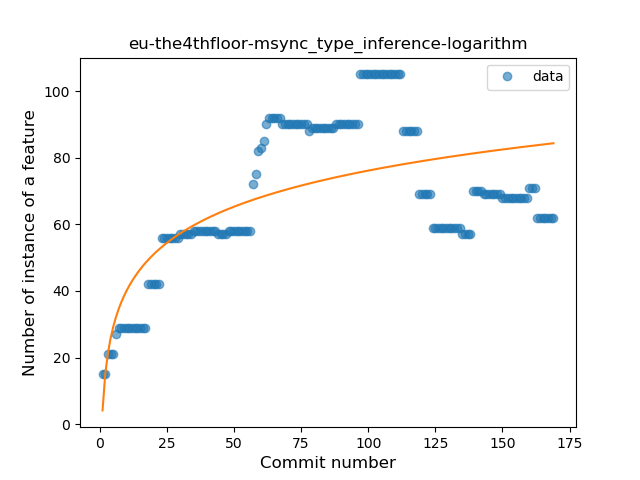
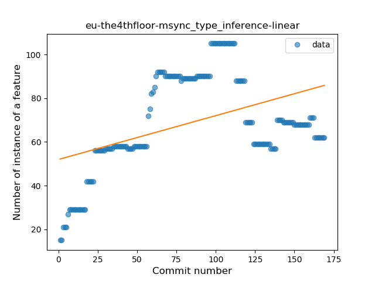
### <a name="lambda">Lambda</a>
----
#### Functions
* **Sudden Rise Plateau - Logarithm:** 
    * **R_Squared:** 0.38396983
* **Constant Rise - Linear:** 
    * **R_Squared:** 0.16893716

**Plots** :chart_with_upwards_trend:
-----

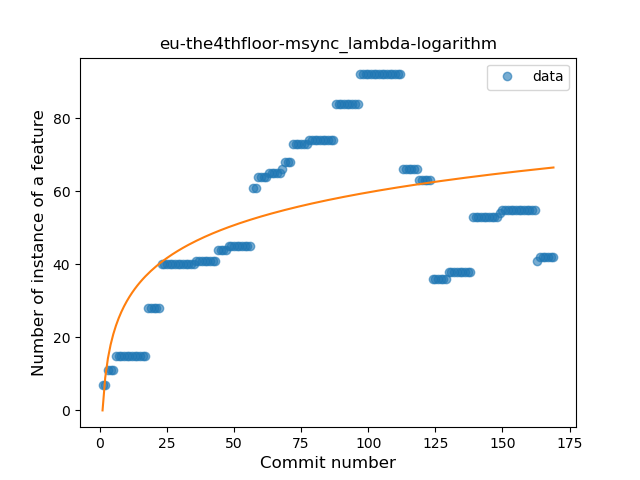
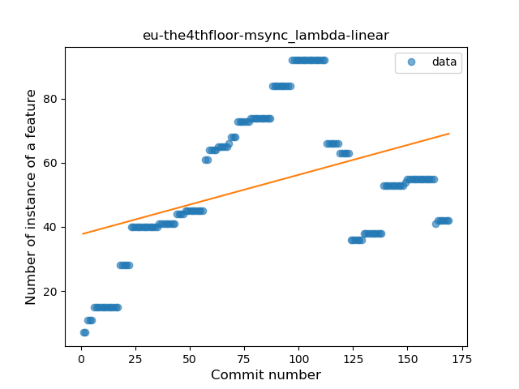
### <a name="safe_call">Safe Call</a>
----
#### Functions
* **Plateau Gradual Rise - Sigmoid:** 
    * **R_Squared:** 0.33780934
* **Sudden Rise Plateau - Logarithm:** 
    * **R_Squared:** 0.22504115
* **Constant Rise - Linear:** 
    * **R_Squared:** 0.03714893

**Plots** :chart_with_upwards_trend:
-----

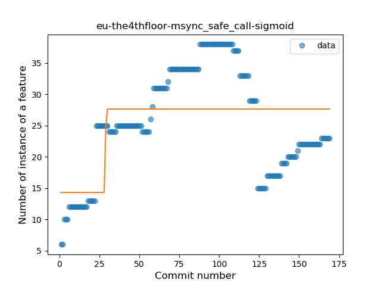
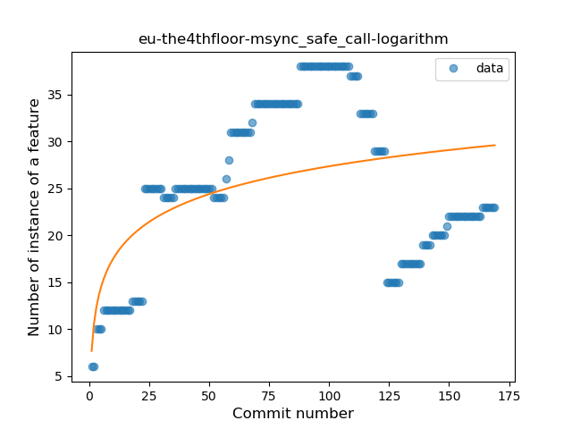
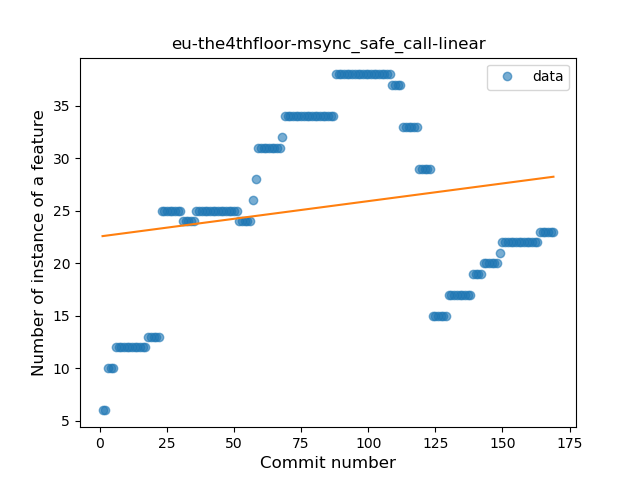
### <a name="when_expr">When expression</a>
----
#### Functions
* **Plateau Gradual Rise - Sigmoid:** 
    * **R_Squared:** 0.87004118
* **Constant Rise - Linear:** 
    * **R_Squared:** 0.85372654
* **Sudden Rise Plateau - Logarithm:** 
    * **R_Squared:** 0.61342828

**Plots** :chart_with_upwards_trend:
-----

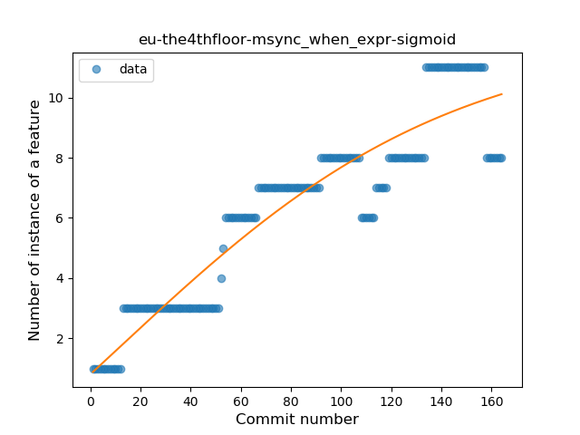
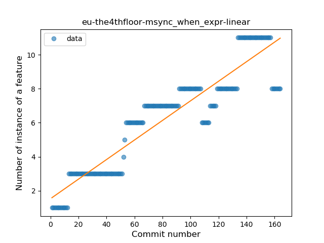
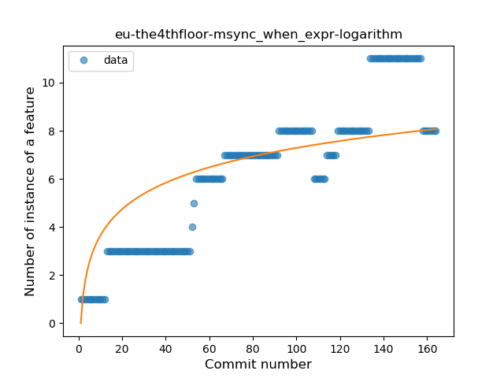
### <a name="unsafe_call">Unsafe Call</a>
----
#### Functions
* **Plateau Sudden Rise - Binary Sigmoid:** 
    * **R_Squared:** 0.20004795
* **Constant Decline - Linear:** 
    * **R_Squared:** 0.15927858
* **Sudden Rise Plateau - Logarithm:** 
    * **R_Squared:** -0.0

**Plots** :chart_with_upwards_trend:
-----

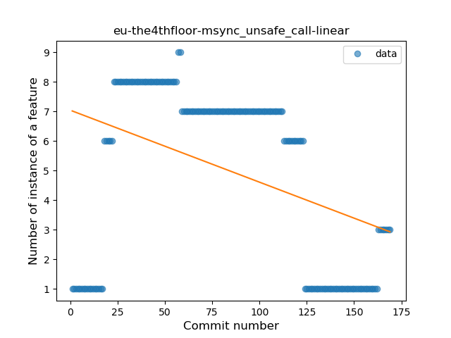
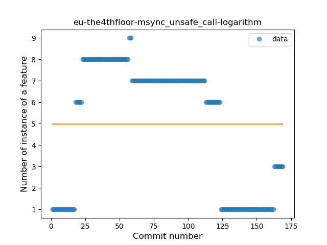
### <a name="companion_object">Companion Object</a>
----
#### Functions
* **Constant Decline - Linear:** 
    * **R_Squared:** 0.51264006
* **Plateau Sudden Rise - Binary Sigmoid:** 
    * **R_Squared:** 0.03018962
* **Sudden Rise Plateau - Logarithm:** 
    * **R_Squared:** 0.0

**Plots** :chart_with_upwards_trend:
-----

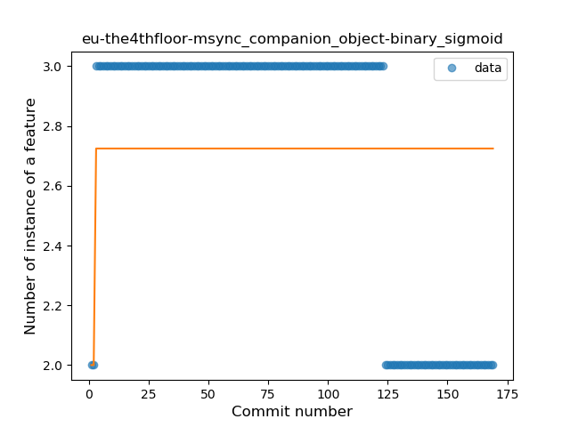
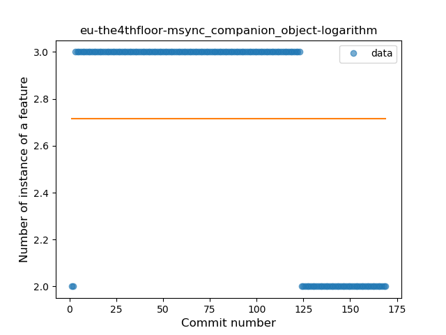
### <a name="string_template">String Template</a>
----
#### Functions
* **Constant Rise - Linear:** 
    * **R_Squared:** 0.47008382
* **Sudden Rise Plateau - Logarithm:** 
    * **R_Squared:** 0.45338513

**Plots** :chart_with_upwards_trend:
-----

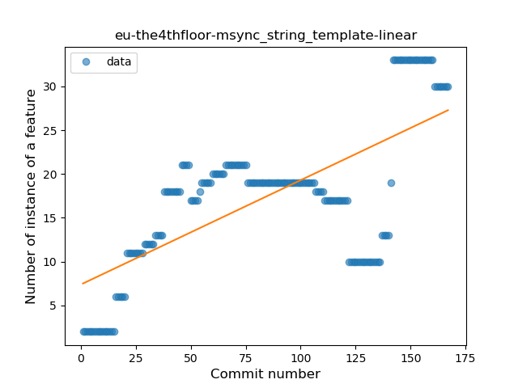
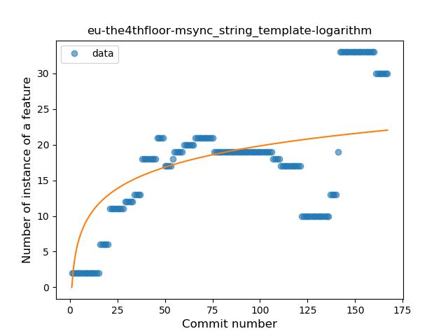
### <a name="func_with_default_value">Function with Default Value</a>
----
#### Functions
* **Plateau Sudden Rise - Binary Sigmoid:** 
    * **R_Squared:** 0.33258263
* **Sudden Rise Plateau - Logarithm:** 
    * **R_Squared:** 0.14275722
* **Constant Rise - Linear:** 
    * **R_Squared:** 0.03478163

**Plots** :chart_with_upwards_trend:
-----

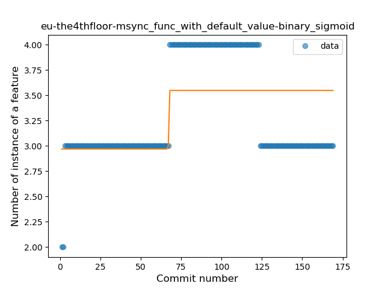

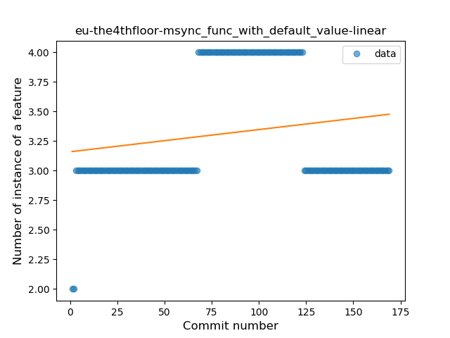
### <a name="singleton">Singleton</a>
----
#### Functions
* **Sudden Rise Plateau - Logarithm:** 
    * **R_Squared:** 0.04611425
* **Constant Rise - Linear:** 
    * **R_Squared:** 0.03183416

**Plots** :chart_with_upwards_trend:
-----

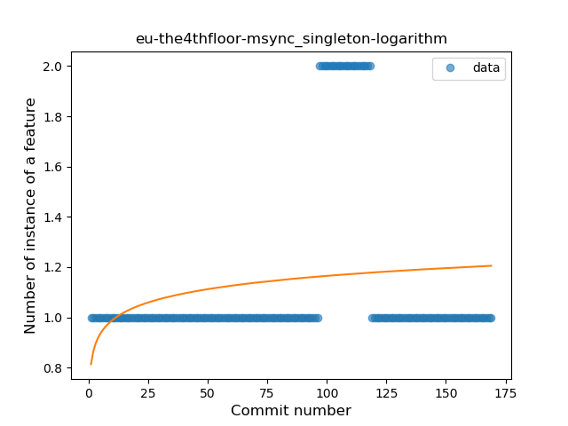
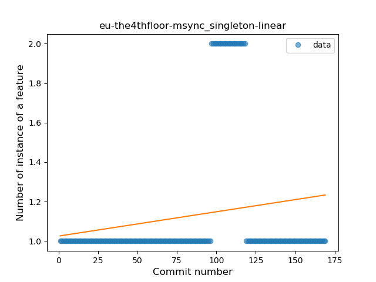
### <a name="range_expr">Range Expression</a>
----
#### Functions
* **Plateau Sudden Decline - Binary Sigmoid:** 
    * **R_Squared:** 1.0
* **Sudden Decline - Exponential:** 
    * **R_Squared:** 0.79714146
* **Constant Decline - Linear:** 
    * **R_Squared:** 0.27142857
* **Sudden Rise Plateau - Logarithm:** 
    * **R_Squared:** -0.0

**Plots** :chart_with_upwards_trend:
-----

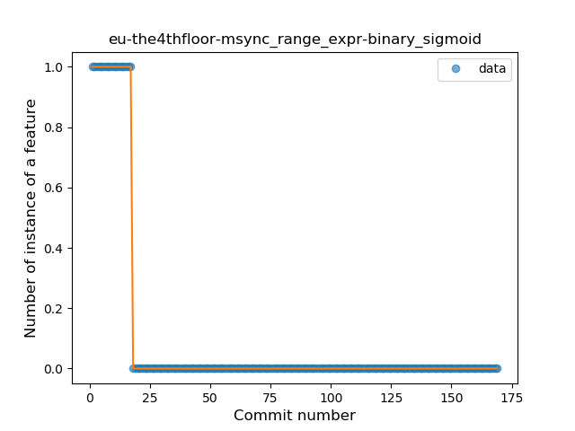
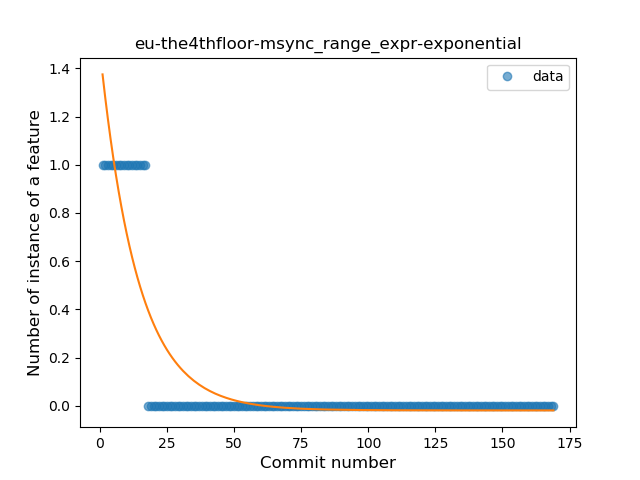
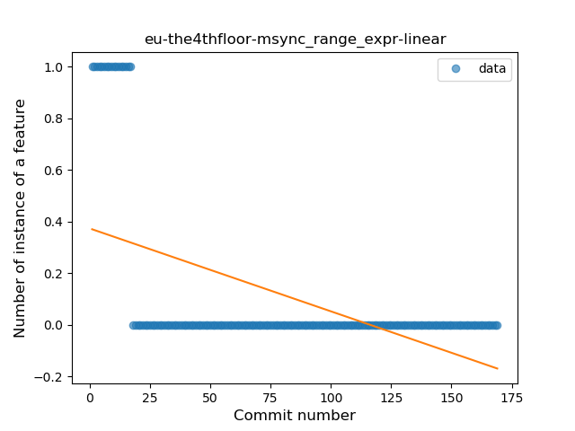
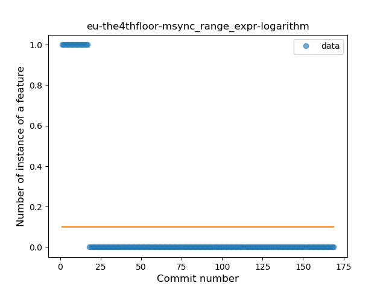
### <a name="smart_cast">Smart Cast</a>
----
#### Functions
* **Sudden Rise Plateau - Logarithm:** 
    * **R_Squared:** 0.61651526
* **Constant Rise - Linear:** 
    * **R_Squared:** 0.42098819

**Plots** :chart_with_upwards_trend:
-----

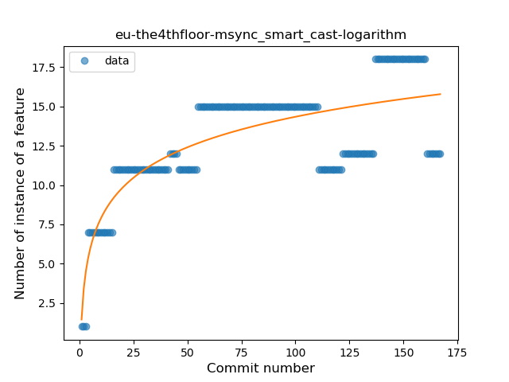
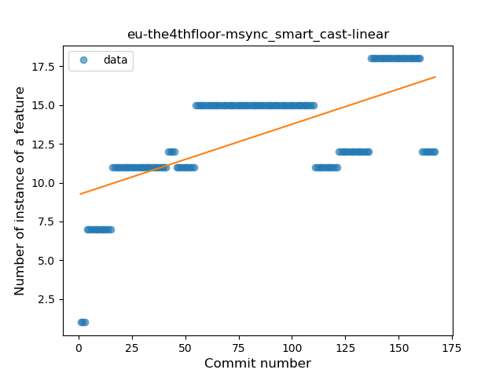
### <a name="data_class">Data Class</a>
----
#### Functions
* **Plateau Sudden Rise - Binary Sigmoid:** 
    * **R_Squared:** 0.99173006
* **Sudden Rise - Exponential:** 
    * **R_Squared:** 0.74093443
* **Constant Rise - Linear:** 
    * **R_Squared:** 0.54548682
* **Sudden Rise Plateau - Logarithm:** 
    * **R_Squared:** 0.1672241

**Plots** :chart_with_upwards_trend:
-----

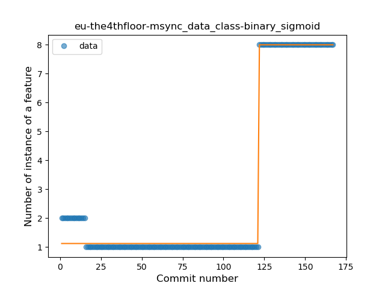
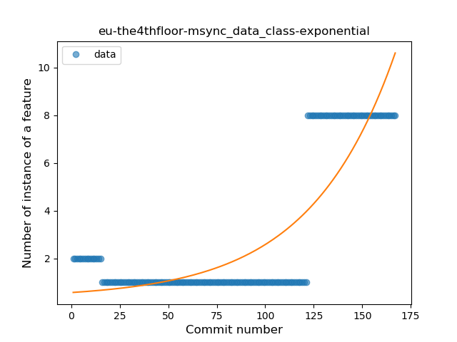
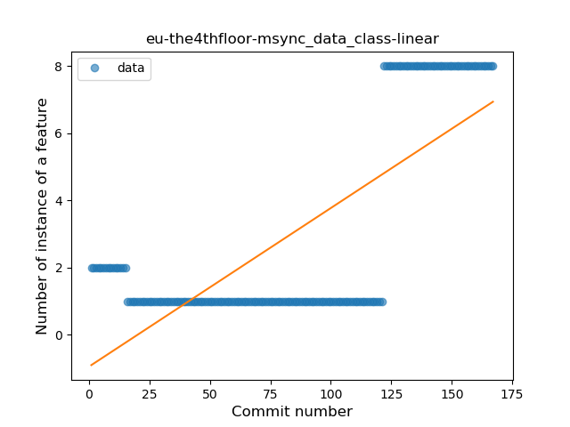
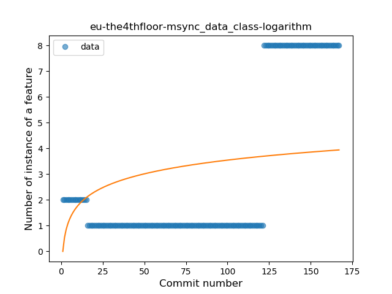
### <a name="func_call_with_named_arg">Function call with Named Argument</a>
----
#### Functions
* **Plateau Gradual Decline - Sigmoid:** 
    * **R_Squared:** 0.93251677
* **Constant Decline - Linear:** 
    * **R_Squared:** 0.5243883
* **Sudden Rise Plateau - Logarithm:** 
    * **R_Squared:** -0.0

**Plots** :chart_with_upwards_trend:
-----

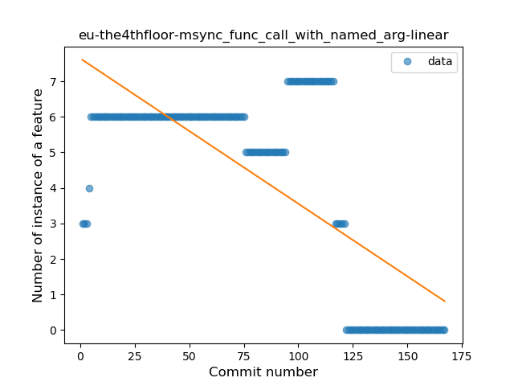
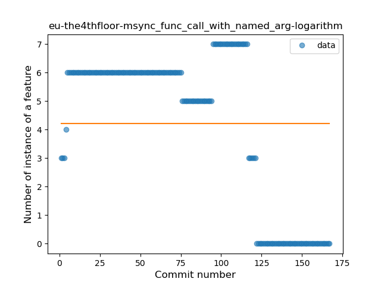
### <a name="extension_function">Extension Function</a>
----
#### Functions
* **Sudden Rise Plateau - Logarithm:** 
    * **R_Squared:** 0.77316351
* **Plateau Gradual Rise - Sigmoid:** 
    * **R_Squared:** 0.64854982
* **Constant Rise - Linear:** 
    * **R_Squared:** 0.53486345

**Plots** :chart_with_upwards_trend:
-----

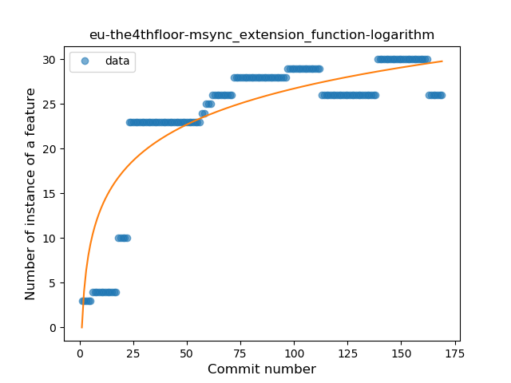
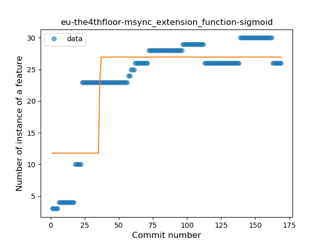
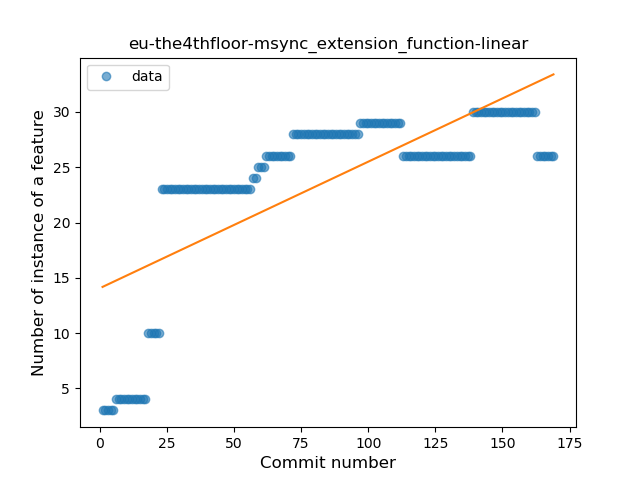
### <a name="property_delegation">Property Delegation</a>
----
#### Functions
* **Plateau Sudden Rise - Binary Sigmoid:** 
    * **R_Squared:** 1.0
* **Sudden Rise Plateau - Logarithm:** 
    * **R_Squared:** 0.59347931
* **Constant Rise - Linear:** 
    * **R_Squared:** 0.27142857

**Plots** :chart_with_upwards_trend:
-----

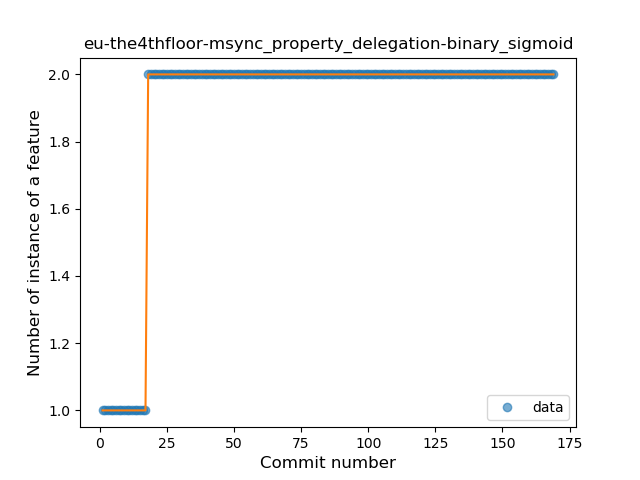
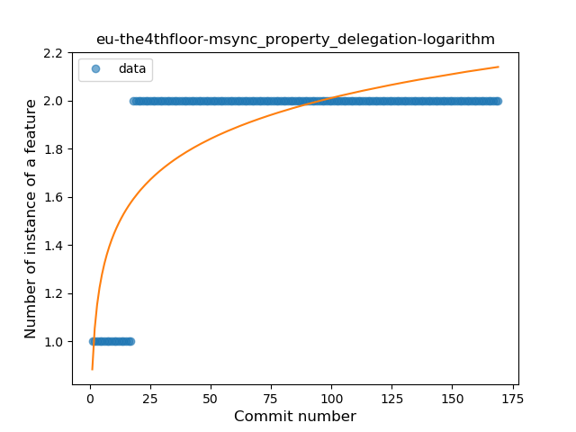
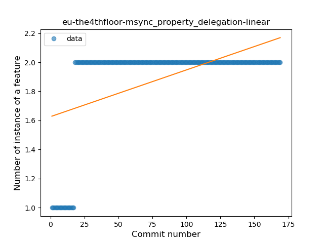
### <a name="destructuring_declaration">Destructuring Declaration</a>
----
#### Functions
* **Plateau Gradual Decline - Sigmoid:** 
    * **R_Squared:** 0.76076856
* **Constant Decline - Linear:** 
    * **R_Squared:** 0.36527435
* **Sudden Rise Plateau - Logarithm:** 
    * **R_Squared:** -0.0

**Plots** :chart_with_upwards_trend:
-----

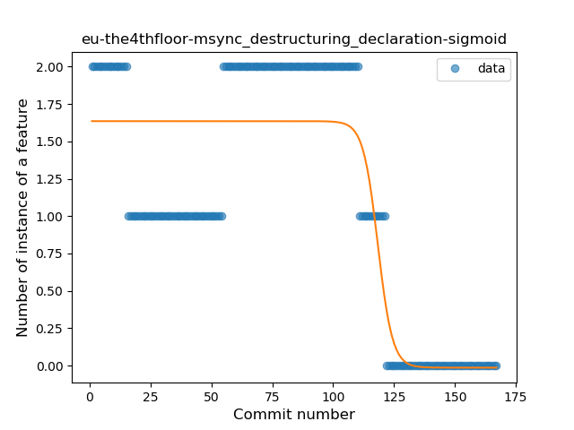
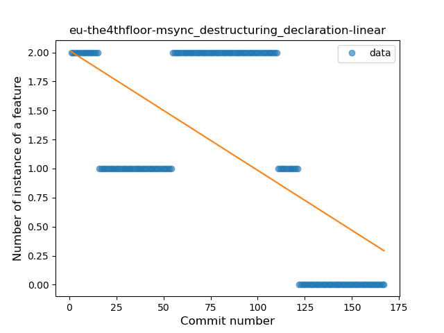
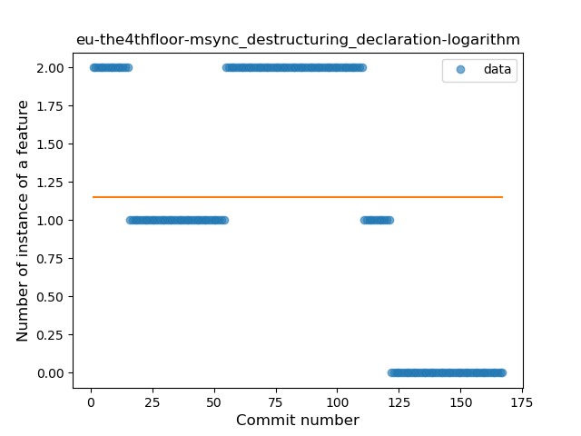
### <a name="coroutine">Coroutine</a>
----
#### Functions
* **Plateau Gradual Rise - Sigmoid:** 
    * **R_Squared:** 0.76803753
* **Sudden Rise - Exponential:** 
    * **R_Squared:** 0.50970813
* **Constant Rise - Linear:** 
    * **R_Squared:** 0.46166756
* **Sudden Rise Plateau - Logarithm:** 
    * **R_Squared:** 0.20415463

**Plots** :chart_with_upwards_trend:
-----

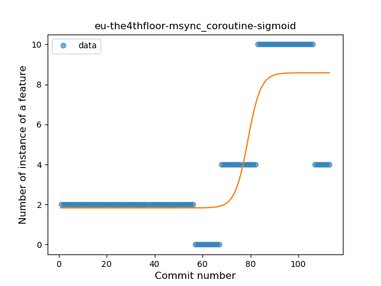
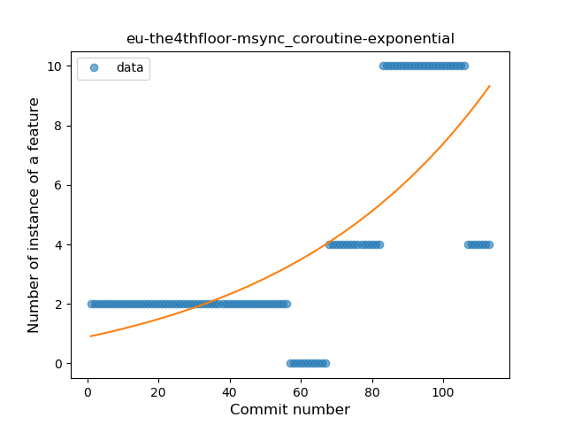
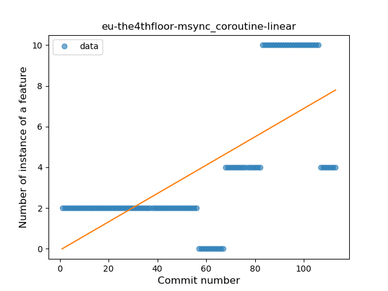
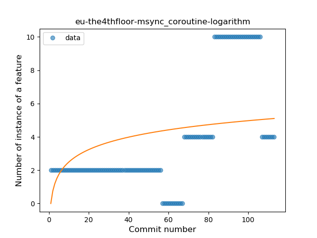
### <a name="sealed_class">Sealed Class</a>
----
#### Functions
* **Plateau Sudden Decline - Binary Sigmoid:** 
    * **R_Squared:** 1.0
* **Constant Decline - Linear:** 
    * **R_Squared:** 0.63316452
* **Sudden Rise Plateau - Logarithm:** 
    * **R_Squared:** -0.0

**Plots** :chart_with_upwards_trend:
-----

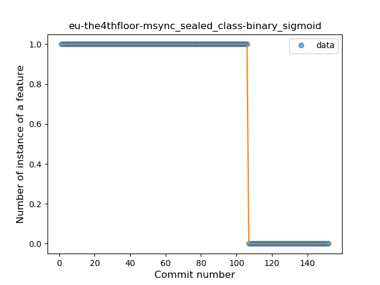
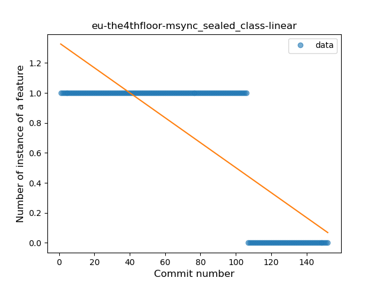
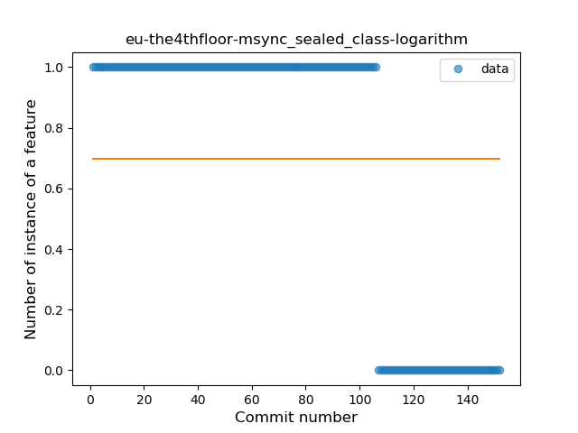
