## eurofurence-ef-app_android
----
#### Metrics provided by Detekt
* Number of lines of code 10093
* Number of Kotlin files: 92
* Cyclomatic complexity: 1310
* Cyclomatic complexity by thousands of lines: 262 

----
**19** features analyzed

*	<a href="#type_inference">Type Inference</a> 
*	<a href="#lambda">Lambda</a> 
*	<a href="#safe_call">Safe Call</a> 
*	<a href="#when_expr">When expression</a> 
*	<a href="#companion_object">Companion Object</a> 
*	<a href="#unsafe_call">Unsafe Call</a> 
*	<a href="#string_template">String Template</a> 
*	<a href="#func_with_default_value">Function with Default Value</a> 
*	<a href="#singleton">Singleton</a> 
*	<a href="#smart_cast">Smart Cast</a> 
*	<a href="#range_expr">Range Expression</a> 
*	<a href="#func_call_with_named_arg">Function call with Named Argument</a> 
*	<a href="#data_class">Data Class</a> 
*	<a href="#extension_function">Extension Function</a> 
*	<a href="#property_delegation">Property Delegation</a> 
*	<a href="#destructuring_declaration">Destructuring Declaration</a> 
*	<a href="#inline_func">Inline Function</a> 
*	<a href="#overloaded_op">Overloaded Operator</a> 
*	<a href="#super_delegation">Super Delegation</a> 

### <a name="type_inference">Type Inference</a>
----
#### Functions
* **Constant Rise - Linear:** 
    * **R_Squared:** 0.93246501
* **Sudden Rise Plateau - Logarithm:** 
    * **R_Squared:** 0.63820527
* **Plateau Sudden Rise - Binary Sigmoid:** 
    * **R_Squared:** 0.64813894

**Plots** :chart_with_upwards_trend:
-----

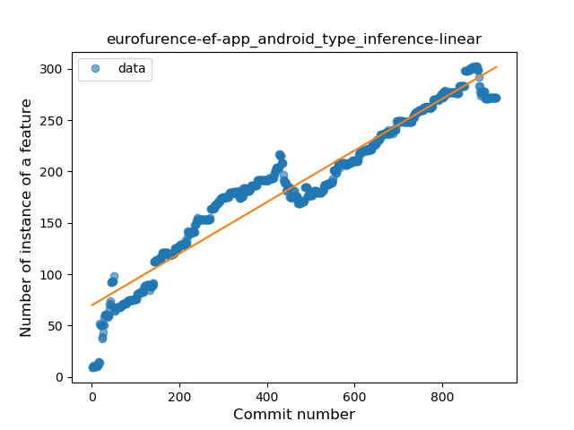
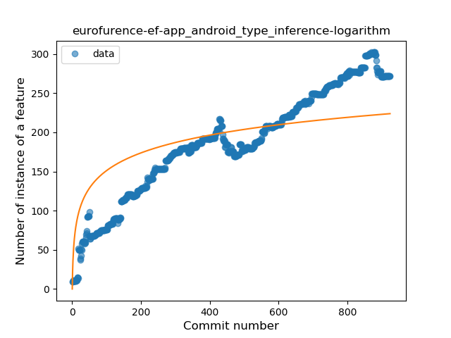
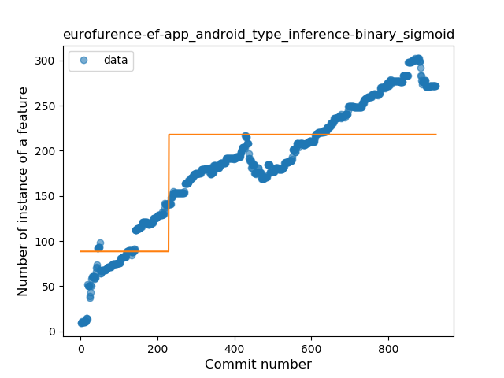
### <a name="lambda">Lambda</a>
----
#### Functions
* **Sudden Rise - Exponential:** 
    * **R_Squared:** 0.9701468
* **Constant Rise - Linear:** 
    * **R_Squared:** 0.94339879
* **Plateau Sudden Rise - Binary Sigmoid:** 
    * **R_Squared:** 0.35269711
* **Sudden Rise Plateau - Logarithm:** 
    * **R_Squared:** 0.32523174

**Plots** :chart_with_upwards_trend:
-----

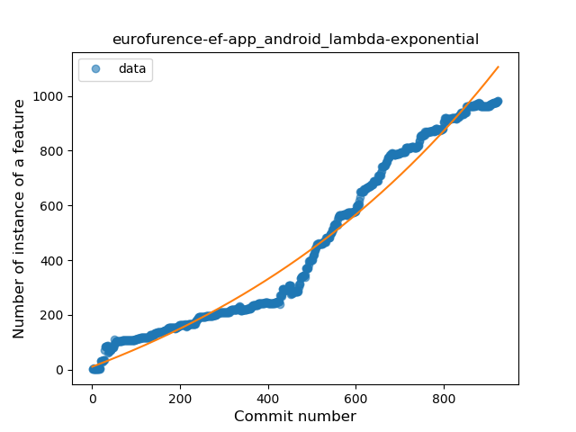
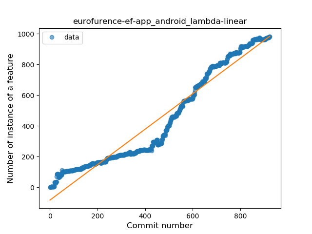
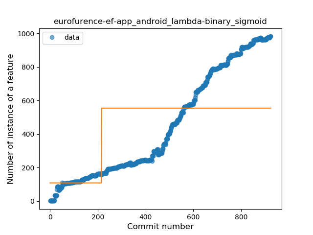

### <a name="safe_call">Safe Call</a>
----
#### Functions
* **Sudden Rise - Exponential:** 
    * **R_Squared:** 0.95780385
* **Constant Rise - Linear:** 
    * **R_Squared:** 0.60816229
* **Sudden Rise Plateau - Logarithm:** 
    * **R_Squared:** 0.18257058

**Plots** :chart_with_upwards_trend:
-----

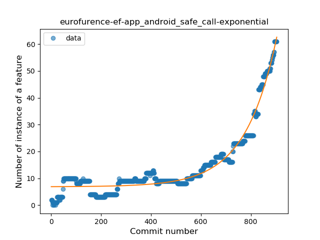
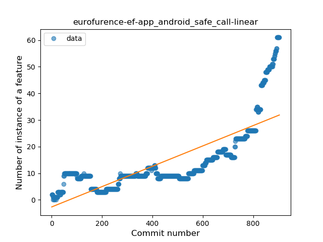
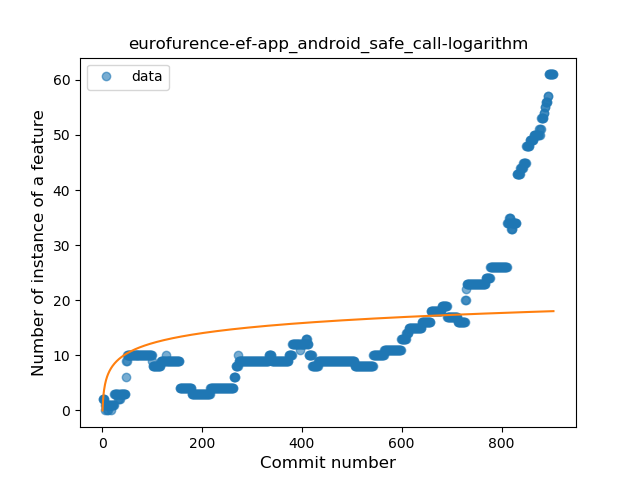
### <a name="when_expr">When expression</a>
----
#### Functions
* **Plateau Gradual Rise - Sigmoid:** 
    * **R_Squared:** 0.95606799
* **Constant Rise - Linear:** 
    * **R_Squared:** 0.92354866
* **Sudden Rise Plateau - Logarithm:** 
    * **R_Squared:** 0.45310278

**Plots** :chart_with_upwards_trend:
-----

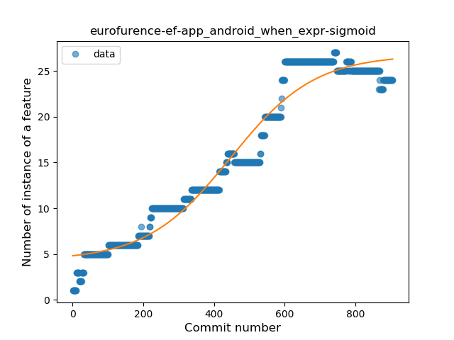
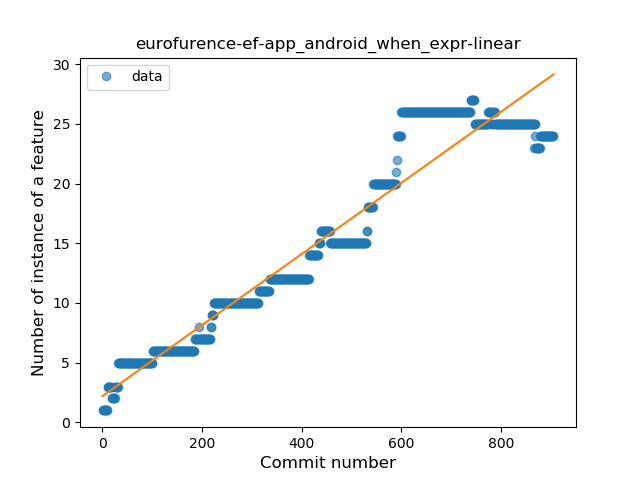
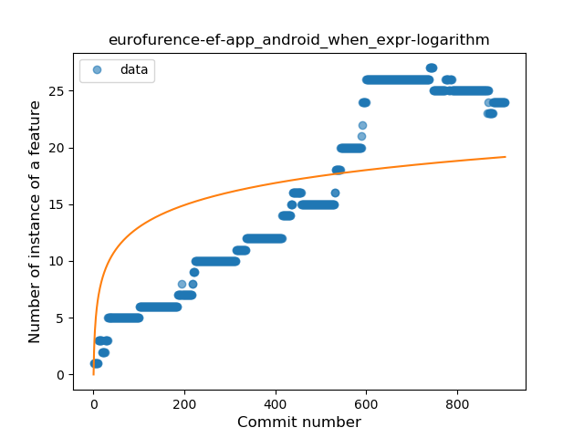
### <a name="companion_object">Companion Object</a>
----
#### Functions
* **Plateau Gradual Rise - Sigmoid:** 
    * **R_Squared:** 0.78989146
* **Sudden Rise Plateau - Logarithm:** 
    * **R_Squared:** 0.65700206
* **Constant Rise - Linear:** 
    * **R_Squared:** 0.40410582

**Plots** :chart_with_upwards_trend:
-----

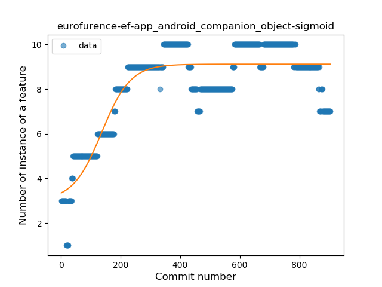
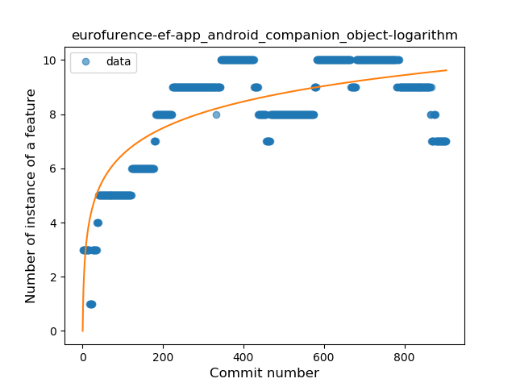
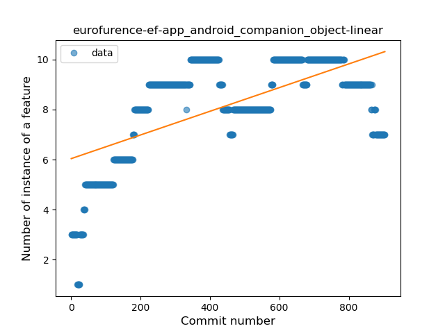
### <a name="unsafe_call">Unsafe Call</a>
----
#### Functions
* **Constant Decline - Linear:** 
    * **R_Squared:** 0.15445799
* **Sudden Decline - Exponential:** 
    * **R_Squared:** 0.0
* **Sudden Rise Plateau - Logarithm:** 
    * **R_Squared:** -0.0

**Plots** :chart_with_upwards_trend:
-----

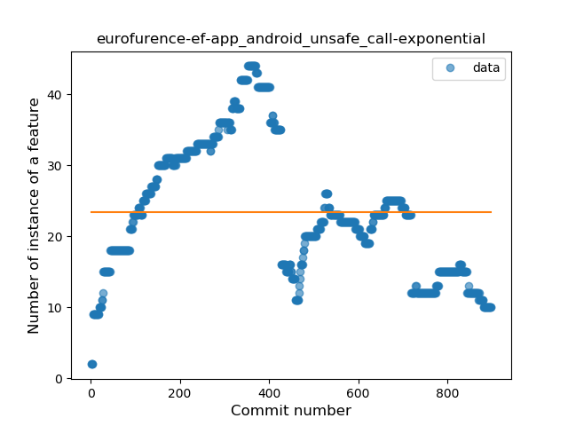

### <a name="string_template">String Template</a>
----
#### Functions
* **Constant Rise - Linear:** 
    * **R_Squared:** 0.90125928
* **Sudden Rise - Exponential:** 
    * **R_Squared:** 0.90658771
* **Sudden Rise Plateau - Logarithm:** 
    * **R_Squared:** 0.32276569
* **Plateau Sudden Rise - Binary Sigmoid:** 
    * **R_Squared:** 0.10413758

**Plots** :chart_with_upwards_trend:
-----

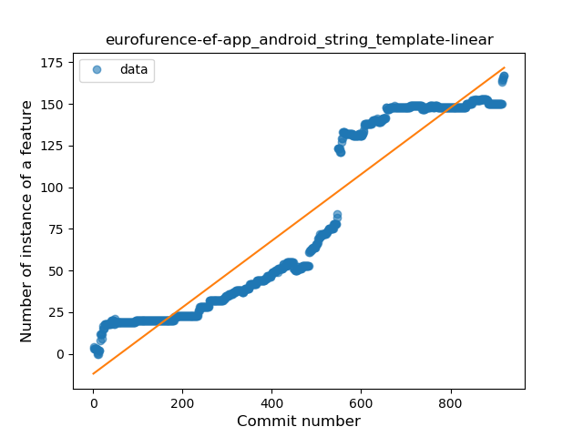
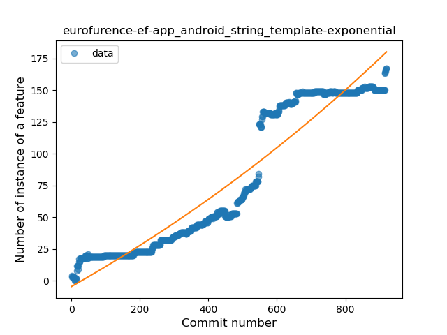
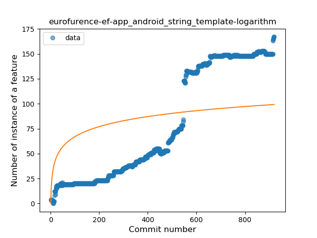
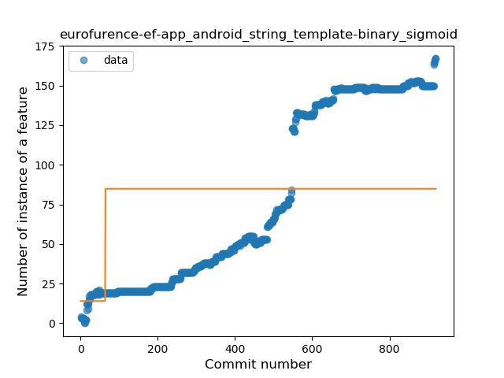
### <a name="func_with_default_value">Function with Default Value</a>
----
#### Functions
* **Constant Rise - Linear:** 
    * **R_Squared:** 0.53580311
* **Sudden Rise Plateau - Logarithm:** 
    * **R_Squared:** 0.43525457

**Plots** :chart_with_upwards_trend:
-----

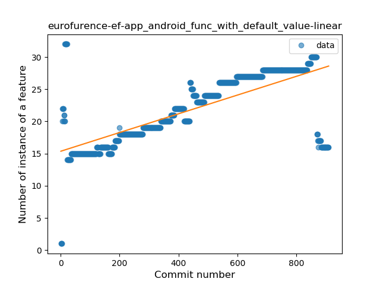
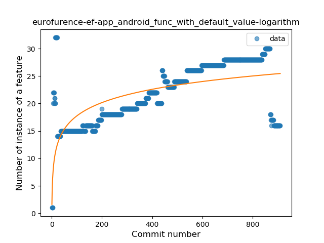
### <a name="singleton">Singleton</a>
----
#### Functions
* **Constant Rise - Linear:** 
    * **R_Squared:** 0.87429566
* **Sudden Rise Plateau - Logarithm:** 
    * **R_Squared:** 0.58773941
* **Plateau Sudden Rise - Binary Sigmoid:** 
    * **R_Squared:** 0.0087058

**Plots** :chart_with_upwards_trend:
-----

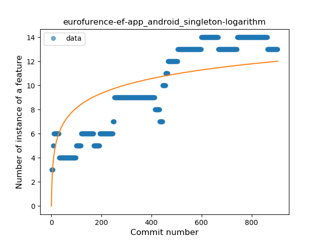
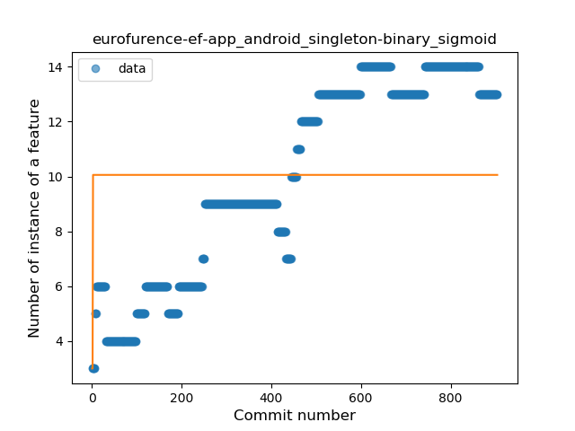
### <a name="smart_cast">Smart Cast</a>
----
#### Functions
* **Constant Rise - Linear:** 
    * **R_Squared:** 0.90275862
* **Sudden Rise Plateau - Logarithm:** 
    * **R_Squared:** 0.39703919
* **Plateau Sudden Rise - Binary Sigmoid:** 
    * **R_Squared:** 0.05622316

**Plots** :chart_with_upwards_trend:
-----

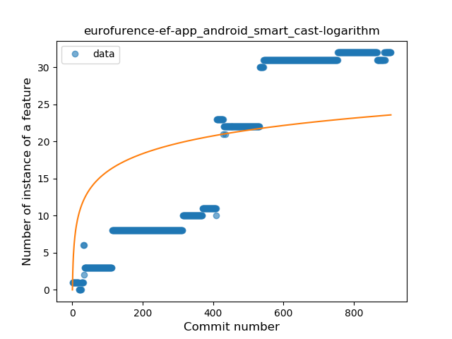
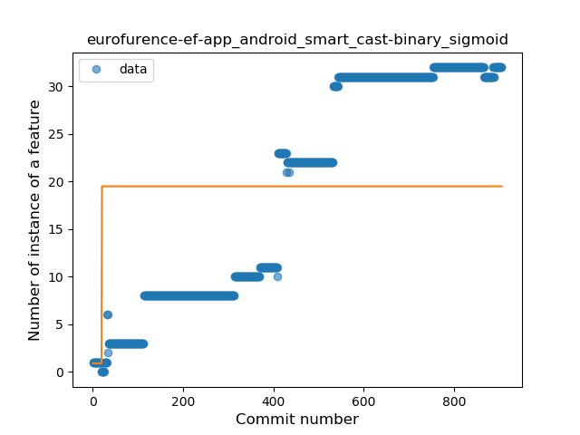
### <a name="range_expr">Range Expression</a>
----
#### Functions
* **Sudden Rise - Exponential:** 
    * **R_Squared:** 0.75737343
* **Constant Rise - Linear:** 
    * **R_Squared:** 0.46050009
* **Sudden Rise Plateau - Logarithm:** 
    * **R_Squared:** 0.06636439

**Plots** :chart_with_upwards_trend:
-----

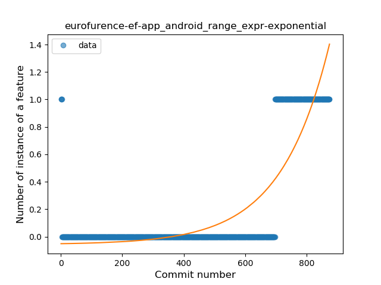
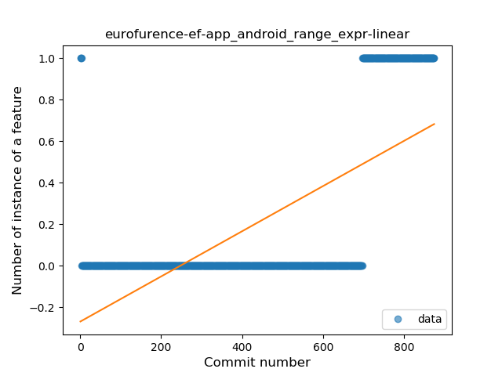
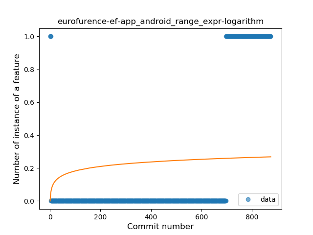
### <a name="func_call_with_named_arg">Function call with Named Argument</a>
----
#### Functions
* **Plateau Gradual Rise - Sigmoid:** 
    * **R_Squared:** 0.90263144
* **Sudden Rise - Exponential:** 
    * **R_Squared:** 0.88410997
* **Constant Rise - Linear:** 
    * **R_Squared:** 0.56263833
* **Sudden Rise Plateau - Logarithm:** 
    * **R_Squared:** 0.12948568

**Plots** :chart_with_upwards_trend:
-----

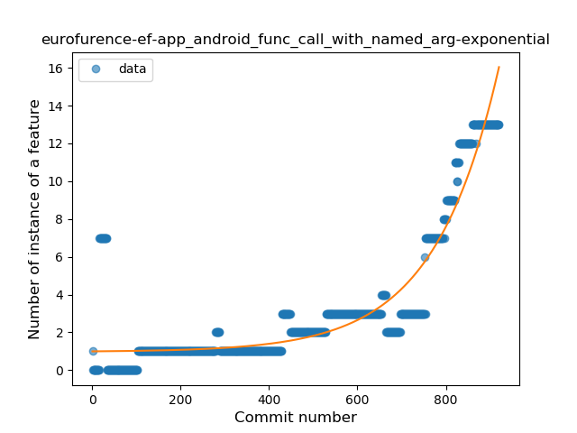
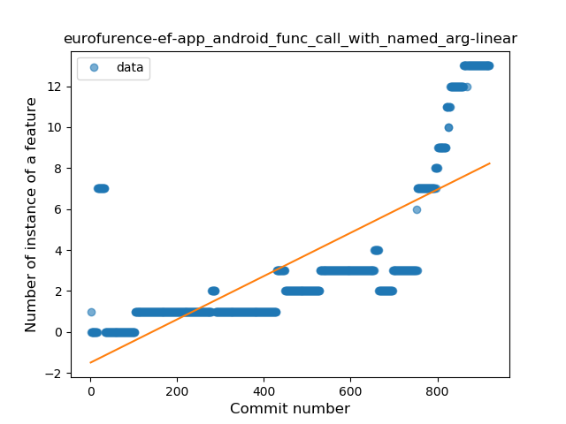
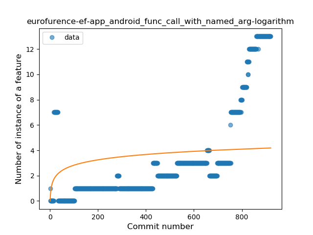
### <a name="data_class">Data Class</a>
----
#### Functions
* **Sudden Rise Plateau - Logarithm:** 
    * **R_Squared:** 0.54804821
* **Constant Rise - Linear:** 
    * **R_Squared:** 0.51453359

**Plots** :chart_with_upwards_trend:
-----

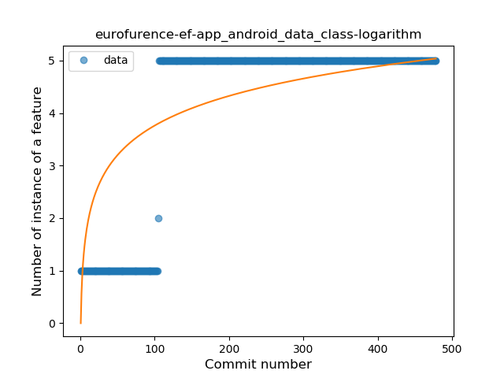
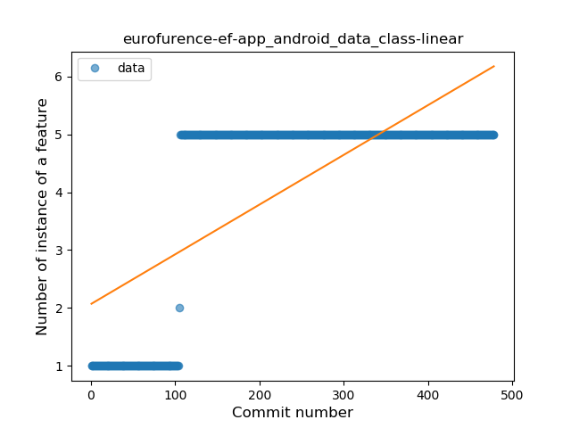
### <a name="extension_function">Extension Function</a>
----
#### Functions
* **Constant Rise - Linear:** 
    * **R_Squared:** 0.8971721
* **Sudden Rise - Exponential:** 
    * **R_Squared:** 0.90111681
* **Sudden Rise Plateau - Logarithm:** 
    * **R_Squared:** 0.37365711

**Plots** :chart_with_upwards_trend:
-----

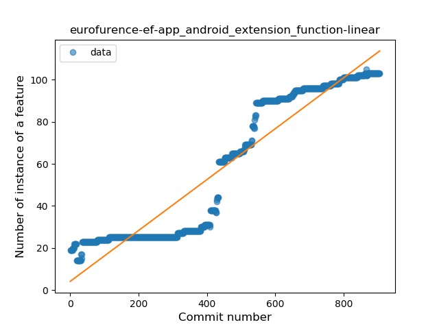
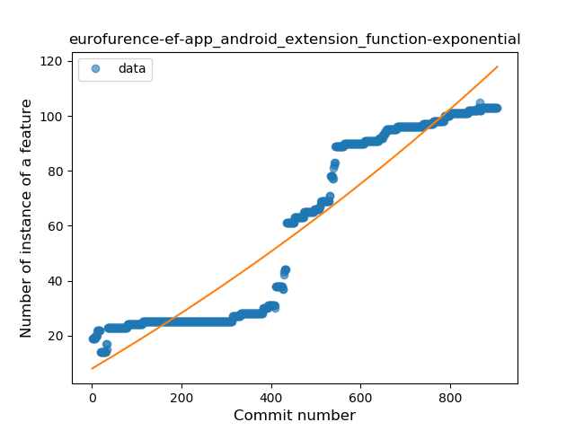
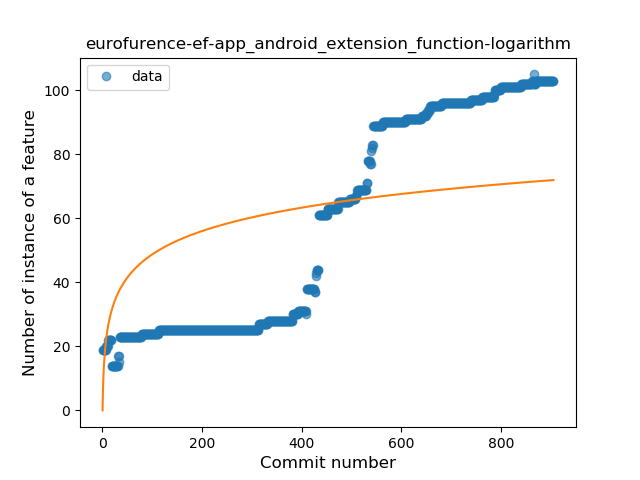
### <a name="property_delegation">Property Delegation</a>
----
#### Functions
* **Constant Rise - Linear:** 
    * **R_Squared:** 0.85872564
* **Sudden Rise Plateau - Logarithm:** 
    * **R_Squared:** 0.66385333
* **Plateau Sudden Rise - Binary Sigmoid:** 
    * **R_Squared:** 0.45185823

**Plots** :chart_with_upwards_trend:
-----

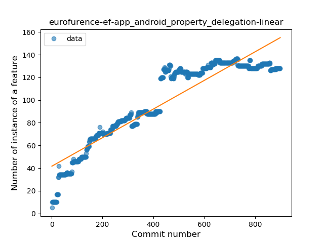
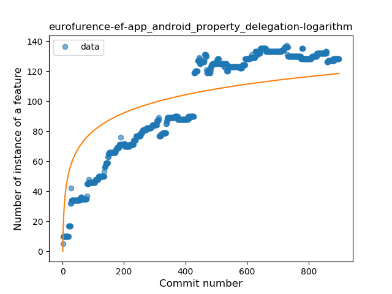
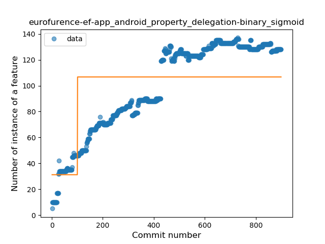
### <a name="destructuring_declaration">Destructuring Declaration</a>
----
#### Functions
* **Sudden Rise - Exponential:** 
    * **R_Squared:** 0.88880477
* **Constant Rise - Linear:** 
    * **R_Squared:** 0.84241768
* **Sudden Rise Plateau - Logarithm:** 
    * **R_Squared:** 0.19445734
* **Plateau Sudden Decline - Binary Sigmoid:** 
    * **R_Squared:** 0.00259032

**Plots** :chart_with_upwards_trend:
-----

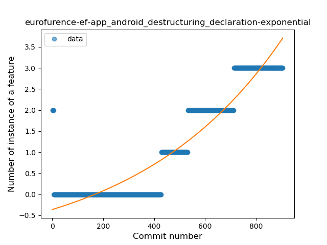
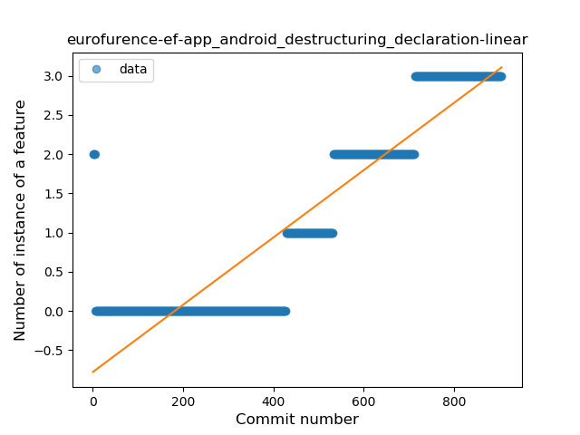

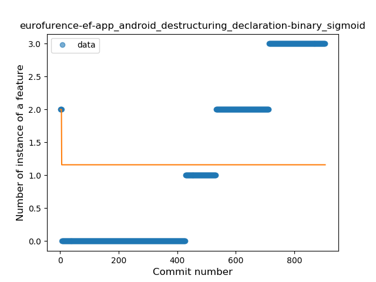
### <a name="inline_func">Inline Function</a>
----
#### Functions
* **Constant Rise - Linear:** 
    * **R_Squared:** 0.80615877
* **Sudden Rise Plateau - Logarithm:** 
    * **R_Squared:** 0.32226626
* **Plateau Sudden Rise - Binary Sigmoid:** 
    * **R_Squared:** 0.00259022

**Plots** :chart_with_upwards_trend:
-----

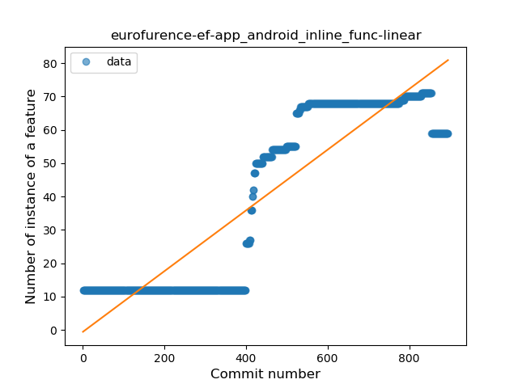
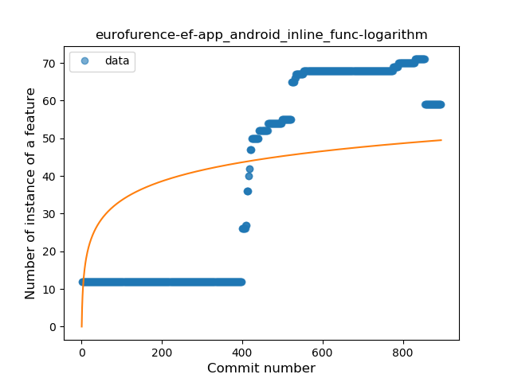
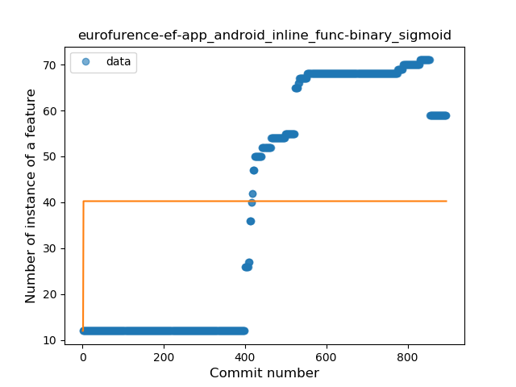
### <a name="overloaded_op">Overloaded Operator</a>
----
#### Functions
* **Sudden Rise Plateau - Logarithm:** 
    * **R_Squared:** 0.80125347
* **Constant Rise - Linear:** 
    * **R_Squared:** 0.71130349

**Plots** :chart_with_upwards_trend:
-----

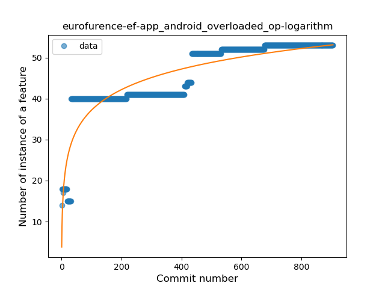
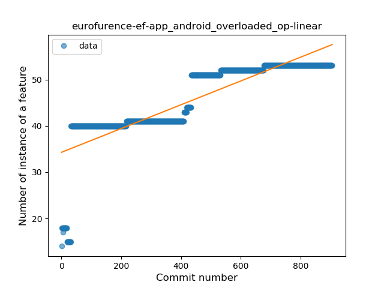
### <a name="super_delegation">Super Delegation</a>
----
#### Functions
* **Sudden Decline - Exponential:** 
    * **R_Squared:** 0.59776251
* **Constant Decline - Linear:** 
    * **R_Squared:** 0.02909103
* **Sudden Rise Plateau - Logarithm:** 
    * **R_Squared:** 0.0

**Plots** :chart_with_upwards_trend:
-----

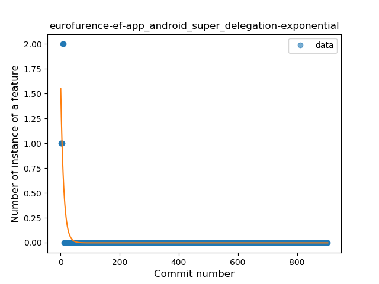
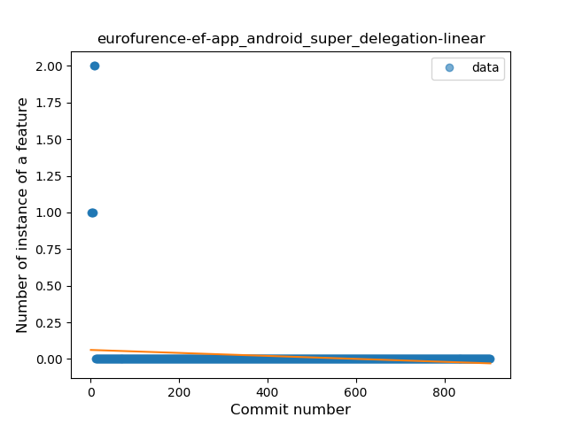
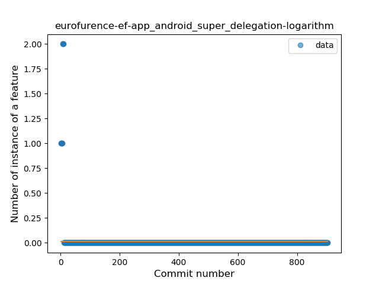
