## exviva-stew
----
#### Metrics provided by Detekt
* Number of lines of code 954
* Number of Kotlin files: 13
* Cyclomatic complexity: 161
* Cyclomatic complexity by thousands of lines: 298 

----
**13** features analyzed

*	<a href="#type_inference">Type Inference</a> 
*	<a href="#lambda">Lambda</a> 
*	<a href="#safe_call">Safe Call</a> 
*	<a href="#when_expr">When expression</a> 
*	<a href="#companion_object">Companion Object</a> 
*	<a href="#unsafe_call">Unsafe Call</a> 
*	<a href="#string_template">String Template</a> 
*	<a href="#func_with_default_value">Function with Default Value</a> 
*	<a href="#singleton">Singleton</a> 
*	<a href="#smart_cast">Smart Cast</a> 
*	<a href="#func_call_with_named_arg">Function call with Named Argument</a> 
*	<a href="#data_class">Data Class</a> 
*	<a href="#property_delegation">Property Delegation</a> 

### <a name="type_inference">Type Inference</a>
----
#### Functions
* **Sudden Rise Plateau - Logarithm:** 
    * **R_Squared:** 0.90749897
* **Constant Rise - Linear:** 
    * **R_Squared:** 0.79587226

**Plots** :chart_with_upwards_trend:
-----

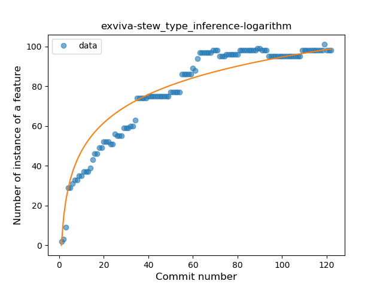
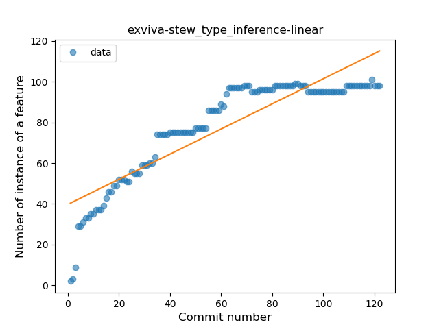
### <a name="lambda">Lambda</a>
----
#### Functions
* **Sudden Rise Plateau - Logarithm:** 
    * **R_Squared:** 0.91125605
* **Constant Rise - Linear:** 
    * **R_Squared:** 0.76503489
* **Plateau Gradual Rise - Sigmoid:** 
    * **R_Squared:** 0.59791557

**Plots** :chart_with_upwards_trend:
-----

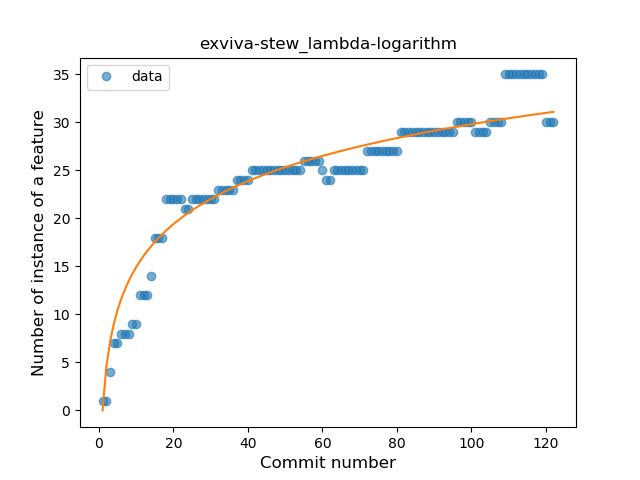
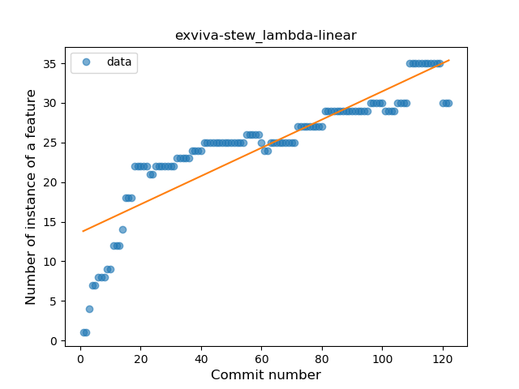
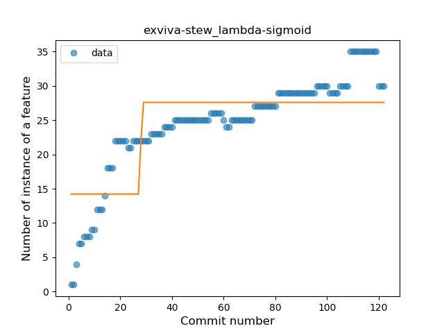
### <a name="safe_call">Safe Call</a>
----
#### Functions
* **Sudden Rise Plateau - Logarithm:** 
    * **R_Squared:** 0.24136864
* **Constant Rise - Linear:** 
    * **R_Squared:** 0.10320088

**Plots** :chart_with_upwards_trend:
-----

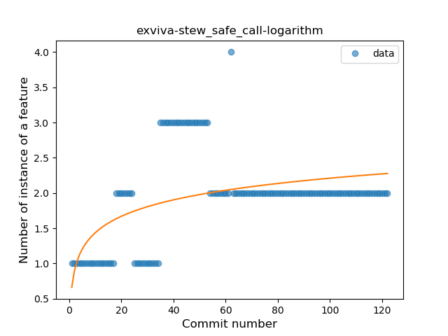
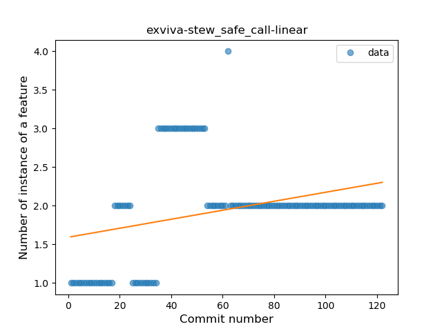
### <a name="when_expr">When expression</a>
----
#### Functions
* **Sudden Rise - Exponential:** 
    * **R_Squared:** 0.44826987
* **Plateau Gradual Rise - Sigmoid:** 
    * **R_Squared:** 0.18266002
* **Sudden Rise Plateau - Logarithm:** 
    * **R_Squared:** 0.11953477
* **Constant Rise - Linear:** 
    * **R_Squared:** 0.0759857

**Plots** :chart_with_upwards_trend:
-----

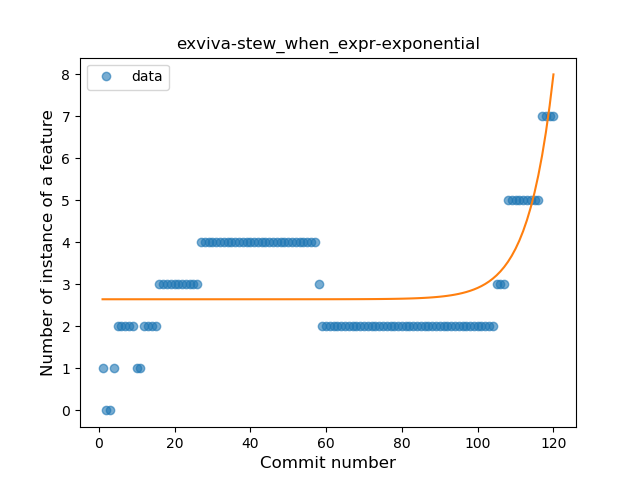

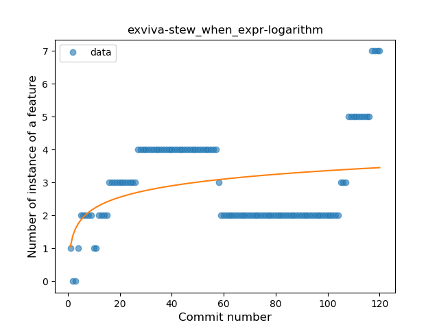
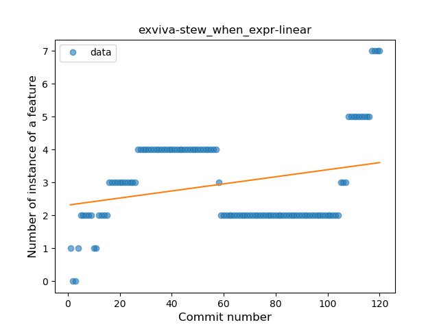
### <a name="companion_object">Companion Object</a>
----
#### Functions
* **Plateau Gradual Rise - Sigmoid:** 
    * **R_Squared:** 0.90237405
* **Constant Rise - Linear:** 
    * **R_Squared:** 0.87678588
* **Sudden Rise Plateau - Logarithm:** 
    * **R_Squared:** 0.56806118

**Plots** :chart_with_upwards_trend:
-----

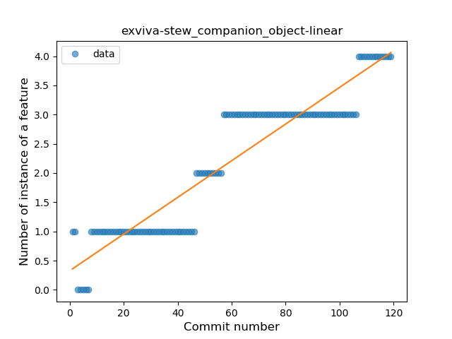
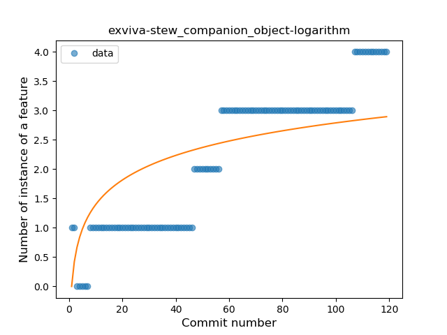
### <a name="unsafe_call">Unsafe Call</a>
----
#### Functions
* **Instability - Polinomial 3:** )
    * **R_Squared:** 0.77268743
* **Sudden Rise Plateau - Logarithm:** 
    * **R_Squared:** 0.48213843
* **Constant Rise - Linear:** 
    * **R_Squared:** 0.3951868

**Plots** :chart_with_upwards_trend:
-----

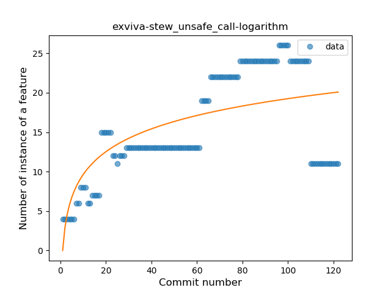
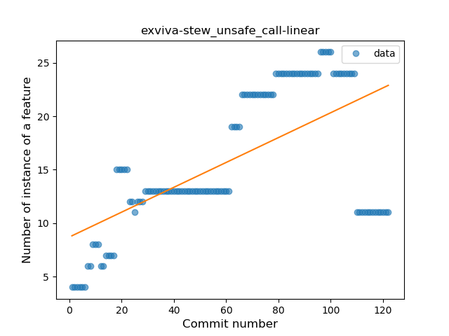
### <a name="string_template">String Template</a>
----
#### Functions
* **Plateau Gradual Rise - Sigmoid:** 
    * **R_Squared:** 0.98207247
* **Sudden Rise Plateau - Logarithm:** 
    * **R_Squared:** 0.65499357
* **Constant Rise - Linear:** 
    * **R_Squared:** 0.31535251

**Plots** :chart_with_upwards_trend:
-----

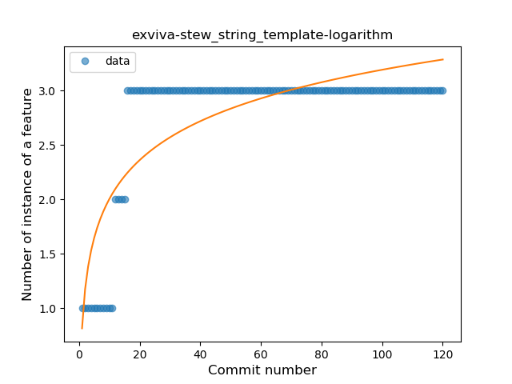
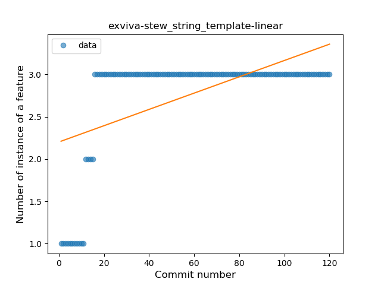
### <a name="func_with_default_value">Function with Default Value</a>
----
#### Functions
* **Plateau Gradual Rise - Sigmoid:** 
    * **R_Squared:** 0.24601164
* **Constant Rise - Linear:** 
    * **R_Squared:** 0.08250573
* **Sudden Rise Plateau - Logarithm:** 
    * **R_Squared:** 0.05459685

**Plots** :chart_with_upwards_trend:
-----

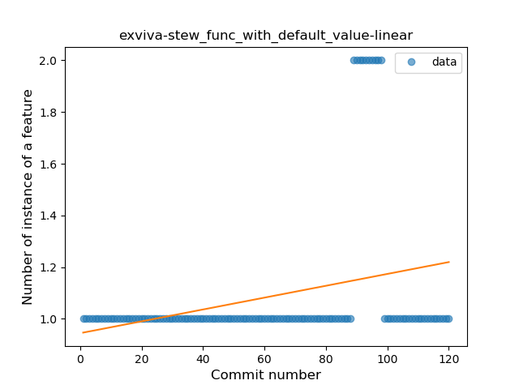
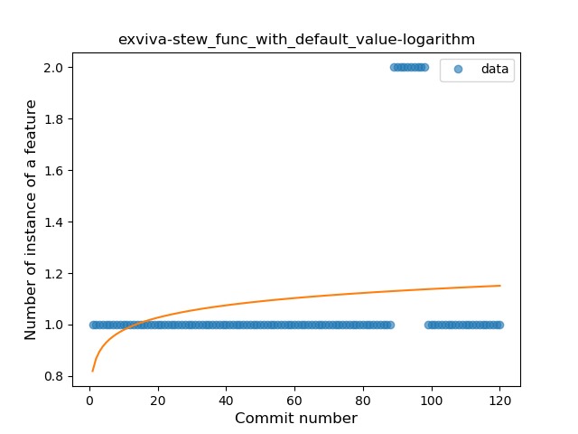
### <a name="singleton">Singleton</a>
----
#### Functions
* **Sudden Decline - Exponential:** 
    * **R_Squared:** 1.0
* **Constant Decline - Linear:** 
    * **R_Squared:** 0.02479339
* **Sudden Rise Plateau - Logarithm:** 
    * **R_Squared:** -0.0

**Plots** :chart_with_upwards_trend:
-----

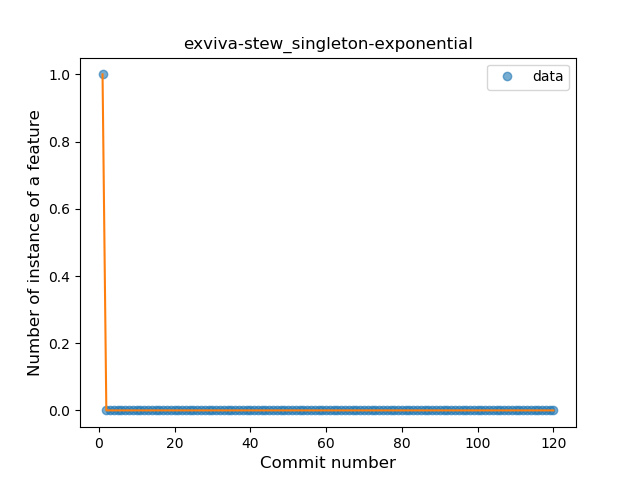
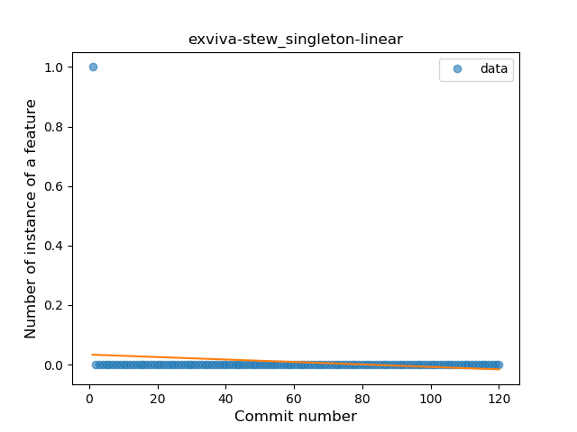
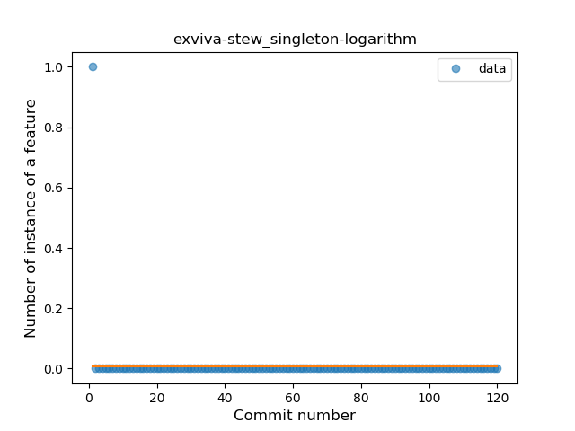
### <a name="smart_cast">Smart Cast</a>
----
#### Functions
* **Plateau Sudden Rise - Binary Sigmoid:** 
    * **R_Squared:** 0.96817509
* **Sudden Rise - Exponential:** 
    * **R_Squared:** 0.79474696
* **Instability - Polinomial 3:** )
    * **R_Squared:** 0.6647193
* **Constant Rise - Linear:** 
    * **R_Squared:** 0.25094468
* **Sudden Rise Plateau - Logarithm:** 
    * **R_Squared:** 0.15823959

**Plots** :chart_with_upwards_trend:
-----

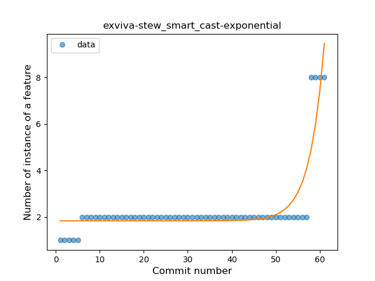
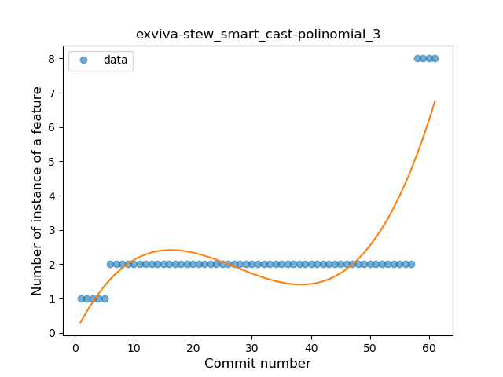
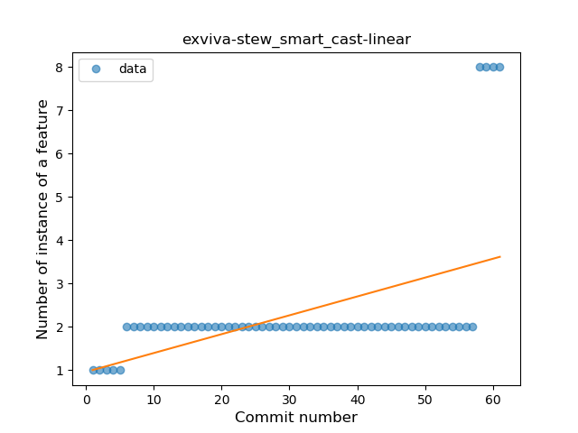
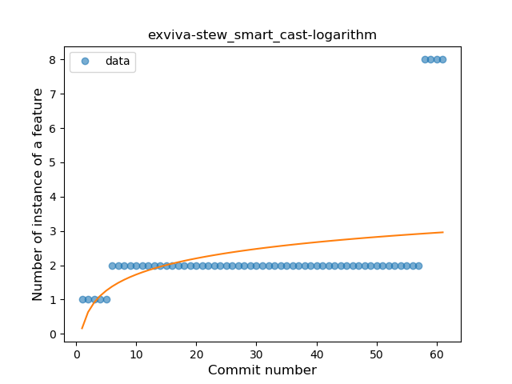
### <a name="func_call_with_named_arg">Function call with Named Argument</a>
----
#### Functions
* **Plateau Sudden Rise - Binary Sigmoid:** 
    * **R_Squared:** 0.61406553
* **Sudden Rise Plateau - Logarithm:** 
    * **R_Squared:** 0.4825444
* **Sudden Rise - Exponential:** 
    * **R_Squared:** 0.40555614
* **Constant Rise - Linear:** 
    * **R_Squared:** 0.38605221

**Plots** :chart_with_upwards_trend:
-----

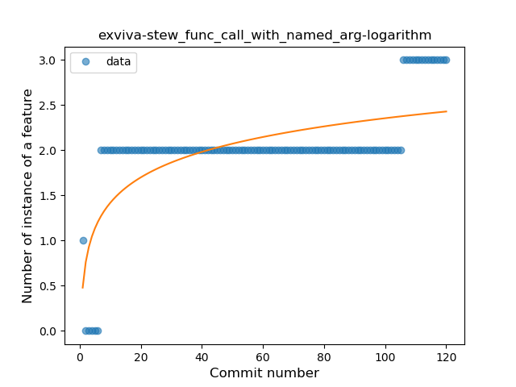
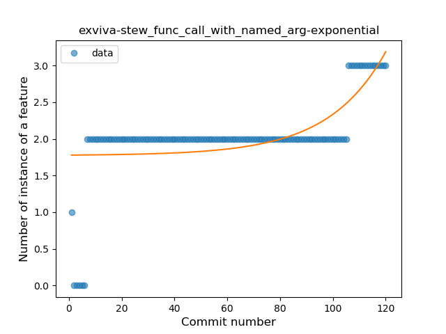
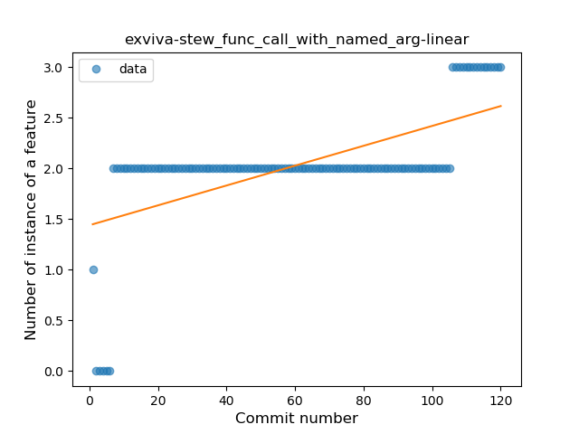
### <a name="data_class">Data Class</a>
----
#### Functions
* **Plateau Sudden Decline - Binary Sigmoid:** 
    * **R_Squared:** 0.88170653
* **Sudden Decline - Exponential:** 
    * **R_Squared:** 0.57722149
* **Constant Decline - Linear:** 
    * **R_Squared:** 0.4961225
* **Sudden Rise Plateau - Logarithm:** 
    * **R_Squared:** -0.0

**Plots** :chart_with_upwards_trend:
-----

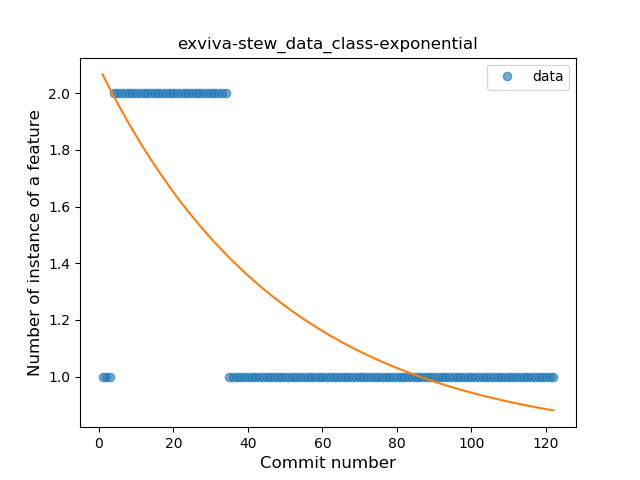

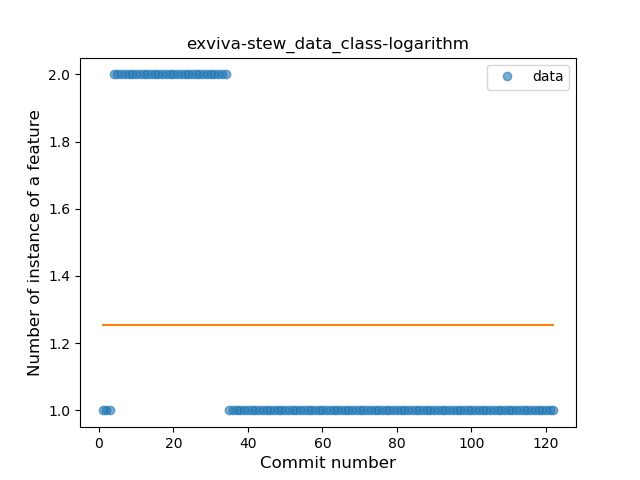
### <a name="property_delegation">Property Delegation</a>
----
#### Functions
* **Plateau Sudden Decline - Binary Sigmoid:** 
    * **R_Squared:** 1.0
* **Instability - Polinomial 4:** 
    * **R_Squared:** 0.83710407
* **Instability - Polinomial 3:** )
    * **R_Squared:** 0.82352941
* **Constant Decline - Linear:** 
    * **R_Squared:** 0.50769231
* **Sudden Rise Plateau - Logarithm:** 
    * **R_Squared:** -0.0

**Plots** :chart_with_upwards_trend:
-----

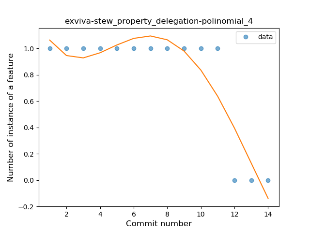
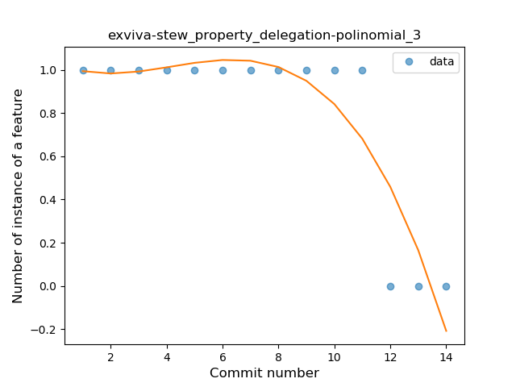
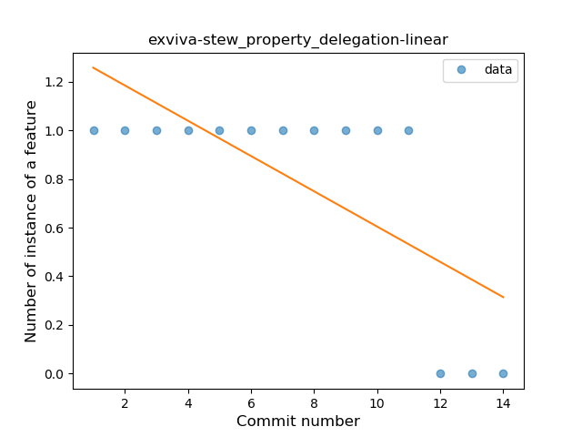
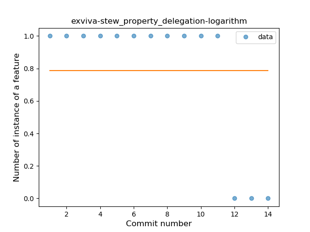
