## fedepaol-BikeSharing
----
#### Metrics provided by Detekt
* Number of lines of code 1096
* Number of Kotlin files: 22
* Cyclomatic complexity: 145
* Cyclomatic complexity by thousands of lines: 275 

----
**5** features analyzed

*	<a href="#type_inference">Type Inference</a> 
*	<a href="#lambda">Lambda</a> 
*	<a href="#safe_call">Safe Call</a> 
*	<a href="#when_expr">When expression</a> 
*	<a href="#data_class">Data Class</a> 

### <a name="type_inference">Type Inference</a>
----
#### Functions
* **Sudden Rise - Exponential:** 
    * **R_Squared:** 0.94220521
* **Constant Rise - Linear:** 
    * **R_Squared:** 0.87303856
* **Sudden Rise Plateau - Logarithm:** 
    * **R_Squared:** 0.50180446

**Plots** :chart_with_upwards_trend:
-----

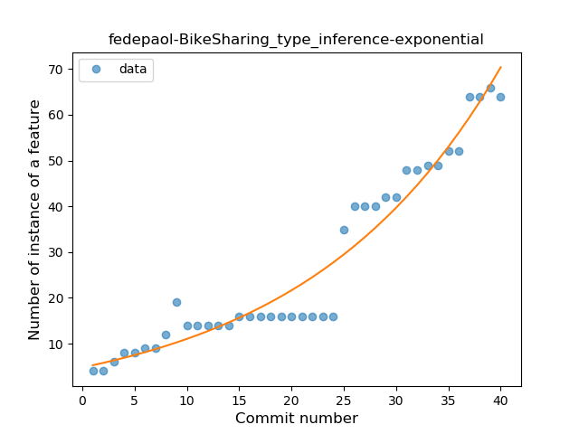
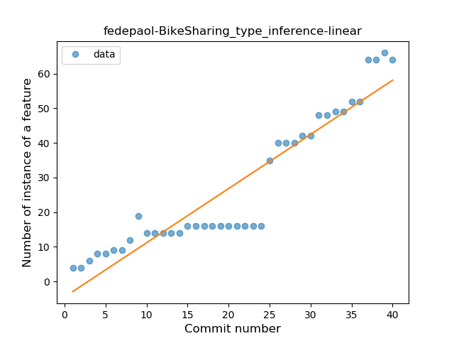
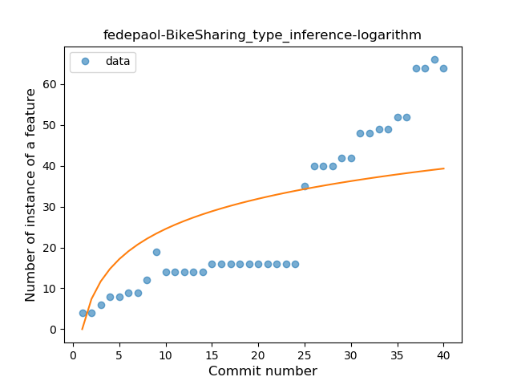
### <a name="lambda">Lambda</a>
----
#### Functions
* **Plateau Gradual Rise - Sigmoid:** 
    * **R_Squared:** 0.95514015
* **Instability - Polinomial 4:** 
    * **R_Squared:** 0.96377542
* **Sudden Rise - Exponential:** 
    * **R_Squared:** 0.90173772
* **Constant Rise - Linear:** 
    * **R_Squared:** 0.81840057
* **Sudden Rise Plateau - Logarithm:** 
    * **R_Squared:** 0.46920006

**Plots** :chart_with_upwards_trend:
-----

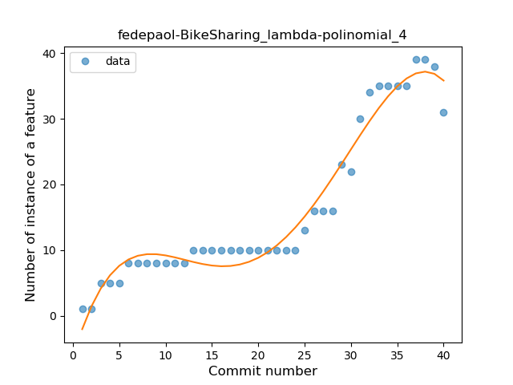

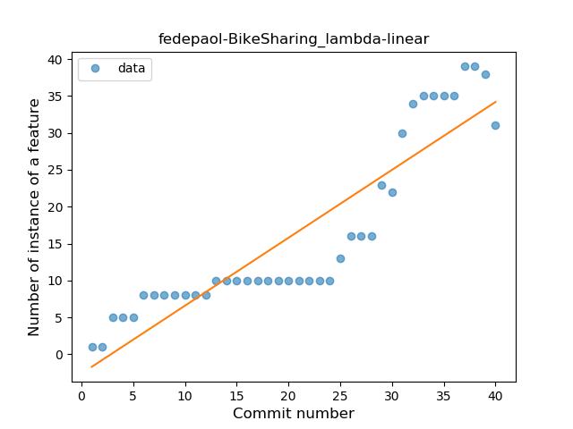
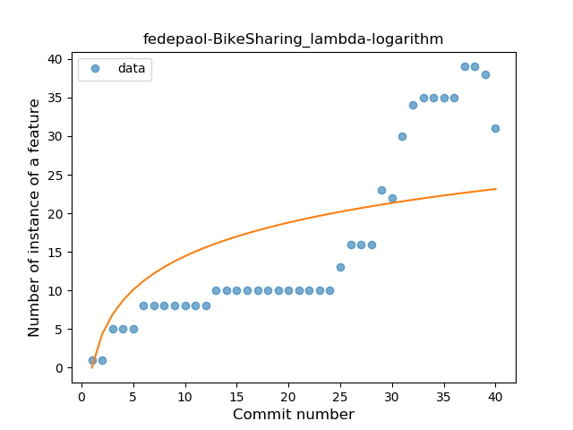
### <a name="safe_call">Safe Call</a>
----
#### Functions
* **Sudden Rise Plateau - Logarithm:** 
    * **R_Squared:** 0.90543143
* **Constant Rise - Linear:** 
    * **R_Squared:** 0.85793097

**Plots** :chart_with_upwards_trend:
-----

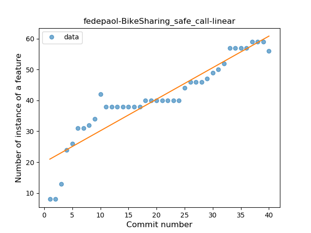
### <a name="when_expr">When expression</a>
----
#### Functions
* **Plateau Gradual Rise - Sigmoid:** 
    * **R_Squared:** 0.9559322
* **Sudden Rise - Exponential:** 
    * **R_Squared:** 0.94566419
* **Constant Rise - Linear:** 
    * **R_Squared:** 0.72732398
* **Sudden Rise Plateau - Logarithm:** 
    * **R_Squared:** 0.34538623

**Plots** :chart_with_upwards_trend:
-----

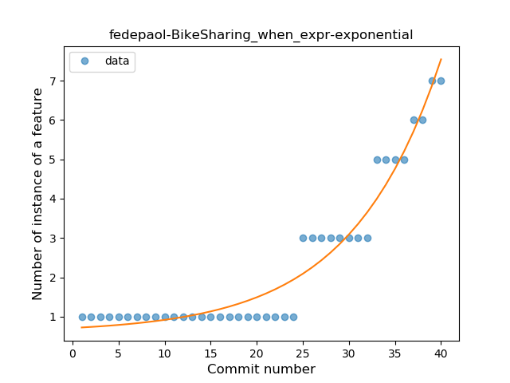
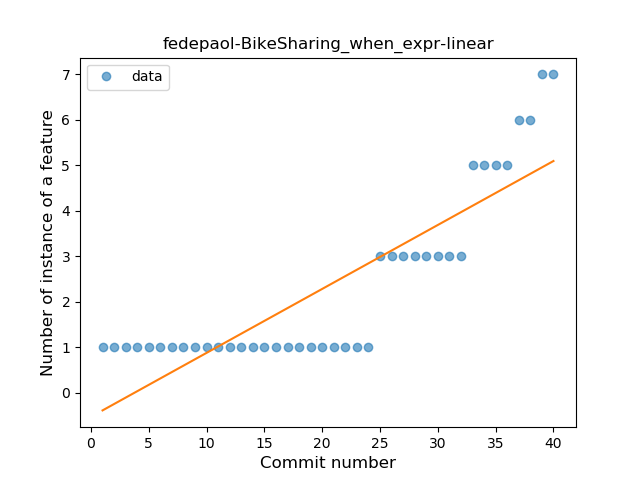
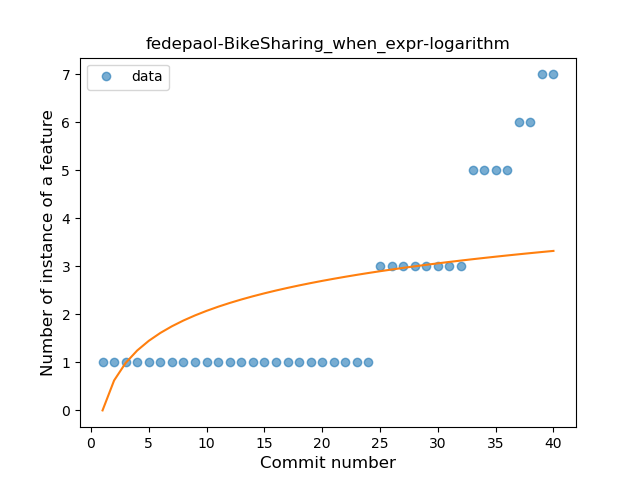
### <a name="data_class">Data Class</a>
----
#### Functions
* **Plateau Gradual Rise - Sigmoid:** 
    * **R_Squared:** 0.95581472
* **Instability - Polinomial 3:** )
    * **R_Squared:** 0.91632752
* **Sudden Rise - Exponential:** 
    * **R_Squared:** 0.84429592
* **Constant Rise - Linear:** 
    * **R_Squared:** 0.81056762
* **Sudden Rise Plateau - Logarithm:** 
    * **R_Squared:** 0.49198419

**Plots** :chart_with_upwards_trend:
-----

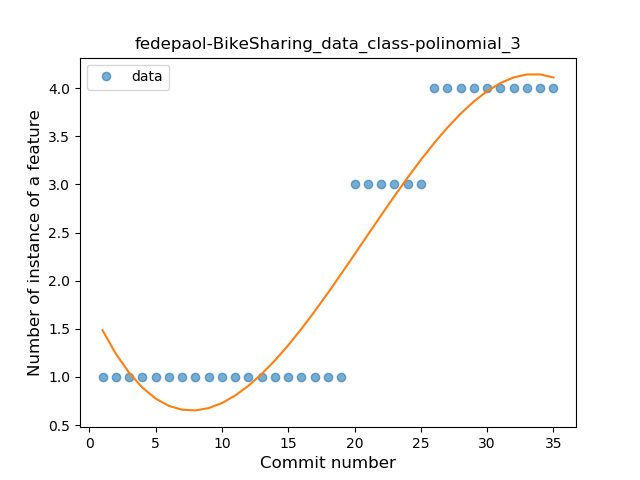
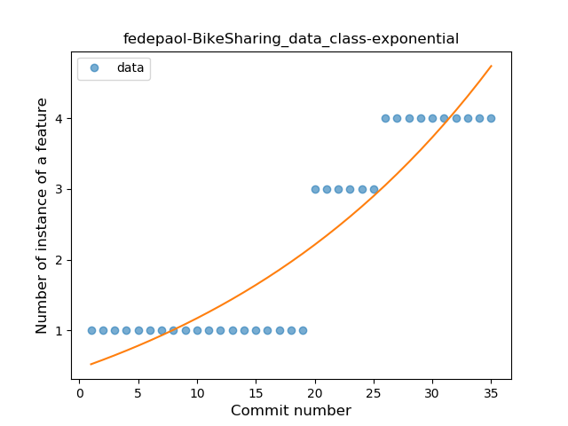
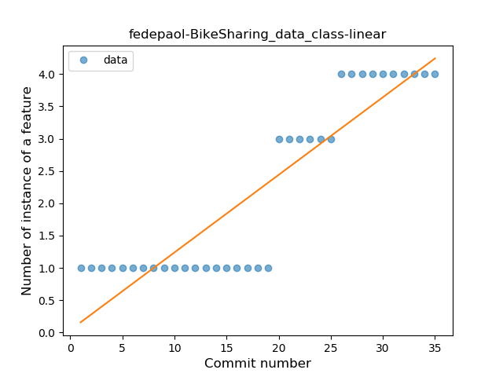
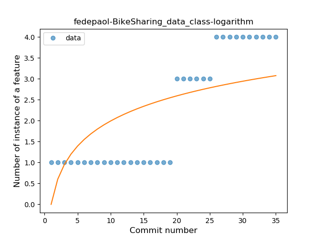
