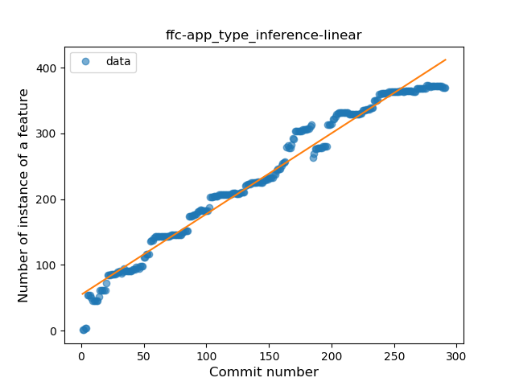
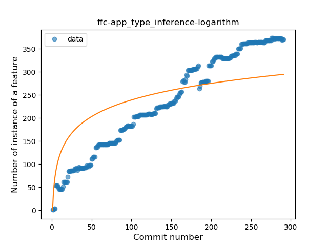
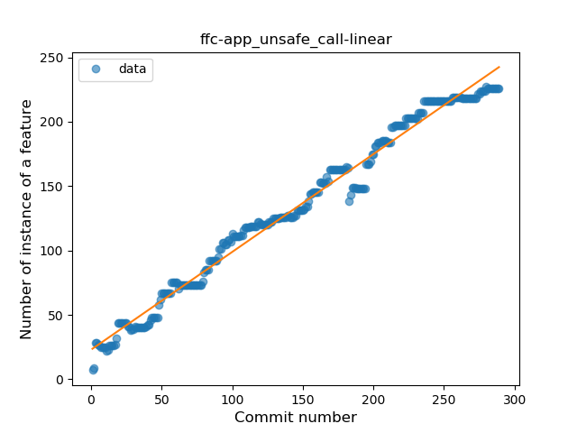
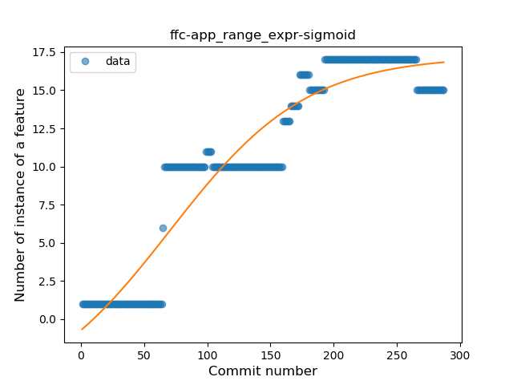
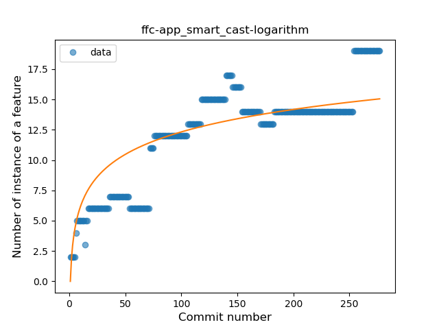
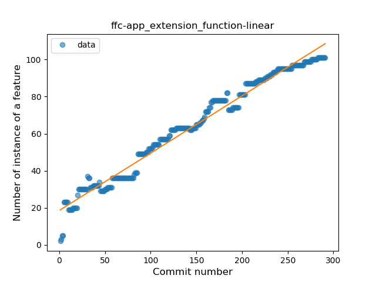
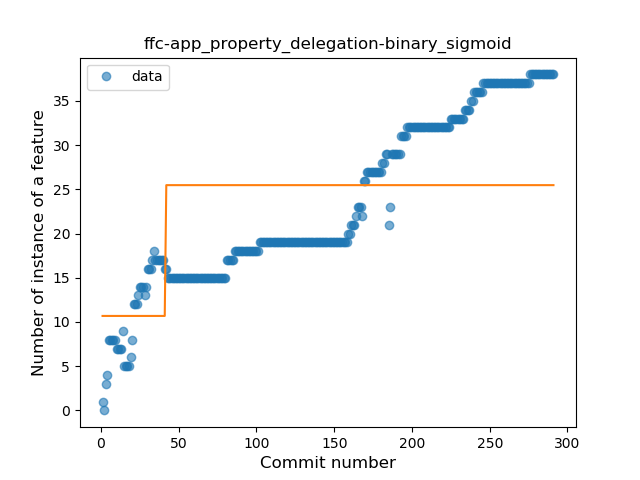

## ffc-app
----
#### Metrics provided by Detekt
* Number of lines of code 10128
* Number of Kotlin files: 162
* Cyclomatic complexity: 1188
* Cyclomatic complexity by thousands of lines: 272 

----
**15** features analyzed

*	<a href="#type_inference">Type Inference</a> 
*	<a href="#lambda">Lambda</a> 
*	<a href="#safe_call">Safe Call</a> 
*	<a href="#when_expr">When expression</a> 
*	<a href="#unsafe_call">Unsafe Call</a> 
*	<a href="#companion_object">Companion Object</a> 
*	<a href="#string_template">String Template</a> 
*	<a href="#func_with_default_value">Function with Default Value</a> 
*	<a href="#range_expr">Range Expression</a> 
*	<a href="#smart_cast">Smart Cast</a> 
*	<a href="#data_class">Data Class</a> 
*	<a href="#func_call_with_named_arg">Function call with Named Argument</a> 
*	<a href="#extension_function">Extension Function</a> 
*	<a href="#property_delegation">Property Delegation</a> 
*	<a href="#inline_func">Inline Function</a> 

### <a name="type_inference">Type Inference</a>
----
#### Functions
* **Constant Rise - Linear:** 
    * **R_Squared:** 0.97506356
* **Sudden Rise Plateau - Logarithm:** 
    * **R_Squared:** 0.63966295

**Plots** :chart_with_upwards_trend:
-----

### <a name="lambda">Lambda</a>
----
#### Functions
* **Constant Rise - Linear:** 
    * **R_Squared:** 0.98377688
* **Sudden Rise Plateau - Logarithm:** 
    * **R_Squared:** 0.60837033
* **Plateau Sudden Rise - Binary Sigmoid:** 
    * **R_Squared:** 0.53430169

**Plots** :chart_with_upwards_trend:
-----

### <a name="safe_call">Safe Call</a>
----
#### Functions
* **Constant Rise - Linear:** 
    * **R_Squared:** 0.98087607
* **Sudden Rise - Exponential:** 
    * **R_Squared:** 0.9828356
* **Plateau Sudden Rise - Binary Sigmoid:** 
    * **R_Squared:** 0.73283157
* **Sudden Rise Plateau - Logarithm:** 
    * **R_Squared:** 0.54709003

**Plots** :chart_with_upwards_trend:
-----

### <a name="when_expr">When expression</a>
----
#### Functions
* **Constant Rise - Linear:** 
    * **R_Squared:** 0.90466696
* **Sudden Rise Plateau - Logarithm:** 
    * **R_Squared:** 0.542754
* **Plateau Sudden Rise - Binary Sigmoid:** 
    * **R_Squared:** 0.24789181

**Plots** :chart_with_upwards_trend:
-----

### <a name="unsafe_call">Unsafe Call</a>
----
#### Functions
* **Constant Rise - Linear:** 
    * **R_Squared:** 0.98378108
* **Plateau Sudden Rise - Binary Sigmoid:** 
    * **R_Squared:** 0.71819689
* **Sudden Rise Plateau - Logarithm:** 
    * **R_Squared:** 0.59056979

**Plots** :chart_with_upwards_trend:
-----

### <a name="companion_object">Companion Object</a>
----
#### Functions
* **Constant Rise - Linear:** 
    * **R_Squared:** 0.86928232
* **Sudden Rise Plateau - Logarithm:** 
    * **R_Squared:** 0.82584811

**Plots** :chart_with_upwards_trend:
-----

### <a name="string_template">String Template</a>
----
#### Functions
* **Constant Rise - Linear:** 
    * **R_Squared:** 0.90345426
* **Sudden Rise Plateau - Logarithm:** 
    * **R_Squared:** 0.78547913

**Plots** :chart_with_upwards_trend:
-----

### <a name="func_with_default_value">Function with Default Value</a>
----
#### Functions
* **Constant Rise - Linear:** 
    * **R_Squared:** 0.94343094
* **Sudden Rise Plateau - Logarithm:** 
    * **R_Squared:** 0.67920892
* **Plateau Sudden Rise - Binary Sigmoid:** 
    * **R_Squared:** 0.259295

**Plots** :chart_with_upwards_trend:
-----

### <a name="range_expr">Range Expression</a>
----
#### Functions
* **Plateau Gradual Rise - Sigmoid:** 
    * **R_Squared:** 0.89860176
* **Constant Rise - Linear:** 
    * **R_Squared:** 0.82934546
* **Sudden Rise Plateau - Logarithm:** 
    * **R_Squared:** 0.52141911

**Plots** :chart_with_upwards_trend:
-----

### <a name="smart_cast">Smart Cast</a>
----
#### Functions
* **Constant Rise - Linear:** 
    * **R_Squared:** 0.74010244
* **Sudden Rise Plateau - Logarithm:** 
    * **R_Squared:** 0.6958027

**Plots** :chart_with_upwards_trend:
-----

### <a name="data_class">Data Class</a>
----
#### Functions
* **Plateau Sudden Decline - Binary Sigmoid:** 
    * **R_Squared:** 0.63002109
* **Sudden Decline - Exponential:** 
    * **R_Squared:** 0.34848298
* **Constant Decline - Linear:** 
    * **R_Squared:** 0.00799828
* **Sudden Rise Plateau - Logarithm:** 
    * **R_Squared:** -0.0

**Plots** :chart_with_upwards_trend:
-----

### <a name="func_call_with_named_arg">Function call with Named Argument</a>
----
#### Functions
* **Constant Rise - Linear:** 
    * **R_Squared:** 0.92944699
* **Sudden Rise - Exponential:** 
    * **R_Squared:** 0.93363057
* **Sudden Rise Plateau - Logarithm:** 
    * **R_Squared:** 0.50309263
* **Plateau Sudden Rise - Binary Sigmoid:** 
    * **R_Squared:** 0.14206991

**Plots** :chart_with_upwards_trend:
-----

### <a name="extension_function">Extension Function</a>
----
#### Functions
* **Constant Rise - Linear:** 
    * **R_Squared:** 0.97578068
* **Sudden Rise Plateau - Logarithm:** 
    * **R_Squared:** 0.65792814
* **Plateau Gradual Rise - Sigmoid:** 
    * **R_Squared:** 0.4411181

**Plots** :chart_with_upwards_trend:
-----

### <a name="property_delegation">Property Delegation</a>
----
#### Functions
* **Constant Rise - Linear:** 
    * **R_Squared:** 0.93169579
* **Sudden Rise - Exponential:** 
    * **R_Squared:** 0.93619912
* **Sudden Rise Plateau - Logarithm:** 
    * **R_Squared:** 0.61657204
* **Plateau Sudden Rise - Binary Sigmoid:** 
    * **R_Squared:** 0.29131891

**Plots** :chart_with_upwards_trend:
-----

### <a name="inline_func">Inline Function</a>
----
#### Functions
* **Sudden Rise - Exponential:** 
    * **R_Squared:** 0.60715268
* **Constant Rise - Linear:** 
    * **R_Squared:** 0.59533204
* **Sudden Rise Plateau - Logarithm:** 
    * **R_Squared:** 0.30914386
* **Plateau Sudden Rise - Binary Sigmoid:** 
    * **R_Squared:** 0.00563549

**Plots** :chart_with_upwards_trend:
-----

