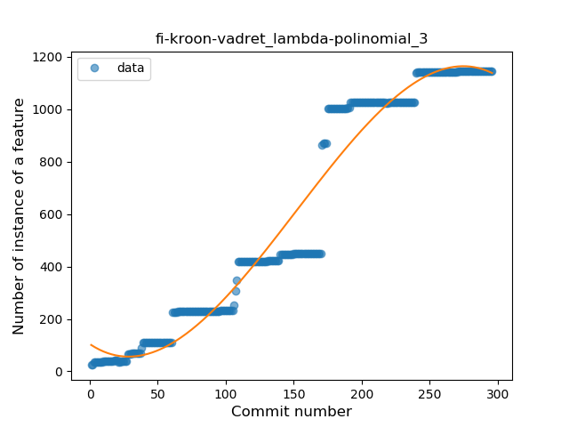
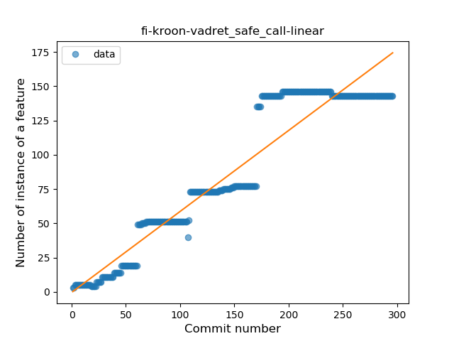
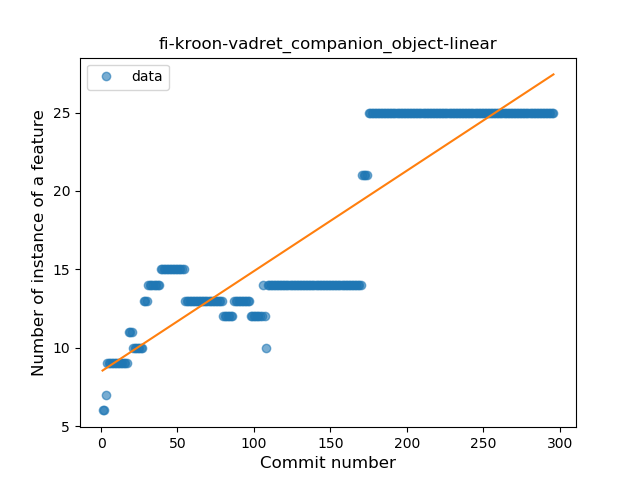
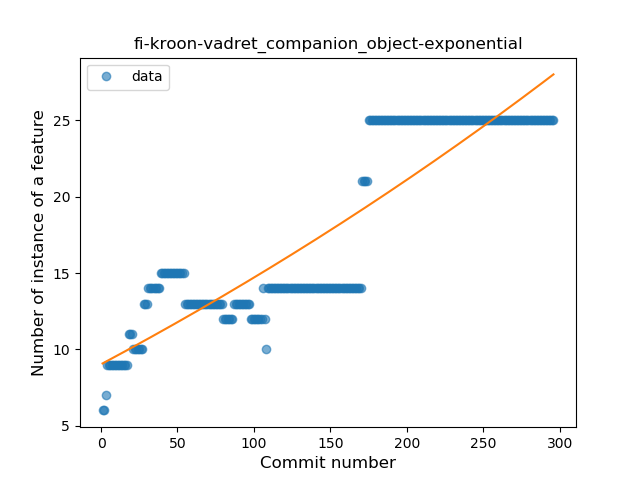
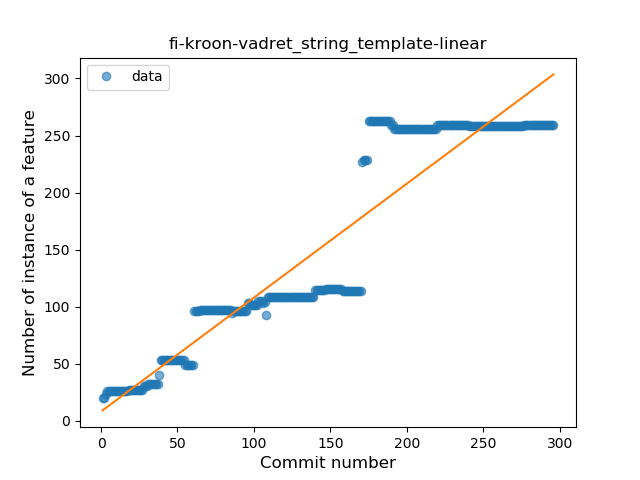
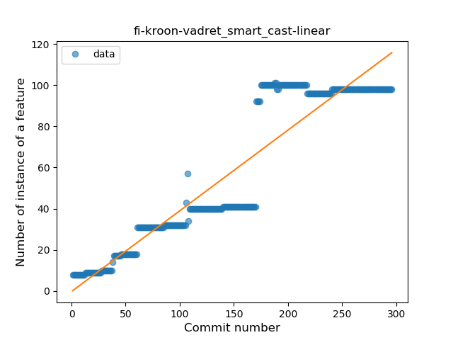
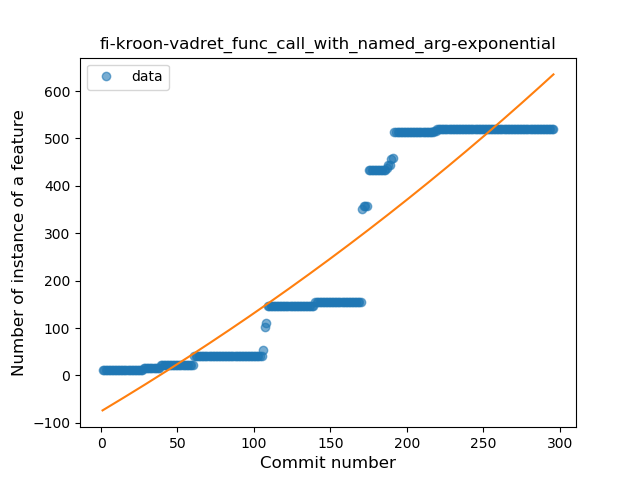
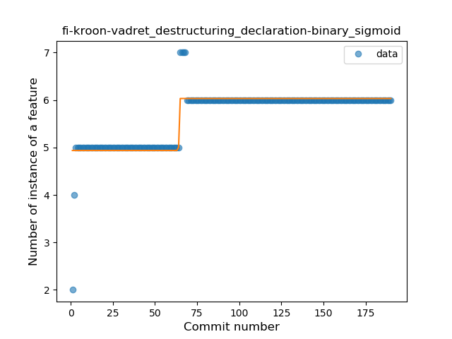

## fi-kroon-vadret
----
#### Metrics provided by Detekt
* Number of lines of code 23462
* Number of Kotlin files: 398
* Cyclomatic complexity: 2374
* Cyclomatic complexity by thousands of lines: 177 

----
**20** features analyzed

*	<a href="#type_inference">Type Inference</a> 
*	<a href="#lambda">Lambda</a> 
*	<a href="#safe_call">Safe Call</a> 
*	<a href="#when_expr">When expression</a> 
*	<a href="#unsafe_call">Unsafe Call</a> 
*	<a href="#companion_object">Companion Object</a> 
*	<a href="#string_template">String Template</a> 
*	<a href="#func_with_default_value">Function with Default Value</a> 
*	<a href="#singleton">Singleton</a> 
*	<a href="#range_expr">Range Expression</a> 
*	<a href="#smart_cast">Smart Cast</a> 
*	<a href="#data_class">Data Class</a> 
*	<a href="#func_call_with_named_arg">Function call with Named Argument</a> 
*	<a href="#extension_function">Extension Function</a> 
*	<a href="#property_delegation">Property Delegation</a> 
*	<a href="#destructuring_declaration">Destructuring Declaration</a> 
*	<a href="#inline_func">Inline Function</a> 
*	<a href="#overloaded_op">Overloaded Operator</a> 
*	<a href="#sealed_class">Sealed Class</a> 
*	<a href="#super_delegation">Super Delegation</a> 

### <a name="type_inference">Type Inference</a>
----
#### Functions
* **Constant Rise - Linear:** 
    * **R_Squared:** 0.85766831
* **Sudden Rise Plateau - Logarithm:** 
    * **R_Squared:** 0.67442712
* **Plateau Sudden Rise - Binary Sigmoid:** 
    * **R_Squared:** 0.07886443

**Plots** :chart_with_upwards_trend:
-----

### <a name="lambda">Lambda</a>
----
#### Functions
* **Instability - Polinomial 3:** )
    * **R_Squared:** 0.95386364
* **Constant Rise - Linear:** 
    * **R_Squared:** 0.92431209
* **Sudden Rise - Exponential:** 
    * **R_Squared:** 0.92469024
* **Plateau Sudden Rise - Binary Sigmoid:** 
    * **R_Squared:** 0.7983408
* **Sudden Rise Plateau - Logarithm:** 
    * **R_Squared:** 0.3967489

**Plots** :chart_with_upwards_trend:
-----

### <a name="safe_call">Safe Call</a>
----
#### Functions
* **Constant Rise - Linear:** 
    * **R_Squared:** 0.9036915
* **Plateau Sudden Rise - Binary Sigmoid:** 
    * **R_Squared:** 0.57209676
* **Sudden Rise Plateau - Logarithm:** 
    * **R_Squared:** 0.4768665

**Plots** :chart_with_upwards_trend:
-----

### <a name="when_expr">When expression</a>
----
#### Functions
* **Constant Rise - Linear:** 
    * **R_Squared:** 0.90230367
* **Plateau Sudden Rise - Binary Sigmoid:** 
    * **R_Squared:** 0.47937283
* **Sudden Rise Plateau - Logarithm:** 
    * **R_Squared:** 0.42759145

**Plots** :chart_with_upwards_trend:
-----

### <a name="unsafe_call">Unsafe Call</a>
----
#### Functions
* **Constant Rise - Linear:** 
    * **R_Squared:** 0.85127369
* **Plateau Gradual Rise - Sigmoid:** 
    * **R_Squared:** 0.77494975
* **Sudden Rise Plateau - Logarithm:** 
    * **R_Squared:** 0.61752848

**Plots** :chart_with_upwards_trend:
-----

### <a name="companion_object">Companion Object</a>
----
#### Functions
* **Constant Rise - Linear:** 
    * **R_Squared:** 0.80239305
* **Sudden Rise - Exponential:** 
    * **R_Squared:** 0.80454617
* **Sudden Rise Plateau - Logarithm:** 
    * **R_Squared:** 0.57186546
* **Plateau Sudden Rise - Binary Sigmoid:** 
    * **R_Squared:** 0.07427886

**Plots** :chart_with_upwards_trend:
-----

### <a name="string_template">String Template</a>
----
#### Functions
* **Constant Rise - Linear:** 
    * **R_Squared:** 0.87828901
* **Plateau Sudden Rise - Binary Sigmoid:** 
    * **R_Squared:** 0.58460403
* **Sudden Rise Plateau - Logarithm:** 
    * **R_Squared:** 0.46368211

**Plots** :chart_with_upwards_trend:
-----

### <a name="func_with_default_value">Function with Default Value</a>
----
#### Functions
* **Constant Rise - Linear:** 
    * **R_Squared:** 0.91129075
* **Sudden Rise Plateau - Logarithm:** 
    * **R_Squared:** 0.47397396
* **Plateau Gradual Rise - Sigmoid:** 
    * **R_Squared:** 0.31154265

**Plots** :chart_with_upwards_trend:
-----

### <a name="singleton">Singleton</a>
----
#### Functions
* **Sudden Rise Plateau - Logarithm:** 
    * **R_Squared:** 0.72261769
* **Constant Rise - Linear:** 
    * **R_Squared:** 0.65228907

**Plots** :chart_with_upwards_trend:
-----

### <a name="range_expr">Range Expression</a>
----
#### Functions
* **Plateau Gradual Rise - Sigmoid:** 
    * **R_Squared:** 0.87551485
* **Sudden Rise Plateau - Logarithm:** 
    * **R_Squared:** 0.69201716
* **Constant Rise - Linear:** 
    * **R_Squared:** 0.62126775

**Plots** :chart_with_upwards_trend:
-----

### <a name="smart_cast">Smart Cast</a>
----
#### Functions
* **Constant Rise - Linear:** 
    * **R_Squared:** 0.86943273
* **Plateau Gradual Rise - Sigmoid:** 
    * **R_Squared:** 0.54065658
* **Sudden Rise Plateau - Logarithm:** 
    * **R_Squared:** 0.43534099

**Plots** :chart_with_upwards_trend:
-----

### <a name="data_class">Data Class</a>
----
#### Functions
* **Constant Rise - Linear:** 
    * **R_Squared:** 0.88351276
* **Sudden Rise Plateau - Logarithm:** 
    * **R_Squared:** 0.43617641
* **Plateau Sudden Rise - Binary Sigmoid:** 
    * **R_Squared:** 0.25646556

**Plots** :chart_with_upwards_trend:
-----

### <a name="func_call_with_named_arg">Function call with Named Argument</a>
----
#### Functions
* **Instability - Polinomial 3:** )
    * **R_Squared:** 0.94365169
* **Constant Rise - Linear:** 
    * **R_Squared:** 0.87585723
* **Sudden Rise - Exponential:** 
    * **R_Squared:** 0.87951676
* **Sudden Rise Plateau - Logarithm:** 
    * **R_Squared:** 0.31844361

**Plots** :chart_with_upwards_trend:
-----

### <a name="extension_function">Extension Function</a>
----
#### Functions
* **Constant Rise - Linear:** 
    * **R_Squared:** 0.74524869
* **Sudden Rise Plateau - Logarithm:** 
    * **R_Squared:** 0.61125814

**Plots** :chart_with_upwards_trend:
-----

### <a name="property_delegation">Property Delegation</a>
----
#### Functions
* **Sudden Rise - Exponential:** 
    * **R_Squared:** 0.88341956
* **Constant Rise - Linear:** 
    * **R_Squared:** 0.69342017
* **Sudden Rise Plateau - Logarithm:** 
    * **R_Squared:** 0.17989449
* **Plateau Gradual Rise - Sigmoid:** 
    * **R_Squared:** 0.14166228

**Plots** :chart_with_upwards_trend:
-----

### <a name="destructuring_declaration">Destructuring Declaration</a>
----
#### Functions
* **Plateau Sudden Rise - Binary Sigmoid:** 
    * **R_Squared:** 0.78866228
* **Sudden Rise Plateau - Logarithm:** 
    * **R_Squared:** 0.63699306
* **Constant Rise - Linear:** 
    * **R_Squared:** 0.50036224

**Plots** :chart_with_upwards_trend:
-----

### <a name="inline_func">Inline Function</a>
----
#### Functions
* **Plateau Gradual Rise - Sigmoid:** 
    * **R_Squared:** 0.88006709
* **Constant Rise - Linear:** 
    * **R_Squared:** 0.80068388
* **Sudden Rise Plateau - Logarithm:** 
    * **R_Squared:** 0.47085333

**Plots** :chart_with_upwards_trend:
-----

### <a name="overloaded_op">Overloaded Operator</a>
----
#### Functions
* **Constant Rise - Linear:** 
    * **R_Squared:** 0.87010953
* **Sudden Rise - Exponential:** 
    * **R_Squared:** 0.87055576
* **Plateau Gradual Rise - Sigmoid:** 
    * **R_Squared:** 0.78936206
* **Sudden Rise Plateau - Logarithm:** 
    * **R_Squared:** 0.31235921

**Plots** :chart_with_upwards_trend:
-----

### <a name="sealed_class">Sealed Class</a>
----
#### Functions
* **Constant Rise - Linear:** 
    * **R_Squared:** 0.85904398
* **Sudden Rise Plateau - Logarithm:** 
    * **R_Squared:** 0.3671685

**Plots** :chart_with_upwards_trend:
-----

### <a name="super_delegation">Super Delegation</a>
----
#### Functions
* **Constant Rise - Linear:** 
    * **R_Squared:** 0.7467344
* **Sudden Rise Plateau - Logarithm:** 
    * **R_Squared:** 0.55079778

**Plots** :chart_with_upwards_trend:
-----

