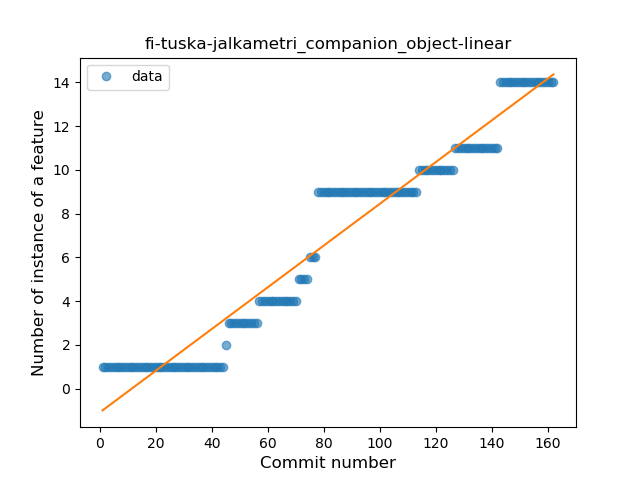
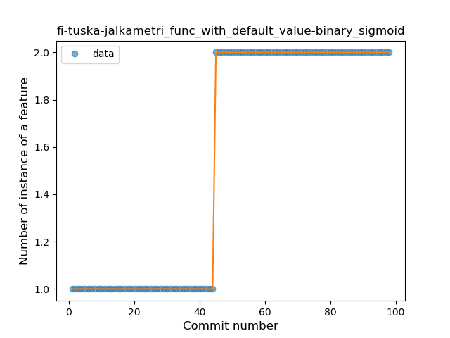

## fi-tuska-jalkametri
----
#### Metrics provided by Detekt
* Number of lines of code 3524
* Number of Kotlin files: 32
* Cyclomatic complexity: 512
* Cyclomatic complexity by thousands of lines: 279 

----
**10** features analyzed

*	<a href="#type_inference">Type Inference</a> 
*	<a href="#lambda">Lambda</a> 
*	<a href="#safe_call">Safe Call</a> 
*	<a href="#when_expr">When expression</a> 
*	<a href="#unsafe_call">Unsafe Call</a> 
*	<a href="#companion_object">Companion Object</a> 
*	<a href="#string_template">String Template</a> 
*	<a href="#func_with_default_value">Function with Default Value</a> 
*	<a href="#singleton">Singleton</a> 
*	<a href="#range_expr">Range Expression</a> 

### <a name="type_inference">Type Inference</a>
----
#### Functions
* **Sudden Rise - Exponential:** 
    * **R_Squared:** 0.97413051
* **Constant Rise - Linear:** 
    * **R_Squared:** 0.9605044
* **Sudden Rise Plateau - Logarithm:** 
    * **R_Squared:** 0.5053734
* **Plateau Sudden Rise - Binary Sigmoid:** 
    * **R_Squared:** 0.33237248

**Plots** :chart_with_upwards_trend:
-----

### <a name="lambda">Lambda</a>
----
#### Functions
* **Constant Rise - Linear:** 
    * **R_Squared:** 0.97136565
* **Sudden Rise - Exponential:** 
    * **R_Squared:** 0.97273342
* **Sudden Rise Plateau - Logarithm:** 
    * **R_Squared:** 0.58424707
* **Plateau Gradual Rise - Sigmoid:** 
    * **R_Squared:** 0.29236622

**Plots** :chart_with_upwards_trend:
-----

### <a name="safe_call">Safe Call</a>
----
#### Functions
* **Sudden Rise - Exponential:** 
    * **R_Squared:** 0.85324272
* **Constant Rise - Linear:** 
    * **R_Squared:** 0.82274463
* **Sudden Rise Plateau - Logarithm:** 
    * **R_Squared:** 0.63894238

**Plots** :chart_with_upwards_trend:
-----

### <a name="when_expr">When expression</a>
----
#### Functions
* **Constant Rise - Linear:** 
    * **R_Squared:** 0.69305602
* **Sudden Rise - Exponential:** 
    * **R_Squared:** 0.70283256
* **Sudden Rise Plateau - Logarithm:** 
    * **R_Squared:** 0.53947515

**Plots** :chart_with_upwards_trend:
-----

### <a name="unsafe_call">Unsafe Call</a>
----
#### Functions
* **Instability - Polinomial 3:** )
    * **R_Squared:** 0.78623246
* **Constant Rise - Linear:** 
    * **R_Squared:** 0.55890965
* **Sudden Rise Plateau - Logarithm:** 
    * **R_Squared:** 0.34225613
* **Plateau Sudden Rise - Binary Sigmoid:** 
    * **R_Squared:** 0.21615169

**Plots** :chart_with_upwards_trend:
-----

### <a name="companion_object">Companion Object</a>
----
#### Functions
* **Constant Rise - Linear:** 
    * **R_Squared:** 0.94463605
* **Sudden Rise - Exponential:** 
    * **R_Squared:** 0.94608002
* **Sudden Rise Plateau - Logarithm:** 
    * **R_Squared:** 0.44920642

**Plots** :chart_with_upwards_trend:
-----

### <a name="string_template">String Template</a>
----
#### Functions
* **Sudden Rise Plateau - Logarithm:** 
    * **R_Squared:** 0.65669428
* **Constant Rise - Linear:** 
    * **R_Squared:** 0.53359756

**Plots** :chart_with_upwards_trend:
-----

### <a name="func_with_default_value">Function with Default Value</a>
----
#### Functions
* **Plateau Sudden Rise - Binary Sigmoid:** 
    * **R_Squared:** 1.0
* **Constant Rise - Linear:** 
    * **R_Squared:** 0.74226804
* **Sudden Rise Plateau - Logarithm:** 
    * **R_Squared:** 0.56729228

**Plots** :chart_with_upwards_trend:
-----

### <a name="singleton">Singleton</a>
----
#### Functions
* **Sudden Rise Plateau - Logarithm:** 
    * **R_Squared:** 0.89049344
* **Constant Rise - Linear:** 
    * **R_Squared:** 0.75350596
* **Plateau Sudden Rise - Binary Sigmoid:** 
    * **R_Squared:** 0.49230025

**Plots** :chart_with_upwards_trend:
-----

### <a name="range_expr">Range Expression</a>
----
#### Functions
* **Sudden Decline - Exponential:** 
    * **R_Squared:** 0.82239643
* **Constant Decline - Linear:** 
    * **R_Squared:** 0.08251001
* **Sudden Rise Plateau - Logarithm:** 
    * **R_Squared:** -0.0

**Plots** :chart_with_upwards_trend:
-----

