## fossasia-open-event-android
----
#### Metrics provided by Detekt
* Number of lines of code 7725
* Number of Kotlin files: 122
* Cyclomatic complexity: 925
* Cyclomatic complexity by thousands of lines: 207 

----
**15** features analyzed

*	<a href="#type_inference">Type Inference</a> 
*	<a href="#lambda">Lambda</a> 
*	<a href="#safe_call">Safe Call</a> 
*	<a href="#when_expr">When expression</a> 
*	<a href="#companion_object">Companion Object</a> 
*	<a href="#unsafe_call">Unsafe Call</a> 
*	<a href="#string_template">String Template</a> 
*	<a href="#func_with_default_value">Function with Default Value</a> 
*	<a href="#singleton">Singleton</a> 
*	<a href="#smart_cast">Smart Cast</a> 
*	<a href="#range_expr">Range Expression</a> 
*	<a href="#func_call_with_named_arg">Function call with Named Argument</a> 
*	<a href="#data_class">Data Class</a> 
*	<a href="#property_delegation">Property Delegation</a> 
*	<a href="#destructuring_declaration">Destructuring Declaration</a> 

### <a name="type_inference">Type Inference</a>
----
#### Functions
* **Constant Rise - Linear:** 
    * **R_Squared:** 0.95952912
* **Sudden Rise Plateau - Logarithm:** 
    * **R_Squared:** 0.61424589

**Plots** :chart_with_upwards_trend:
-----

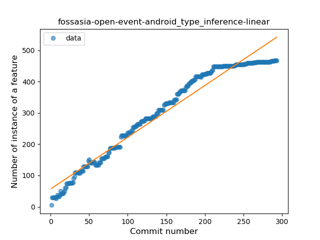

### <a name="lambda">Lambda</a>
----
#### Functions
* **Constant Rise - Linear:** 
    * **R_Squared:** 0.93558237
* **Sudden Rise Plateau - Logarithm:** 
    * **R_Squared:** 0.68310935

**Plots** :chart_with_upwards_trend:
-----

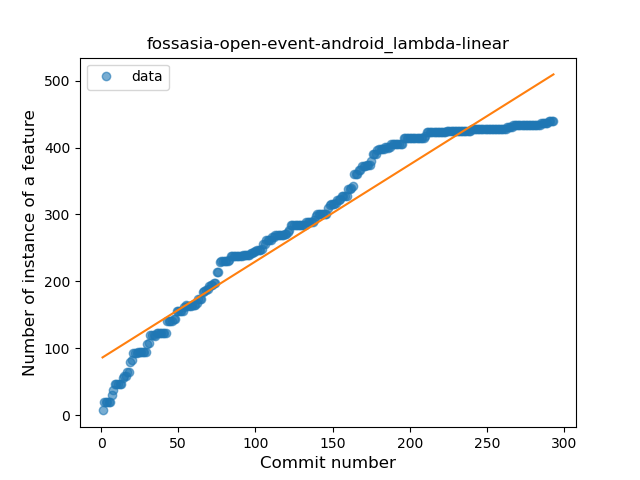
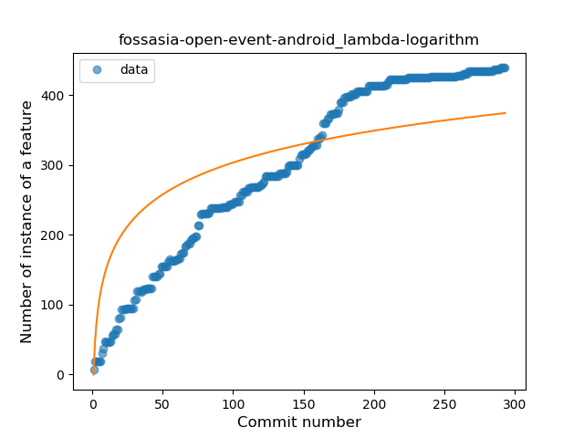
### <a name="safe_call">Safe Call</a>
----
#### Functions
* **Constant Rise - Linear:** 
    * **R_Squared:** 0.96179199
* **Sudden Rise Plateau - Logarithm:** 
    * **R_Squared:** 0.53592983

**Plots** :chart_with_upwards_trend:
-----

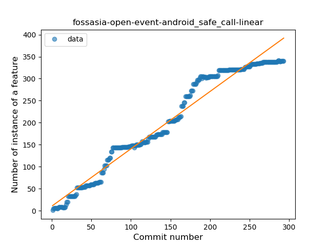
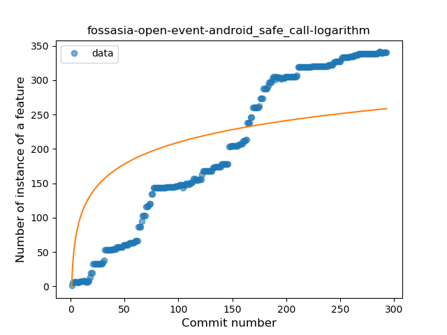
### <a name="when_expr">When expression</a>
----
#### Functions
* **Constant Rise - Linear:** 
    * **R_Squared:** 0.88222428
* **Sudden Rise Plateau - Logarithm:** 
    * **R_Squared:** 0.7316053

**Plots** :chart_with_upwards_trend:
-----

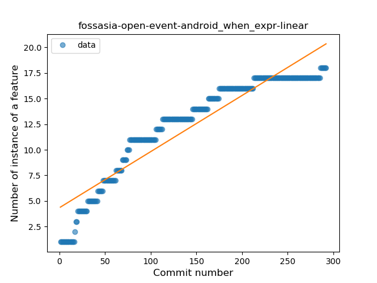
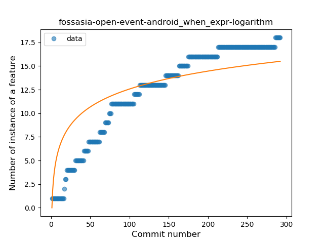
### <a name="companion_object">Companion Object</a>
----
#### Functions
* **Sudden Rise Plateau - Logarithm:** 
    * **R_Squared:** 0.03110378
* **Constant Rise - Linear:** 
    * **R_Squared:** 0.00954729
* **Sudden Rise - Exponential:** 
    * **R_Squared:** 0.0094901

**Plots** :chart_with_upwards_trend:
-----

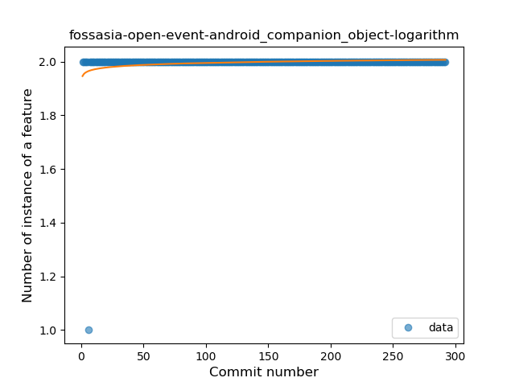
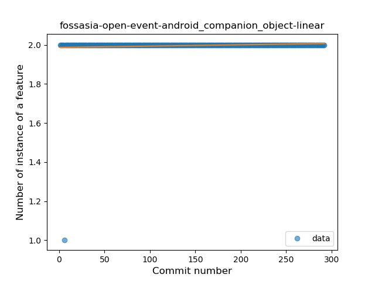

### <a name="unsafe_call">Unsafe Call</a>
----
#### Functions
* **Plateau Sudden Rise - Binary Sigmoid:** 
    * **R_Squared:** 0.97804271
* **Sudden Rise - Exponential:** 
    * **R_Squared:** 0.68386543
* **Constant Rise - Linear:** 
    * **R_Squared:** 0.5067609
* **Sudden Rise Plateau - Logarithm:** 
    * **R_Squared:** 0.15425967

**Plots** :chart_with_upwards_trend:
-----

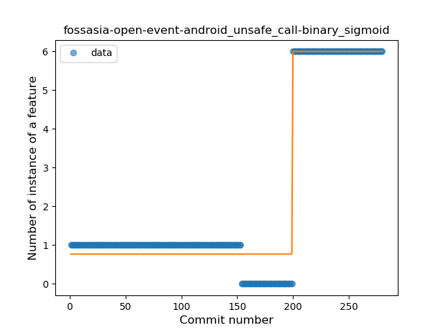
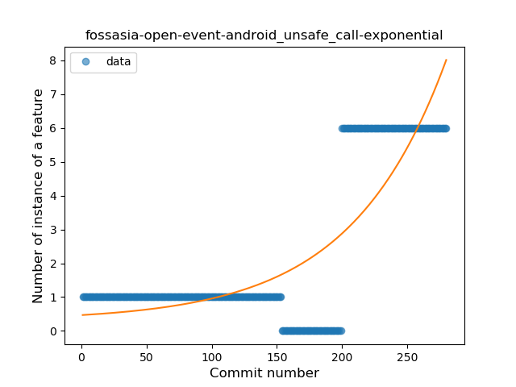
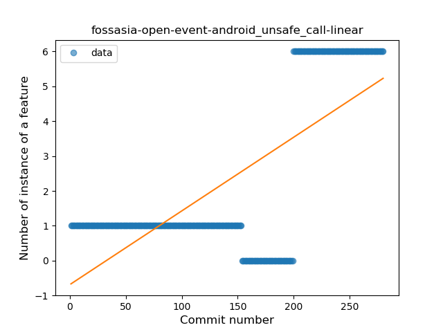
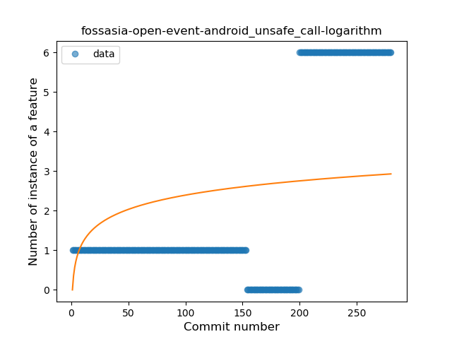
### <a name="string_template">String Template</a>
----
#### Functions
* **Constant Rise - Linear:** 
    * **R_Squared:** 0.94222936
* **Sudden Rise Plateau - Logarithm:** 
    * **R_Squared:** 0.57573456
* **Plateau Gradual Rise - Sigmoid:** 
    * **R_Squared:** 0.34056851

**Plots** :chart_with_upwards_trend:
-----

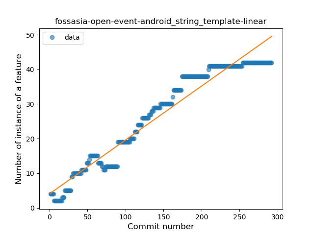
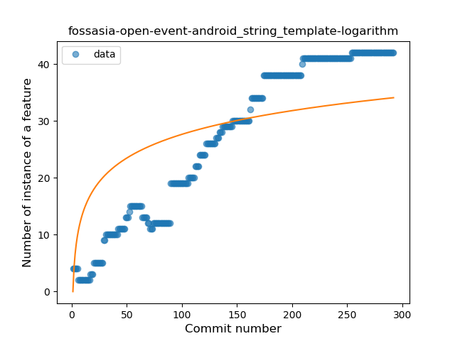
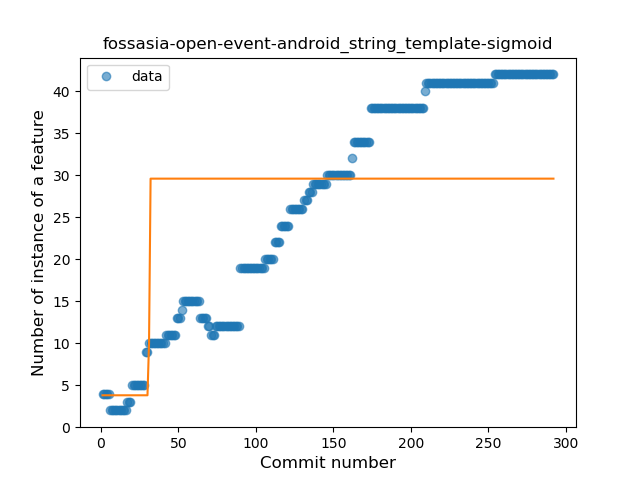
### <a name="func_with_default_value">Function with Default Value</a>
----
#### Functions
* **Constant Rise - Linear:** 
    * **R_Squared:** 0.90765816
* **Sudden Rise Plateau - Logarithm:** 
    * **R_Squared:** 0.82265699

**Plots** :chart_with_upwards_trend:
-----

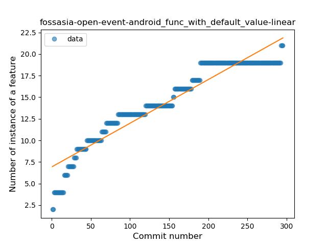
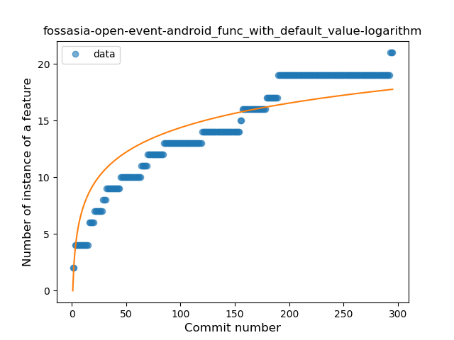
### <a name="singleton">Singleton</a>
----
#### Functions
* **Plateau Gradual Rise - Sigmoid:** 
    * **R_Squared:** 0.4443667
* **Sudden Rise Plateau - Logarithm:** 
    * **R_Squared:** 0.30712505
* **Constant Rise - Linear:** 
    * **R_Squared:** 0.18893104

**Plots** :chart_with_upwards_trend:
-----

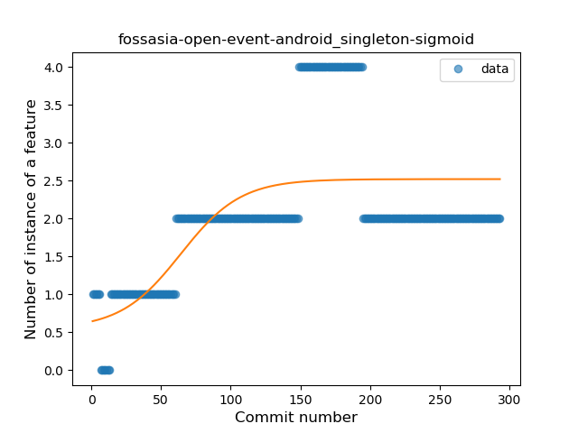
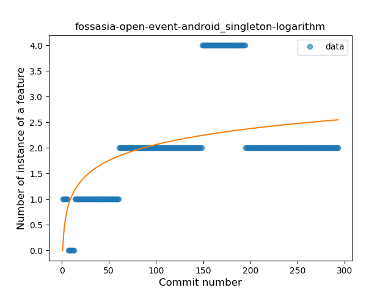
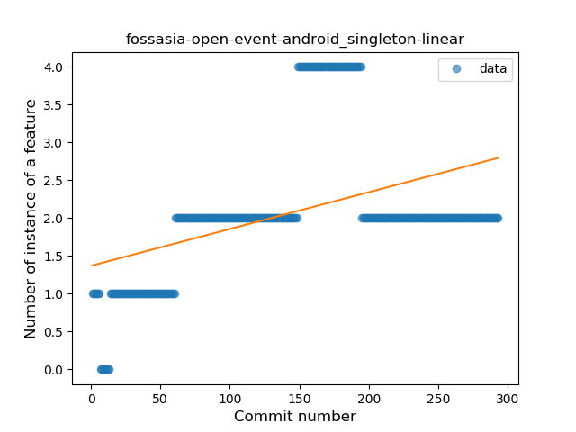
### <a name="smart_cast">Smart Cast</a>
----
#### Functions
* **Plateau Gradual Rise - Sigmoid:** 
    * **R_Squared:** 0.92503852
* **Sudden Rise - Exponential:** 
    * **R_Squared:** 0.88804894
* **Constant Rise - Linear:** 
    * **R_Squared:** 0.65505976
* **Sudden Rise Plateau - Logarithm:** 
    * **R_Squared:** 0.33356025

**Plots** :chart_with_upwards_trend:
-----

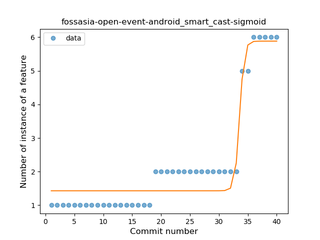
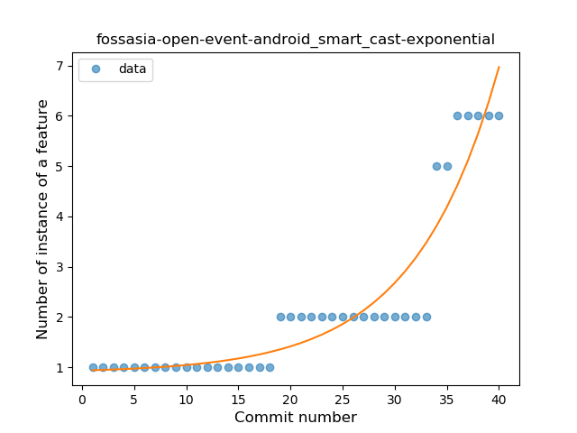
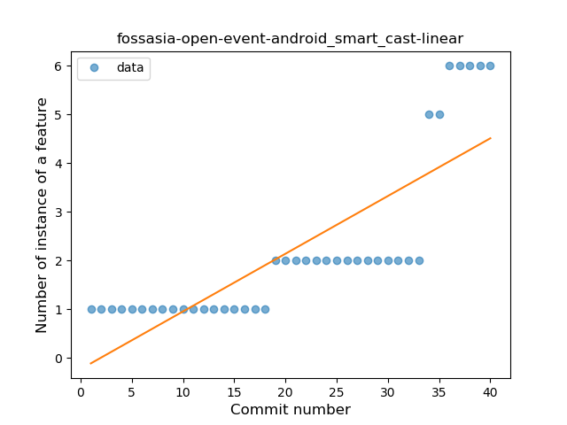

### <a name="range_expr">Range Expression</a>
----
#### Functions
* **Plateau Gradual Rise - Sigmoid:** 
    * **R_Squared:** 0.95984892
* **Constant Rise - Linear:** 
    * **R_Squared:** 0.90429987
* **Sudden Rise Plateau - Logarithm:** 
    * **R_Squared:** 0.45570119

**Plots** :chart_with_upwards_trend:
-----

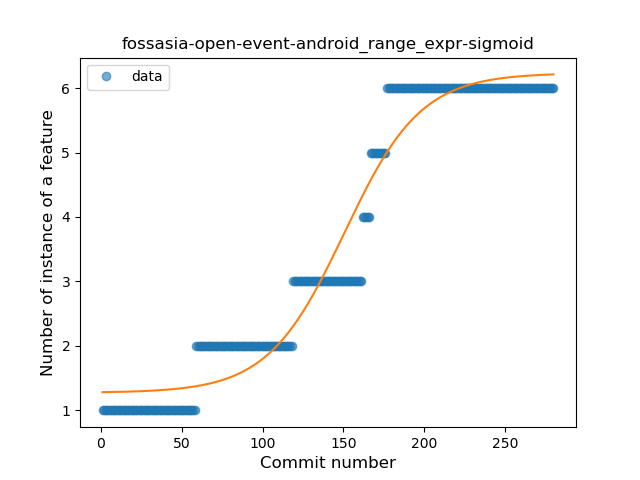
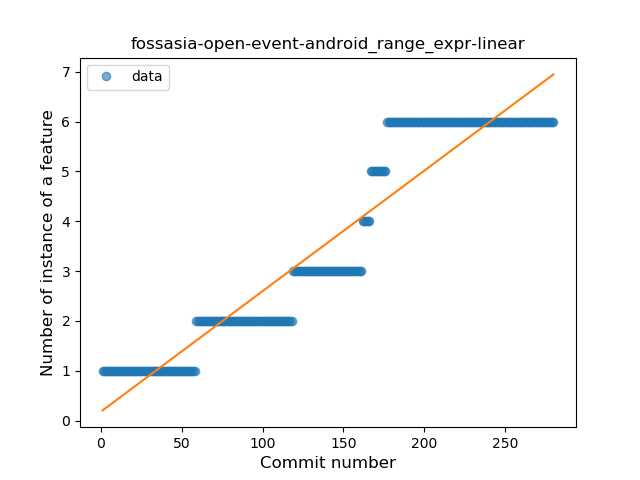
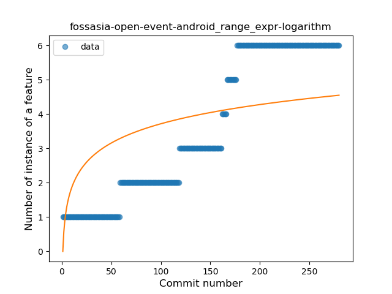
### <a name="func_call_with_named_arg">Function call with Named Argument</a>
----
#### Functions
* **Constant Rise - Linear:** 
    * **R_Squared:** 0.81548469
* **Sudden Rise Plateau - Logarithm:** 
    * **R_Squared:** 0.71314128

**Plots** :chart_with_upwards_trend:
-----

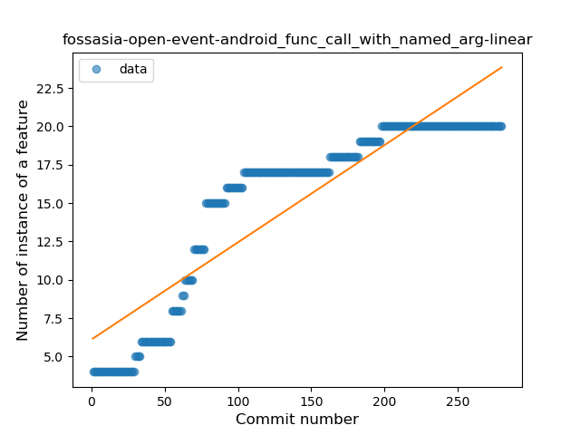
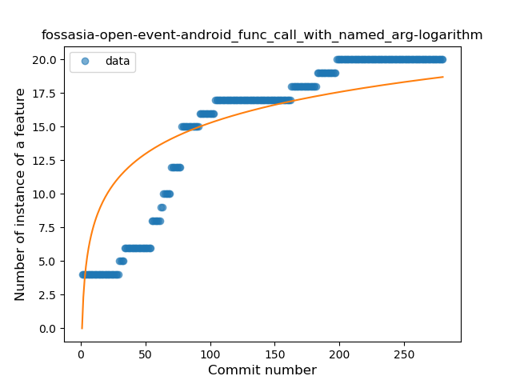
### <a name="data_class">Data Class</a>
----
#### Functions
* **Plateau Gradual Rise - Sigmoid:** 
    * **R_Squared:** 0.98210388
* **Constant Rise - Linear:** 
    * **R_Squared:** 0.91037214
* **Sudden Rise Plateau - Logarithm:** 
    * **R_Squared:** 0.6819611

**Plots** :chart_with_upwards_trend:
-----

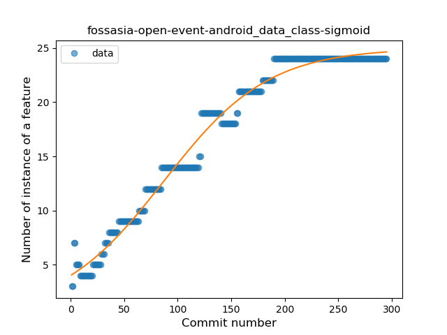
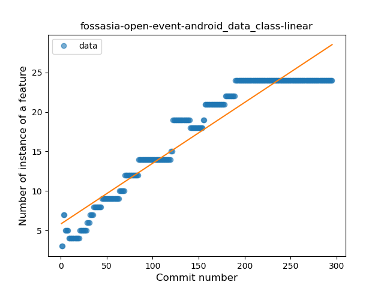
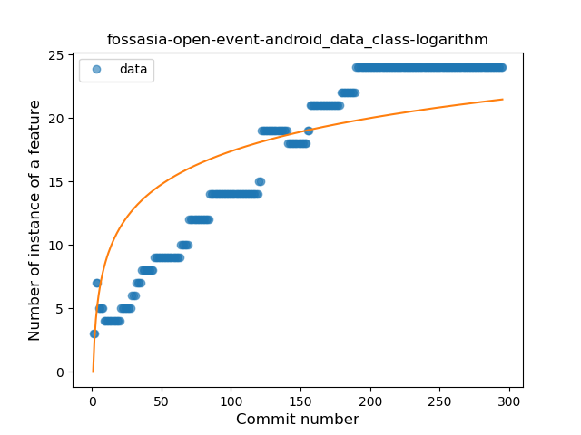
### <a name="property_delegation">Property Delegation</a>
----
#### Functions
* **Constant Rise - Linear:** 
    * **R_Squared:** 0.8875909
* **Sudden Rise Plateau - Logarithm:** 
    * **R_Squared:** 0.77550366
* **Plateau Gradual Rise - Sigmoid:** 
    * **R_Squared:** 0.35849486

**Plots** :chart_with_upwards_trend:
-----

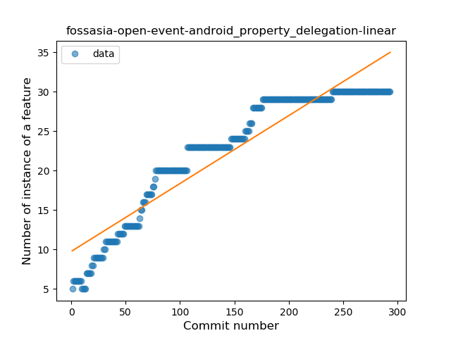
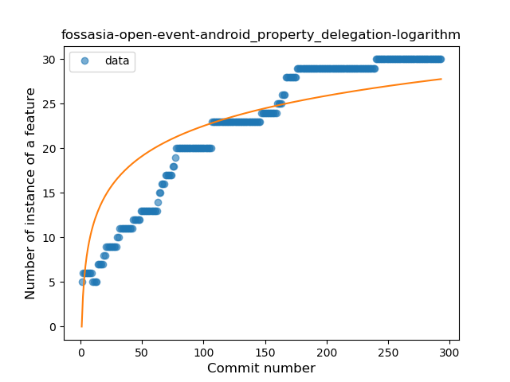
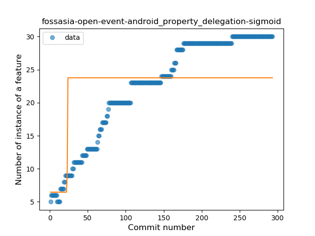
### <a name="destructuring_declaration">Destructuring Declaration</a>
----
#### Functions
* **Plateau Sudden Decline - Binary Sigmoid:** 
    * **R_Squared:** 1.0
* **Sudden Decline - Exponential:** 
    * **R_Squared:** 0.81605637
* **Constant Decline - Linear:** 
    * **R_Squared:** 0.05049083
* **Sudden Rise Plateau - Logarithm:** 
    * **R_Squared:** -0.0

**Plots** :chart_with_upwards_trend:
-----

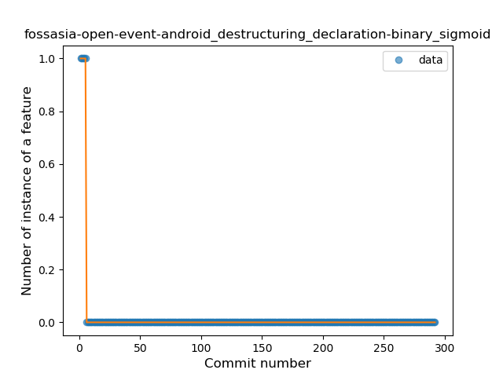
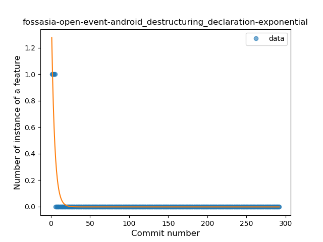
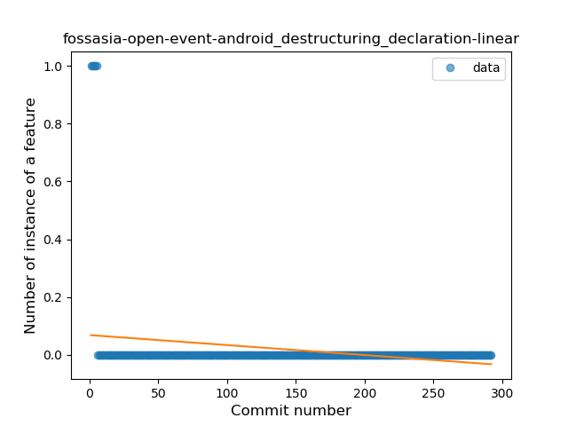
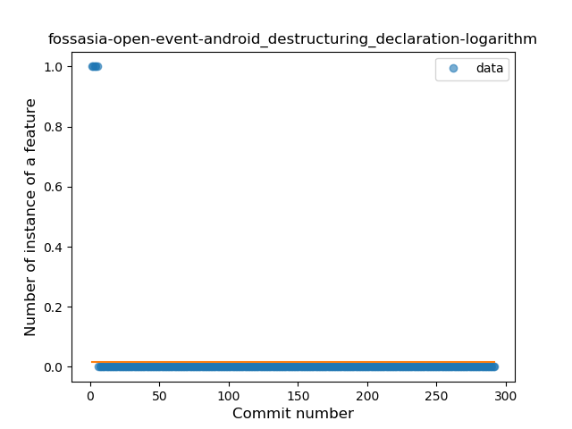
