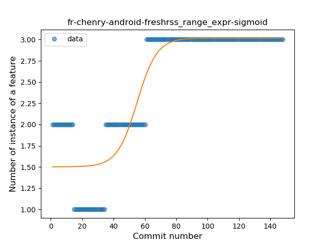
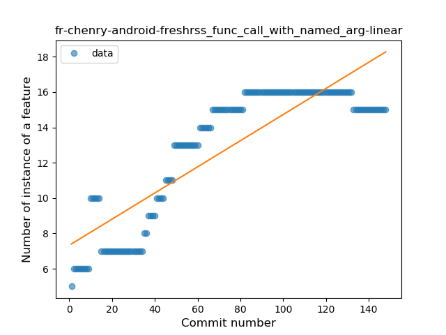
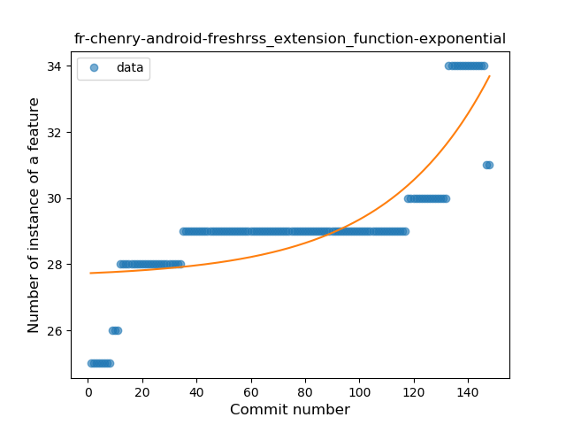

## fr-chenry-android-freshrss
----
#### Metrics provided by Detekt
* Number of lines of code 3895
* Number of Kotlin files: 56
* Cyclomatic complexity: 632
* Cyclomatic complexity by thousands of lines: 289 

----
**19** features analyzed

*	<a href="#type_inference">Type Inference</a> 
*	<a href="#lambda">Lambda</a> 
*	<a href="#safe_call">Safe Call</a> 
*	<a href="#when_expr">When expression</a> 
*	<a href="#unsafe_call">Unsafe Call</a> 
*	<a href="#companion_object">Companion Object</a> 
*	<a href="#string_template">String Template</a> 
*	<a href="#func_with_default_value">Function with Default Value</a> 
*	<a href="#singleton">Singleton</a> 
*	<a href="#range_expr">Range Expression</a> 
*	<a href="#smart_cast">Smart Cast</a> 
*	<a href="#data_class">Data Class</a> 
*	<a href="#func_call_with_named_arg">Function call with Named Argument</a> 
*	<a href="#extension_function">Extension Function</a> 
*	<a href="#property_delegation">Property Delegation</a> 
*	<a href="#destructuring_declaration">Destructuring Declaration</a> 
*	<a href="#overloaded_op">Overloaded Operator</a> 
*	<a href="#sealed_class">Sealed Class</a> 
*	<a href="#type_alias">Type Alias</a> 

### <a name="type_inference">Type Inference</a>
----
#### Functions
* **Constant Rise - Linear:** 
    * **R_Squared:** 0.94526744
* **Sudden Rise Plateau - Logarithm:** 
    * **R_Squared:** 0.79117044

**Plots** :chart_with_upwards_trend:
-----

### <a name="lambda">Lambda</a>
----
#### Functions
* **Constant Rise - Linear:** 
    * **R_Squared:** 0.91609578
* **Sudden Rise Plateau - Logarithm:** 
    * **R_Squared:** 0.85363519
* **Plateau Sudden Rise - Binary Sigmoid:** 
    * **R_Squared:** 0.76734019

**Plots** :chart_with_upwards_trend:
-----

### <a name="safe_call">Safe Call</a>
----
#### Functions
* **Sudden Rise - Exponential:** 
    * **R_Squared:** 0.84343074
* **Constant Rise - Linear:** 
    * **R_Squared:** 0.76510507
* **Sudden Rise Plateau - Logarithm:** 
    * **R_Squared:** 0.41110025

**Plots** :chart_with_upwards_trend:
-----

### <a name="when_expr">When expression</a>
----
#### Functions
* **Constant Rise - Linear:** 
    * **R_Squared:** 0.91984222
* **Sudden Rise Plateau - Logarithm:** 
    * **R_Squared:** 0.81226228

**Plots** :chart_with_upwards_trend:
-----

### <a name="unsafe_call">Unsafe Call</a>
----
#### Functions
* **Constant Rise - Linear:** 
    * **R_Squared:** 0.90812292
* **Sudden Rise - Exponential:** 
    * **R_Squared:** 0.90970724
* **Sudden Rise Plateau - Logarithm:** 
    * **R_Squared:** 0.64779359

**Plots** :chart_with_upwards_trend:
-----

### <a name="companion_object">Companion Object</a>
----
#### Functions
* **Sudden Rise Plateau - Logarithm:** 
    * **R_Squared:** 0.84939925
* **Constant Rise - Linear:** 
    * **R_Squared:** 0.76351464

**Plots** :chart_with_upwards_trend:
-----

### <a name="string_template">String Template</a>
----
#### Functions
* **Constant Rise - Linear:** 
    * **R_Squared:** 0.88950701
* **Sudden Rise Plateau - Logarithm:** 
    * **R_Squared:** 0.73906676

**Plots** :chart_with_upwards_trend:
-----

### <a name="func_with_default_value">Function with Default Value</a>
----
#### Functions
* **Sudden Rise Plateau - Logarithm:** 
    * **R_Squared:** 0.86803585
* **Constant Rise - Linear:** 
    * **R_Squared:** 0.73969606

**Plots** :chart_with_upwards_trend:
-----

### <a name="singleton">Singleton</a>
----
#### Functions
* **Sudden Rise - Exponential:** 
    * **R_Squared:** 0.47032261
* **Constant Rise - Linear:** 
    * **R_Squared:** 0.42455473
* **Sudden Rise Plateau - Logarithm:** 
    * **R_Squared:** 0.14580942
* **Plateau Gradual Rise - Sigmoid:** 
    * **R_Squared:** 0.00024213

**Plots** :chart_with_upwards_trend:
-----

### <a name="range_expr">Range Expression</a>
----
#### Functions
* **Plateau Gradual Rise - Sigmoid:** 
    * **R_Squared:** 0.84103029
* **Constant Rise - Linear:** 
    * **R_Squared:** 0.6390018
* **Sudden Rise Plateau - Logarithm:** 
    * **R_Squared:** 0.48155809

**Plots** :chart_with_upwards_trend:
-----

### <a name="smart_cast">Smart Cast</a>
----
#### Functions
* **Constant Rise - Linear:** 
    * **R_Squared:** 0.7445008
* **Sudden Rise Plateau - Logarithm:** 
    * **R_Squared:** 0.44788219

**Plots** :chart_with_upwards_trend:
-----

### <a name="data_class">Data Class</a>
----
#### Functions
* **Sudden Rise Plateau - Logarithm:** 
    * **R_Squared:** 0.80703129
* **Constant Rise - Linear:** 
    * **R_Squared:** 0.4570153

**Plots** :chart_with_upwards_trend:
-----

### <a name="func_call_with_named_arg">Function call with Named Argument</a>
----
#### Functions
* **Plateau Gradual Rise - Sigmoid:** 
    * **R_Squared:** 0.95512798
* **Sudden Rise Plateau - Logarithm:** 
    * **R_Squared:** 0.76426187
* **Constant Rise - Linear:** 
    * **R_Squared:** 0.74836048

**Plots** :chart_with_upwards_trend:
-----

### <a name="extension_function">Extension Function</a>
----
#### Functions
* **Sudden Rise - Exponential:** 
    * **R_Squared:** 0.67197823
* **Constant Rise - Linear:** 
    * **R_Squared:** 0.62453271
* **Sudden Rise Plateau - Logarithm:** 
    * **R_Squared:** 0.5768304

**Plots** :chart_with_upwards_trend:
-----

### <a name="property_delegation">Property Delegation</a>
----
#### Functions
* **Instability - Polinomial 3:** )
    * **R_Squared:** 0.89430101
* **Sudden Rise Plateau - Logarithm:** 
    * **R_Squared:** 0.64284589
* **Constant Rise - Linear:** 
    * **R_Squared:** 0.55332476

**Plots** :chart_with_upwards_trend:
-----

### <a name="destructuring_declaration">Destructuring Declaration</a>
----
#### Functions
* **Plateau Gradual Rise - Sigmoid:** 
    * **R_Squared:** 0.77955836
* **Constant Rise - Linear:** 
    * **R_Squared:** 0.65451436
* **Sudden Rise Plateau - Logarithm:** 
    * **R_Squared:** 0.50541505

**Plots** :chart_with_upwards_trend:
-----

### <a name="overloaded_op">Overloaded Operator</a>
----
#### Functions
* **Plateau Gradual Decline - Sigmoid:** 
    * **R_Squared:** 0.9240728
* **Sudden Decline - Exponential:** 
    * **R_Squared:** 0.79075262
* **Constant Decline - Linear:** 
    * **R_Squared:** 0.57489725
* **Sudden Rise Plateau - Logarithm:** 
    * **R_Squared:** 0.0

**Plots** :chart_with_upwards_trend:
-----

### <a name="sealed_class">Sealed Class</a>
----
#### Functions
* **Plateau Sudden Rise - Binary Sigmoid:** 
    * **R_Squared:** 0.86060055
* **Constant Rise - Linear:** 
    * **R_Squared:** 0.66561639
* **Sudden Rise Plateau - Logarithm:** 
    * **R_Squared:** 0.52864731

**Plots** :chart_with_upwards_trend:
-----

### <a name="type_alias">Type Alias</a>
----
#### Functions
* **Plateau Gradual Rise - Sigmoid:** 
    * **R_Squared:** 0.82213187
* **Sudden Rise Plateau - Logarithm:** 
    * **R_Squared:** 0.78816309
* **Constant Rise - Linear:** 
    * **R_Squared:** 0.56185152

**Plots** :chart_with_upwards_trend:
-----

