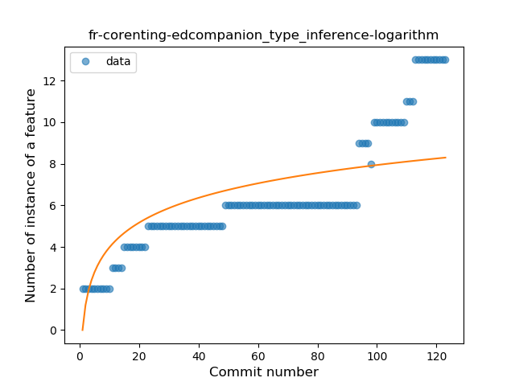
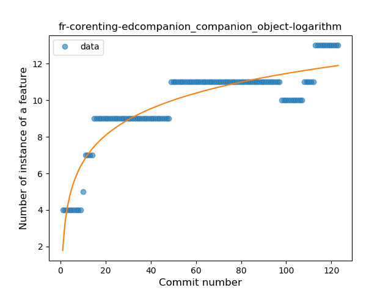
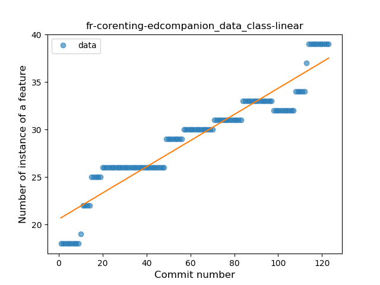

## fr-corenting-edcompanion
----
#### Metrics provided by Detekt
* Number of lines of code 730
* Number of Kotlin files: 43
* Cyclomatic complexity: 55
* Cyclomatic complexity by thousands of lines: 163 

----
**7** features analyzed

*	<a href="#type_inference">Type Inference</a> 
*	<a href="#lambda">Lambda</a> 
*	<a href="#safe_call">Safe Call</a> 
*	<a href="#unsafe_call">Unsafe Call</a> 
*	<a href="#companion_object">Companion Object</a> 
*	<a href="#func_with_default_value">Function with Default Value</a> 
*	<a href="#data_class">Data Class</a> 

### <a name="type_inference">Type Inference</a>
----
#### Functions
* **Sudden Rise - Exponential:** 
    * **R_Squared:** 0.90309633
* **Constant Rise - Linear:** 
    * **R_Squared:** 0.82095034
* **Sudden Rise Plateau - Logarithm:** 
    * **R_Squared:** 0.54864759

**Plots** :chart_with_upwards_trend:
-----

### <a name="lambda">Lambda</a>
----
#### Functions
* **Constant Rise - Linear:** 
    * **R_Squared:** 0.83692878
* **Sudden Rise - Exponential:** 
    * **R_Squared:** 0.84177845
* **Sudden Rise Plateau - Logarithm:** 
    * **R_Squared:** 0.68577132

**Plots** :chart_with_upwards_trend:
-----

### <a name="safe_call">Safe Call</a>
----
#### Functions
* **Plateau Sudden Rise - Binary Sigmoid:** 
    * **R_Squared:** 1.0
* **Instability - Polinomial 4:** 
    * **R_Squared:** 0.86913594
* **Instability - Polinomial 3:** )
    * **R_Squared:** 0.85191379
* **Constant Rise - Linear:** 
    * **R_Squared:** 0.74038462
* **Sudden Rise Plateau - Logarithm:** 
    * **R_Squared:** 0.62367792

**Plots** :chart_with_upwards_trend:
-----

### <a name="unsafe_call">Unsafe Call</a>
----
#### Functions
* **Plateau Gradual Rise - Sigmoid:** 
    * **R_Squared:** 0.88263897
* **Constant Rise - Linear:** 
    * **R_Squared:** 0.83119622
* **Sudden Rise Plateau - Logarithm:** 
    * **R_Squared:** 0.82570089

**Plots** :chart_with_upwards_trend:
-----

### <a name="companion_object">Companion Object</a>
----
#### Functions
* **Sudden Rise Plateau - Logarithm:** 
    * **R_Squared:** 0.83173741
* **Constant Rise - Linear:** 
    * **R_Squared:** 0.65354141

**Plots** :chart_with_upwards_trend:
-----

### <a name="func_with_default_value">Function with Default Value</a>
----
#### Functions
* **Plateau Sudden Rise - Binary Sigmoid:** 
    * **R_Squared:** 1.0
* **Sudden Rise - Exponential:** 
    * **R_Squared:** 0.76766046
* **Constant Rise - Linear:** 
    * **R_Squared:** 0.58837599
* **Sudden Rise Plateau - Logarithm:** 
    * **R_Squared:** 0.2907315

**Plots** :chart_with_upwards_trend:
-----

### <a name="data_class">Data Class</a>
----
#### Functions
* **Constant Rise - Linear:** 
    * **R_Squared:** 0.8938943
* **Sudden Rise Plateau - Logarithm:** 
    * **R_Squared:** 0.83349631

**Plots** :chart_with_upwards_trend:
-----

