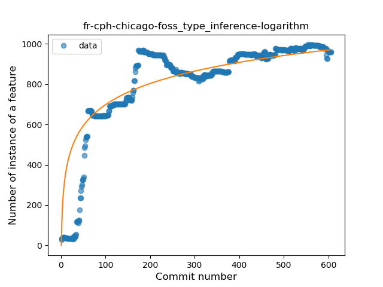
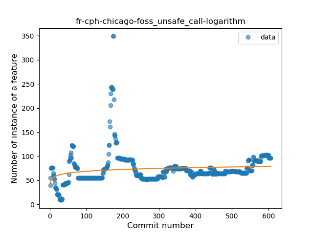
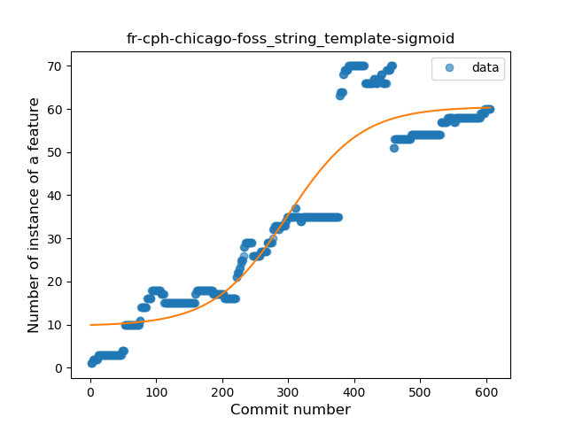
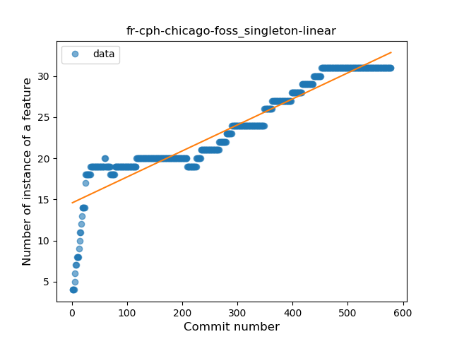
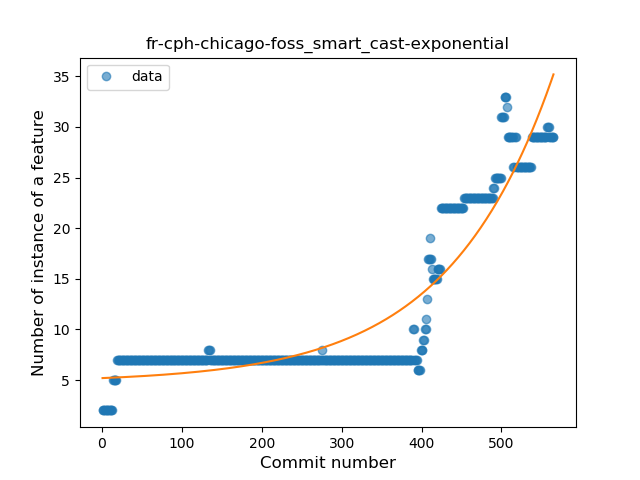
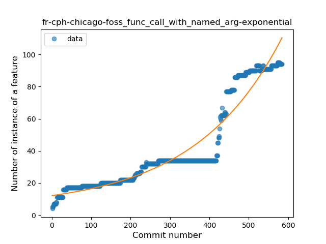
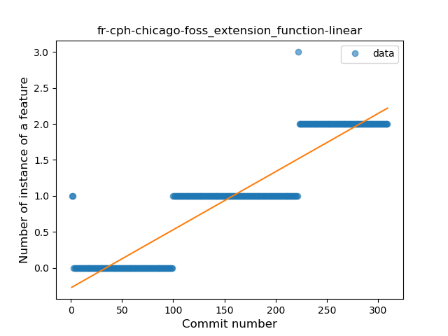
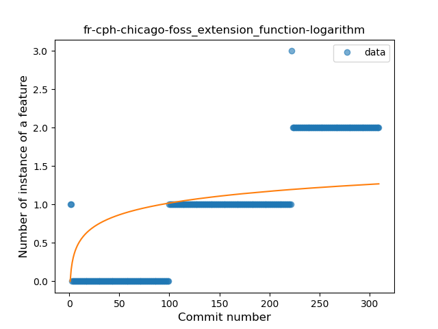

## fr-cph-chicago-foss
----
#### Metrics provided by Detekt
* Number of lines of code 15230
* Number of Kotlin files: 148
* Cyclomatic complexity: 1551
* Cyclomatic complexity by thousands of lines: 216 

----
**17** features analyzed

*	<a href="#type_inference">Type Inference</a> 
*	<a href="#lambda">Lambda</a> 
*	<a href="#safe_call">Safe Call</a> 
*	<a href="#when_expr">When expression</a> 
*	<a href="#unsafe_call">Unsafe Call</a> 
*	<a href="#companion_object">Companion Object</a> 
*	<a href="#string_template">String Template</a> 
*	<a href="#func_with_default_value">Function with Default Value</a> 
*	<a href="#singleton">Singleton</a> 
*	<a href="#range_expr">Range Expression</a> 
*	<a href="#smart_cast">Smart Cast</a> 
*	<a href="#data_class">Data Class</a> 
*	<a href="#func_call_with_named_arg">Function call with Named Argument</a> 
*	<a href="#extension_function">Extension Function</a> 
*	<a href="#property_delegation">Property Delegation</a> 
*	<a href="#destructuring_declaration">Destructuring Declaration</a> 
*	<a href="#super_delegation">Super Delegation</a> 

### <a name="type_inference">Type Inference</a>
----
#### Functions
* **Sudden Rise Plateau - Logarithm:** 
    * **R_Squared:** 0.74738579
* **Plateau Sudden Rise - Binary Sigmoid:** 
    * **R_Squared:** 0.67776708
* **Constant Rise - Linear:** 
    * **R_Squared:** 0.55309628

**Plots** :chart_with_upwards_trend:
-----

### <a name="lambda">Lambda</a>
----
#### Functions
* **Constant Rise - Linear:** 
    * **R_Squared:** 0.92893674
* **Plateau Sudden Rise - Binary Sigmoid:** 
    * **R_Squared:** 0.56937808
* **Sudden Rise Plateau - Logarithm:** 
    * **R_Squared:** 0.55023511

**Plots** :chart_with_upwards_trend:
-----

### <a name="safe_call">Safe Call</a>
----
#### Functions
* **Constant Rise - Linear:** 
    * **R_Squared:** 0.77614902
* **Sudden Rise - Exponential:** 
    * **R_Squared:** 0.77939755
* **Plateau Sudden Rise - Binary Sigmoid:** 
    * **R_Squared:** 0.29727383
* **Sudden Rise Plateau - Logarithm:** 
    * **R_Squared:** 0.28085016

**Plots** :chart_with_upwards_trend:
-----

### <a name="when_expr">When expression</a>
----
#### Functions
* **Plateau Gradual Rise - Sigmoid:** 
    * **R_Squared:** 0.93887242
* **Sudden Rise - Exponential:** 
    * **R_Squared:** 0.86658856
* **Constant Rise - Linear:** 
    * **R_Squared:** 0.63798675
* **Sudden Rise Plateau - Logarithm:** 
    * **R_Squared:** 0.26427288

**Plots** :chart_with_upwards_trend:
-----

### <a name="unsafe_call">Unsafe Call</a>
----
#### Functions
* **Sudden Rise - Exponential:** 
    * **R_Squared:** 0.0390628
* **Sudden Rise Plateau - Logarithm:** 
    * **R_Squared:** 0.02844604
* **Constant Rise - Linear:** 
    * **R_Squared:** 0.00969137

**Plots** :chart_with_upwards_trend:
-----

### <a name="companion_object">Companion Object</a>
----
#### Functions
* **Sudden Rise Plateau - Logarithm:** 
    * **R_Squared:** 0.791633
* **Constant Rise - Linear:** 
    * **R_Squared:** 0.67076069
* **Plateau Sudden Rise - Binary Sigmoid:** 
    * **R_Squared:** 0.09327356

**Plots** :chart_with_upwards_trend:
-----

### <a name="string_template">String Template</a>
----
#### Functions
* **Plateau Gradual Rise - Sigmoid:** 
    * **R_Squared:** 0.89392082
* **Constant Rise - Linear:** 
    * **R_Squared:** 0.8426547
* **Sudden Rise Plateau - Logarithm:** 
    * **R_Squared:** 0.40728241

**Plots** :chart_with_upwards_trend:
-----

### <a name="func_with_default_value">Function with Default Value</a>
----
#### Functions
* **Sudden Rise - Exponential:** 
    * **R_Squared:** 0.89613213
* **Constant Rise - Linear:** 
    * **R_Squared:** 0.86626924
* **Sudden Rise Plateau - Logarithm:** 
    * **R_Squared:** 0.31944545

**Plots** :chart_with_upwards_trend:
-----

### <a name="singleton">Singleton</a>
----
#### Functions
* **Constant Rise - Linear:** 
    * **R_Squared:** 0.88600198
* **Sudden Rise Plateau - Logarithm:** 
    * **R_Squared:** 0.78404486
* **Plateau Sudden Rise - Binary Sigmoid:** 
    * **R_Squared:** 0.27553113

**Plots** :chart_with_upwards_trend:
-----

### <a name="range_expr">Range Expression</a>
----
#### Functions
* **Sudden Rise Plateau - Logarithm:** 
    * **R_Squared:** 0.65748064
* **Constant Rise - Linear:** 
    * **R_Squared:** 0.43848466

**Plots** :chart_with_upwards_trend:
-----

### <a name="smart_cast">Smart Cast</a>
----
#### Functions
* **Plateau Gradual Rise - Sigmoid:** 
    * **R_Squared:** 0.96125239
* **Sudden Rise - Exponential:** 
    * **R_Squared:** 0.87346266
* **Constant Rise - Linear:** 
    * **R_Squared:** 0.64708003
* **Sudden Rise Plateau - Logarithm:** 
    * **R_Squared:** 0.2392622

**Plots** :chart_with_upwards_trend:
-----

### <a name="data_class">Data Class</a>
----
#### Functions
* **Constant Rise - Linear:** 
    * **R_Squared:** 0.93315263
* **Sudden Rise Plateau - Logarithm:** 
    * **R_Squared:** 0.45322382

**Plots** :chart_with_upwards_trend:
-----

### <a name="func_call_with_named_arg">Function call with Named Argument</a>
----
#### Functions
* **Plateau Gradual Rise - Sigmoid:** 
    * **R_Squared:** 0.94453241
* **Sudden Rise - Exponential:** 
    * **R_Squared:** 0.91888127
* **Constant Rise - Linear:** 
    * **R_Squared:** 0.82002153
* **Sudden Rise Plateau - Logarithm:** 
    * **R_Squared:** 0.31327139

**Plots** :chart_with_upwards_trend:
-----

### <a name="extension_function">Extension Function</a>
----
#### Functions
* **Constant Rise - Linear:** 
    * **R_Squared:** 0.85589463
* **Sudden Rise - Exponential:** 
    * **R_Squared:** 0.85752847
* **Sudden Rise Plateau - Logarithm:** 
    * **R_Squared:** 0.32959017

**Plots** :chart_with_upwards_trend:
-----

### <a name="property_delegation">Property Delegation</a>
----
#### Functions
* **Constant Rise - Linear:** 
    * **R_Squared:** 0.77276908
* **Sudden Rise Plateau - Logarithm:** 
    * **R_Squared:** 0.40429988

**Plots** :chart_with_upwards_trend:
-----

### <a name="destructuring_declaration">Destructuring Declaration</a>
----
#### Functions
* **Sudden Rise Plateau - Logarithm:** 
    * **R_Squared:** 0.24976292
* **Constant Rise - Linear:** 
    * **R_Squared:** 0.02162689

**Plots** :chart_with_upwards_trend:
-----

### <a name="super_delegation">Super Delegation</a>
----
#### Functions
* **Plateau Sudden Rise - Binary Sigmoid:** 
    * **R_Squared:** 1.0
* **Sudden Rise Plateau - Logarithm:** 
    * **R_Squared:** 0.27752703
* **Constant Rise - Linear:** 
    * **R_Squared:** 0.06664084

**Plots** :chart_with_upwards_trend:
-----

