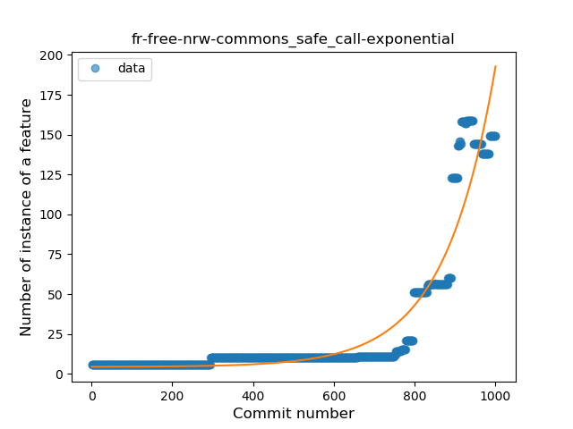

## fr-free-nrw-commons
----
#### Metrics provided by Detekt
* Number of lines of code 4566
* Number of Kotlin files: 44
* Cyclomatic complexity: 399
* Cyclomatic complexity by thousands of lines: 159 

----
**7** features analyzed

*	<a href="#type_inference">Type Inference</a> 
*	<a href="#lambda">Lambda</a> 
*	<a href="#safe_call">Safe Call</a> 
*	<a href="#unsafe_call">Unsafe Call</a> 
*	<a href="#string_template">String Template</a> 
*	<a href="#range_expr">Range Expression</a> 
*	<a href="#extension_function">Extension Function</a> 

### <a name="type_inference">Type Inference</a>
----
#### Functions
* **Constant Rise - Linear:** 
    * **R_Squared:** 0.92351173
* **Sudden Rise - Exponential:** 
    * **R_Squared:** 0.93164372
* **Sudden Rise Plateau - Logarithm:** 
    * **R_Squared:** 0.5924354

**Plots** :chart_with_upwards_trend:
-----

### <a name="lambda">Lambda</a>
----
#### Functions
* **Constant Rise - Linear:** 
    * **R_Squared:** 0.76743857
* **Sudden Rise Plateau - Logarithm:** 
    * **R_Squared:** 0.63107171

**Plots** :chart_with_upwards_trend:
-----

### <a name="safe_call">Safe Call</a>
----
#### Functions
* **Sudden Rise - Exponential:** 
    * **R_Squared:** 0.90461486
* **Constant Rise - Linear:** 
    * **R_Squared:** 0.47097212
* **Sudden Rise Plateau - Logarithm:** 
    * **R_Squared:** 0.0889169

**Plots** :chart_with_upwards_trend:
-----

### <a name="unsafe_call">Unsafe Call</a>
----
#### Functions
* **Constant Rise - Linear:** 
    * **R_Squared:** 0.07578473
* **Sudden Rise - Exponential:** 
    * **R_Squared:** 0.07997893
* **Sudden Rise Plateau - Logarithm:** 
    * **R_Squared:** 0.03822763

**Plots** :chart_with_upwards_trend:
-----

### <a name="string_template">String Template</a>
----
#### Functions
* **Constant Rise - Linear:** 
    * **R_Squared:** 0.67440471
* **Sudden Rise Plateau - Logarithm:** 
    * **R_Squared:** 0.55510757

**Plots** :chart_with_upwards_trend:
-----

### <a name="range_expr">Range Expression</a>
----
#### Functions
* **Plateau Gradual Rise - Sigmoid:** 
    * **R_Squared:** 0.93475599
* **Constant Rise - Linear:** 
    * **R_Squared:** 0.85998802
* **Sudden Rise Plateau - Logarithm:** 
    * **R_Squared:** 0.43290434

**Plots** :chart_with_upwards_trend:
-----

### <a name="extension_function">Extension Function</a>
----
#### Functions
* **Plateau Sudden Decline - Binary Sigmoid:** 
    * **R_Squared:** 1.0
* **Constant Decline - Linear:** 
    * **R_Squared:** 0.51341782
* **Sudden Rise Plateau - Logarithm:** 
    * **R_Squared:** -0.0

**Plots** :chart_with_upwards_trend:
-----

