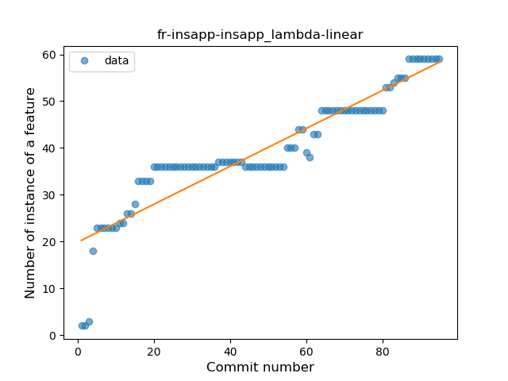
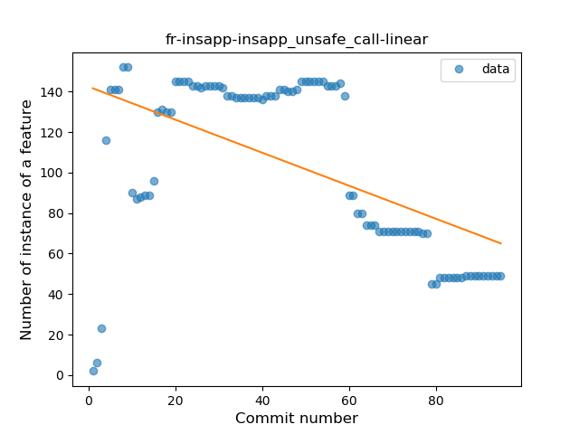
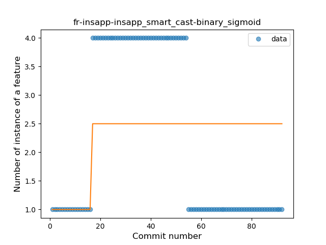
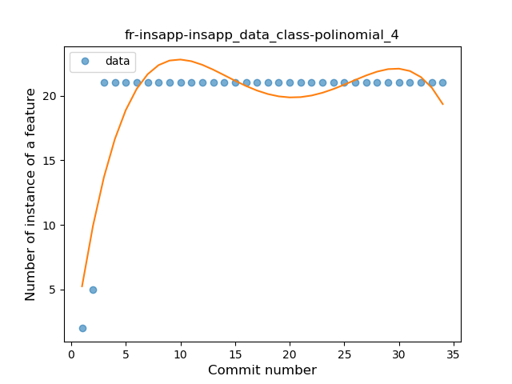

## fr-insapp-insapp
----
#### Metrics provided by Detekt
* Number of lines of code 6901
* Number of Kotlin files: 73
* Cyclomatic complexity: 839
* Cyclomatic complexity by thousands of lines: 250 

----
**14** features analyzed

*	<a href="#type_inference">Type Inference</a> 
*	<a href="#lambda">Lambda</a> 
*	<a href="#safe_call">Safe Call</a> 
*	<a href="#when_expr">When expression</a> 
*	<a href="#unsafe_call">Unsafe Call</a> 
*	<a href="#companion_object">Companion Object</a> 
*	<a href="#string_template">String Template</a> 
*	<a href="#func_with_default_value">Function with Default Value</a> 
*	<a href="#singleton">Singleton</a> 
*	<a href="#range_expr">Range Expression</a> 
*	<a href="#smart_cast">Smart Cast</a> 
*	<a href="#data_class">Data Class</a> 
*	<a href="#extension_function">Extension Function</a> 
*	<a href="#destructuring_declaration">Destructuring Declaration</a> 

### <a name="type_inference">Type Inference</a>
----
#### Functions
* **Constant Rise - Linear:** 
    * **R_Squared:** 0.91436039
* **Sudden Rise Plateau - Logarithm:** 
    * **R_Squared:** 0.86544557

**Plots** :chart_with_upwards_trend:
-----

### <a name="lambda">Lambda</a>
----
#### Functions
* **Constant Rise - Linear:** 
    * **R_Squared:** 0.85064495
* **Sudden Rise Plateau - Logarithm:** 
    * **R_Squared:** 0.85109672

**Plots** :chart_with_upwards_trend:
-----

### <a name="safe_call">Safe Call</a>
----
#### Functions
* **Sudden Rise Plateau - Logarithm:** 
    * **R_Squared:** 0.88378919
* **Constant Rise - Linear:** 
    * **R_Squared:** 0.7967512

**Plots** :chart_with_upwards_trend:
-----

### <a name="when_expr">When expression</a>
----
#### Functions
* **Sudden Rise Plateau - Logarithm:** 
    * **R_Squared:** 0.84438836
* **Instability - Polinomial 3:** )
    * **R_Squared:** 0.82466712
* **Constant Rise - Linear:** 
    * **R_Squared:** 0.48692833
* **Plateau Sudden Rise - Binary Sigmoid:** 
    * **R_Squared:** 0.32123008

**Plots** :chart_with_upwards_trend:
-----

### <a name="unsafe_call">Unsafe Call</a>
----
#### Functions
* **Constant Decline - Linear:** 
    * **R_Squared:** 0.28540011
* **Sudden Decline - Exponential:** 
    * **R_Squared:** 0.0
* **Sudden Rise Plateau - Logarithm:** 
    * **R_Squared:** -0.0

**Plots** :chart_with_upwards_trend:
-----

### <a name="companion_object">Companion Object</a>
----
#### Functions
* **Constant Rise - Linear:** 
    * **R_Squared:** 0.9022823
* **Sudden Rise Plateau - Logarithm:** 
    * **R_Squared:** 0.74890179

**Plots** :chart_with_upwards_trend:
-----

### <a name="string_template">String Template</a>
----
#### Functions
* **Sudden Rise - Exponential:** 
    * **R_Squared:** 0.95566275
* **Plateau Gradual Rise - Sigmoid:** 
    * **R_Squared:** 0.96248853
* **Constant Rise - Linear:** 
    * **R_Squared:** 0.90572152
* **Sudden Rise Plateau - Logarithm:** 
    * **R_Squared:** 0.42934311

**Plots** :chart_with_upwards_trend:
-----

### <a name="func_with_default_value">Function with Default Value</a>
----
#### Functions
* **Plateau Sudden Rise - Binary Sigmoid:** 
    * **R_Squared:** 1.0
* **Instability - Polinomial 3:** )
    * **R_Squared:** 0.74547591
* **Sudden Rise Plateau - Logarithm:** 
    * **R_Squared:** 0.57102809
* **Constant Rise - Linear:** 
    * **R_Squared:** 0.26428571

**Plots** :chart_with_upwards_trend:
-----

### <a name="singleton">Singleton</a>
----
#### Functions
* **Plateau Sudden Rise - Binary Sigmoid:** 
    * **R_Squared:** 1.0
* **Sudden Rise - Exponential:** 
    * **R_Squared:** 0.77582529
* **Constant Rise - Linear:** 
    * **R_Squared:** 0.51142528
* **Sudden Rise Plateau - Logarithm:** 
    * **R_Squared:** 0.24300644

**Plots** :chart_with_upwards_trend:
-----

### <a name="range_expr">Range Expression</a>
----
#### Functions
* **Instability - Polinomial 3:** )
    * **R_Squared:** 0.8362252
* **Plateau Gradual Rise - Sigmoid:** 
    * **R_Squared:** 0.53605816
* **Sudden Rise Plateau - Logarithm:** 
    * **R_Squared:** 0.15830064
* **Constant Rise - Linear:** 
    * **R_Squared:** 0.00266978

**Plots** :chart_with_upwards_trend:
-----

### <a name="smart_cast">Smart Cast</a>
----
#### Functions
* **Plateau Sudden Rise - Binary Sigmoid:** 
    * **R_Squared:** 0.14814815
* **Constant Decline - Linear:** 
    * **R_Squared:** 0.1207347
* **Sudden Rise Plateau - Logarithm:** 
    * **R_Squared:** -0.0

**Plots** :chart_with_upwards_trend:
-----

### <a name="data_class">Data Class</a>
----
#### Functions
* **Instability - Polinomial 4:** 
    * **R_Squared:** 0.75792138
* **Instability - Polinomial 3:** )
    * **R_Squared:** 0.59620816
* **Sudden Rise Plateau - Logarithm:** 
    * **R_Squared:** 0.45159332
* **Constant Rise - Linear:** 
    * **R_Squared:** 0.165831

**Plots** :chart_with_upwards_trend:
-----

### <a name="extension_function">Extension Function</a>
----
#### Functions
* **Plateau Sudden Rise - Binary Sigmoid:** 
    * **R_Squared:** 1.0
* **Instability - Polinomial 3:** )
    * **R_Squared:** 0.694091
* **Sudden Rise Plateau - Logarithm:** 
    * **R_Squared:** 0.52507991
* **Constant Rise - Linear:** 
    * **R_Squared:** 0.22368421

**Plots** :chart_with_upwards_trend:
-----

### <a name="destructuring_declaration">Destructuring Declaration</a>
----
#### Functions
* **Plateau Sudden Rise - Binary Sigmoid:** 
    * **R_Squared:** 1.0
* **Sudden Rise - Exponential:** 
    * **R_Squared:** 0.76520379
* **Constant Rise - Linear:** 
    * **R_Squared:** 0.61598224
* **Sudden Rise Plateau - Logarithm:** 
    * **R_Squared:** 0.32858546

**Plots** :chart_with_upwards_trend:
-----

