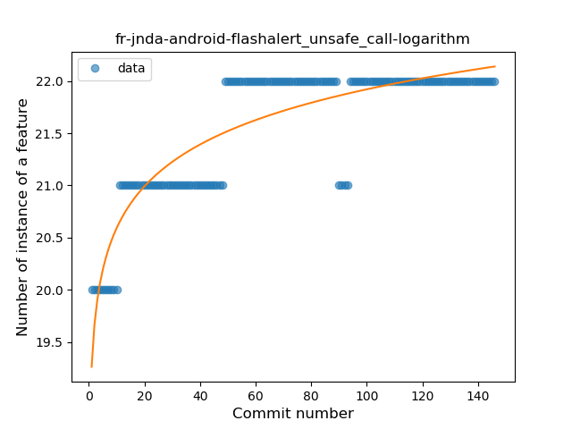

## fr-jnda-android-flashalert
----
#### Metrics provided by Detekt
* Number of lines of code 1718
* Number of Kotlin files: 22
* Cyclomatic complexity: 286
* Cyclomatic complexity by thousands of lines: 317 

----
**9** features analyzed

*	<a href="#type_inference">Type Inference</a> 
*	<a href="#lambda">Lambda</a> 
*	<a href="#safe_call">Safe Call</a> 
*	<a href="#when_expr">When expression</a> 
*	<a href="#unsafe_call">Unsafe Call</a> 
*	<a href="#companion_object">Companion Object</a> 
*	<a href="#string_template">String Template</a> 
*	<a href="#smart_cast">Smart Cast</a> 
*	<a href="#coroutine">Coroutine</a> 

### <a name="type_inference">Type Inference</a>
----
#### Functions
* **Constant Rise - Linear:** 
    * **R_Squared:** 0.91583952
* **Sudden Rise - Exponential:** 
    * **R_Squared:** 0.91767394
* **Sudden Rise Plateau - Logarithm:** 
    * **R_Squared:** 0.69475311

**Plots** :chart_with_upwards_trend:
-----

### <a name="lambda">Lambda</a>
----
#### Functions
* **Sudden Rise - Exponential:** 
    * **R_Squared:** 0.86472082
* **Constant Rise - Linear:** 
    * **R_Squared:** 0.7644916
* **Sudden Rise Plateau - Logarithm:** 
    * **R_Squared:** 0.3906615
* **Plateau Sudden Rise - Binary Sigmoid:** 
    * **R_Squared:** 0.07630711

**Plots** :chart_with_upwards_trend:
-----

### <a name="safe_call">Safe Call</a>
----
#### Functions
* **Sudden Rise - Exponential:** 
    * **R_Squared:** 0.90848467
* **Constant Rise - Linear:** 
    * **R_Squared:** 0.80653253
* **Sudden Rise Plateau - Logarithm:** 
    * **R_Squared:** 0.34649389
* **Plateau Sudden Rise - Binary Sigmoid:** 
    * **R_Squared:** 0.15899646

**Plots** :chart_with_upwards_trend:
-----

### <a name="when_expr">When expression</a>
----
#### Functions
* **Constant Rise - Linear:** 
    * **R_Squared:** 0.17274825
* **Sudden Rise Plateau - Logarithm:** 
    * **R_Squared:** 0.12449663
* **Plateau Gradual Decline - Sigmoid:** 
    * **R_Squared:** 0.00090643

**Plots** :chart_with_upwards_trend:
-----

### <a name="unsafe_call">Unsafe Call</a>
----
#### Functions
* **Sudden Rise Plateau - Logarithm:** 
    * **R_Squared:** 0.77373442
* **Constant Rise - Linear:** 
    * **R_Squared:** 0.60686995

**Plots** :chart_with_upwards_trend:
-----

### <a name="companion_object">Companion Object</a>
----
#### Functions
* **Sudden Rise - Exponential:** 
    * **R_Squared:** 0.42427339
* **Constant Rise - Linear:** 
    * **R_Squared:** 0.35678028
* **Sudden Rise Plateau - Logarithm:** 
    * **R_Squared:** 0.15134683
* **Plateau Sudden Rise - Binary Sigmoid:** 
    * **R_Squared:** 0.02155858

**Plots** :chart_with_upwards_trend:
-----

### <a name="string_template">String Template</a>
----
#### Functions
* **Plateau Sudden Decline - Binary Sigmoid:** 
    * **R_Squared:** 0.19648434
* **Sudden Rise - Exponential:** 
    * **R_Squared:** 0.01921093
* **Constant Rise - Linear:** 
    * **R_Squared:** 0.00060593
* **Sudden Rise Plateau - Logarithm:** 
    * **R_Squared:** -0.0

**Plots** :chart_with_upwards_trend:
-----

### <a name="smart_cast">Smart Cast</a>
----
#### Functions
* **Plateau Sudden Decline - Binary Sigmoid:** 
    * **R_Squared:** 1.0
* **Sudden Decline - Exponential:** 
    * **R_Squared:** 0.80376362
* **Constant Decline - Linear:** 
    * **R_Squared:** 0.1914145
* **Sudden Rise Plateau - Logarithm:** 
    * **R_Squared:** -0.0

**Plots** :chart_with_upwards_trend:
-----

### <a name="coroutine">Coroutine</a>
----
#### Functions
* **Sudden Rise - Exponential:** 
    * **R_Squared:** 0.74237768
* **Instability - Polinomial 3:** )
    * **R_Squared:** 0.69721051
* **Constant Rise - Linear:** 
    * **R_Squared:** 0.20048737
* **Sudden Rise Plateau - Logarithm:** 
    * **R_Squared:** 0.06736755
* **Plateau Gradual Rise - Sigmoid:** 
    * **R_Squared:** 0.00403026

**Plots** :chart_with_upwards_trend:
-----

