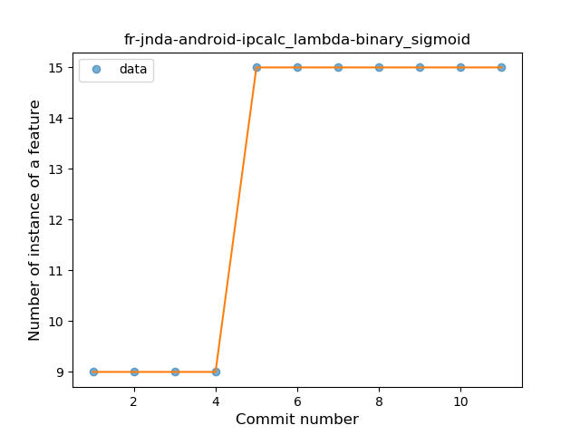

## fr-jnda-android-ipcalc
----
#### Metrics provided by Detekt
* Number of lines of code 815
* Number of Kotlin files: 12
* Cyclomatic complexity: 128
* Cyclomatic complexity by thousands of lines: 270 

----
**5** features analyzed

*	<a href="#type_inference">Type Inference</a> 
*	<a href="#lambda">Lambda</a> 
*	<a href="#safe_call">Safe Call</a> 
*	<a href="#companion_object">Companion Object</a> 
*	<a href="#string_template">String Template</a> 

### <a name="type_inference">Type Inference</a>
----
#### Functions
* **Instability - Polinomial 4:** 
    * **R_Squared:** 0.93479686
* **Constant Rise - Linear:** 
    * **R_Squared:** 0.75545593
* **Sudden Rise Plateau - Logarithm:** 
    * **R_Squared:** 0.7503199

**Plots** :chart_with_upwards_trend:
-----

### <a name="lambda">Lambda</a>
----
#### Functions
* **Plateau Sudden Rise - Binary Sigmoid:** 
    * **R_Squared:** 1.0
* **Instability - Polinomial 4:** 
    * **R_Squared:** 0.8974359
* **Sudden Rise Plateau - Logarithm:** 
    * **R_Squared:** 0.71845587
* **Constant Rise - Linear:** 
    * **R_Squared:** 0.7

**Plots** :chart_with_upwards_trend:
-----

### <a name="safe_call">Safe Call</a>
----
#### Functions
* **Instability - Polinomial 4:** 
    * **R_Squared:** 0.8974359
* **Sudden Rise Plateau - Logarithm:** 
    * **R_Squared:** 0.71845587
* **Constant Rise - Linear:** 
    * **R_Squared:** 0.7

**Plots** :chart_with_upwards_trend:
-----

### <a name="companion_object">Companion Object</a>
----
#### Functions
* **Sudden Decline - Exponential:** 
    * **R_Squared:** 1.0
* **Instability - Polinomial 4:** 
    * **R_Squared:** 0.98484848
* **Instability - Polinomial 3:** )
    * **R_Squared:** 0.91666667
* **Constant Decline - Linear:** 
    * **R_Squared:** 0.375
* **Sudden Rise Plateau - Logarithm:** 
    * **R_Squared:** -0.0

**Plots** :chart_with_upwards_trend:
-----

### <a name="string_template">String Template</a>
----
#### Functions
* **Instability - Polinomial 4:** 
    * **R_Squared:** 0.8974359
* **Sudden Rise Plateau - Logarithm:** 
    * **R_Squared:** 0.71845587
* **Constant Rise - Linear:** 
    * **R_Squared:** 0.7

**Plots** :chart_with_upwards_trend:
-----

