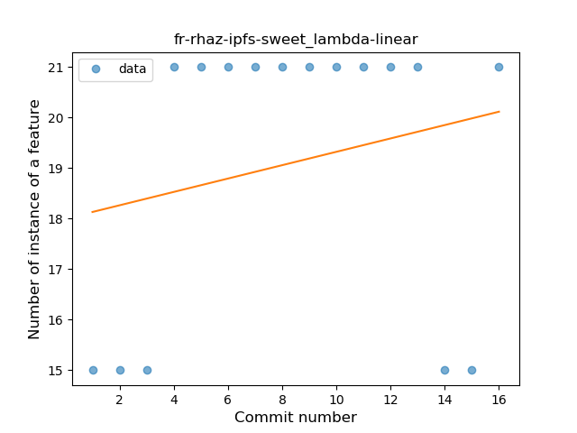

## fr-rhaz-ipfs-sweet
----
#### Metrics provided by Detekt
* Number of lines of code 323
* Number of Kotlin files: 6
* Cyclomatic complexity: 72
* Cyclomatic complexity by thousands of lines: 404 

----
**10** features analyzed

*	<a href="#type_inference">Type Inference</a> 
*	<a href="#lambda">Lambda</a> 
*	<a href="#safe_call">Safe Call</a> 
*	<a href="#unsafe_call">Unsafe Call</a> 
*	<a href="#string_template">String Template</a> 
*	<a href="#func_with_default_value">Function with Default Value</a> 
*	<a href="#extension_function">Extension Function</a> 
*	<a href="#inline_func">Inline Function</a> 
*	<a href="#overloaded_op">Overloaded Operator</a> 
*	<a href="#coroutine">Coroutine</a> 

### <a name="type_inference">Type Inference</a>
----
#### Functions
* **Instability - Polinomial 4:** 
    * **R_Squared:** 0.47511442
* **Plateau Sudden Rise - Binary Sigmoid:** 
    * **R_Squared:** 0.08026756
* **Constant Decline - Linear:** 
    * **R_Squared:** 0.02819693
* **Sudden Rise Plateau - Logarithm:** 
    * **R_Squared:** 0.00028966

**Plots** :chart_with_upwards_trend:
-----

### <a name="lambda">Lambda</a>
----
#### Functions
* **Instability - Polinomial 4:** 
    * **R_Squared:** 0.64373769
* **Sudden Rise Plateau - Logarithm:** 
    * **R_Squared:** 0.18632924
* **Constant Rise - Linear:** 
    * **R_Squared:** 0.04812834

**Plots** :chart_with_upwards_trend:
-----

### <a name="safe_call">Safe Call</a>
----
#### Functions
* **Instability - Polinomial 4:** 
    * **R_Squared:** 0.45186496
* **Constant Decline - Linear:** 
    * **R_Squared:** 0.24201681
* **Sudden Rise Plateau - Logarithm:** 
    * **R_Squared:** -0.0

**Plots** :chart_with_upwards_trend:
-----

### <a name="unsafe_call">Unsafe Call</a>
----
#### Functions
* **Plateau Sudden Decline - Binary Sigmoid:** 
    * **R_Squared:** 0.61904762
* **Instability - Polinomial 4:** 
    * **R_Squared:** 0.45186496
* **Constant Decline - Linear:** 
    * **R_Squared:** 0.24201681
* **Sudden Rise Plateau - Logarithm:** 
    * **R_Squared:** -0.0

**Plots** :chart_with_upwards_trend:
-----

### <a name="string_template">String Template</a>
----
#### Functions
* **Instability - Polinomial 4:** 
    * **R_Squared:** 0.50201929
* **Constant Decline - Linear:** 
    * **R_Squared:** 0.00750347
* **Sudden Rise Plateau - Logarithm:** 
    * **R_Squared:** 0.01173885

**Plots** :chart_with_upwards_trend:
-----

### <a name="func_with_default_value">Function with Default Value</a>
----
#### Functions
* **Instability - Polinomial 4:** 
    * **R_Squared:** 0.45186496
* **Constant Decline - Linear:** 
    * **R_Squared:** 0.24201681
* **Sudden Rise Plateau - Logarithm:** 
    * **R_Squared:** -0.0

**Plots** :chart_with_upwards_trend:
-----

### <a name="extension_function">Extension Function</a>
----
#### Functions
* **Instability - Polinomial 4:** 
    * **R_Squared:** 0.44124123
* **Constant Decline - Linear:** 
    * **R_Squared:** 0.16341537
* **Sudden Rise Plateau - Logarithm:** 
    * **R_Squared:** -0.0

**Plots** :chart_with_upwards_trend:
-----

### <a name="inline_func">Inline Function</a>
----
#### Functions
* **Instability - Polinomial 4:** 
    * **R_Squared:** 0.45186496
* **Constant Decline - Linear:** 
    * **R_Squared:** 0.24201681
* **Sudden Rise Plateau - Logarithm:** 
    * **R_Squared:** -0.0

**Plots** :chart_with_upwards_trend:
-----

### <a name="overloaded_op">Overloaded Operator</a>
----
#### Functions
* **Instability - Polinomial 4:** 
    * **R_Squared:** 0.45186496
* **Constant Decline - Linear:** 
    * **R_Squared:** 0.24201681
* **Sudden Rise Plateau - Logarithm:** 
    * **R_Squared:** -0.0

**Plots** :chart_with_upwards_trend:
-----

### <a name="coroutine">Coroutine</a>
----
#### Functions
* **Instability - Polinomial 4:** 
    * **R_Squared:** 0.45186496
* **Constant Decline - Linear:** 
    * **R_Squared:** 0.24201681
* **Sudden Rise Plateau - Logarithm:** 
    * **R_Squared:** -0.0

**Plots** :chart_with_upwards_trend:
-----

