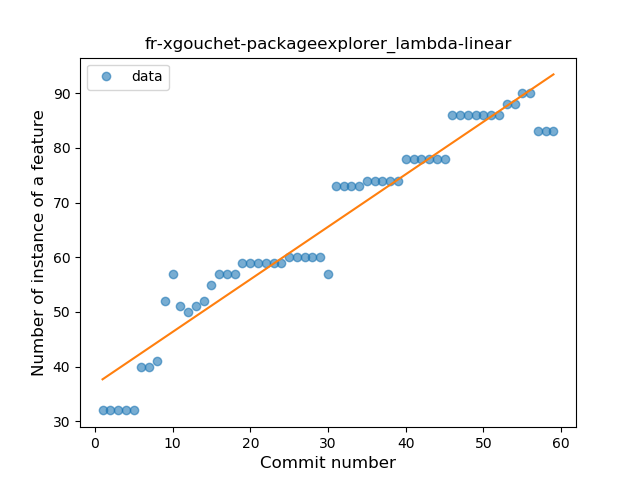
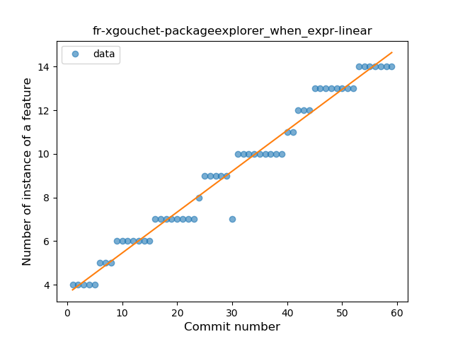
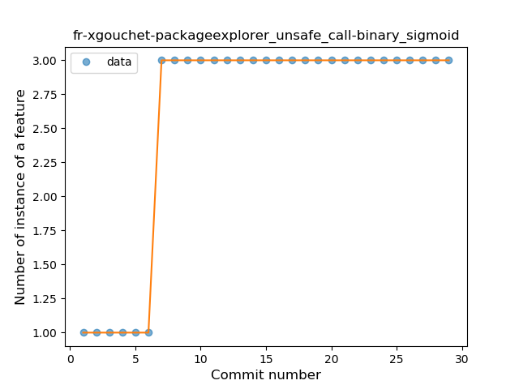
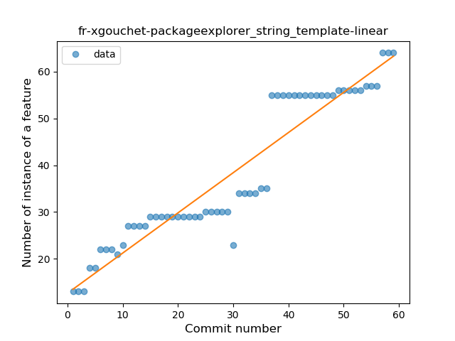
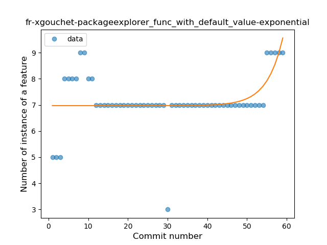
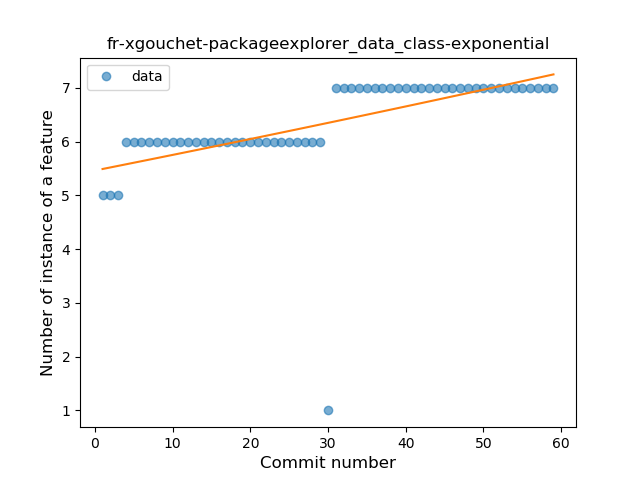
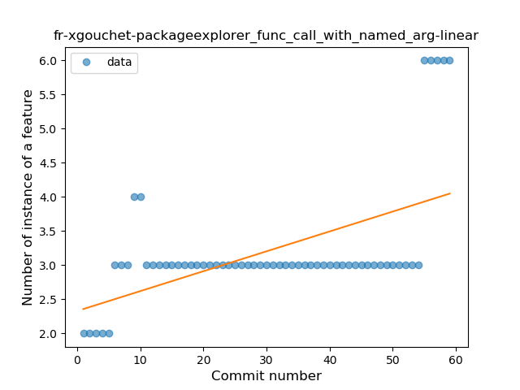
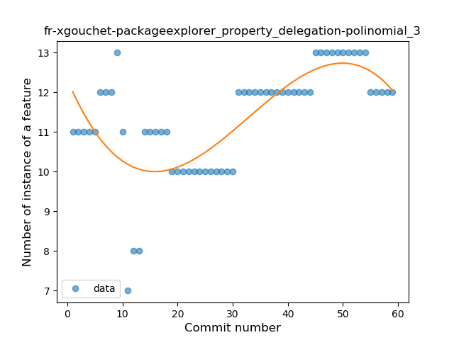

## fr-xgouchet-packageexplorer
----
#### Metrics provided by Detekt
* Number of lines of code 4004
* Number of Kotlin files: 62
* Cyclomatic complexity: 552
* Cyclomatic complexity by thousands of lines: 293 

----
**15** features analyzed

*	<a href="#type_inference">Type Inference</a> 
*	<a href="#lambda">Lambda</a> 
*	<a href="#safe_call">Safe Call</a> 
*	<a href="#when_expr">When expression</a> 
*	<a href="#unsafe_call">Unsafe Call</a> 
*	<a href="#companion_object">Companion Object</a> 
*	<a href="#string_template">String Template</a> 
*	<a href="#func_with_default_value">Function with Default Value</a> 
*	<a href="#singleton">Singleton</a> 
*	<a href="#smart_cast">Smart Cast</a> 
*	<a href="#data_class">Data Class</a> 
*	<a href="#func_call_with_named_arg">Function call with Named Argument</a> 
*	<a href="#extension_function">Extension Function</a> 
*	<a href="#property_delegation">Property Delegation</a> 
*	<a href="#sealed_class">Sealed Class</a> 

### <a name="type_inference">Type Inference</a>
----
#### Functions
* **Constant Rise - Linear:** 
    * **R_Squared:** 0.95751686
* **Sudden Rise Plateau - Logarithm:** 
    * **R_Squared:** 0.83391619

**Plots** :chart_with_upwards_trend:
-----

### <a name="lambda">Lambda</a>
----
#### Functions
* **Constant Rise - Linear:** 
    * **R_Squared:** 0.92940545
* **Sudden Rise Plateau - Logarithm:** 
    * **R_Squared:** 0.8703846

**Plots** :chart_with_upwards_trend:
-----

### <a name="safe_call">Safe Call</a>
----
#### Functions
* **Sudden Rise Plateau - Logarithm:** 
    * **R_Squared:** 0.87591369
* **Constant Rise - Linear:** 
    * **R_Squared:** 0.80173832

**Plots** :chart_with_upwards_trend:
-----

### <a name="when_expr">When expression</a>
----
#### Functions
* **Constant Rise - Linear:** 
    * **R_Squared:** 0.97456485
* **Plateau Gradual Rise - Sigmoid:** 
    * **R_Squared:** 0.97525069
* **Sudden Rise Plateau - Logarithm:** 
    * **R_Squared:** 0.78727149

**Plots** :chart_with_upwards_trend:
-----

### <a name="unsafe_call">Unsafe Call</a>
----
#### Functions
* **Plateau Sudden Rise - Binary Sigmoid:** 
    * **R_Squared:** 1.0
* **Instability - Polinomial 3:** )
    * **R_Squared:** 0.81463429
* **Sudden Rise Plateau - Logarithm:** 
    * **R_Squared:** 0.69633049
* **Constant Rise - Linear:** 
    * **R_Squared:** 0.49285714

**Plots** :chart_with_upwards_trend:
-----

### <a name="companion_object">Companion Object</a>
----
#### Functions
* **Constant Rise - Linear:** 
    * **R_Squared:** 0.92737363
* **Sudden Rise Plateau - Logarithm:** 
    * **R_Squared:** 0.83046139

**Plots** :chart_with_upwards_trend:
-----

### <a name="string_template">String Template</a>
----
#### Functions
* **Constant Rise - Linear:** 
    * **R_Squared:** 0.89676453
* **Sudden Rise - Exponential:** 
    * **R_Squared:** 0.90083608
* **Sudden Rise Plateau - Logarithm:** 
    * **R_Squared:** 0.69266001
* **Plateau Sudden Rise - Binary Sigmoid:** 
    * **R_Squared:** 0.25830213

**Plots** :chart_with_upwards_trend:
-----

### <a name="func_with_default_value">Function with Default Value</a>
----
#### Functions
* **Instability - Polinomial 3:** )
    * **R_Squared:** 0.34223967
* **Plateau Sudden Rise - Binary Sigmoid:** 
    * **R_Squared:** 0.30354132
* **Sudden Rise - Exponential:** 
    * **R_Squared:** 0.24389976
* **Constant Rise - Linear:** 
    * **R_Squared:** 0.04479948
* **Sudden Rise Plateau - Logarithm:** 
    * **R_Squared:** 0.05042498

**Plots** :chart_with_upwards_trend:
-----

### <a name="singleton">Singleton</a>
----
#### Functions
* **Plateau Sudden Rise - Binary Sigmoid:** 
    * **R_Squared:** 0.99139741
* **Instability - Polinomial 3:** )
    * **R_Squared:** 0.85383245
* **Sudden Rise - Exponential:** 
    * **R_Squared:** 0.79279713
* **Constant Rise - Linear:** 
    * **R_Squared:** 0.76866705
* **Sudden Rise Plateau - Logarithm:** 
    * **R_Squared:** 0.49770773

**Plots** :chart_with_upwards_trend:
-----

### <a name="smart_cast">Smart Cast</a>
----
#### Functions
* **Constant Rise - Linear:** 
    * **R_Squared:** 0.78703268
* **Sudden Rise Plateau - Logarithm:** 
    * **R_Squared:** 0.77934275

**Plots** :chart_with_upwards_trend:
-----

### <a name="data_class">Data Class</a>
----
#### Functions
* **Constant Rise - Linear:** 
    * **R_Squared:** 0.3178751
* **Sudden Rise - Exponential:** 
    * **R_Squared:** 0.317928
* **Sudden Rise Plateau - Logarithm:** 
    * **R_Squared:** 0.27734433

**Plots** :chart_with_upwards_trend:
-----

### <a name="func_call_with_named_arg">Function call with Named Argument</a>
----
#### Functions
* **Instability - Polinomial 3:** )
    * **R_Squared:** 0.72884872
* **Sudden Rise - Exponential:** 
    * **R_Squared:** 0.70563869
* **Constant Rise - Linear:** 
    * **R_Squared:** 0.29364711
* **Sudden Rise Plateau - Logarithm:** 
    * **R_Squared:** 0.22379807
* **Plateau Sudden Rise - Binary Sigmoid:** 
    * **R_Squared:** 0.16169998

**Plots** :chart_with_upwards_trend:
-----

### <a name="extension_function">Extension Function</a>
----
#### Functions
* **Sudden Rise Plateau - Logarithm:** 
    * **R_Squared:** 0.8442374
* **Constant Rise - Linear:** 
    * **R_Squared:** 0.79792208

**Plots** :chart_with_upwards_trend:
-----

### <a name="property_delegation">Property Delegation</a>
----
#### Functions
* **Instability - Polinomial 3:** )
    * **R_Squared:** 0.54868247
* **Sudden Rise - Exponential:** 
    * **R_Squared:** 0.35814617
* **Constant Rise - Linear:** 
    * **R_Squared:** 0.33038807
* **Sudden Rise Plateau - Logarithm:** 
    * **R_Squared:** 0.15265489

**Plots** :chart_with_upwards_trend:
-----

### <a name="sealed_class">Sealed Class</a>
----
#### Functions
* **Constant Decline - Linear:** 
    * **R_Squared:** 0.0
* **Sudden Rise - Exponential:** 
    * **R_Squared:** -0.0
* **Sudden Rise Plateau - Logarithm:** 
    * **R_Squared:** -0.0

**Plots** :chart_with_upwards_trend:
-----

