## freedombox-team-android-app
----
#### Metrics provided by Detekt
* Number of lines of code 2528
* Number of Kotlin files: 38
* Cyclomatic complexity: 228
* Cyclomatic complexity by thousands of lines: 247 

----
**11** features analyzed

*	<a href="#type_inference">Type Inference</a> 
*	<a href="#lambda">Lambda</a> 
*	<a href="#safe_call">Safe Call</a> 
*	<a href="#when_expr">When expression</a> 
*	<a href="#companion_object">Companion Object</a> 
*	<a href="#unsafe_call">Unsafe Call</a> 
*	<a href="#string_template">String Template</a> 
*	<a href="#func_with_default_value">Function with Default Value</a> 
*	<a href="#singleton">Singleton</a> 
*	<a href="#func_call_with_named_arg">Function call with Named Argument</a> 
*	<a href="#data_class">Data Class</a> 

### <a name="type_inference">Type Inference</a>
----
#### Functions
* **Constant Rise - Linear:** 
    * **R_Squared:** 0.88196142
* **Plateau Sudden Rise - Binary Sigmoid:** 
    * **R_Squared:** 0.63344668
* **Sudden Rise Plateau - Logarithm:** 
    * **R_Squared:** 0.61982918

**Plots** :chart_with_upwards_trend:
-----

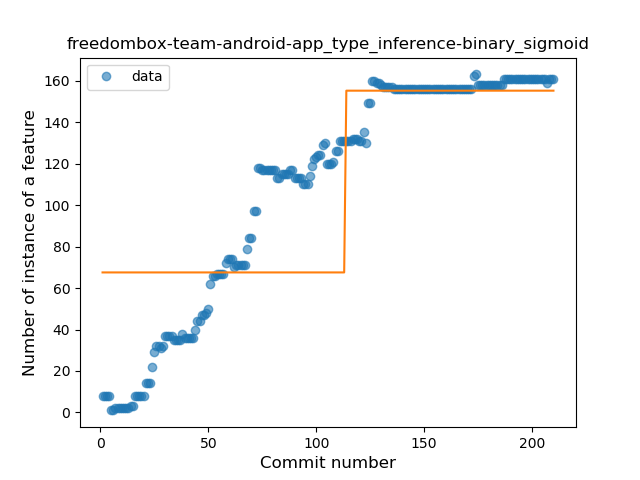
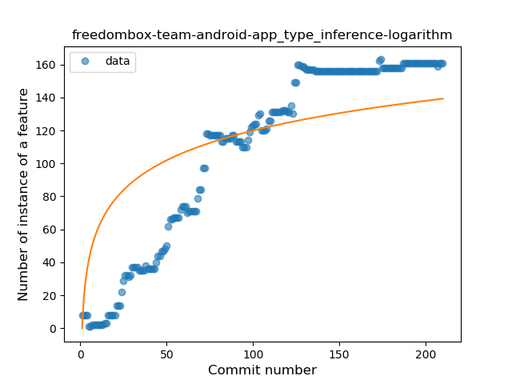
### <a name="lambda">Lambda</a>
----
#### Functions
* **Constant Rise - Linear:** 
    * **R_Squared:** 0.92907973
* **Sudden Rise Plateau - Logarithm:** 
    * **R_Squared:** 0.47935508

**Plots** :chart_with_upwards_trend:
-----

### <a name="safe_call">Safe Call</a>
----
#### Functions
* **Constant Rise - Linear:** 
    * **R_Squared:** 0.95822681
* **Plateau Gradual Rise - Sigmoid:** 
    * **R_Squared:** 0.96728661
* **Sudden Rise Plateau - Logarithm:** 
    * **R_Squared:** 0.59666341

**Plots** :chart_with_upwards_trend:
-----

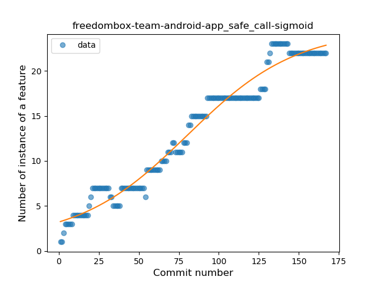
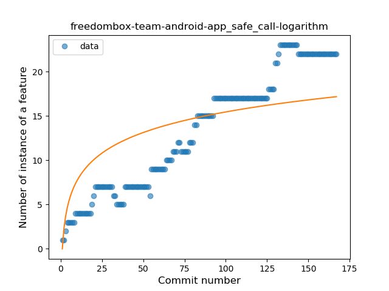
### <a name="when_expr">When expression</a>
----
#### Functions
* **Plateau Sudden Rise - Binary Sigmoid:** 
    * **R_Squared:** 1.0
* **Instability - Polinomial 3:** )
    * **R_Squared:** 0.54894529
* **Sudden Rise Plateau - Logarithm:** 
    * **R_Squared:** 0.4214238
* **Constant Rise - Linear:** 
    * **R_Squared:** 0.14968815

**Plots** :chart_with_upwards_trend:
-----

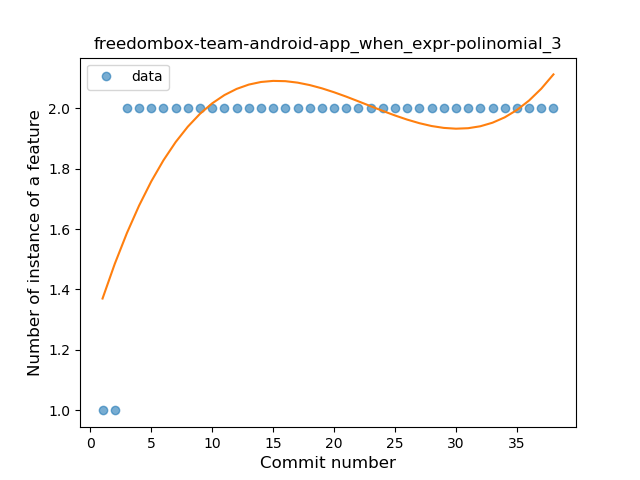
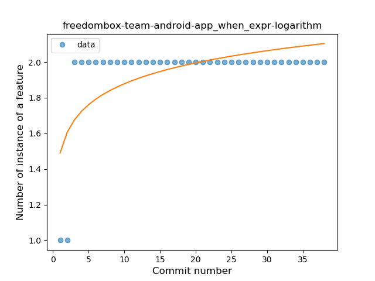
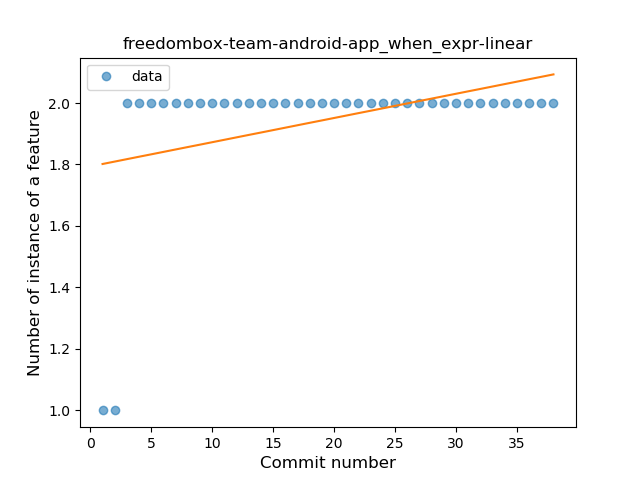
### <a name="companion_object">Companion Object</a>
----
#### Functions
* **Plateau Gradual Rise - Sigmoid:** 
    * **R_Squared:** 0.87629277
* **Sudden Rise Plateau - Logarithm:** 
    * **R_Squared:** 0.75760751
* **Constant Rise - Linear:** 
    * **R_Squared:** 0.66478001

**Plots** :chart_with_upwards_trend:
-----

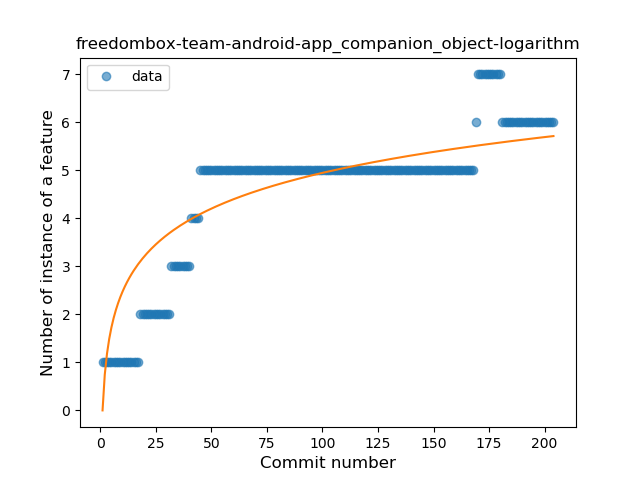
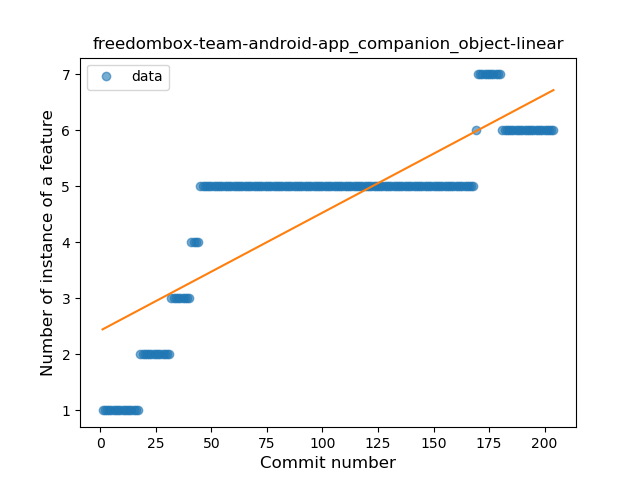
### <a name="unsafe_call">Unsafe Call</a>
----
#### Functions
* **Constant Rise - Linear:** 
    * **R_Squared:** 0.83367488
* **Sudden Rise Plateau - Logarithm:** 
    * **R_Squared:** 0.36494729

**Plots** :chart_with_upwards_trend:
-----

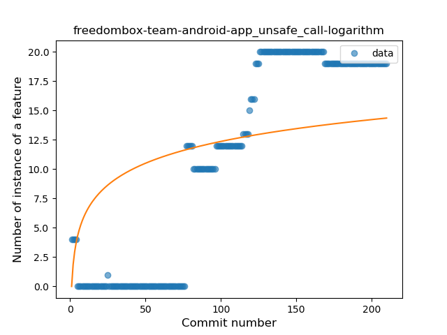
### <a name="string_template">String Template</a>
----
#### Functions
* **Constant Rise - Linear:** 
    * **R_Squared:** 0.77808528
* **Sudden Rise Plateau - Logarithm:** 
    * **R_Squared:** 0.52570037

**Plots** :chart_with_upwards_trend:
-----

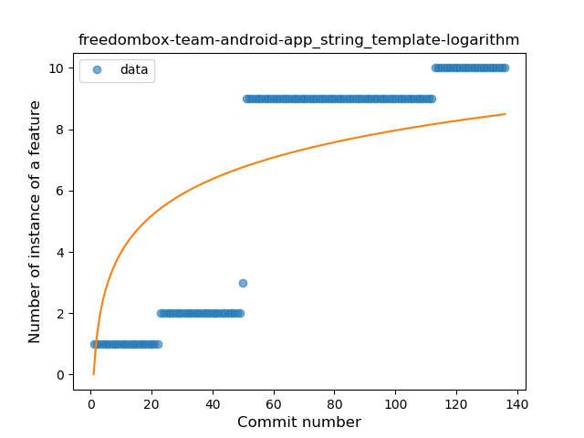
### <a name="func_with_default_value">Function with Default Value</a>
----
#### Functions
* **Plateau Sudden Rise - Binary Sigmoid:** 
    * **R_Squared:** 0.96492493
* **Constant Rise - Linear:** 
    * **R_Squared:** 0.80525733
* **Sudden Rise Plateau - Logarithm:** 
    * **R_Squared:** 0.54149869

**Plots** :chart_with_upwards_trend:
-----

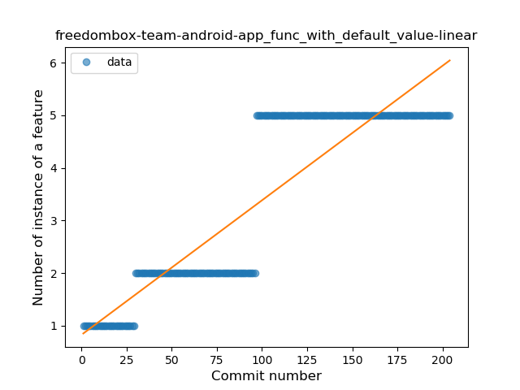
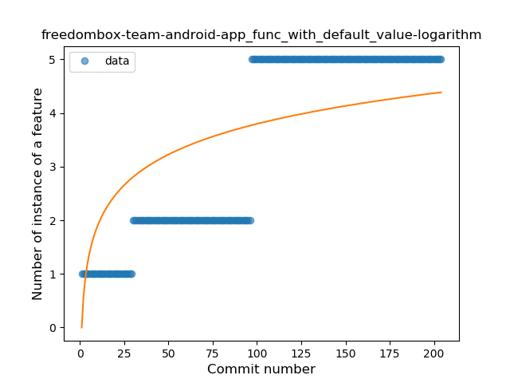
### <a name="singleton">Singleton</a>
----
#### Functions
* **Plateau Sudden Decline - Binary Sigmoid:** 
    * **R_Squared:** 1.0
* **Sudden Decline - Exponential:** 
    * **R_Squared:** 0.78124413
* **Constant Decline - Linear:** 
    * **R_Squared:** 0.45477266
* **Sudden Rise Plateau - Logarithm:** 
    * **R_Squared:** -0.0

**Plots** :chart_with_upwards_trend:
-----

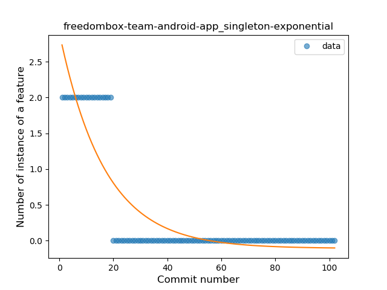
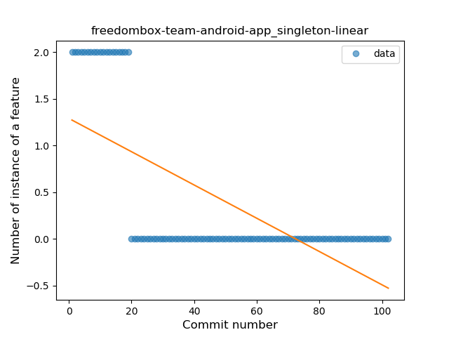
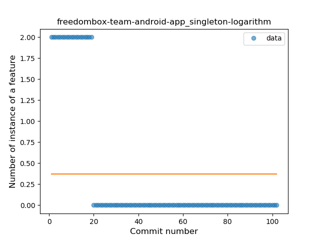
### <a name="func_call_with_named_arg">Function call with Named Argument</a>
----
#### Functions
* **Plateau Gradual Rise - Sigmoid:** 
    * **R_Squared:** 0.90575113
* **Constant Rise - Linear:** 
    * **R_Squared:** 0.65654167
* **Sudden Rise Plateau - Logarithm:** 
    * **R_Squared:** 0.56160983

**Plots** :chart_with_upwards_trend:
-----

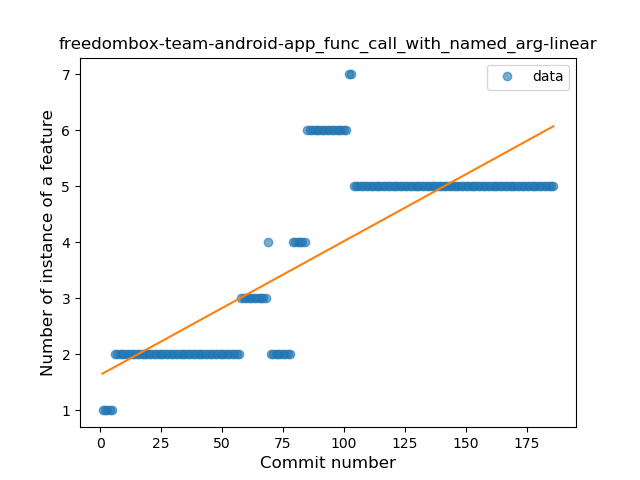
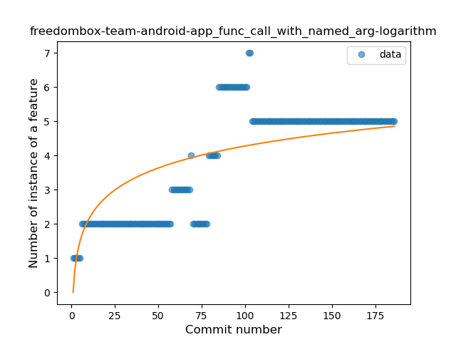
### <a name="data_class">Data Class</a>
----
#### Functions
* **Plateau Sudden Rise - Binary Sigmoid:** 
    * **R_Squared:** 1.0
* **Constant Rise - Linear:** 
    * **R_Squared:** 0.61455526
* **Sudden Rise Plateau - Logarithm:** 
    * **R_Squared:** 0.56068653

**Plots** :chart_with_upwards_trend:
-----

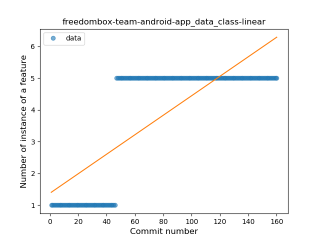
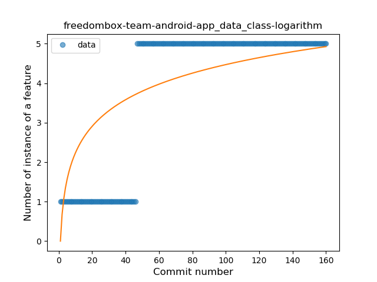
