## fvasco-pinpoi
----
#### Metrics provided by Detekt
* Number of lines of code 5327
* Number of Kotlin files: 49
* Cyclomatic complexity: 816
* Cyclomatic complexity by thousands of lines: 267 

----
**17** features analyzed

*	<a href="#type_inference">Type Inference</a> 
*	<a href="#lambda">Lambda</a> 
*	<a href="#safe_call">Safe Call</a> 
*	<a href="#when_expr">When expression</a> 
*	<a href="#companion_object">Companion Object</a> 
*	<a href="#unsafe_call">Unsafe Call</a> 
*	<a href="#string_template">String Template</a> 
*	<a href="#func_with_default_value">Function with Default Value</a> 
*	<a href="#singleton">Singleton</a> 
*	<a href="#smart_cast">Smart Cast</a> 
*	<a href="#range_expr">Range Expression</a> 
*	<a href="#func_call_with_named_arg">Function call with Named Argument</a> 
*	<a href="#data_class">Data Class</a> 
*	<a href="#extension_function">Extension Function</a> 
*	<a href="#property_delegation">Property Delegation</a> 
*	<a href="#destructuring_declaration">Destructuring Declaration</a> 
*	<a href="#inline_func">Inline Function</a> 

### <a name="type_inference">Type Inference</a>
----
#### Functions
* **Instability - Polinomial 3:** )
    * **R_Squared:** 0.62485275
* **Sudden Rise - Exponential:** 
    * **R_Squared:** 0.4698366
* **Constant Rise - Linear:** 
    * **R_Squared:** 0.44238763
* **Sudden Rise Plateau - Logarithm:** 
    * **R_Squared:** 0.15636166

**Plots** :chart_with_upwards_trend:
-----

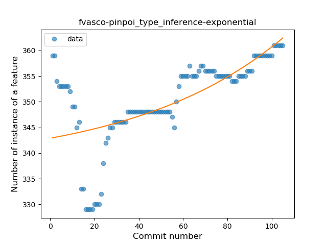
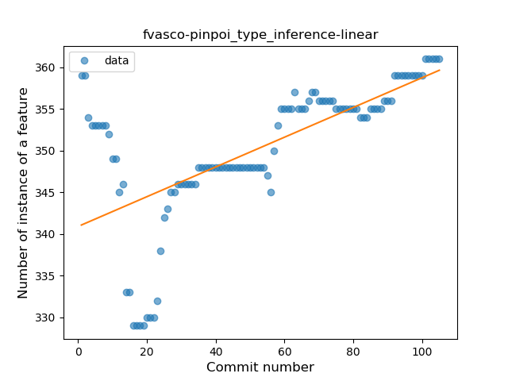
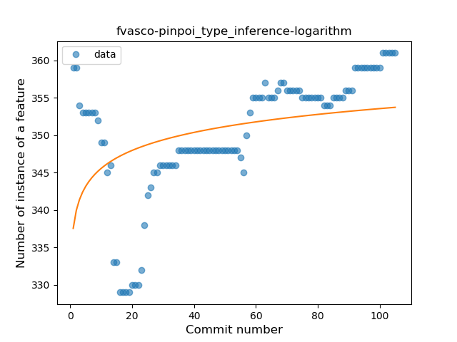
### <a name="lambda">Lambda</a>
----
#### Functions
* **Sudden Rise Plateau - Logarithm:** 
    * **R_Squared:** 0.92561222
* **Constant Rise - Linear:** 
    * **R_Squared:** 0.77915868
* **Plateau Sudden Rise - Binary Sigmoid:** 
    * **R_Squared:** 0.2808231

**Plots** :chart_with_upwards_trend:
-----

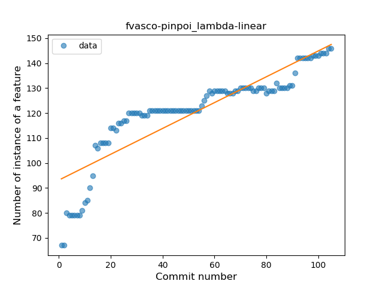
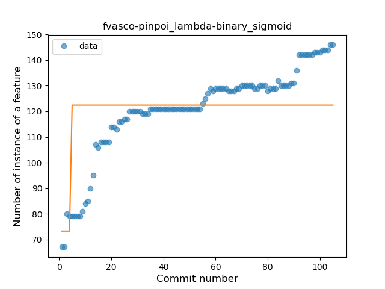
### <a name="safe_call">Safe Call</a>
----
#### Functions
* **Sudden Rise - Exponential:** 
    * **R_Squared:** 0.91839515
* **Constant Rise - Linear:** 
    * **R_Squared:** 0.87719265
* **Sudden Rise Plateau - Logarithm:** 
    * **R_Squared:** 0.68976244

**Plots** :chart_with_upwards_trend:
-----

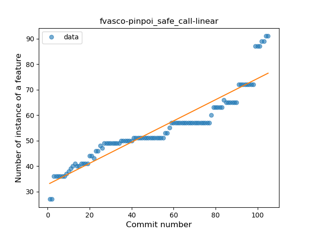
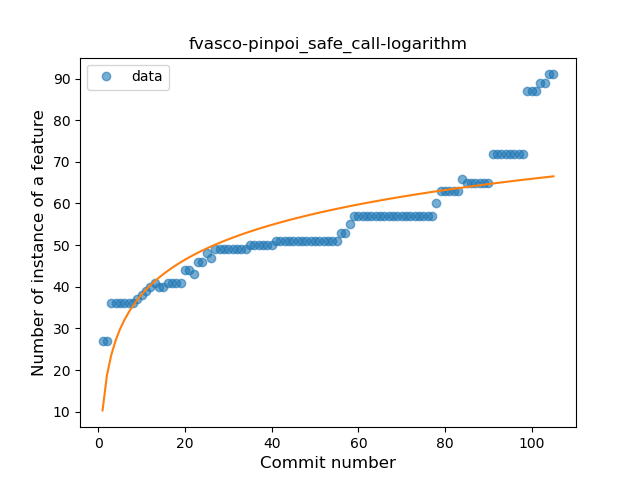
### <a name="when_expr">When expression</a>
----
#### Functions
* **Constant Rise - Linear:** 
    * **R_Squared:** 0.90727719
* **Sudden Rise Plateau - Logarithm:** 
    * **R_Squared:** 0.8283232

**Plots** :chart_with_upwards_trend:
-----

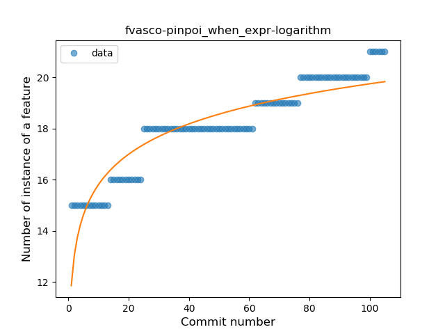
### <a name="companion_object">Companion Object</a>
----
#### Functions
* **Sudden Decline - Exponential:** 
    * **R_Squared:** 0.79311697
* **Constant Decline - Linear:** 
    * **R_Squared:** 0.3254717
* **Sudden Rise Plateau - Logarithm:** 
    * **R_Squared:** -0.0

**Plots** :chart_with_upwards_trend:
-----

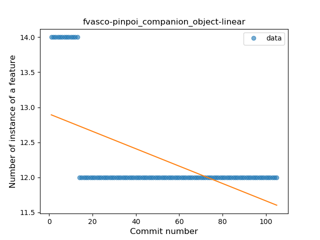
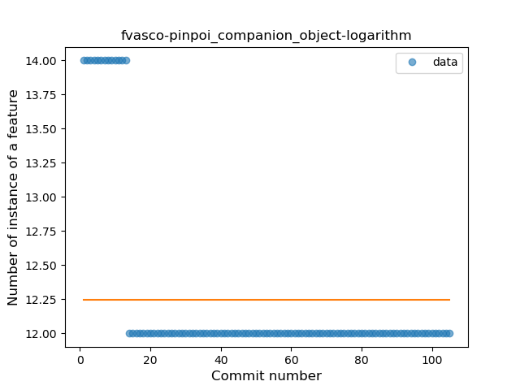
### <a name="unsafe_call">Unsafe Call</a>
----
#### Functions
* **Instability - Polinomial 3:** )
    * **R_Squared:** 0.89021252
* **Constant Decline - Linear:** 
    * **R_Squared:** 0.47537611
* **Sudden Rise - Exponential:** 
    * **R_Squared:** 0.0
* **Sudden Rise Plateau - Logarithm:** 
    * **R_Squared:** -0.0

**Plots** :chart_with_upwards_trend:
-----

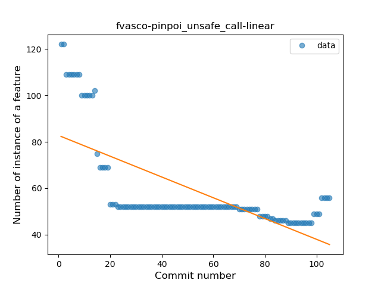
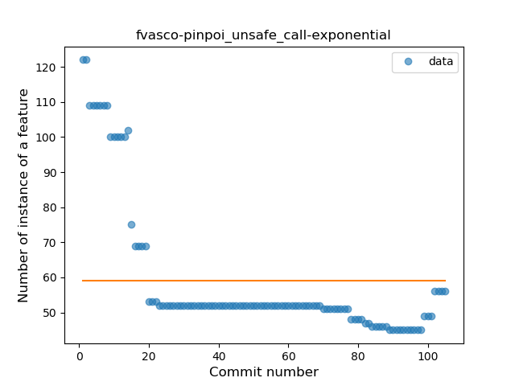

### <a name="string_template">String Template</a>
----
#### Functions
* **Constant Rise - Linear:** 
    * **R_Squared:** 0.89420655
* **Sudden Rise Plateau - Logarithm:** 
    * **R_Squared:** 0.88059675

**Plots** :chart_with_upwards_trend:
-----

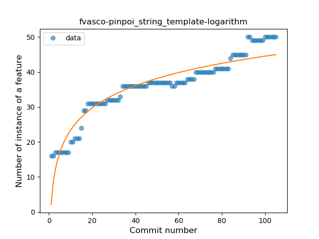
### <a name="func_with_default_value">Function with Default Value</a>
----
#### Functions
* **Plateau Gradual Rise - Sigmoid:** 
    * **R_Squared:** 0.92597065
* **Sudden Rise Plateau - Logarithm:** 
    * **R_Squared:** 0.69169051
* **Constant Rise - Linear:** 
    * **R_Squared:** 0.41930792

**Plots** :chart_with_upwards_trend:
-----

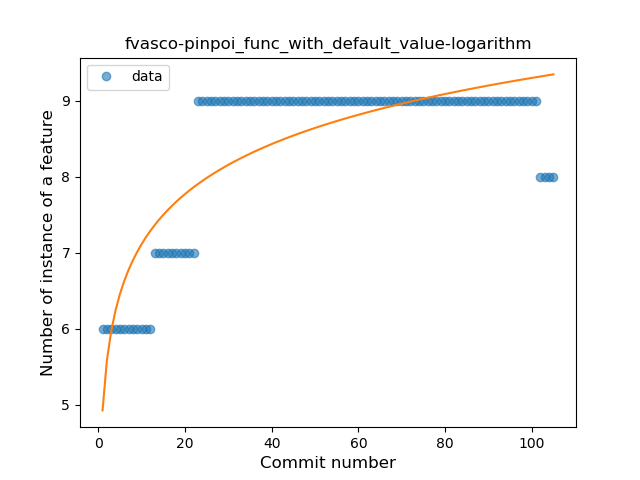
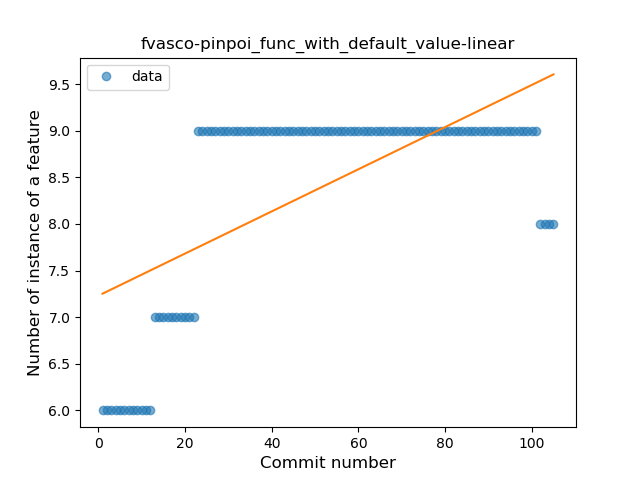
### <a name="singleton">Singleton</a>
----
#### Functions
* **Sudden Rise - Exponential:** 
    * **R_Squared:** 0.22054775
* **Constant Rise - Linear:** 
    * **R_Squared:** 0.09321516
* **Sudden Rise Plateau - Logarithm:** 
    * **R_Squared:** 0.03870014

**Plots** :chart_with_upwards_trend:
-----

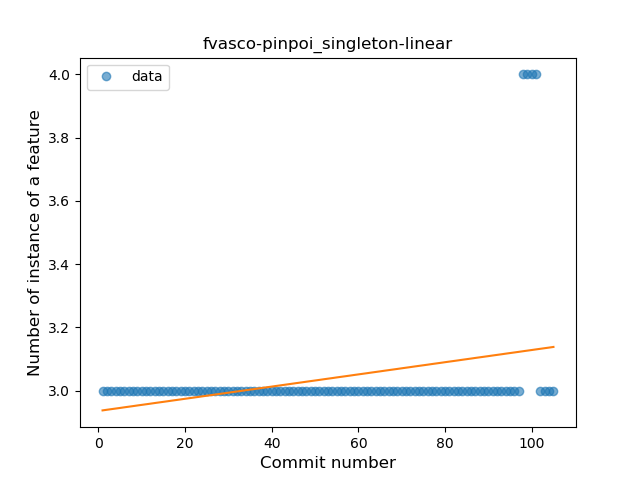
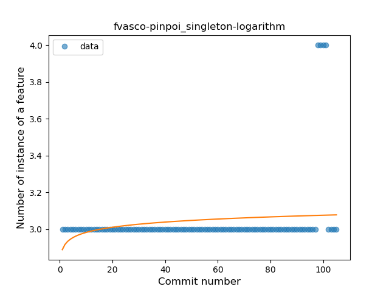
### <a name="smart_cast">Smart Cast</a>
----
#### Functions
* **Plateau Sudden Rise - Binary Sigmoid:** 
    * **R_Squared:** 1.0
* **Instability - Polinomial 4:** 
    * **R_Squared:** 0.87429013
* **Sudden Rise - Exponential:** 
    * **R_Squared:** 0.7641977
* **Constant Rise - Linear:** 
    * **R_Squared:** 0.64
* **Sudden Rise Plateau - Logarithm:** 
    * **R_Squared:** 0.37240792

**Plots** :chart_with_upwards_trend:
-----

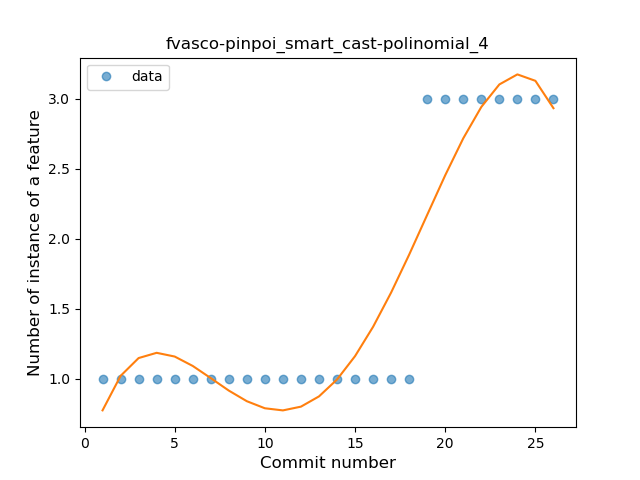
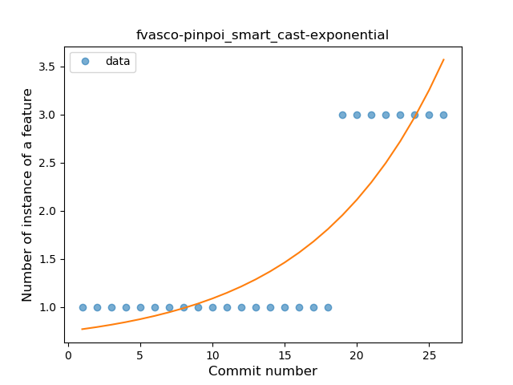
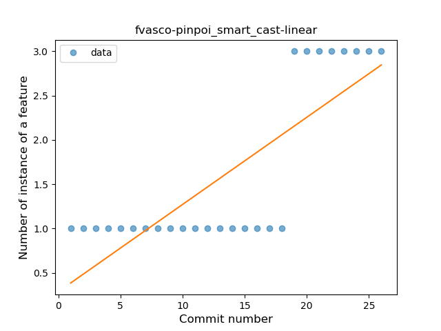
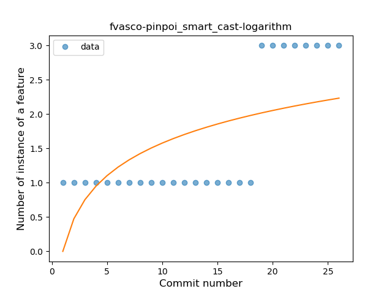
### <a name="range_expr">Range Expression</a>
----
#### Functions
* **Sudden Rise - Exponential:** 
    * **R_Squared:** 0.91235843
* **Constant Rise - Linear:** 
    * **R_Squared:** 0.50897154
* **Sudden Rise Plateau - Logarithm:** 
    * **R_Squared:** 0.18555202

**Plots** :chart_with_upwards_trend:
-----

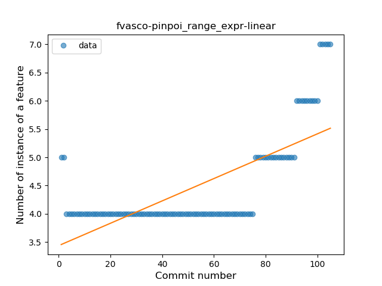
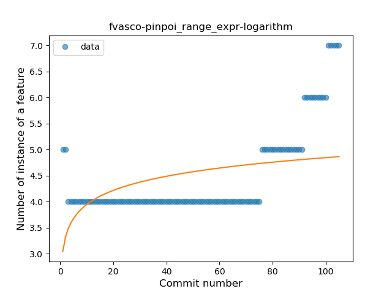
### <a name="func_call_with_named_arg">Function call with Named Argument</a>
----
#### Functions
* **Plateau Gradual Rise - Sigmoid:** 
    * **R_Squared:** 0.94686787
* **Sudden Rise - Exponential:** 
    * **R_Squared:** 0.91893893
* **Constant Rise - Linear:** 
    * **R_Squared:** 0.84778821
* **Sudden Rise Plateau - Logarithm:** 
    * **R_Squared:** 0.49811527

**Plots** :chart_with_upwards_trend:
-----

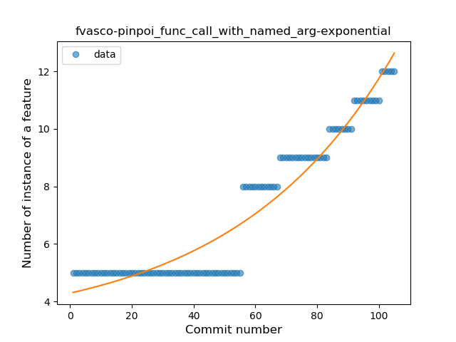
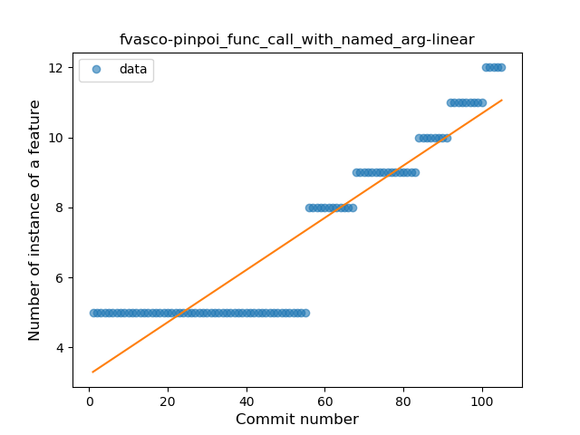
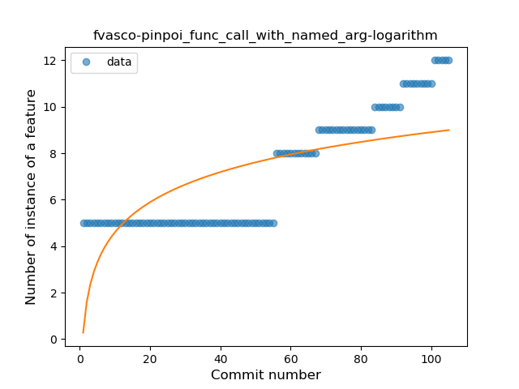
### <a name="data_class">Data Class</a>
----
#### Functions
* **Plateau Sudden Rise - Binary Sigmoid:** 
    * **R_Squared:** 1.0
* **Sudden Rise - Exponential:** 
    * **R_Squared:** 0.79124508
* **Constant Rise - Linear:** 
    * **R_Squared:** 0.34669811
* **Sudden Rise Plateau - Logarithm:** 
    * **R_Squared:** 0.14678313

**Plots** :chart_with_upwards_trend:
-----

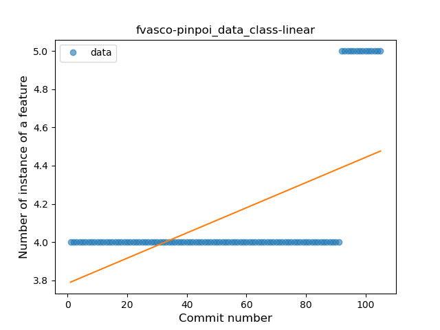
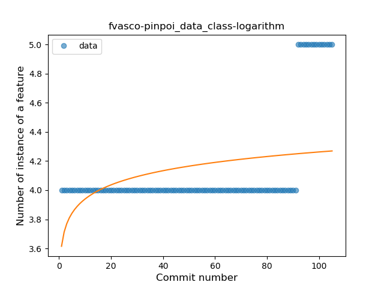
### <a name="extension_function">Extension Function</a>
----
#### Functions
* **Sudden Rise - Exponential:** 
    * **R_Squared:** 0.81916731
* **Constant Rise - Linear:** 
    * **R_Squared:** 0.45453953
* **Sudden Rise Plateau - Logarithm:** 
    * **R_Squared:** 0.21316494

**Plots** :chart_with_upwards_trend:
-----

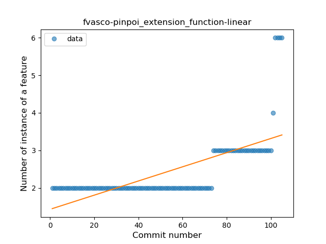
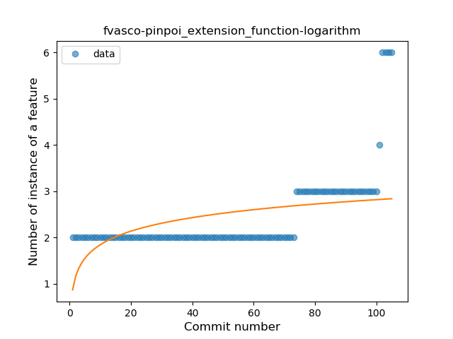
### <a name="property_delegation">Property Delegation</a>
----
#### Functions
* **Constant Decline - Linear:** 
    * **R_Squared:** 0.36225679
* **Sudden Rise Plateau - Logarithm:** 
    * **R_Squared:** -0.0

**Plots** :chart_with_upwards_trend:
-----

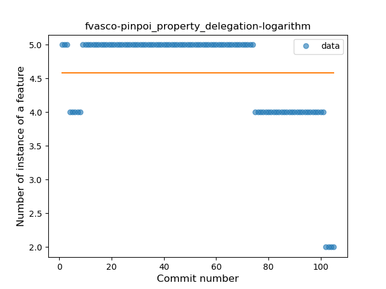
### <a name="destructuring_declaration">Destructuring Declaration</a>
----
#### Functions
* **Plateau Sudden Rise - Binary Sigmoid:** 
    * **R_Squared:** 1.0
* **Constant Rise - Linear:** 
    * **R_Squared:** 0.74183599
* **Sudden Rise - Exponential:** 
    * **R_Squared:** 0.75098526
* **Sudden Rise Plateau - Logarithm:** 
    * **R_Squared:** 0.47361609

**Plots** :chart_with_upwards_trend:
-----

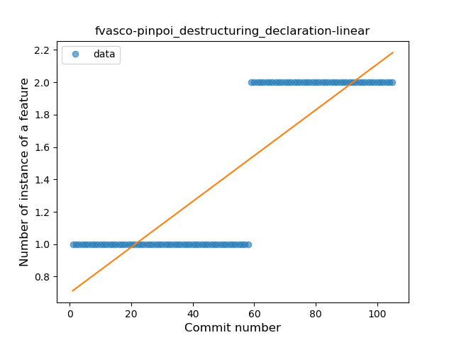
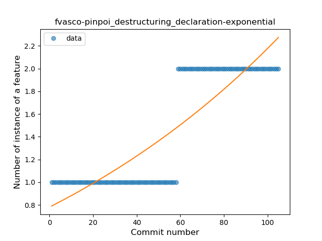

### <a name="inline_func">Inline Function</a>
----
#### Functions
* **Plateau Gradual Decline - Sigmoid:** 
    * **R_Squared:** 0.87982138
* **Sudden Decline - Exponential:** 
    * **R_Squared:** 0.8146921
* **Constant Decline - Linear:** 
    * **R_Squared:** 0.50515333
* **Sudden Rise Plateau - Logarithm:** 
    * **R_Squared:** -0.0

**Plots** :chart_with_upwards_trend:
-----

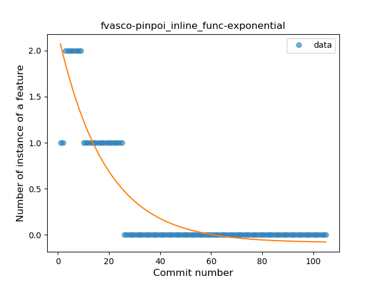
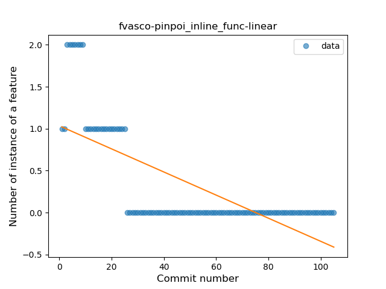
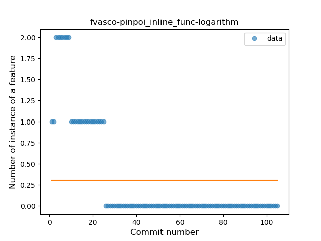
