## garmax1-material-flashlight
----
#### Metrics provided by Detekt
* Number of lines of code 0
* Number of Kotlin files: 0
* Cyclomatic complexity: 0
* Cyclomatic complexity by thousands of lines: 0 

----
**7** features analyzed

*	<a href="#type_inference">Type Inference</a> 
*	<a href="#lambda">Lambda</a> 
*	<a href="#safe_call">Safe Call</a> 
*	<a href="#when_expr">When expression</a> 
*	<a href="#companion_object">Companion Object</a> 
*	<a href="#unsafe_call">Unsafe Call</a> 
*	<a href="#range_expr">Range Expression</a> 

### <a name="type_inference">Type Inference</a>
----
#### Functions
* **Instability - Polinomial 3:** )
    * **R_Squared:** 0.76395748
* **Constant Decline - Linear:** 
    * **R_Squared:** 0.59822244
* **Sudden Rise Plateau - Logarithm:** 
    * **R_Squared:** -0.0

**Plots** :chart_with_upwards_trend:
-----

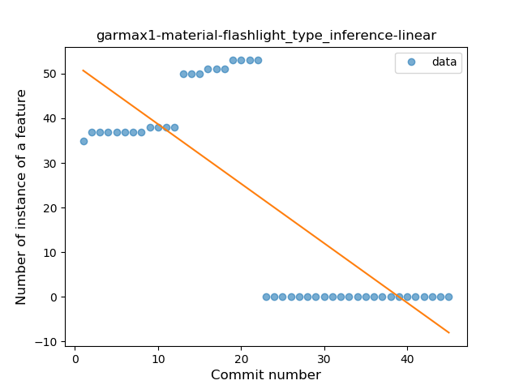
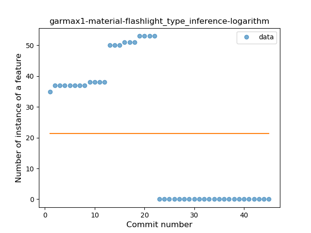
### <a name="lambda">Lambda</a>
----
#### Functions
* **Plateau Sudden Decline - Binary Sigmoid:** 
    * **R_Squared:** 1.0
* **Instability - Polinomial 3:** )
    * **R_Squared:** 0.85972291
* **Constant Decline - Linear:** 
    * **R_Squared:** 0.75
* **Sudden Decline - Exponential:** 
    * **R_Squared:** 0.75041254
* **Sudden Rise Plateau - Logarithm:** 
    * **R_Squared:** -0.0

**Plots** :chart_with_upwards_trend:
-----

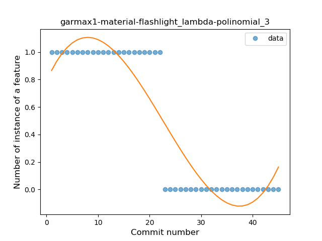
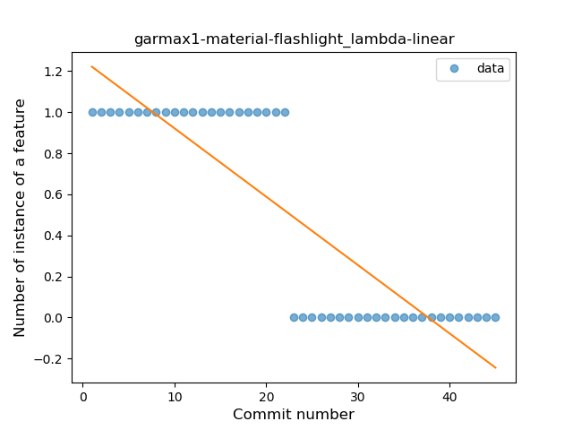
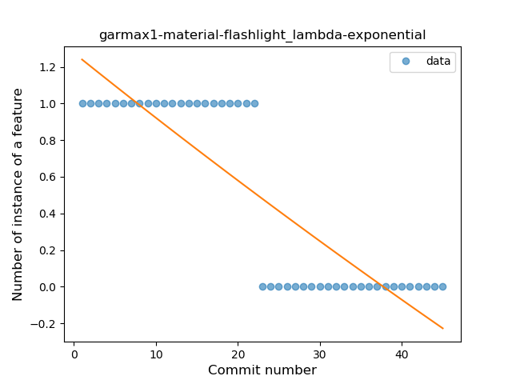

### <a name="safe_call">Safe Call</a>
----
#### Functions
* **Plateau Sudden Decline - Binary Sigmoid:** 
    * **R_Squared:** 0.99040798
* **Instability - Polinomial 3:** )
    * **R_Squared:** 0.84894561
* **Constant Decline - Linear:** 
    * **R_Squared:** 0.72038227
* **Sudden Rise Plateau - Logarithm:** 
    * **R_Squared:** -0.0

**Plots** :chart_with_upwards_trend:
-----

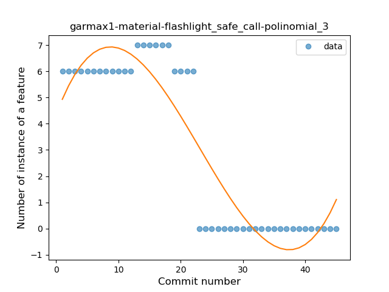
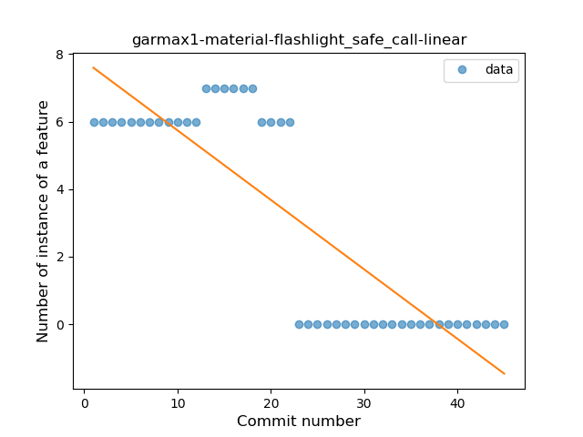
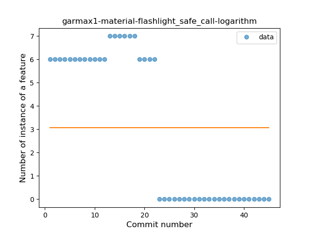
### <a name="when_expr">When expression</a>
----
#### Functions
* **Plateau Sudden Decline - Binary Sigmoid:** 
    * **R_Squared:** 0.99460099
* **Instability - Polinomial 3:** )
    * **R_Squared:** 0.85937371
* **Constant Decline - Linear:** 
    * **R_Squared:** 0.73037576
* **Sudden Rise Plateau - Logarithm:** 
    * **R_Squared:** -0.0

**Plots** :chart_with_upwards_trend:
-----

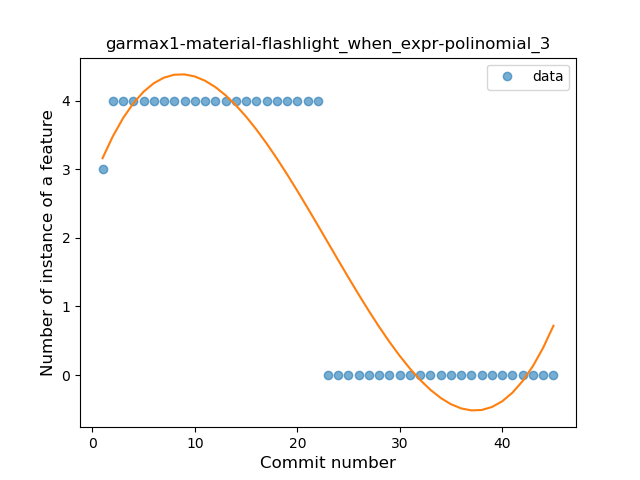

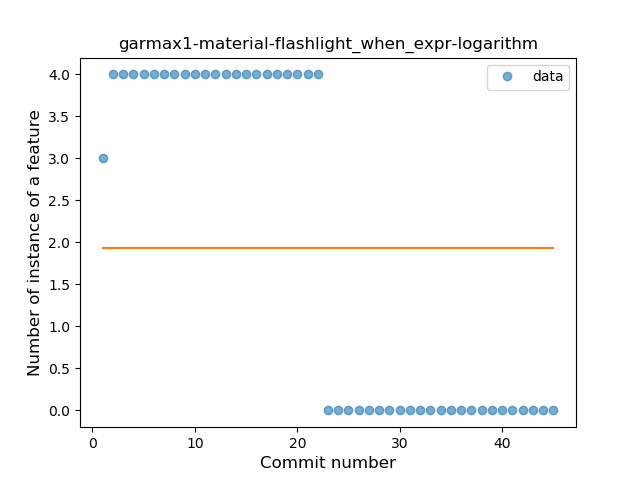
### <a name="companion_object">Companion Object</a>
----
#### Functions
* **Instability - Polinomial 3:** )
    * **R_Squared:** 0.82617065
* **Constant Decline - Linear:** 
    * **R_Squared:** 0.67394106
* **Plateau Sudden Decline - Binary Sigmoid:** 
    * **R_Squared:** 0.49693666
* **Sudden Rise Plateau - Logarithm:** 
    * **R_Squared:** -0.0

**Plots** :chart_with_upwards_trend:
-----

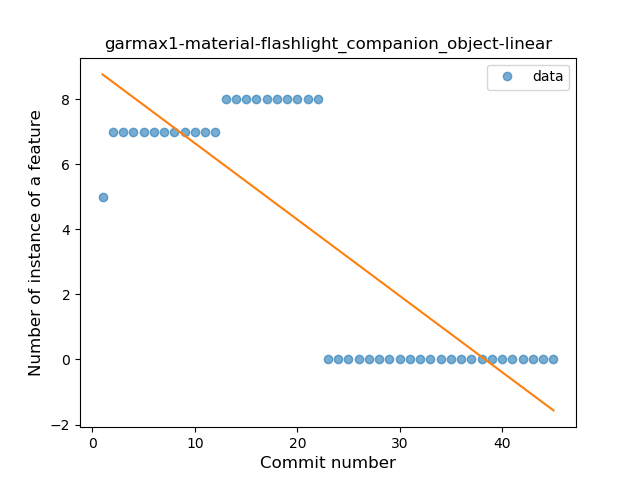
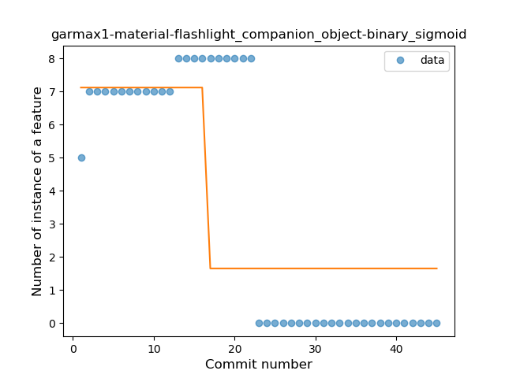
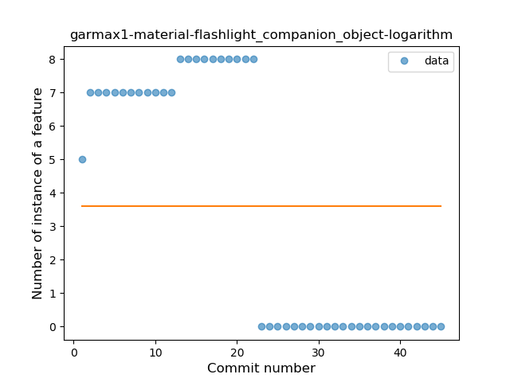
### <a name="unsafe_call">Unsafe Call</a>
----
#### Functions
* **Instability - Polinomial 3:** )
    * **R_Squared:** 0.85972291
* **Constant Decline - Linear:** 
    * **R_Squared:** 0.75
* **Sudden Decline - Exponential:** 
    * **R_Squared:** 0.75041254
* **Sudden Rise Plateau - Logarithm:** 
    * **R_Squared:** -0.0

**Plots** :chart_with_upwards_trend:
-----

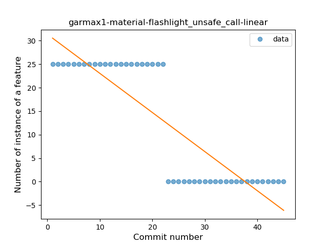
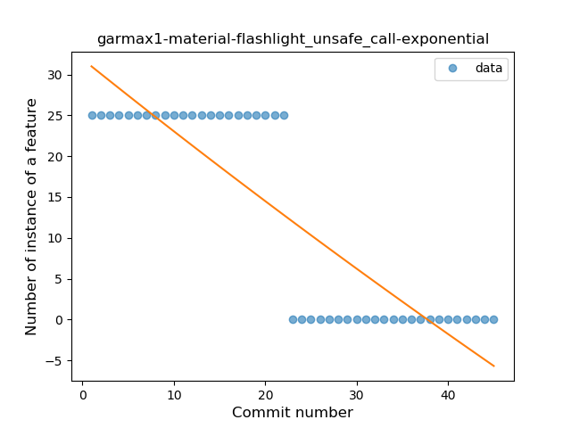
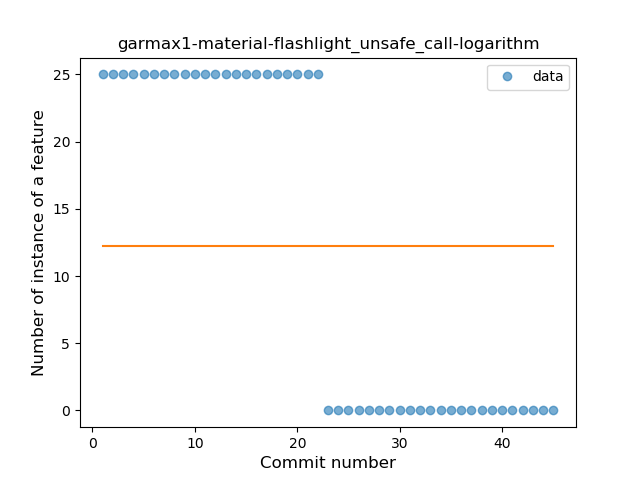
### <a name="range_expr">Range Expression</a>
----
#### Functions
* **Plateau Sudden Decline - Binary Sigmoid:** 
    * **R_Squared:** 1.0
* **Instability - Polinomial 3:** )
    * **R_Squared:** 0.85972291
* **Constant Decline - Linear:** 
    * **R_Squared:** 0.75
* **Sudden Decline - Exponential:** 
    * **R_Squared:** 0.75041254
* **Sudden Rise Plateau - Logarithm:** 
    * **R_Squared:** -0.0

**Plots** :chart_with_upwards_trend:
-----

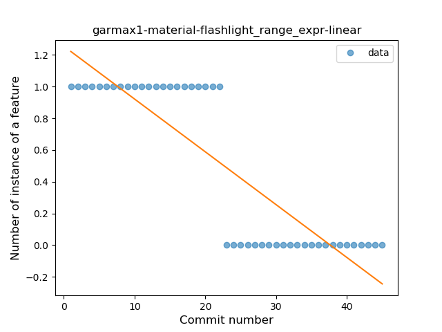
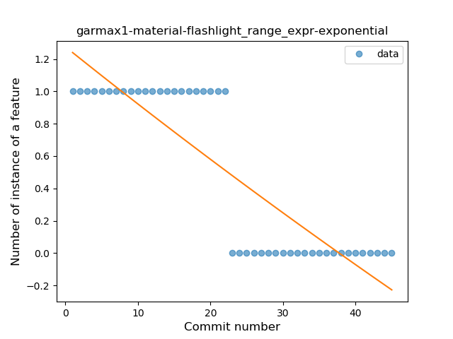

