## glodanif-BluetoothChat
----
#### Metrics provided by Detekt
* Number of lines of code 10043
* Number of Kotlin files: 120
* Cyclomatic complexity: 1770
* Cyclomatic complexity by thousands of lines: 322 

----
**15** features analyzed

*	<a href="#type_inference">Type Inference</a> 
*	<a href="#lambda">Lambda</a> 
*	<a href="#safe_call">Safe Call</a> 
*	<a href="#when_expr">When expression</a> 
*	<a href="#companion_object">Companion Object</a> 
*	<a href="#unsafe_call">Unsafe Call</a> 
*	<a href="#string_template">String Template</a> 
*	<a href="#func_with_default_value">Function with Default Value</a> 
*	<a href="#singleton">Singleton</a> 
*	<a href="#smart_cast">Smart Cast</a> 
*	<a href="#func_call_with_named_arg">Function call with Named Argument</a> 
*	<a href="#data_class">Data Class</a> 
*	<a href="#extension_function">Extension Function</a> 
*	<a href="#property_delegation">Property Delegation</a> 
*	<a href="#inline_func">Inline Function</a> 

### <a name="type_inference">Type Inference</a>
----
#### Functions
* **Constant Rise - Linear:** 
    * **R_Squared:** 0.90118975
* **Sudden Rise Plateau - Logarithm:** 
    * **R_Squared:** 0.69285487
* **Plateau Sudden Rise - Binary Sigmoid:** 
    * **R_Squared:** 0.49829138

**Plots** :chart_with_upwards_trend:
-----

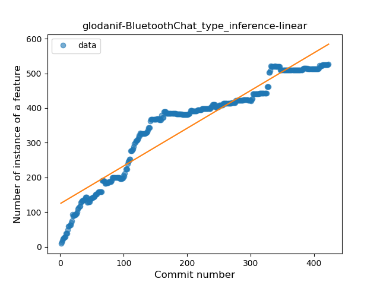
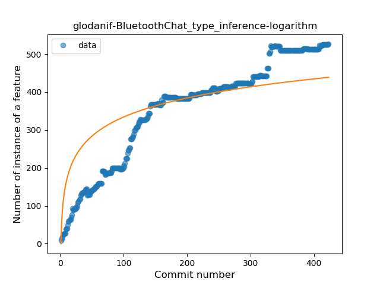
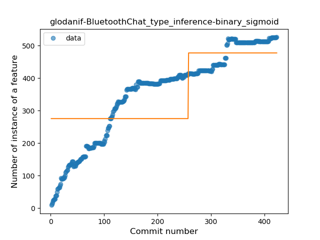
### <a name="lambda">Lambda</a>
----
#### Functions
* **Constant Rise - Linear:** 
    * **R_Squared:** 0.97561219
* **Plateau Sudden Rise - Binary Sigmoid:** 
    * **R_Squared:** 0.49283194
* **Sudden Rise Plateau - Logarithm:** 
    * **R_Squared:** 0.45775857

**Plots** :chart_with_upwards_trend:
-----

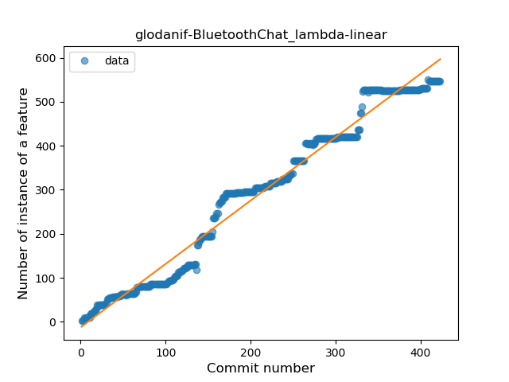
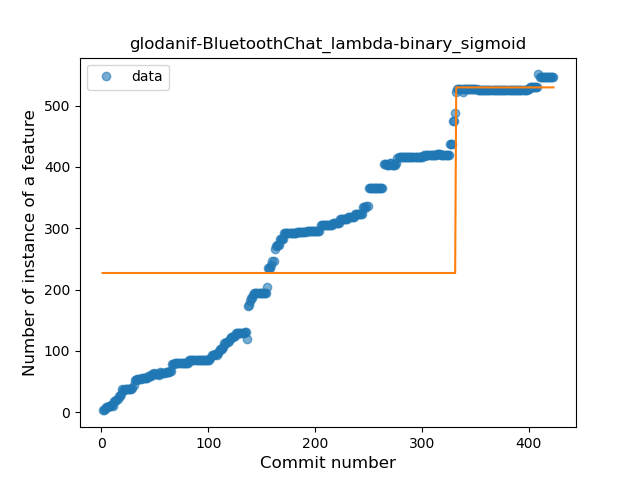
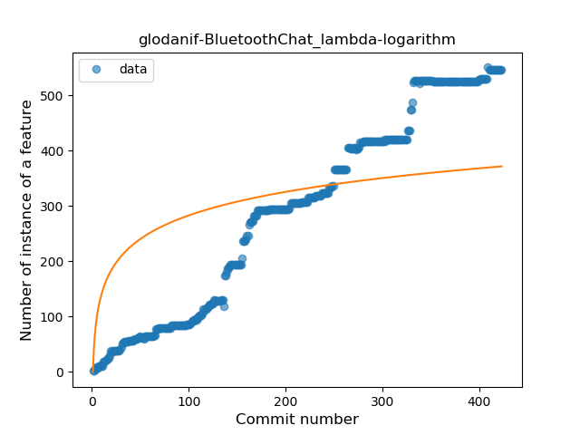
### <a name="safe_call">Safe Call</a>
----
#### Functions
* **Sudden Rise Plateau - Logarithm:** 
    * **R_Squared:** 0.79988972
* **Constant Rise - Linear:** 
    * **R_Squared:** 0.75342651
* **Plateau Sudden Rise - Binary Sigmoid:** 
    * **R_Squared:** 0.35635718

**Plots** :chart_with_upwards_trend:
-----

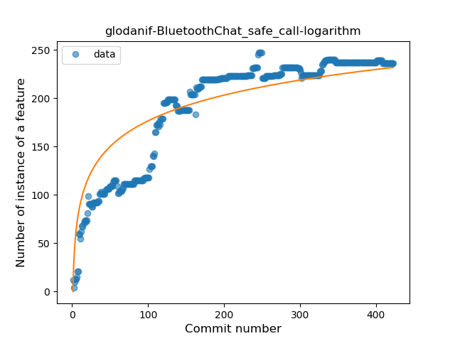
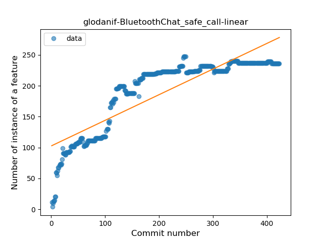
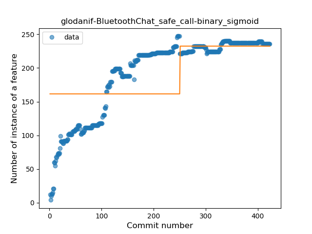
### <a name="when_expr">When expression</a>
----
#### Functions
* **Plateau Gradual Rise - Sigmoid:** 
    * **R_Squared:** 0.98381809
* **Constant Rise - Linear:** 
    * **R_Squared:** 0.84260813
* **Sudden Rise Plateau - Logarithm:** 
    * **R_Squared:** 0.59698346

**Plots** :chart_with_upwards_trend:
-----

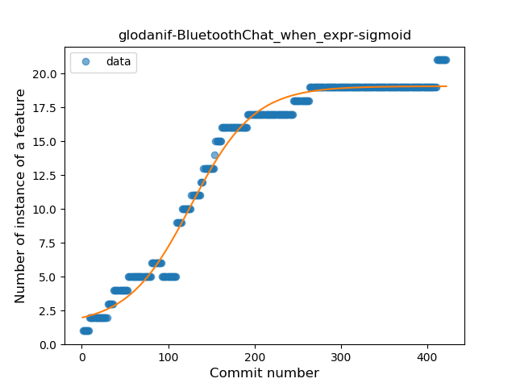
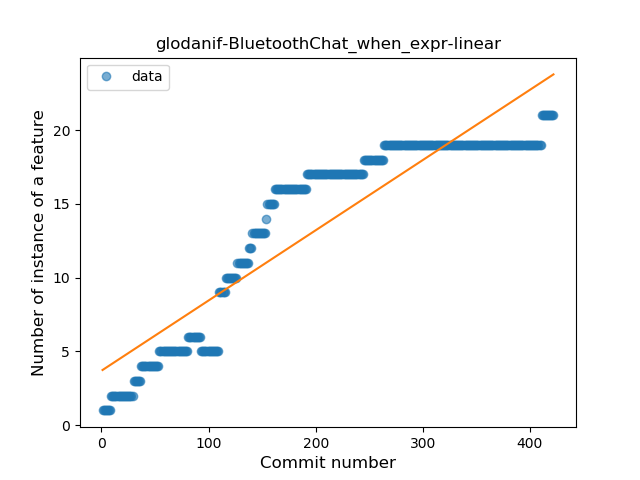
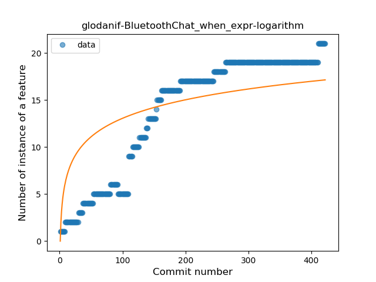
### <a name="companion_object">Companion Object</a>
----
#### Functions
* **Plateau Gradual Rise - Sigmoid:** 
    * **R_Squared:** 0.96045377
* **Sudden Rise Plateau - Logarithm:** 
    * **R_Squared:** 0.77527401
* **Constant Rise - Linear:** 
    * **R_Squared:** 0.70257226

**Plots** :chart_with_upwards_trend:
-----

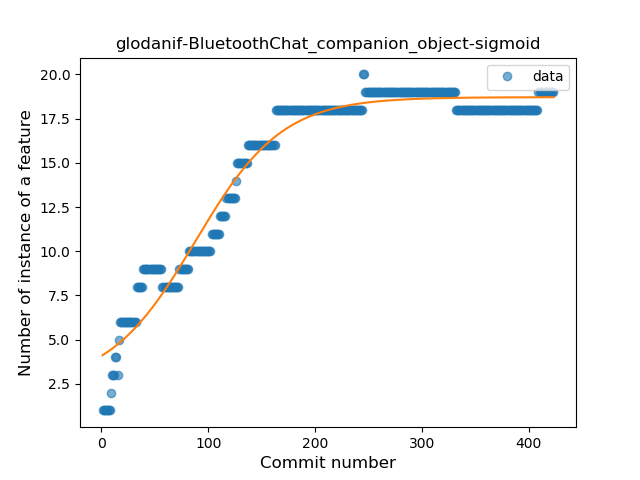
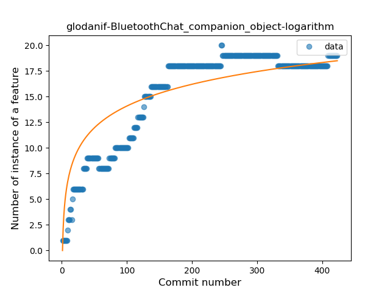
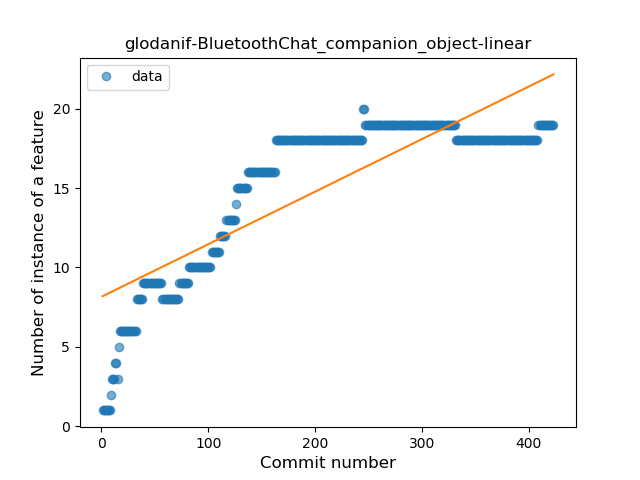
### <a name="unsafe_call">Unsafe Call</a>
----
#### Functions
* **Constant Decline - Linear:** 
    * **R_Squared:** 0.29676698
* **Plateau Sudden Decline - Binary Sigmoid:** 
    * **R_Squared:** 0.17984174
* **Sudden Rise Plateau - Logarithm:** 
    * **R_Squared:** -0.0

**Plots** :chart_with_upwards_trend:
-----

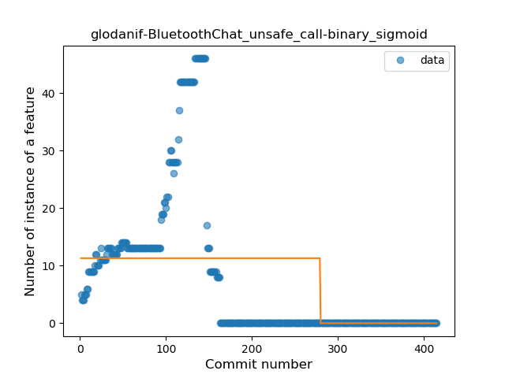
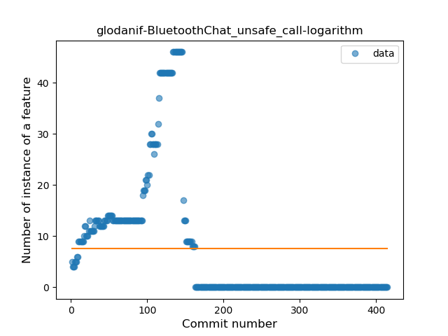
### <a name="string_template">String Template</a>
----
#### Functions
* **Sudden Rise Plateau - Logarithm:** 
    * **R_Squared:** 0.74449544
* **Constant Rise - Linear:** 
    * **R_Squared:** 0.49595685

**Plots** :chart_with_upwards_trend:
-----

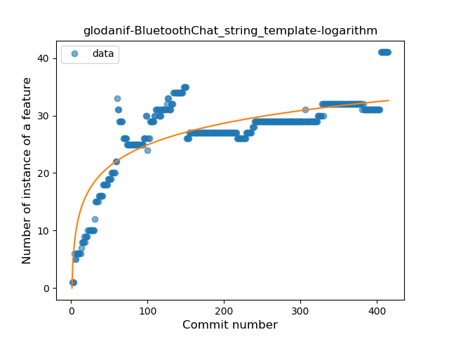
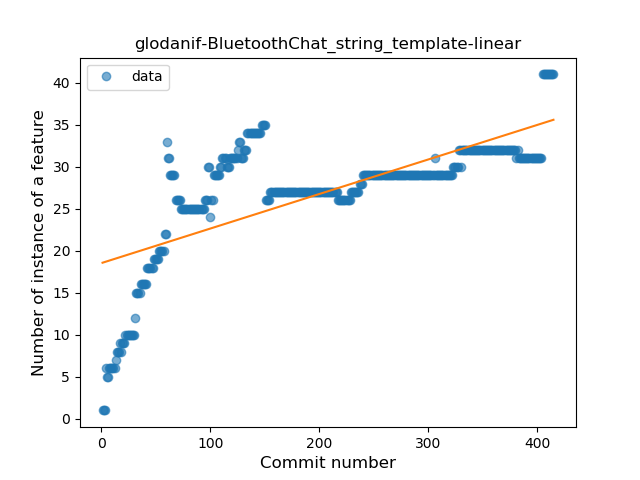
### <a name="func_with_default_value">Function with Default Value</a>
----
#### Functions
* **Constant Rise - Linear:** 
    * **R_Squared:** 0.87812865
* **Sudden Rise Plateau - Logarithm:** 
    * **R_Squared:** 0.72105899

**Plots** :chart_with_upwards_trend:
-----

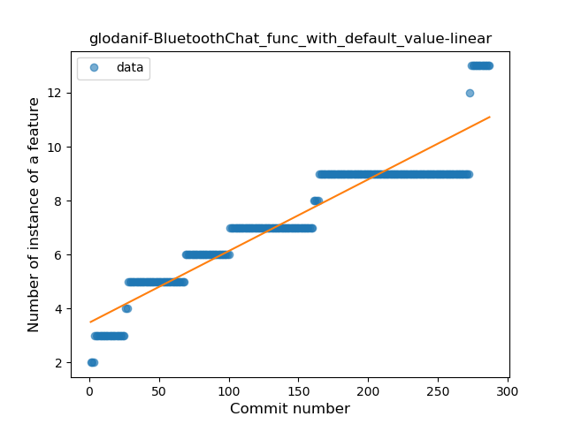
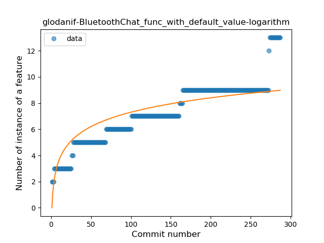
### <a name="singleton">Singleton</a>
----
#### Functions
* **Sudden Rise Plateau - Logarithm:** 
    * **R_Squared:** 0.01349451
* **Constant Rise - Linear:** 
    * **R_Squared:** 0.00176964
* **Sudden Rise - Exponential:** 
    * **R_Squared:** 0.00175373

**Plots** :chart_with_upwards_trend:
-----

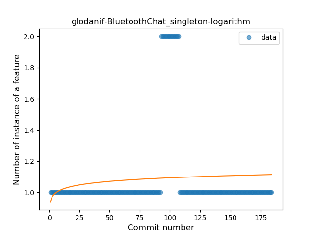
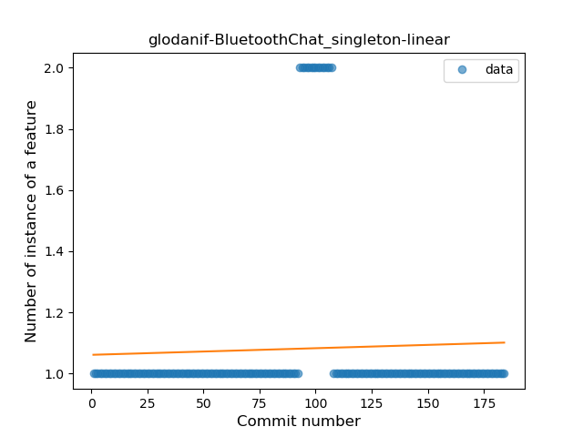
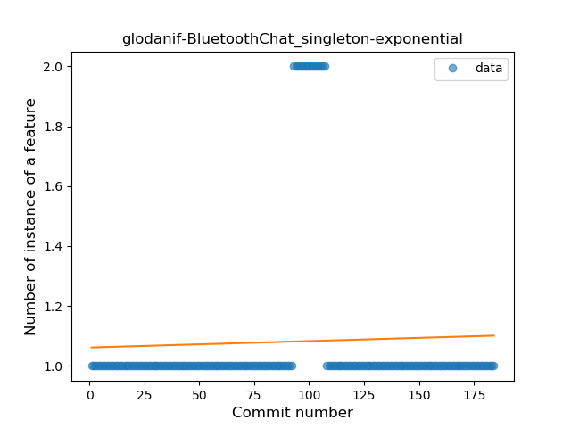
### <a name="smart_cast">Smart Cast</a>
----
#### Functions
* **Sudden Rise Plateau - Logarithm:** 
    * **R_Squared:** 0.76785058
* **Constant Rise - Linear:** 
    * **R_Squared:** 0.48487366

**Plots** :chart_with_upwards_trend:
-----

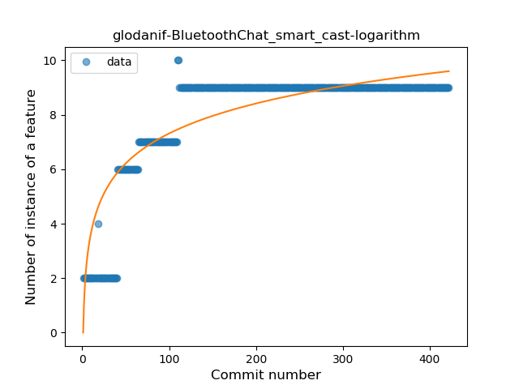
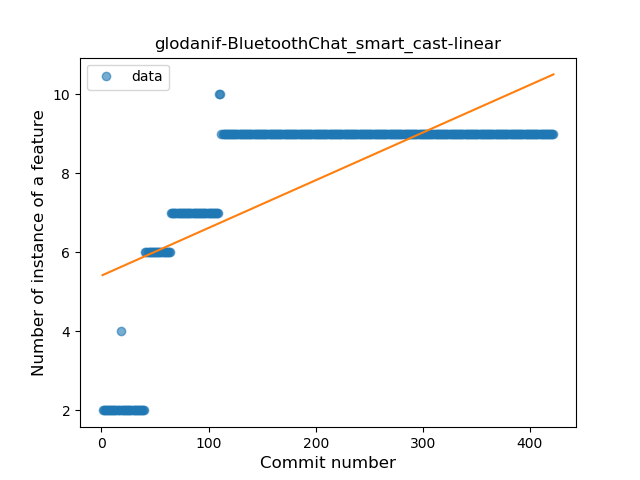
### <a name="func_call_with_named_arg">Function call with Named Argument</a>
----
#### Functions
* **Sudden Rise Plateau - Logarithm:** 
    * **R_Squared:** 0.61298604
* **Constant Rise - Linear:** 
    * **R_Squared:** 0.33594971

**Plots** :chart_with_upwards_trend:
-----

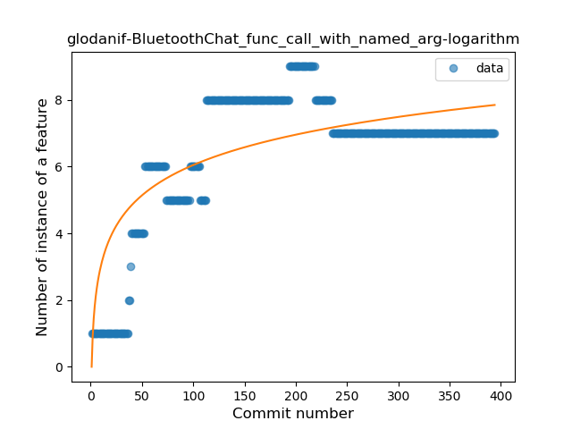
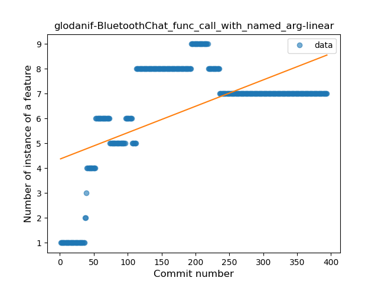
### <a name="data_class">Data Class</a>
----
#### Functions
* **Constant Rise - Linear:** 
    * **R_Squared:** 0.82744132
* **Sudden Rise Plateau - Logarithm:** 
    * **R_Squared:** 0.55714752

**Plots** :chart_with_upwards_trend:
-----

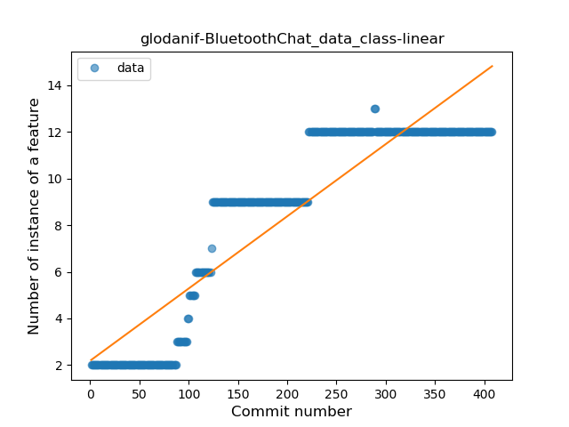
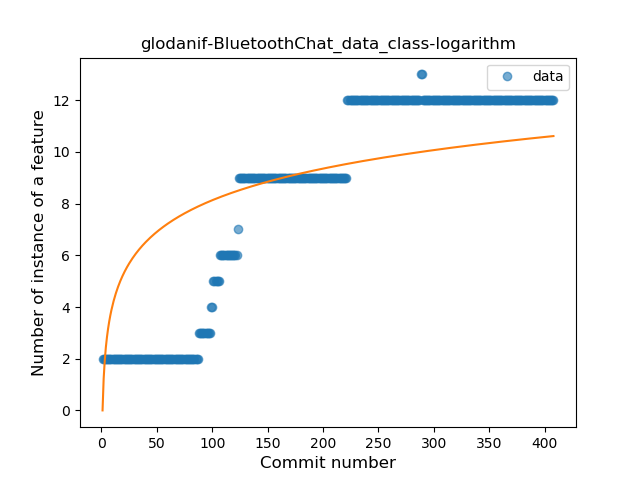
### <a name="extension_function">Extension Function</a>
----
#### Functions
* **Constant Rise - Linear:** 
    * **R_Squared:** 0.94400612
* **Sudden Rise Plateau - Logarithm:** 
    * **R_Squared:** 0.46749876

**Plots** :chart_with_upwards_trend:
-----

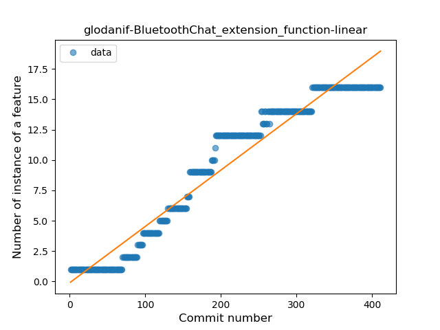

### <a name="property_delegation">Property Delegation</a>
----
#### Functions
* **Constant Rise - Linear:** 
    * **R_Squared:** 0.88572983
* **Sudden Rise - Exponential:** 
    * **R_Squared:** 0.89437378
* **Sudden Rise Plateau - Logarithm:** 
    * **R_Squared:** 0.62466256

**Plots** :chart_with_upwards_trend:
-----

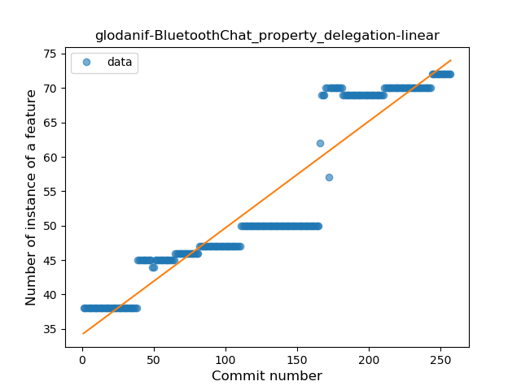
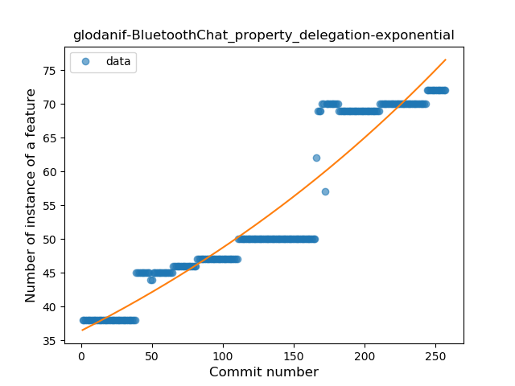
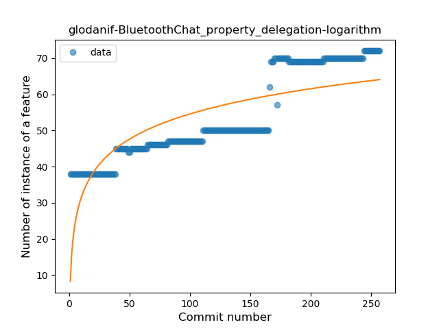
### <a name="inline_func">Inline Function</a>
----
#### Functions
* **Plateau Sudden Rise - Binary Sigmoid:** 
    * **R_Squared:** 0.92638678
* **Sudden Rise - Exponential:** 
    * **R_Squared:** 0.78695985
* **Constant Rise - Linear:** 
    * **R_Squared:** 0.77138029
* **Sudden Rise Plateau - Logarithm:** 
    * **R_Squared:** 0.5170714

**Plots** :chart_with_upwards_trend:
-----

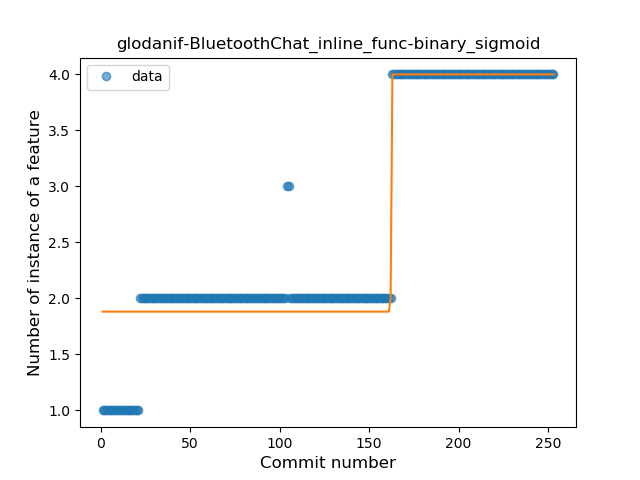
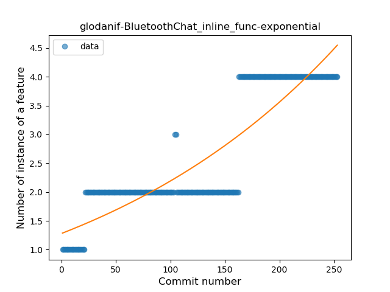

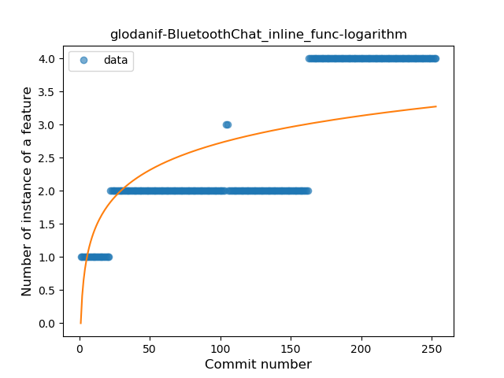
