## grote-Transportr
----
#### Metrics provided by Detekt
* Number of lines of code 8380
* Number of Kotlin files: 71
* Cyclomatic complexity: 1054
* Cyclomatic complexity by thousands of lines: 264 

----
**13** features analyzed

*	<a href="#type_inference">Type Inference</a> 
*	<a href="#lambda">Lambda</a> 
*	<a href="#safe_call">Safe Call</a> 
*	<a href="#when_expr">When expression</a> 
*	<a href="#companion_object">Companion Object</a> 
*	<a href="#unsafe_call">Unsafe Call</a> 
*	<a href="#string_template">String Template</a> 
*	<a href="#func_with_default_value">Function with Default Value</a> 
*	<a href="#singleton">Singleton</a> 
*	<a href="#smart_cast">Smart Cast</a> 
*	<a href="#func_call_with_named_arg">Function call with Named Argument</a> 
*	<a href="#data_class">Data Class</a> 
*	<a href="#extension_function">Extension Function</a> 

### <a name="type_inference">Type Inference</a>
----
#### Functions
* **Constant Rise - Linear:** 
    * **R_Squared:** 0.92687157
* **Sudden Rise Plateau - Logarithm:** 
    * **R_Squared:** 0.61174663

**Plots** :chart_with_upwards_trend:
-----

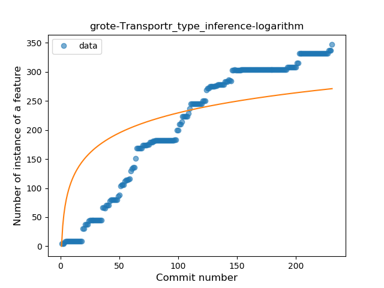
### <a name="lambda">Lambda</a>
----
#### Functions
* **Instability - Polinomial 3:** )
    * **R_Squared:** 0.95644502
* **Constant Rise - Linear:** 
    * **R_Squared:** 0.91199782
* **Plateau Sudden Rise - Binary Sigmoid:** 
    * **R_Squared:** 0.9028026
* **Sudden Rise Plateau - Logarithm:** 
    * **R_Squared:** 0.45723754

**Plots** :chart_with_upwards_trend:
-----

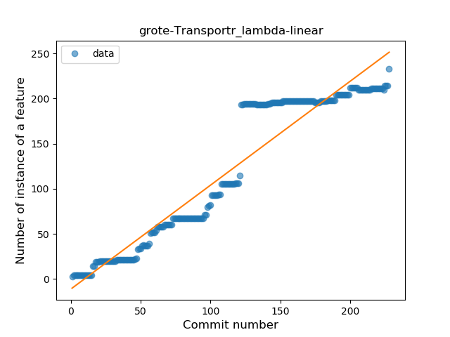
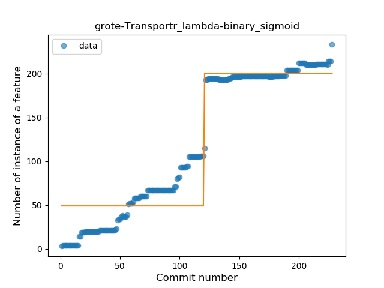
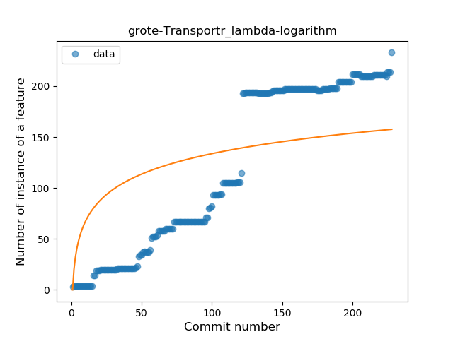
### <a name="safe_call">Safe Call</a>
----
#### Functions
* **Constant Rise - Linear:** 
    * **R_Squared:** 0.8739234
* **Sudden Rise Plateau - Logarithm:** 
    * **R_Squared:** 0.65361868
* **Plateau Sudden Rise - Binary Sigmoid:** 
    * **R_Squared:** 0.63570808

**Plots** :chart_with_upwards_trend:
-----

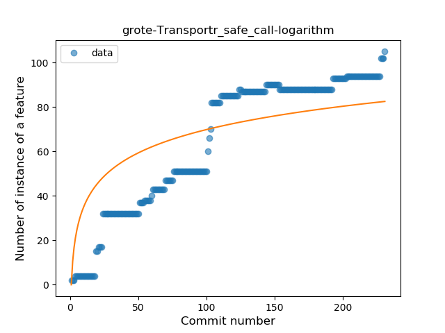
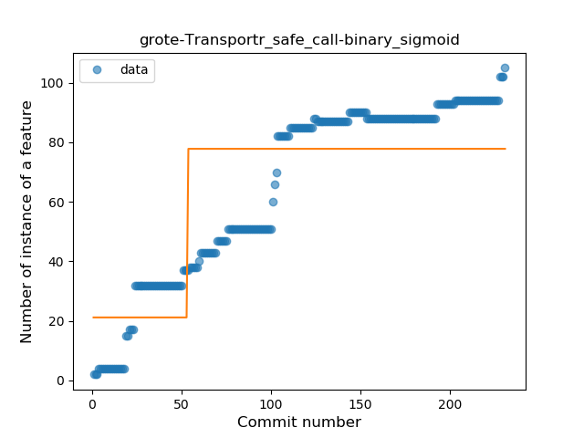
### <a name="when_expr">When expression</a>
----
#### Functions
* **Constant Rise - Linear:** 
    * **R_Squared:** 0.91835605
* **Sudden Rise Plateau - Logarithm:** 
    * **R_Squared:** 0.57724902
* **Plateau Sudden Rise - Binary Sigmoid:** 
    * **R_Squared:** 0.11693741

**Plots** :chart_with_upwards_trend:
-----

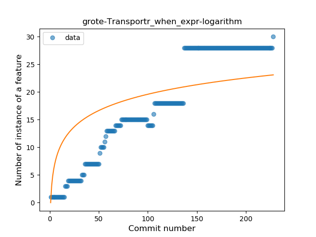
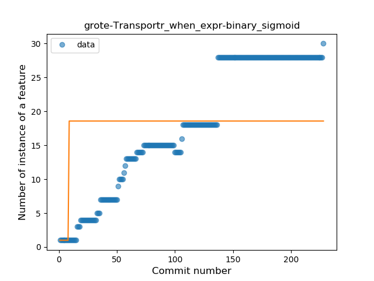
### <a name="companion_object">Companion Object</a>
----
#### Functions
* **Plateau Gradual Rise - Sigmoid:** 
    * **R_Squared:** 0.9873174
* **Constant Rise - Linear:** 
    * **R_Squared:** 0.93575919
* **Sudden Rise Plateau - Logarithm:** 
    * **R_Squared:** 0.57891111

**Plots** :chart_with_upwards_trend:
-----

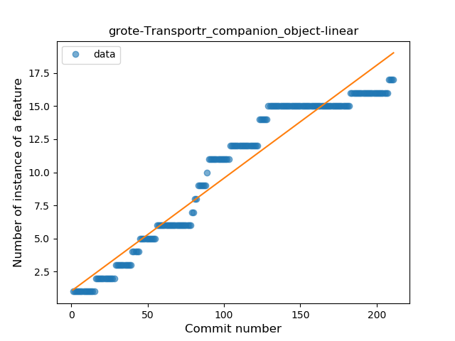
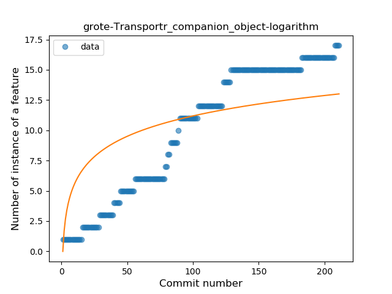
### <a name="unsafe_call">Unsafe Call</a>
----
#### Functions
* **Plateau Gradual Rise - Sigmoid:** 
    * **R_Squared:** 0.96883381
* **Constant Rise - Linear:** 
    * **R_Squared:** 0.90950102
* **Sudden Rise Plateau - Logarithm:** 
    * **R_Squared:** 0.60810071

**Plots** :chart_with_upwards_trend:
-----

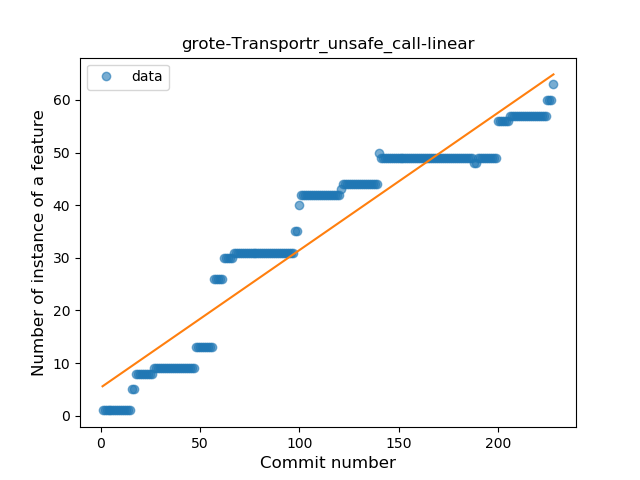
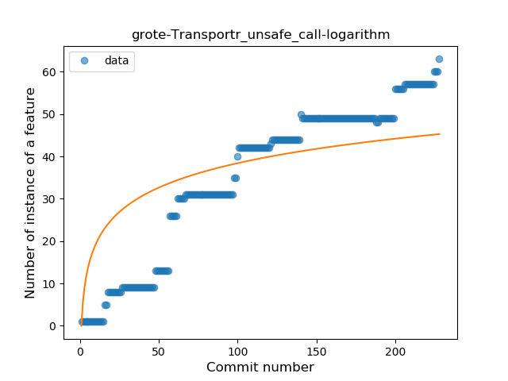
### <a name="string_template">String Template</a>
----
#### Functions
* **Constant Rise - Linear:** 
    * **R_Squared:** 0.90066968
* **Sudden Rise Plateau - Logarithm:** 
    * **R_Squared:** 0.71262102

**Plots** :chart_with_upwards_trend:
-----

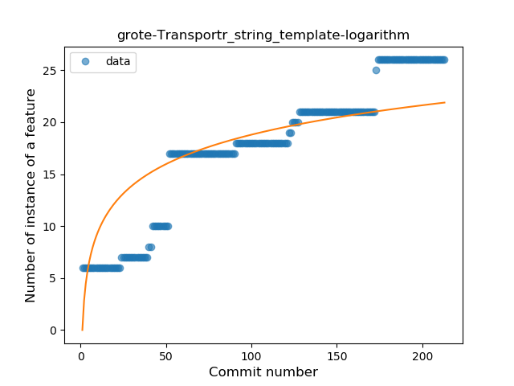
### <a name="func_with_default_value">Function with Default Value</a>
----
#### Functions
* **Plateau Gradual Rise - Sigmoid:** 
    * **R_Squared:** 0.96130706
* **Constant Rise - Linear:** 
    * **R_Squared:** 0.91359384
* **Sudden Rise Plateau - Logarithm:** 
    * **R_Squared:** 0.65937672

**Plots** :chart_with_upwards_trend:
-----

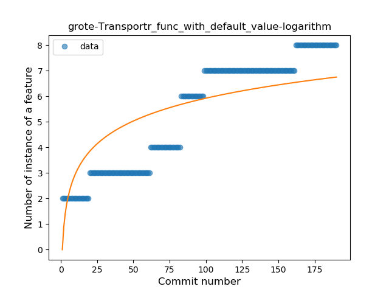
### <a name="singleton">Singleton</a>
----
#### Functions
* **Plateau Sudden Rise - Binary Sigmoid:** 
    * **R_Squared:** 0.92061246
* **Sudden Rise Plateau - Logarithm:** 
    * **R_Squared:** 0.72667974
* **Constant Rise - Linear:** 
    * **R_Squared:** 0.38369315

**Plots** :chart_with_upwards_trend:
-----

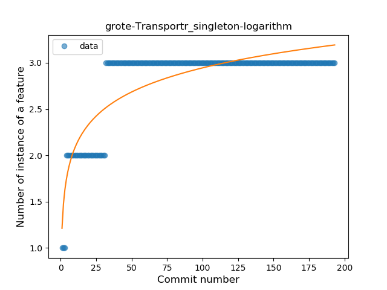
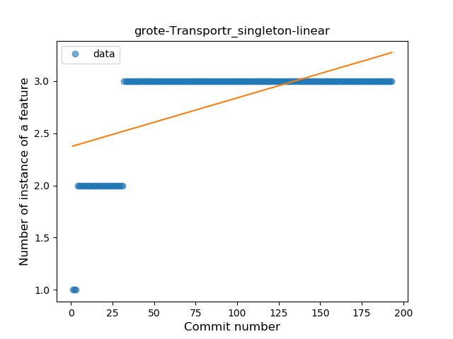
### <a name="smart_cast">Smart Cast</a>
----
#### Functions
* **Sudden Rise Plateau - Logarithm:** 
    * **R_Squared:** 0.78476171
* **Constant Rise - Linear:** 
    * **R_Squared:** 0.69774188

**Plots** :chart_with_upwards_trend:
-----

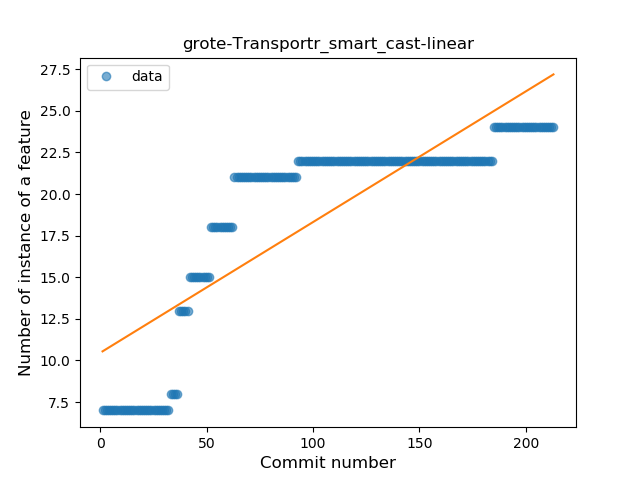
### <a name="func_call_with_named_arg">Function call with Named Argument</a>
----
#### Functions
* **Instability - Polinomial 3:** )
    * **R_Squared:** 0.82939951
* **Sudden Rise Plateau - Logarithm:** 
    * **R_Squared:** 0.62420213
* **Constant Rise - Linear:** 
    * **R_Squared:** 0.42985025
* **Plateau Sudden Rise - Binary Sigmoid:** 
    * **R_Squared:** 0.04014611

**Plots** :chart_with_upwards_trend:
-----

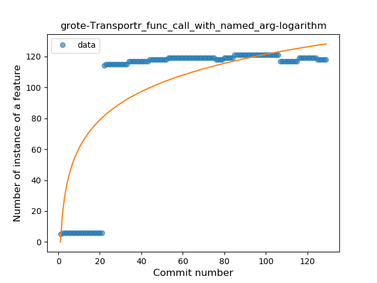
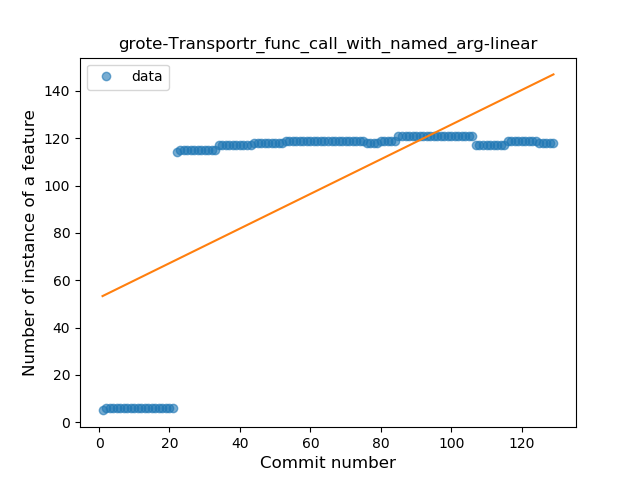
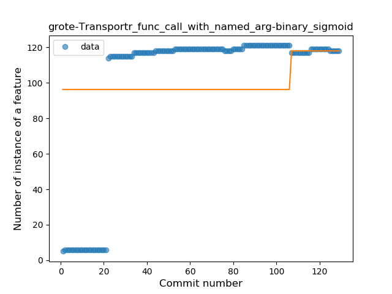
### <a name="data_class">Data Class</a>
----
#### Functions
* **Plateau Gradual Rise - Sigmoid:** 
    * **R_Squared:** 0.92042171
* **Sudden Rise Plateau - Logarithm:** 
    * **R_Squared:** 0.71045088
* **Constant Rise - Linear:** 
    * **R_Squared:** 0.32729718

**Plots** :chart_with_upwards_trend:
-----

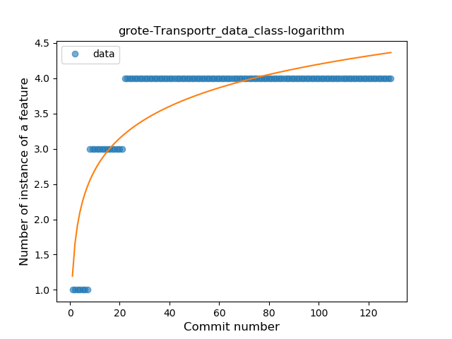
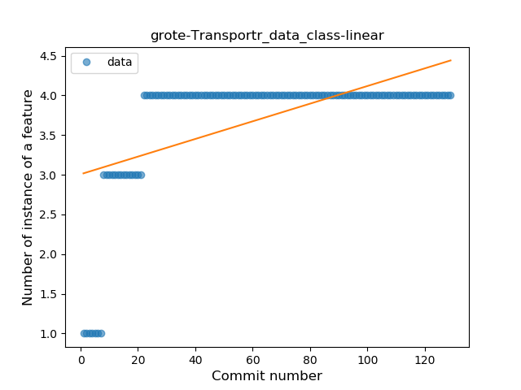
### <a name="extension_function">Extension Function</a>
----
#### Functions
* **Constant Rise - Linear:** 
    * **R_Squared:** 0.81965942
* **Sudden Rise Plateau - Logarithm:** 
    * **R_Squared:** 0.72965776
* **Plateau Sudden Rise - Binary Sigmoid:** 
    * **R_Squared:** 0.18409091

**Plots** :chart_with_upwards_trend:
-----

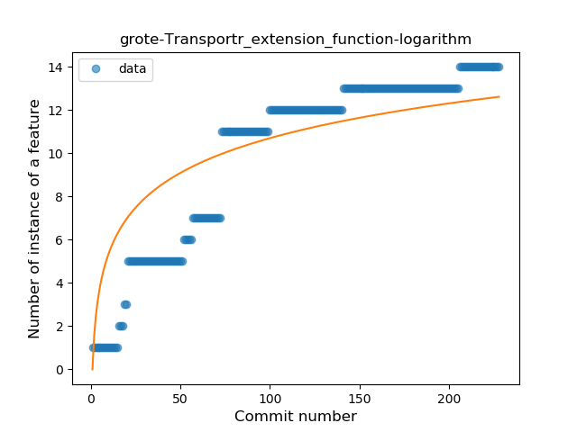
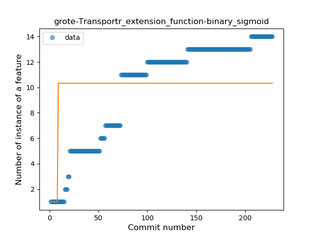
